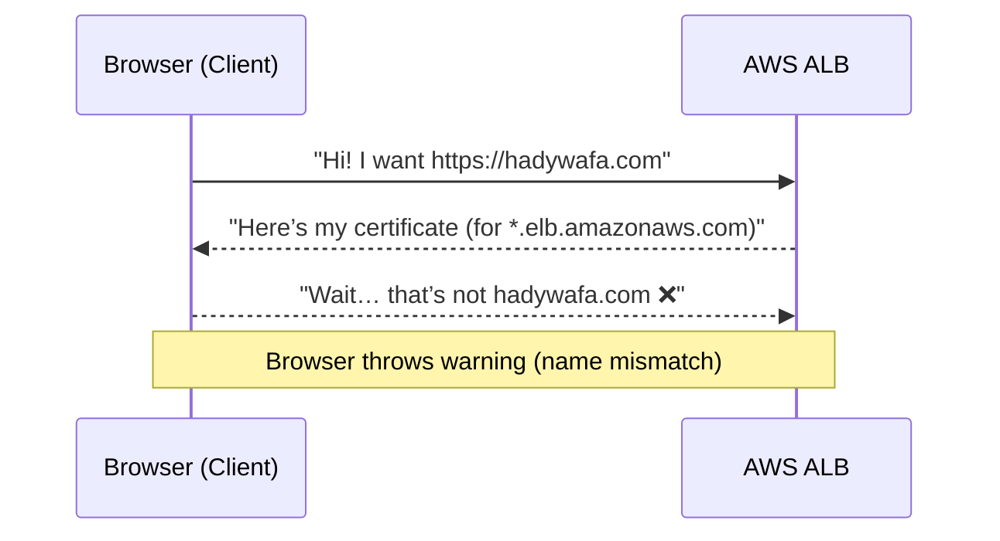
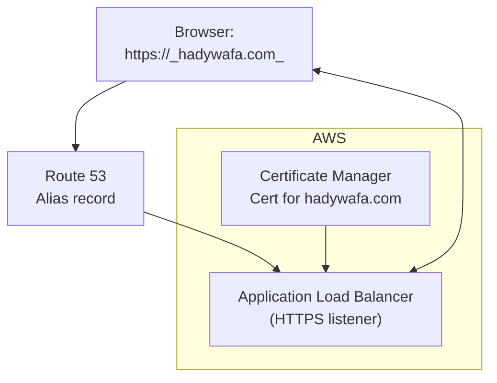

# 🌐 HTTPS Certificates In AWS

## 😵 Your Confusion (Totally Normal)

You said:

> “I have a domain name `hadywafa.com`.
> My website sits behind an AWS Load Balancer, which already has an HTTPS endpoint (with its random AWS domain like `abc123.elb.amazonaws.com`).
> If I just point Route 53 to my ALB, do I still need to set up HTTPS for `hadywafa.com`?”

Sounds reasonable, right? The ALB already speaks HTTPS… so why bother?

---

## 🚫 Where the Thinking Goes Wrong

Here’s the catch:

The ALB’s **default certificate** only covers its AWS hostname, e.g.
`*.elb.amazonaws.com` ✅

But your visitors won’t type that. They’ll type:
`https://hadywafa.com` ❌

When the browser receives the ALB’s default cert, it checks:
👉 “Does this cert say `hadywafa.com` in the SAN list?”

- If **NO** → browser screams ⚠️ “Certificate mismatch — this site is not secure.”
- If **YES** → all good, green lock 🔒.

So — even though your ALB can _technically_ handle HTTPS, it cannot _prove_ it’s really `hadywafa.com` without a cert for that domain.

---

## 🔐 The Official Correction

➡️ An HTTPS certificate is always tied to a **domain name** (or wildcard).
➡️ If you want to serve **`https://hadywafa.com`**, the cert must explicitly include `hadywafa.com`.
➡️ The ALB must present **that cert** when clients connect.

So yes, you need your own HTTPS certificate — not just the ELB’s default one.

---

## 🧩 How HTTPS Works (In Plain Terms)

Imagine HTTPS like a **handshake at a nightclub** 🍸:

1. You (the browser) say: “I’m here to see **hadywafa.com**.”
2. The server (ALB) shows its ID card (the certificate).
3. You check if the ID card really says “hadywafa.com” and whether it’s signed by a trusted authority (CA).
4. If the name doesn’t match → 🚫 fake ID, access denied.
5. If it matches → ✅ handshake complete → all further chat is encrypted.

That’s exactly the confusion you had — the cert name mismatch.

---

## 🏗️ Logical Solution in AWS

Here’s how to fix it, step by step:

1. **Get a real cert for your domain.**

   - Use **AWS Certificate Manager (ACM)** → free & auto-renew.
   - Request cert for `hadywafa.com` (and maybe `www.hadywafa.com`).

2. **Validate the cert.**

   - ACM gives you a DNS record.
   - Add it in Route 53.
   - Done ✅ → proves you own the domain.

3. **Attach cert to your ALB.**

   - In your ALB, create an HTTPS (port 443) listener.
   - Choose the ACM cert for `hadywafa.com`.

4. **Redirect HTTP → HTTPS.**

   - Add a rule in the ALB listener: redirect port 80 → 443.

5. **Route 53 mapping.**

   - Create an **Alias A record** for `hadywafa.com` → ALB DNS name.
   - Users now reach your ALB using your cert.

6. **Browser check.**

   - Visit `https://hadywafa.com`.
   - Browser padlock shows ✅ trusted cert issued for your domain.

---

## 🛠️ Easy Example (Concrete)

- **Domain**: `hadywafa.com`

- **ALB DNS**: `xyz.elb.amazonaws.com`

- **Wrong setup**:

  - Route 53 → ALB
  - Browser connects → ALB presents `*.elb.amazonaws.com` cert → mismatch ❌.

- **Correct setup**:

  - ACM cert for `hadywafa.com`
  - ALB HTTPS listener with that cert
  - Route 53 → ALB Alias
  - Browser connects → ALB presents `hadywafa.com` cert → match ✅.

---

## 🎯 Final Takeaway

- Yes, HTTPS certificates are **always bound to domain names**.
- The ELB’s built-in cert is **not valid** for your custom domain.
- The fix is simple: request your own ACM cert, attach it to the ALB, and Route 53 does the mapping.

**Bottom line:** If you want `https://hadywafa.com` without scary warnings, you must set up your own HTTPS certificate.
