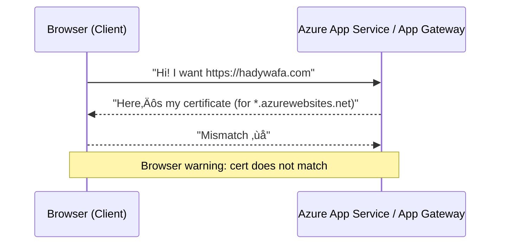
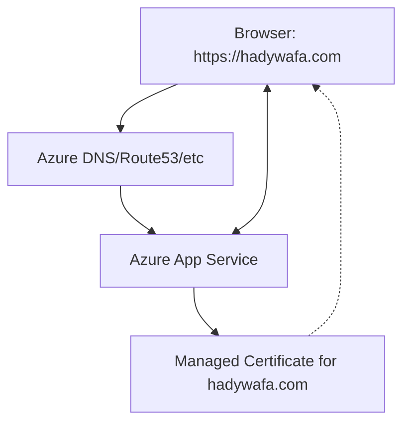

# üîê HTTPS Certificates in Azure

## üòµ The Confusion

You own a custom domain — say `hadywafa.com`.
You’ve deployed your website to **Azure App Service** or behind an **Azure Application Gateway**.

Now you’re thinking:

> “Wait… my Azure service already gives me HTTPS by default with some random domain like `hadywafa.azurewebsites.net` or `xyz.eastus.cloudapp.azure.com`.
> If I just map my custom domain `hadywafa.com` to it, do I really need another certificate?”

---

## üö´ The Wrong Assumption

Here’s the catch (again):

The default Azure HTTPS certificate only covers the **Azure-provided hostname** (like `*.azurewebsites.net`).

If your users connect via `https://hadywafa.com`, the browser will check:

👉 “Does this cert say `hadywafa.com` in SAN?”

- If **NO** → ❌ Browser says: “Not secure” (certificate mismatch).
- If **YES** → ✅ Everyone’s happy.

So just like AWS — the free built-in cert **does not apply** to your custom domain.

---

## üîê The Official Correction

➡️ In Azure, if you want `https://hadywafa.com`, you need a certificate that explicitly covers that domain.
➡️ That cert must be **uploaded/associated** with the Azure service (App Service, Application Gateway, Front Door, etc.) that terminates TLS.

---

## üß© How HTTPS Works (Azure Perspective)

Let’s reuse our fun analogy 🎭:

- You (browser) show up at the Azure club.
- The bouncer (App Service/App Gateway) shows its ID (certificate).
- If the ID says `*.azurewebsites.net` but you asked for `hadywafa.com`, you’ll be like “uhhh… wrong club?” 🚫.
- If the ID says `hadywafa.com`, then the handshake continues happily.

```mermaid
sequenceDiagram
    participant B as Browser (Client)
    participant A as Azure App Service / App Gateway
    B->>A: "Hi! I want https://hadywafa.com"
    A-->>B: "Here’s my certificate (for *.azurewebsites.net)"
    B-->>A: "Mismatch ‚ùå"
    Note over B,A: Browser warning: cert does not match
```

---

## 🏗️ Logical Solution in Azure

Azure gives you multiple ways to solve this depending on where your website lives:

### Option 1: **Azure App Service** (most common)

1. **Custom Domain Binding**

   - Map `hadywafa.com` ‚Üí App Service (via DNS CNAME/A record in Azure DNS or external registrar).

2. **TLS/SSL Certificate**

   - Upload your own certificate (`.pfx` file)
     OR
   - Use **App Service Managed Certificate** (free, DV-only, auto-renew).

3. **Binding**

   - In App Service ‚Üí TLS/SSL settings ‚Üí Bind the cert to `hadywafa.com`.

Result ‚Üí `https://hadywafa.com` works with trusted cert.

---

### Option 2: **Azure Application Gateway (AppGW)**

AppGW is like Azure’s version of AWS ALB but with more WAF/security features.

1. **Get a Cert**

   - Use **Azure Key Vault** to store the cert (recommended).
   - Import a public CA cert for `hadywafa.com`.

2. **HTTPS Listener**

   - Configure a listener on port 443.
   - Attach the cert from Key Vault.

3. **Routing**

   - Forward traffic to your backend pool (App Service, VMs, AKS).

Result ‚Üí AppGW terminates HTTPS and presents the `hadywafa.com` cert.

---

### Option 3: **Azure Front Door (Global CDN/WAF)**

If you want a global entry point with CDN + WAF:

1. Add your custom domain (`hadywafa.com`) to Front Door.
2. Enable **Front Door Managed Certificate** (free, auto-renew).
3. Route traffic to your backend service.

Result → Visitors hit `https://hadywafa.com` via Front Door’s edge POPs with proper cert.

---

## üåç Where Certificates Live in Azure

- **Azure Key Vault** ‚Üí Best practice for storing and auto-rotating certs.
- **App Service** ‚Üí Can directly generate a free managed cert or upload one.
- **Application Gateway / Front Door** ‚Üí Can pull certs directly from Key Vault.

---

## ⚙️ Example (App Service Case)

- Domain: `hadywafa.com`

- Wrong Setup:

  - CNAME `hadywafa.com` ‚Üí `hadywafa.azurewebsites.net`.
  - Users visit → cert says `*.azurewebsites.net` → mismatch ⚠️.

- Correct Setup:

  - Add custom domain to App Service.
  - Add managed cert for `hadywafa.com`.
  - Bind cert to domain in TLS/SSL settings.
  - Users visit ‚Üí cert says `hadywafa.com` ‚Üí ‚úÖ secure.

```mermaid
flowchart TD
    User[Browser: https://hadywafa.com] --> DNS[Azure DNS/Route53/etc]
    DNS --> AppService[Azure App Service]
    AppService --> Cert[Managed Certificate for hadywafa.com]
    Cert -.-> User
    User <--> AppService
```

---

## 🛡️ Pro Tips (Azure Style)

- **App Service Managed Certs** ‚Üí Free but only support **basic SSL (DV)**, no wildcards.
- For **wildcards or EV certs**, use your own cert + Key Vault.
- **HTTPS only** ‚Üí Force HTTPS in App Service settings.
- If using **AppGW/Front Door**, always store certs in Key Vault for auto-rotation.
- Azure also supports **mutual TLS (mTLS)** for client certs if you need zero-trust service-to-service.

---

## 🎯 Final Takeaway

- Just like AWS, the default Azure HTTPS cert only works for Azure subdomains, **not your custom domain**.
- To serve `https://hadywafa.com` without warnings:

  - You must bind a certificate that explicitly includes your domain.

- In Azure, you have 3 main solutions:

  - **App Service Managed Certificate** (simple, free)
  - **Application Gateway with Key Vault certs** (enterprise, WAF)
  - **Front Door with Managed Certificate** (global CDN + WAF).
