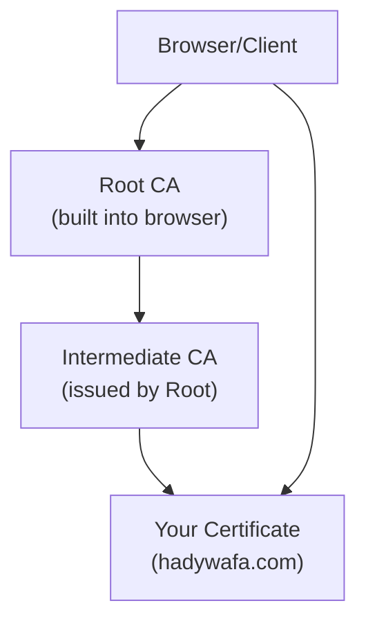

# 🔐 HTTPS Certificates

## 🧐 What is an HTTPS Certificate?

An **HTTPS certificate** (officially called **TLS/SSL Certificate**) is a digital document that binds:

- A **domain name** (`hadywafa.com`)
- To a **cryptographic key pair** (public key + private key)

It is **issued by a Certificate Authority (CA)**, and it allows your browser (client) to **trust** that it’s really talking to the right server, not an evil twin trying to steal cookies 🍪.

Think of it like an **ID card for your website** — except instead of a passport photo, it’s a cryptographic proof.

---

## 🏆 Why is it Important?

1. **Authentication** → Proves visitors are talking to `hadywafa.com`, not some hacker in the middle.
2. **Encryption** → Scrambles data so that even if someone is snooping (hello coffee shop Wi-Fi ☕), they see gibberish.
3. **Integrity** → Ensures that the data wasn’t modified in transit.
4. **Browser Love ❤️** → Chrome, Safari, Edge… all put scary **red “Not Secure” warnings** if you don’t have HTTPS.
5. **Modern Web Features** → HTTP/2, HTTP/3, PWA, SEO boosts → all need HTTPS.

---

## 🏗️ What’s Inside a Certificate?

A certificate is basically a fancy JSON before JSON existed. Inside you’ll find:

- **Common Name (CN) / Subject Alternative Name (SAN):** the exact domains covered (`hadywafa.com`, `www.hadywafa.com`)
- **Issuer:** the CA who signed it (e.g., AWS Certificate Manager, DigiCert)
- **Public Key:** half of your cryptographic pair
- **Validity Dates:** “Born” and “Expires” (certificates have lifespans, usually 90 days to 13 months)
- **Digital Signature:** proving the CA really issued it

---

## 📜 The Chain of Trust

Why should your browser trust some random file claiming to be `hadywafa.com`?

Because certificates are chained back to **root CAs** that your OS/browser already trusts.

➡️ Browser checks the chain: **Your Cert → Intermediate → Root → Trusted**.
If the chain is broken → scary red warnings.

---

## 🔄 How HTTPS Works (TLS 1.3 Handshake in 5 Steps)

Here’s the simplified version of the magic handshake:

```mermaid
sequenceDiagram
    participant B as Browser (Client)
    participant S as Server (AWS ALB)
    B->>S: ClientHello (Hi! I want hadywafa.com, here’s my crypto stuff)
    S-->>B: ServerHello + Certificate (Here’s proof I am hadywafa.com)
    S-->>B: Key agreement (let’s agree on secret session keys 🔑)
    B-->>S: Finished (all future traffic encrypted 🔒)
    S-->>B: Finished (deal sealed ✅)
    Note over B,S: From now on → HTTPS secure channel 🚀
```

Now everything is encrypted and authenticated.

---

## 🧑‍💻 Types of Certificates

- **DV (Domain Validation):** Just proves you own the domain (via DNS or email). ✅ Use this 99% of the time.
- **OV (Organization Validation):** Also includes company details. Rarely needed today.
- **EV (Extended Validation):** Used to give green bars in browsers once upon a time. Now almost irrelevant.

---

## 🌍 Wildcards vs SANs

- `*.hadywafa.com` → works for `api.hadywafa.com`, `blog.hadywafa.com`, but **not** `hadywafa.com`.
- **SAN (Subject Alternative Names):** lets you list multiple domains in one cert (`hadywafa.com`, `www.hadywafa.com`, `shop.hadywafa.com`).

---

## ⚙️ Where Does the Cert Live in AWS?

- **AWS Certificate Manager (ACM)** stores and renews your certs for free.
- You attach the cert to an **HTTPS listener** on:

  - **Application Load Balancer (ALB)**
  - **Network Load Balancer (NLB)**
  - **CloudFront** (edge delivery, cert must be in `us-east-1`)
  - **API Gateway**

---

## 🔄 Example with Your Domain

Let’s connect it to your exact case:

1. You own `hadywafa.com`.
2. You create an ACM certificate for `hadywafa.com` + `www.hadywafa.com`.
3. You validate via DNS (ACM + Route 53 makes this one-click).
4. You attach the cert to your **ALB HTTPS (443) listener**.
5. In Route 53, you create an **Alias A record** from `hadywafa.com` → ALB DNS.
6. Done ✅ → visitors to `https://hadywafa.com` get a green lock.

Without this cert, users would see **“certificate mismatch”** because the ALB presents its default `*.elb.amazonaws.com` cert.

---

## 🛡️ Extra Pro Tips

- Always enable **HTTP→HTTPS redirect** at ALB listener level.
- Choose a modern **SSL policy** (e.g., `ELBSecurityPolicy-TLS13-1-2-2021-06`).
- Use **dual RSA + ECDSA certs** for max compatibility.
- Consider **HSTS** (forces HTTPS) but test first — it’s sticky.
- ACM certs = free + auto-renew 🎉.

---

## 🎯 Summary

- HTTPS certificates are **bound to domain names**, not IPs.
- They ensure **authentication, encryption, and trust**.
- In AWS → use **ACM certs** + **ALB HTTPS listener** + **Route 53 alias**.
- For your case: yes, you definitely need your own cert for `hadywafa.com`.
