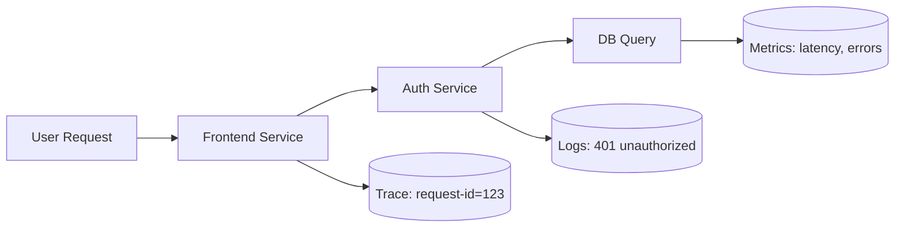
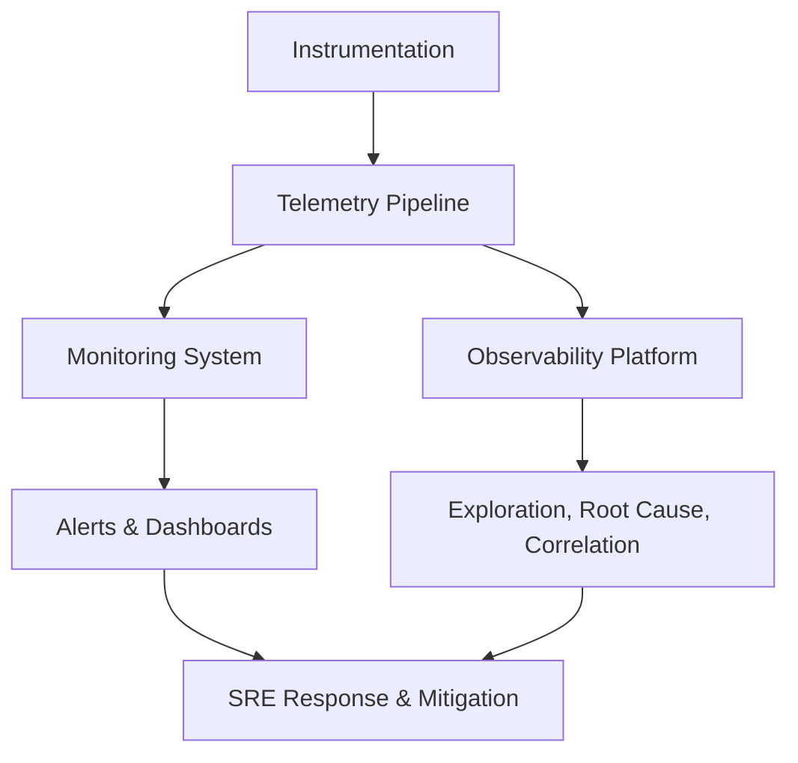

# 🌍 Monitoring vs Observability — The Core of SRE Thinking

## 🧩 1. The Motivation

Modern systems (microservices, distributed clouds, containers, serverless) are like living organisms.
They can fail in ways no one expected — slow database calls, missing metrics, cascading outages.

So we need two superpowers:

| Superpower           | Goal                                                    |
| -------------------- | ------------------------------------------------------- |
| 🩺 **Monitoring**    | Detect and alert when something is _wrong_              |
| 🔭 **Observability** | Understand _why_ it’s wrong and what’s happening inside |

---

## 🩺 2. What is Monitoring?

### 🧠 Definition

> Monitoring is the practice of **collecting, analyzing, and alerting on known metrics or events** to ensure a system is operating as expected.

You monitor things you **already know** can fail.

### 🧱 Components of a Monitoring System

1. **Data Collection (Telemetry)** – agents or exporters send metrics/logs (e.g. Prometheus Node Exporter).
2. **Storage** – time-series database or log store (e.g. Prometheus TSDB, Elasticsearch).
3. **Visualization** – dashboards (Grafana, Kibana, Datadog UI).
4. **Alerting** – rules that trigger notifications when thresholds are crossed.

### ⚙️ Examples

- CPU > 80 % for 5 minutes → trigger alert.
- API error rate > 5 %.
- Database latency > 500 ms.

### 🎯 Goal

Catch problems early → minimize MTTR (Mean Time To Repair).

---

## 🔭 3. What is Observability?

### 🧠 Definition

> Observability is the **ability to understand a system’s internal state by examining its outputs** — even when you don’t know what you’re looking for.

It answers:

> “_Why is this slow?_”
> “_Where did this error originate?_”
> “_What changed that caused the latency spike?_”

Observability is about **exploration and insight**, not just thresholds.

---

## 🔬 4. Three Pillars of Observability

| Pillar         | Description                                          | Examples                                |
| -------------- | ---------------------------------------------------- | --------------------------------------- |
| 📊 **Metrics** | Numeric time-series data measuring performance       | CPU %, memory usage, request latency    |
| 📜 **Logs**    | Discrete events that describe what happened and when | “User login failed”, stack traces       |
| 🕸️ **Traces**  | End-to-end path of a request across services         | Span data showing each microservice hop |

### 📈 Example Flow (Traces + Metrics + Logs)

All three data types correlate to reveal _why_ a problem occurred.

---

## 🧮 5. The Golden Signals (used in SRE)

Google SRE book defines four “golden signals” to monitor any system:

| Signal            | What it measures                | Example                 |
| ----------------- | ------------------------------- | ----------------------- |
| 🚦 **Latency**    | Time to serve a request         | HTTP response time (ms) |
| 💥 **Errors**     | Failed requests                 | 500 status codes        |
| 📈 **Traffic**    | Load on system                  | Requests per second     |
| 🧱 **Saturation** | Resource utilization near limit | CPU/memory usage        |

These are the minimum metrics you need to understand system health.

---

## ⚖️ 6. Monitoring vs Observability — The Big Picture

| Aspect           | Monitoring                | Observability                                     |
| ---------------- | ------------------------- | ------------------------------------------------- |
| 🎯 Goal          | Detect known problems     | Explore unknown problems                          |
| 🧠 Mindset       | Reactive                  | Proactive & Investigative                         |
| 📈 Data          | Metrics (mainly)          | Metrics + Logs + Traces                           |
| 🔔 Alerting      | Threshold based           | Correlated, context-aware                         |
| 🕵️ Investigation | Limited to known failures | Helps ask new questions                           |
| 🧰 Tools         | Nagios, CloudWatch alarms | Prometheus + Grafana, ELK, OpenTelemetry, Datadog |
| 🧩 Outcome       | “Something broke”         | “Why it broke + how to fix”                       |

Think of Monitoring as the **stethoscope**,
and Observability as the **MRI scanner** for your system.

---

## 🏗️ 7. How They Work Together

- **Monitoring** alerts SREs of anomaly.
- **Observability** lets them debug and pinpoint root cause.

---

## 🧰 8. Tools Ecosystem

| Category               | Examples                                                     |
| ---------------------- | ------------------------------------------------------------ |
| Metrics                | Prometheus, CloudWatch, Datadog, Azure Monitor               |
| Logs                   | Elasticsearch, Loki, Fluentd, CloudWatch Logs                |
| Traces                 | Jaeger, Tempo, Zipkin, AWS X-Ray, Azure Application Insights |
| Visualization          | Grafana, Kibana, Datadog UI                                  |
| Correlation / Platform | OpenTelemetry, New Relic, Dynatrace, Splunk Observability    |

---

## 🚨 9. Alerting Best Practices

- Use **multi-signal** alerts (latency + error rate).
- Avoid **alert fatigue** → only alert on user-impacting issues.
- Use **rate of change** alerts instead of static thresholds.
- Route alerts with context (e.g. link to Grafana dashboard).
- Always include runbook links for faster recovery.

---

## ⚙️ 10. Advanced Observability Concepts

| Concept                            | Description                                                 |
| ---------------------------------- | ----------------------------------------------------------- |
| 🔗 **Correlation IDs**             | Unique ID tracing a request across services (logs + traces) |
| 🧠 **Distributed Tracing**         | Visualize end-to-end latency through spans                  |
| 🧭 **Service Dependency Mapping**  | Auto-detect relationships between services                  |
| ⚡ **Real-User Monitoring (RUM)**  | Measure actual user experience (front-end)                  |
| ☁️ **Synthetic Monitoring**        | Scripted probes simulate user traffic                       |
| 📦 **Instrumentation & Telemetry** | Use OpenTelemetry SDKs to emit metrics, logs, traces        |
| 📊 **High-Cardinality Data**       | Handle labels/tags efficiently for scalability              |

---

## 🧠 11. Practical Example – Debugging a Latency Issue

### Scenario

🚨 Alert: API latency > 1 s for 5 min.

- 1️⃣ Monitoring (CloudWatch/Prometheus):  
   - Detects high latency, triggers alert.
- 2️⃣ SRE opens Grafana dashboard:  
   - Sees latency spike in Auth Service.
- 3️⃣ Traces (Jaeger):  
   – Shows delay in DB query span.
- 4️⃣ Logs (Elasticsearch):  
   – Find errors: `DB connection timeout`.
- 5️⃣ Root Cause found: connection pool exhausted → fix scaling config.

This is **Observability in action**.

---

## 🚀 12. Summary – The Mindset Shift

| Before                       | After (Observability Culture)            |
| ---------------------------- | ---------------------------------------- |
| “We collect CPU metrics.”    | “We collect signals that tell a story.”  |
| “We set static thresholds.”  | “We build dynamic SLO-based alerts.”     |
| “We monitor each component.” | “We observe the system as a whole.”      |
| “We react to failures.”      | “We anticipate and understand failures.” |

---

## 🧩 13. Real-World Analogy

Imagine a hospital 🏥:

| Role              | Analogy                                                                          |
| ----------------- | -------------------------------------------------------------------------------- |
| **Monitoring**    | Nurse watches vitals (CPU, memory, latency) and pages doctor if something drops. |
| **Observability** | Doctor orders MRI, blood tests to understand _why_ patient is sick.              |
| **SRE**           | The medical team that designs both systems to keep the patient alive reliably.   |

---

## 🧭 14. Next Step in Your Learning Journey

To truly master this, you’ll next study:

1. **SLI / SLO / SLA** — how to quantify reliability with metrics that matter.
2. **Error Budgets and Alerting Design** — how to avoid alert noise and focus on user impact.
3. **OpenTelemetry Hands-On** — how apps emit metrics, logs, and traces.

---

Would you like me to continue next with
👉 **“SLI / SLO / SLA and Error Budgets — The Heart of SRE Monitoring”**?
That’s where we connect observability to SRE metrics and alerting philosophy.
