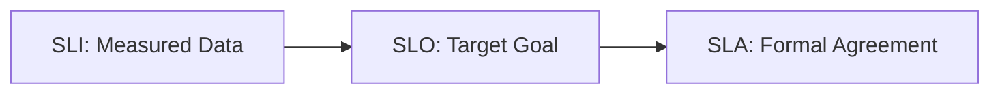
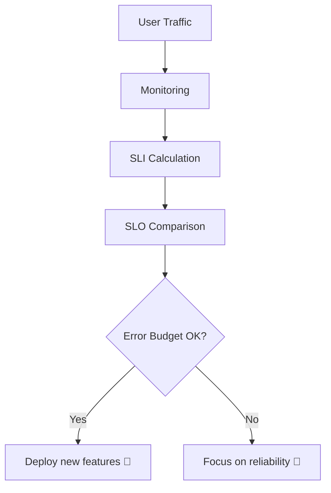
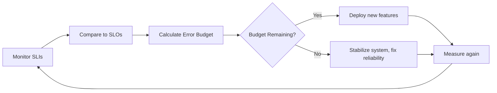

Perfect 🧠✨
Then buckle up — we’re about to cover one of the **most important foundations in SRE monitoring philosophy**:
👉 **SLI, SLO, SLA & Error Budgets** — with clear logic, examples, and visuals in your preferred detailed, human-friendly style.

---

# 🌡️ SLI, SLO, SLA & Error Budgets — The Core of SRE Reliability Thinking

---

## 🧭 1. Why These Concepts Exist

Let’s start with the problem 👇
In traditional ops, teams monitor tons of metrics: CPU, latency, disk space, etc.
But **none of these tell you if your users are actually happy.**

Example:

> “My CPU is 80%, but users are fine.”
> “My CPU is 20%, but users can’t log in.” 😬

So, Google’s SRE philosophy said:

> “We need measurable goals that represent _user happiness and reliability._”

That’s where **SLIs**, **SLOs**, **SLAs**, and **Error Budgets** come in.

---

## 🧩 2. The Three Reliability Terms (SLI → SLO → SLA)

| Term       | Full Form               | Focus       | Description                                                                     |
| ---------- | ----------------------- | ----------- | ------------------------------------------------------------------------------- |
| 📊 **SLI** | Service Level Indicator | Measurement | A metric that tells you how your service performs (e.g., success rate, latency) |
| 🎯 **SLO** | Service Level Objective | Target      | The desired performance target (e.g., 99.9% of requests succeed)                |
| 🤝 **SLA** | Service Level Agreement | Contract    | A **business agreement** with customers, often with penalties if not met        |

Let’s visualize this relationship 👇



---

## 📊 3. What is an SLI (Service Level Indicator)?

### 🧠 Definition:

> A **quantitative measurement** of a service’s reliability or performance, from the _user’s perspective._

SLI = Actual measured value.

### 🧮 Examples:

| Category        | Example SLI                          | Description                     |
| --------------- | ------------------------------------ | ------------------------------- |
| 🕒 Latency      | % of requests < 300 ms               | Measures how fast responses are |
| 💥 Errors       | % of failed requests                 | Measures reliability            |
| 📶 Availability | Successful requests ÷ total requests | Measures uptime                 |
| 🧱 Saturation   | CPU utilization, memory              | Measures load on system         |

🧩 **SLI = good_events / total_events**

Example:
If 9,950 of 10,000 requests succeeded:
→ SLI = 9,950 / 10,000 = **99.5 % success rate**

---

## 🎯 4. What is an SLO (Service Level Objective)?

### 🧠 Definition:

> An **SLO is the target value or range** of your SLI that defines acceptable reliability.

It’s what you _aim for_, not what you always achieve.

Example:

> “Our service should have 99.9 % availability over 30 days.”

If your measured SLI = 99.92 % → ✅ Within SLO.
If it drops to 99.6 % → ❌ SLO violated.

---

### 💡 Choosing the Right SLO

You pick an SLO based on:

1. **User tolerance** (How much failure users can accept)
2. **Business impact** (What downtime costs money)
3. **Engineering cost** (Higher reliability = more \$\$\$)

Example trade-off:

| Availability | Monthly Downtime | Cost & Complexity |
| ------------ | ---------------- | ----------------- |
| 99 %         | 7.3 hours        | Low               |
| 99.9 %       | 43 minutes       | Medium            |
| 99.99 %      | 4 minutes        | High              |
| 99.999 %     | 26 seconds       | Very High 🚀      |

> Each extra “9” costs a fortune.

---

## 🤝 5. What is an SLA (Service Level Agreement)?

### 🧠 Definition:

> An **SLA** is a **formal agreement between the provider and the customer** about the expected service level, often tied to **penalties**.

It’s like the _legal cousin_ of SLO.

- SLAs are for **external communication** (customers, contracts).
- SLOs are for **internal goals** (engineering teams).

### Example:

> SLA: “If uptime drops below 99.9 % this month, we refund 10 % of the bill.”

So:

- **SLI** = “We achieved 99.7 % uptime.”
- **SLO** = “We target 99.9 % uptime.”
- **SLA** = “We refund users if uptime < 99.9 %.”

---

## ⚡ 6. The Error Budget — The Secret Weapon of SREs

Now comes the magic 💥

### 🧠 Definition:

> An **Error Budget** is the amount of unreliability your system is allowed before violating the SLO.

It’s literally the **difference between perfection and your SLO**.

### 📐 Formula:

```
Error Budget = 100 % – SLO %
```

Example:

- SLO = 99.9 %
- Error Budget = 0.1 %

This means:

> You can afford 0.1 % of failures before you must stop risky deployments.

### 🎯 Purpose

- Balances **stability vs. innovation**
- When reliability is good → engineers can release fast
- When SLO is violated → freeze releases, fix stability first

This is the **core feedback loop** of SRE.

---

### 📈 Example in Action

Let’s say your API has SLO = 99.9 % (monthly window).

| Metric                          | Value     |
| ------------------------------- | --------- |
| Total requests                  | 1,000,000 |
| Allowed failed requests (0.1 %) | 1,000     |

If you exceed 1,000 failed requests → error budget exhausted → pause new releases until reliability improves.



---

## 🧠 7. Why Error Budgets Are Game-Changers

| Benefit                  | Description                                     |
| ------------------------ | ----------------------------------------------- |
| ⚖️ Balances priorities   | Aligns Dev & Ops — “move fast but not too fast” |
| 🚨 Reduces alert fatigue | Alert only when you’re burning the budget       |
| 📅 Improves planning     | Reliability becomes measurable & trackable      |
| 🤝 Builds trust          | Business + engineering speak same language      |

This creates a **data-driven reliability culture** — not emotional debates like:

> “We can’t release, it’s risky!”
> Instead → “We’ve used 80 % of our error budget — let’s stabilize.”

---

## 🧰 8. Real-World Example — Google Search Service

| Concept      | Example                                         |
| ------------ | ----------------------------------------------- |
| SLI          | % of search queries under 400 ms                |
| SLO          | 99.99 % of queries under 400 ms                 |
| SLA          | 99.9 % uptime guaranteed to enterprise partners |
| Error Budget | 0.01 % (≈ 4.3 minutes downtime per month)       |

If latency spikes cause 0.02 % of slow queries → they’ve burned double the budget and must pause feature rollouts.

---

## 🔍 9. Alerting with SLOs and Budgets

Traditional alerting:

> “CPU > 80 %” → noisy and irrelevant.

SLO-based alerting:

> “We’ve used 70 % of our error budget in 2 days.”

That’s what _modern SRE monitoring systems_ like **Prometheus**, **Datadog**, or **CloudWatch SLOs** now support — alerting on **user-impacting reliability degradation**, not low-level metrics.

---

## 🧮 10. Example: SLI, SLO, SLA Combined

| Concept | Example                                  | Analogy                           |
| ------- | ---------------------------------------- | --------------------------------- |
| **SLI** | 99.7 % uptime measured                   | Thermometer — what you observe    |
| **SLO** | Target 99.9 % uptime                     | Goal — what you want              |
| **SLA** | 99.9 % uptime guaranteed, or refund 10 % | Legal contract — what you promise |

---

## 🧭 11. Visualization — The SRE Reliability Loop



This loop ensures you:

- Continuously measure user experience
- Quantify acceptable failure
- Balance innovation with reliability

---

## 🧩 12. Summary Table — The Complete Picture

| Concept          | Purpose                           | Who Uses It      | Typical Value | Example                    |
| ---------------- | --------------------------------- | ---------------- | ------------- | -------------------------- |
| **SLI**          | Measure actual performance        | Monitoring tools | Real-time     | 99.7 % successful requests |
| **SLO**          | Set target for reliability        | Engineers, SREs  | Target        | 99.9 % uptime per month    |
| **SLA**          | Define contractual guarantees     | Business/Legal   | Minimum       | 99.9 % uptime or refund    |
| **Error Budget** | Quantify acceptable unreliability | SRE/DevOps       | Difference    | 0.1 % failures allowed     |

---

## 🧠 13. Final Takeaway

- **Monitoring** tells you _what happened_
- **Observability** helps you _understand why_
- **SLIs/SLOs/SLAs** make it _measurable and meaningful_
- **Error Budgets** make it _actionable_

In short:

> **Observability shows the map.
> SLOs define the destination.
> Error budgets tell you when to stop for repairs.**

---

Would you like the **next topic** to continue this flow with:
➡️ **“Alerting and Incident Response Design — How SREs Create Smart, Actionable Alerts”**
(where I’ll teach alert strategies, MTTR, escalation, and avoiding alert fatigue)?
