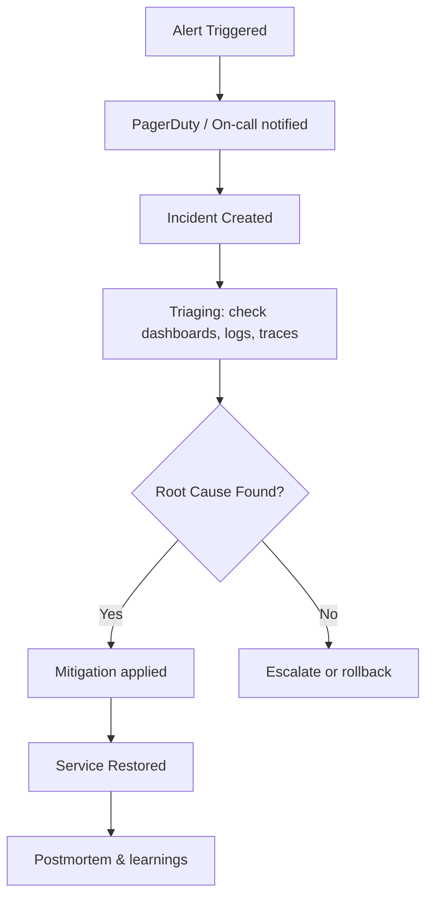

Perfect ⚡🔥 — now we’re stepping into one of the most *real* and *battle-tested* parts of Site Reliability Engineering:

# 🚨 **Alerting & Incident Response Design — The SRE Way**

In this lesson, you’ll learn **how real SREs build smart, calm, and effective alerting systems** that prevent sleepless nights, alert fatigue, and chaos during outages.

---

## 🧭 1. Why Alerting Matters

Every production system — whether it’s running on AWS, Azure, or Kubernetes — will fail someday.
But what matters is **how fast you detect it and how clearly you respond.**

A great alerting system:
✅ Warns you about *real* user-impacting problems,
✅ Gives you *just enough* info to act fast,
✅ Avoids *noisy, useless alerts.*

Bad alerting looks like this 👇

> Pager: "CPU 85%"
> You: "So what? Users are fine..." 😩

Good alerting looks like this 👇

> Pager: “Error rate in checkout API > 3% for 5 minutes — burning 40% of error budget”
> You: “Ah! User payments failing — wake up now!” ⚡

---

## 🧩 2. The SRE Alert Philosophy

SRE teams follow a few sacred alerting rules 👇

| Rule                                      | Meaning                                              |
| ----------------------------------------- | ---------------------------------------------------- |
| 🚨 **Page only for user impact**          | Only wake humans when real users are suffering       |
| 🔍 **Alerts must be actionable**          | Every alert should have a clear next step or runbook |
| 📈 **Alert on symptoms, not causes**      | Don’t alert on CPU; alert on slow API response       |
| ⚖️ **Balance reliability with sleep**     | Fewer, better alerts reduce burnout                  |
| 🧠 **Automate detection and suppression** | Avoid duplicate or flapping alerts                   |

---

## 🧠 3. Anatomy of an Alert

A well-designed alert includes:

| Component             | Description                        | Example                               |
| --------------------- | ---------------------------------- | ------------------------------------- |
| **Trigger condition** | What metric or threshold caused it | “Error rate > 2% for 5m”              |
| **Severity**          | Priority level                     | P1 = wake me now, P3 = check tomorrow |
| **Context**           | Which service, region, or version  | “api/v1/orders – us-east-1”           |
| **Runbook link**      | Step-by-step resolution guide      | “/docs/runbook/orders-error.md”       |
| **Escalation path**   | Who’s on call next                 | PagerDuty escalation chain            |

---

## 🔥 4. Types of Alerts in SRE

### 🩺 **1. Paging Alerts (P1/P2)**

* Require *human action immediately*
* Triggered for **user-facing impact**
* Example: `Availability < 99.9 % for 5 min`

### 🕒 **2. Ticket Alerts (P3/P4)**

* Important but *not urgent*
* Logged for backlog fixing
* Example: “Disk usage > 80 %” or “1 node unhealthy”

### 🧠 **3. Informational Alerts**

* For awareness only (no action)
* Example: “Deployment completed” or “New version rolled out”

SREs tune the system so that **only P1 and P2 alerts page humans.**

---

## ⚖️ 5. The Golden Rule: Alert on **Symptoms, Not Causes**

Bad example ❌

> “Database CPU > 85%” — noise!

Good example ✅

> “API latency > 1s (90th percentile)” — that’s what users feel.

Why?

* CPU can be high without user impact.
* But high latency *means* users are unhappy.

💡 Focus on **SLIs** like:

* Latency
* Error rate
* Availability
* Saturation

These align directly with your **SLOs** and **error budgets**.

---

## 🧮 6. How to Design Smart Alert Thresholds

SREs don’t use static numbers like “>80% CPU”.
Instead, they use **dynamic, SLO-based** conditions.

### ✅ Example:

> Trigger alert when service burns **30% of error budget in 1 hour.**

### Traditional vs. SRE Style

| Style     | Example                              | Problem                   |
| --------- | ------------------------------------ | ------------------------- |
| Static    | “Error rate > 2%”                    | Can be noisy, contextless |
| SLO-based | “Error budget burn rate > 5x normal” | Captures user impact      |

---

## 📊 7. Alert Burn Rate Example

Imagine your **SLO = 99.9% availability**
→ You can fail **0.1%** of requests in a month = 43 min downtime.

You can create **two-tier alerts**:

| Alert       | Burn Rate                          | Duration | Action                   |
| ----------- | ---------------------------------- | -------- | ------------------------ |
| 🟥 Critical | 14x (using 14x faster than budget) | 5 min    | Page immediately         |
| 🟧 Warning  | 2x                                 | 1 hour   | Investigate, slower burn |

This is called **Multi-Window, Multi-Burn Rate Alerting** — used by Google and Prometheus.

It ensures:

* You catch fast failures quickly ⚡
* But also detect slow, creeping degradations 🐢

---

## 🧠 8. Alert Fatigue — The Silent Killer

Alert fatigue happens when engineers get **too many useless alerts**, leading them to ignore even critical ones.

### Common Causes:

* Too many static thresholds
* Missing deduplication
* Multiple alerts for the same symptom
* No severity filtering

### 🔧 Fix It:

| Strategy                                            | Description                                           |
| --------------------------------------------------- | ----------------------------------------------------- |
| 🧩 **Deduplicate**                                  | Use alert correlation (e.g., group by `service_name`) |
| 🧠 **Use alert severity levels**                    | Only page for P1/P2                                   |
| 🧘 **Silence non-critical alerts during incidents** | Prevent noise storms                                  |
| 🗂️ **Add context links**                           | Logs, dashboards, and runbooks in alert body          |

---

## 🕵️ 9. Incident Lifecycle — The SRE Way

Let’s see how a real alert becomes an incident 👇



---

## ⚙️ 10. Key Incident Metrics

| Metric                    | Description              | Ideal              |
| ------------------------- | ------------------------ | ------------------ |
| ⏱️ **MTTD**               | Mean Time to Detect      | Detect fast        |
| 🧠 **MTTA**               | Mean Time to Acknowledge | Respond fast       |
| 🔧 **MTTR**               | Mean Time to Resolve     | Fix fast           |
| 📘 **Postmortem Quality** | Completeness of analysis | Always “Blameless” |

👉 These metrics are how SREs *measure operational excellence.*

---

## 🧩 11. Blameless Postmortems

After incidents, SREs **don’t blame people** — they fix systems.

> Instead of “Who broke it?”
> Ask “Why did our system allow this error to happen unnoticed?”

Each postmortem should include:

1. 📜 Incident summary
2. ⚡ Impact analysis
3. 🕵️ Root cause
4. 🧱 Preventive actions
5. 🔁 Follow-up SLO/alert updates

---

## 🧰 12. Tools for Alerting & Incident Management

| Category              | Examples                                                            |
| --------------------- | ------------------------------------------------------------------- |
| Monitoring & Alerting | Prometheus, Alertmanager, CloudWatch Alarms, Azure Monitor, Datadog |
| Visualization         | Grafana, Kibana                                                     |
| Incident Response     | PagerDuty, Opsgenie, Splunk On-Call                                 |
| Communication         | Slack, Teams, Zoom                                                  |
| Postmortem Tracking   | Atlassian Statuspage, Google Docs, Notion                           |

---

## 🧮 13. Example — Full Alerting Scenario

### Scenario:

SLO = 99.9% API success rate
Error budget = 0.1%

| Step | Description                                            |
| ---- | ------------------------------------------------------ |
| 1️⃣  | Prometheus measures SLI: success_rate = 99.7%          |
| 2️⃣  | Alert fires — “Burn rate 4x (40% budget in 6 hrs)”     |
| 3️⃣  | PagerDuty notifies on-call SRE                         |
| 4️⃣  | SRE checks Grafana → latency spike in “orders” service |
| 5️⃣  | Logs show DB pool exhaustion                           |
| 6️⃣  | Rollback last deployment                               |
| 7️⃣  | System recovers; incident closed                       |
| 8️⃣  | Postmortem → missing connection pool config fix        |

---

## 🔄 14. Alerting Design Flow (Visual Summary)

```mermaid
flowchart LR
A[SLIs: Latency, Errors, Availability] --> B[SLO Targets]
B --> C[Alerting Rules (burn rates, multi-window)]
C --> D[Alertmanager / PagerDuty]
D --> E[Incident Response]
E --> F[Postmortem & Improvement]
F --> A
```

---

## 💬 15. Summary — The SRE Alerting Mindset

| Old Ops                 | SRE Approach                             |
| ----------------------- | ---------------------------------------- |
| “Alert on every metric” | “Alert only on user impact”              |
| “CPU high? Page!”       | “Error rate rising? Page.”               |
| “Tons of noisy alerts”  | “Few meaningful, actionable alerts”      |
| “Blame engineer”        | “Fix process and automation”             |
| “Manual war rooms”      | “Automated escalation and context links” |

---

## 🧠 16. Quick Takeaways

* **Alert on SLOs, not system internals**
* **Use multi-window burn rate alerts**
* **Include runbook & dashboard links**
* **Measure MTTR and MTTD continuously**
* **Do blameless postmortems**
* **Continuously refine alerts** (alerting is never “done”)

---

✅ **Now you understand how SREs build alert systems that protect both users and engineers.**
Next, we’ll connect everything by studying:

> 🔍 **Observability Pipelines & Telemetry Architecture** —
> how metrics, logs, and traces are collected, processed, and correlated using **OpenTelemetry**, **Prometheus**, **Grafana**, and **Loki/Tempo**.

Would you like me to go next into that topic (the full **Observability pipeline design and flow**) — from instrumentation to dashboards?
