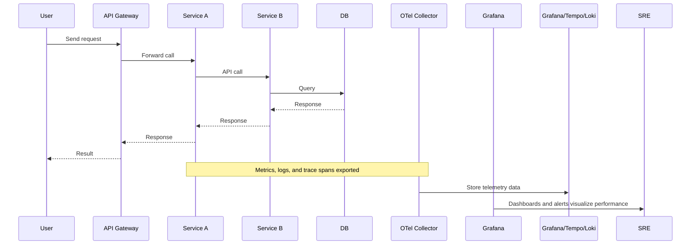
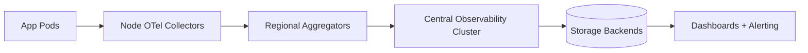

Excellent 🚀 — now we’re going full throttle into the **beating heart of Observability itself**:

# 🔭 Observability Pipeline & Telemetry Architecture — From Code to Dashboard

This topic ties together **everything an SRE or DevOps engineer uses** to see what’s happening in production —
metrics, logs, traces, and events — from your app code to your Grafana dashboard.

You’ll learn:
✅ How telemetry data flows (collection → processing → storage → visualization)
✅ What roles OpenTelemetry, Prometheus, Grafana, Loki, and Tempo play
✅ The architecture of observability in modern systems (microservices, Kubernetes, serverless)
✅ Real-world examples and best practices

---

## 🧠 1. What Is an Observability Pipeline?

### 🩺 Definition

> An **Observability Pipeline** is the system that collects, processes, stores, and routes telemetry data — metrics, logs, traces, and events — to monitoring and visualization tools.

Think of it as the **nervous system of your infrastructure** 🧠⚡.
It senses everything that happens in your applications and sends signals to tools that help you understand it.

---

## 🧩 2. Telemetry: The Building Blocks

Telemetry = “data emitted from systems about their internal state.”
It comes in 3 main forms (the **three pillars of observability**):

| Pillar         | Description               | Example                                   |
| -------------- | ------------------------- | ----------------------------------------- |
| 📊 **Metrics** | Numeric, time-series data | CPU usage, request latency, error rate    |
| 📜 **Logs**    | Discrete textual events   | “User login failed”, “Connection timeout” |
| 🕸️ **Traces** | End-to-end request flow   | Request ID: 123 → Service A → B → DB      |

---

## 🧭 3. Observability Pipeline Flow

Here’s the big picture 👇

```mermaid
flowchart LR
A[Instrumented Applications] --> B[Telemetry Collectors (e.g. OpenTelemetry Agent)]
B --> C[Aggregation & Processing Layer (Prometheus, Fluentd, Vector)]
C --> D[Storage Backend (TSDB, Object Store, ES)]
D --> E[Visualization & Alerting Tools (Grafana, Kibana, Datadog)]
```

---

## ⚙️ 4. Step 1 — Instrumentation

### 🧠 Definition

> Instrumentation means **adding code or agents** that generate telemetry data about what’s happening inside the system.

Types:

* **Manual instrumentation:** developers add OpenTelemetry SDK calls in code.
* **Auto instrumentation:** agent automatically hooks into frameworks (e.g., Flask, .NET, Node.js).

Example (Python OpenTelemetry):

```python
from opentelemetry import trace
tracer = trace.get_tracer(__name__)

with tracer.start_as_current_span("database_query"):
    query_database()
```

👉 This generates a trace span that will later be visualized in Grafana Tempo or Jaeger.

---

## 📦 5. Step 2 — Collection

Once telemetry is produced, it must be collected by an **agent or collector** running close to the source (on the same host, pod, or container).

Common collectors:

| Type                     | Tools                                 | Description                                   |
| ------------------------ | ------------------------------------- | --------------------------------------------- |
| 🧭 **Metrics Collector** | Prometheus, OpenTelemetry Collector   | Scrapes metrics endpoints (`/metrics`)        |
| 📜 **Log Collector**     | Fluentd, Fluent Bit, Vector           | Streams logs to storage (Loki, Elasticsearch) |
| 🕸️ **Trace Collector**  | OpenTelemetry Collector, Jaeger Agent | Receives trace spans from services            |

---

## 🔁 6. Step 3 — Processing & Transformation

Before storing, data often needs to be:

* **Filtered** (drop noise)
* **Transformed** (add labels, rename)
* **Aggregated** (combine metrics)
* **Exported** (send to multiple backends)

Example configuration (OpenTelemetry Collector YAML):

```yaml
processors:
  batch:
  attributes:
    actions:
      - key: environment
        value: "prod"
        action: insert
exporters:
  prometheusremotewrite:
    endpoint: https://prometheus.example.com/api/v1/write
service:
  pipelines:
    metrics:
      receivers: [otlp]
      processors: [batch, attributes]
      exporters: [prometheusremotewrite]
```

💡 This makes the collector act as a **data router** — sending metrics to Prometheus, traces to Tempo, and logs to Loki.

---

## 🗄️ 7. Step 4 — Storage

After processing, telemetry data goes to **backends optimized for each data type**:

| Data Type | Storage Backend                           | Retention                  | Query Type               |
| --------- | ----------------------------------------- | -------------------------- | ------------------------ |
| Metrics   | Prometheus, InfluxDB, CloudWatch, Datadog | Short-term (days/weeks)    | Fast time-series queries |
| Logs      | Loki, Elasticsearch, Splunk               | Medium-term (weeks/months) | Full-text search         |
| Traces    | Tempo, Jaeger, Zipkin                     | Short (hours/days)         | Trace visualization      |

Each backend is **purpose-built** — logs are unstructured, metrics are aggregated, traces are hierarchical.

---

## 📊 8. Step 5 — Visualization and Alerting

Now the fun part — **making sense of it** 👇

| Tool                  | Data Type                          | Example                                   |
| --------------------- | ---------------------------------- | ----------------------------------------- |
| **Grafana**           | Metrics, Logs, Traces (all-in-one) | Unified dashboards                        |
| **Kibana**            | Logs                               | Log search and visualization              |
| **Jaeger/Tempo**      | Traces                             | Distributed trace graphs                  |
| **Datadog/New Relic** | Unified platform                   | Alerts, traces, metrics, and APM combined |

Example Grafana dashboard:

* Panel 1: Latency (90th percentile)
* Panel 2: Error rate over time
* Panel 3: Trace waterfall for slow request
* Panel 4: Log panel filtered by request ID

---

## 🧩 9. The Role of OpenTelemetry (OTel)

### 🧠 What It Is:

> **OpenTelemetry (OTel)** is an open-source framework that standardizes how you collect telemetry data across your systems.

It unifies **tracing, metrics, and logs** under one SDK, one format (OTLP), and one pipeline.

```mermaid
flowchart TD
A[App Code (any language)] --> B[OTel SDK / Agent]
B --> C[OTel Collector]
C --> D[Backends: Prometheus, Loki, Tempo, Datadog, etc.]
```

### 🧩 Why It Matters

* Vendor-neutral standard
* Supports 20+ languages
* Pluggable architecture
* Works with any observability backend

> In short: **Instrument once, export anywhere.**

---

## 🧭 10. Example — End-to-End Telemetry Flow (Real System)

Let’s trace how a single user request generates observability data 👇



---

## ⚡ 11. How Observability Pipelines Scale (Advanced)

Large-scale systems (Kubernetes, cloud-native) produce **millions of metrics per second**, so we need:

* **Sampling** (for traces)
* **Retention policies** (for metrics/logs)
* **Aggregation tiers**
* **Centralized collectors**

### Example Scalable Design:



This design prevents overloading a single collector and allows:

* Tenant isolation (multi-team)
* Data routing by label (prod/staging)
* Fine-grained retention

---

## 🧠 12. Connecting Observability to SRE Practices

| SRE Practice          | Observability Role                                        |
| --------------------- | --------------------------------------------------------- |
| **SLIs & SLOs**       | Built from telemetry metrics (e.g. success_rate, latency) |
| **Error Budgets**     | Derived from availability metrics                         |
| **Incident Response** | Powered by logs + traces                                  |
| **Postmortems**       | Verified by historical telemetry data                     |
| **Toil Reduction**    | Automated alert correlation & dashboards                  |

Without observability, SREs are flying blind.
With it, they can *see the entire system heartbeat.*

---

## 🧰 13. Modern Observability Tool Stack (Popular Choices)

| Function   | Open Source Tools                   | Managed/Enterprise                 |
| ---------- | ----------------------------------- | ---------------------------------- |
| Metrics    | Prometheus, VictoriaMetrics         | Datadog, CloudWatch, Azure Monitor |
| Logs       | Loki, Elasticsearch                 | Splunk, New Relic Logs             |
| Traces     | Tempo, Jaeger                       | AWS X-Ray, Azure App Insights      |
| Dashboards | Grafana                             | Datadog Dashboards                 |
| Collector  | OpenTelemetry Collector, Fluent Bit | New Relic Infrastructure Agent     |

---

## 🧩 14. Real Example — Unified Observability in Grafana Stack

Grafana Labs provides a full open-source ecosystem called **LGTM Stack**:

| Component            | Role            |
| -------------------- | --------------- |
| **Loki**             | Logs backend    |
| **Grafana**          | Visualization   |
| **Tempo**            | Traces backend  |
| **Mimir/Prometheus** | Metrics backend |

### Unified Query:

Grafana can correlate logs ↔ traces ↔ metrics in one click.

Example:

> Click on a slow trace → see logs for that trace → view related metrics over time.

That’s **true observability** — not just monitoring.

---

## 🧮 15. Best Practices for Designing Observability Pipelines

| Category                   | Best Practice                                       |
| -------------------------- | --------------------------------------------------- |
| 🧠 **Instrumentation**     | Use OpenTelemetry SDKs everywhere (standard format) |
| 🔍 **Data Volume Control** | Apply sampling, filtering, and retention limits     |
| 🧩 **Context Propagation** | Use trace IDs in logs to correlate data             |
| 🧱 **Scalability**         | Use hierarchical collectors and batching            |
| 🚦 **Reliability**         | Make collectors fault-tolerant (queue on disk)      |
| 📊 **Unified Dashboards**  | Integrate metrics/logs/traces for holistic view     |
| 🧘 **Noise Reduction**     | Filter irrelevant logs early (collector stage)      |

---

## 🧭 16. Summary Diagram — The Observability Data Lifecycle

```mermaid
flowchart TD
A[Code Instrumentation (OpenTelemetry SDK)] --> B[Data Collection (OTel Collector, Prometheus, Fluent Bit)]
B --> C[Processing (Batching, Filtering, Enrichment)]
C --> D[Storage (Prometheus, Loki, Tempo, ES)]
D --> E[Visualization (Grafana, Kibana)]
E --> F[Action (Alerting, Incident Response, SLO Tracking)]
```

---

## 🧠 17. Final Takeaway

* **Monitoring** tells you *if something’s wrong.*
* **Observability** tells you *why it’s wrong.*
* **The Observability Pipeline** is how that insight flows — from code → collector → dashboard.

Or in one sentence:

> Observability = Telemetry + Intelligence + Action. 💡

---

Next up, we can go into either:

1. ⚙️ **Prometheus Deep Dive** — metrics scraping, exporters, Alertmanager, query language (PromQL).
2. 🧩 **OpenTelemetry Hands-On** — tracing, context propagation, and how telemetry unifies metrics, logs, and traces.

Which one do you want to go to next?
