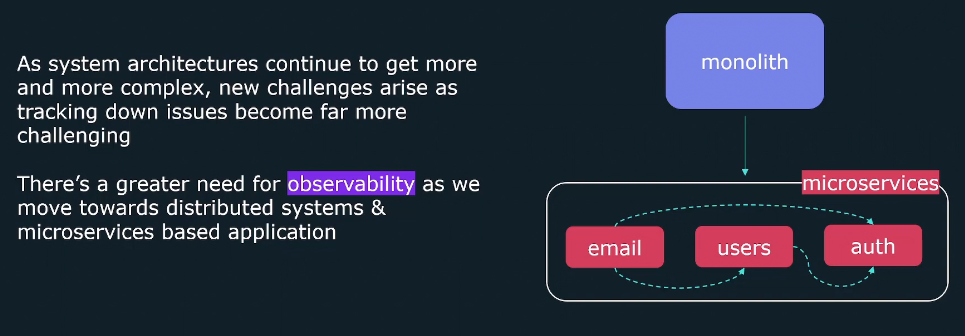
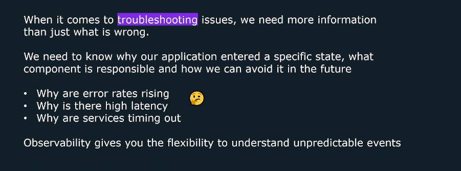
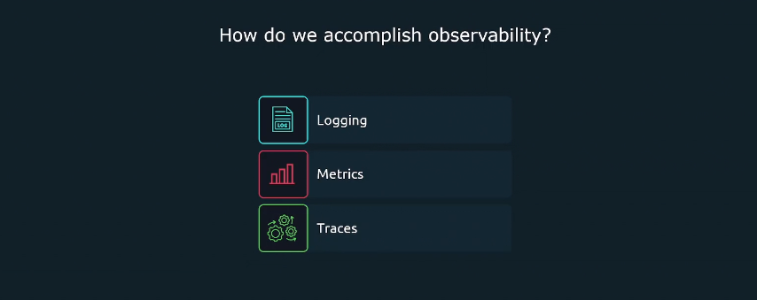
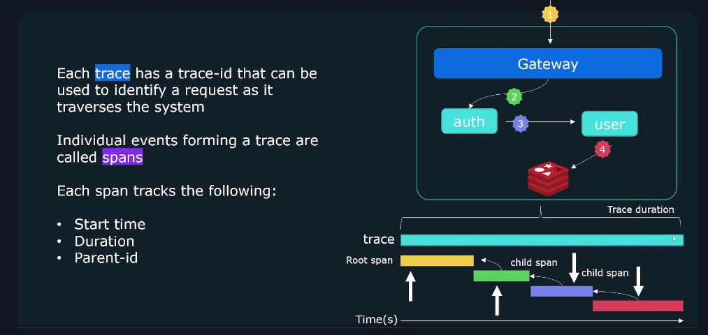

# 👀 **Observability**

## 🕰️ Overview

As system architecture continue to get more and more complex, new challenges arise as traction down issues become far more challenging.

There is a greater need for observability as we move towards distributed systems & microservices based applications.

---

## 📖 Definition

> _**Observability** it is a ability to observe the state of the system based upon data generated by the system_
>
> - it allows you to generate actionable outputs from `unexpected behavior`, such as an error message or a failed test case.
> - it help you to build **Proactive monitoring** which is the ability to monitor the health of your system and identify issues before they cause damage.

**📒 Notes:**

- The main purpose of **Observability** is to provide a complete picture of your system's health and performance.
- **Observability** is a combination of **monitoring** and **logging** to provide a complete picture of your system's health and performance.
- **Observability** gives you the ability to understand unpredicted behavior and identify issues before they cause damage.

---

## 🎯 How do we accomplish observability

### 📌 1. **Logs**

Logs are records of events that have occured and encapsulate information about the specific event.

**📜 Logs are comprised of:**

- `Timestamp`: when the event occurred.
- `Message`: containing information about the event.

**📒 Notes:**

- Logs are the most common form of observation produced by systems.  
  However, they can be difficult to use due to the <u title="كثرة">verbosity</u> of the logs outputted by the system/applications
- Logs of processes are likely to be <u title="متشابكة مع">interwoven with</u> other concurrent processes spread across multiple systems.

### 📌 2. **Metrics**

Metric provide information about the state of a system using numerical values

It Contains:

- CPU Load
- Number of open files
- https response times
- Memory usage
- Disk usage
- Network usage
- Database usage

### 📌 3. **Traces**

