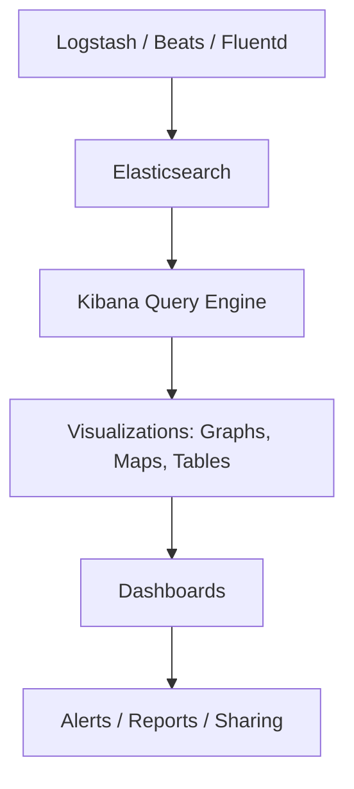

# 🔍 Kibana

> _📖 Real-Time Data Exploration and Visualization for Elasticsearch._

**Kibana** is the official visualization and analytics interface for **Elasticsearch**, forming the “K” in the **ELK Stack** (Elasticsearch, Logstash, Kibana). It enables DevOps, SREs, and analysts to **explore, visualize, and monitor data** stored in Elasticsearch — from logs and metrics to business KPIs and security events.

---

## 🧠 Architectural Overview

Kibana is a **web-based frontend** that interacts directly with Elasticsearch via REST APIs:

| Component                    | Role                                                        |
| ---------------------------- | ----------------------------------------------------------- |
| 📦 **Elasticsearch Backend** | Stores and indexes data (logs, metrics, traces, documents). |
| 🖥️ **Kibana UI**             | Web interface for dashboards, visualizations, and search.   |
| 🔍 **Query Engine**          | Executes DSL queries and filters against Elasticsearch.     |
| 📊 **Visualization Engine**  | Renders charts, graphs, maps, and tables.                   |
| 🔐 **Security Layer**        | Manages RBAC, SSO, and audit logging (via X-Pack).          |
| 🧰 **Plugin System**         | Extends Kibana with apps (e.g., SIEM, APM, ML).             |

Kibana does **not store data** — it’s a visualization and interaction layer for Elasticsearch.

---

## 📦 Key Features

- 🔍 **Discover**: Search and filter raw data with full-text queries and field filters.
- 📊 **Visualize**: Build charts, graphs, maps, and tables using indexed data.
- 🧩 **Dashboards**: Combine multiple visualizations into interactive, shareable views.
- 🧪 **Dev Tools**: Run raw Elasticsearch queries and inspect responses.
- 🗺️ **Maps**: Geospatial visualizations with real-time location data.
- 🔐 **Security & RBAC**: Manage access with roles, field-level security, and SSO.
- 📈 **Time Series Analysis**: Use Timelion and Lens for advanced temporal insights.
- 🧠 **Machine Learning**: Detect anomalies and forecast trends (via X-Pack).
- 📡 **Alerting & Actions**: Trigger alerts and send notifications based on thresholds.
- 🧰 **App Ecosystem**: SIEM, APM, Uptime, and more — all built into Kibana.

---

## 🚀 When to Use Kibana

Kibana is ideal for:

- 🧠 **Log and event analytics** in DevOps and SRE workflows.
- 📊 **Infrastructure monitoring** with Elasticsearch + Beats or Logstash.
- 🔐 **Security analytics** via SIEM dashboards and audit trails.
- 🧪 **Application performance monitoring** with APM traces and metrics.
- 📈 **Business intelligence** using structured data indexed in Elasticsearch.
- 🧰 **CI/CD observability** to track deployments, failures, and trends.

It’s especially powerful when paired with **Elasticsearch** and **Logstash/Filebeat** for ingestion.

---

## ⚔️ Kibana vs Grafana vs Splunk

| Feature        | 🔍 **Kibana**                 | 📊 **Grafana**                             | 🧠 **Splunk**                    |
| -------------- | ----------------------------- | ------------------------------------------ | -------------------------------- |
| Backend        | Elasticsearch only            | Multi-source (Prometheus, Loki, SQL, etc.) | Splunk Indexers                  |
| Visualization  | Strong for logs and search    | Strong for metrics and dashboards          | Strong for logs, metrics, and ML |
| Query Language | Lucene DSL / KQL              | PromQL, LogQL, SQL, etc.                   | SPL (Search Processing Language) |
| Alerting       | Built-in                      | Built-in + integrations                    | Built-in + advanced ML           |
| Extensibility  | Plugins + Elastic apps        | Plugins + custom panels                    | Apps + premium integrations      |
| Cost           | Free + X-Pack (paid features) | Free + Grafana Cloud                       | Commercial (high cost)           |
| Use Case Fit   | Log analytics, SIEM, APM      | Metrics, dashboards, multi-source          | Enterprise-grade observability   |

**TL;DR**:

- Use **Kibana** for **Elasticsearch-native log analytics and security dashboards**.
- Use **Grafana** for **multi-source observability and metrics**.
- Use **Splunk** for **enterprise-scale analytics with advanced ML**.

---

## 🗺️ Visual Model (Mermaid-style)

This shows how data flows from ingestion to visualization and alerting in Kibana.

---

## 🧩 Strategic Fit for You, Hady

- 🧠 **Architectural clarity**: Kibana’s tight coupling with Elasticsearch aligns with your modular observability stack designs.
- 📁 **Portfolio-ready**: Showcase SIEM dashboards, APM traces, and log analytics with real-time filtering.
- 🧪 **Tool benchmarking**: Compare Kibana vs Grafana vs Microsoft Fabric for visualization, cost, and integration.
- 🔐 **Security signaling**: Demonstrate RBAC, field-level security, and audit-ready dashboards.
- 📊 **Interview leverage**: Model log ingestion flows, dashboard layouts, and alerting strategies.

---

You can explore Kibana’s architecture in depth via [Elastic’s official documentation](https://www.elastic.co/docs/extend/kibana/kibana-architecture) or check out [Graph AI’s DevOps glossary](https://www.graphapp.ai/engineering-glossary/devops/kibana) for practical applications.
