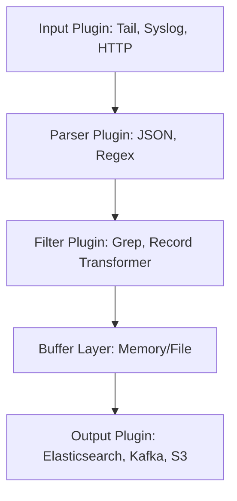

# 🔄 Fluentd

> _📖 Unified Log Collection and Routing for Cloud-Native Systems._

**Fluentd** is a CNCF-graduated, open-source **log collector and forwarder** that unifies data collection across diverse sources and routes it to multiple destinations. It’s designed for **flexible, scalable, and pluggable log pipelines**, making it a strategic backbone for **observability**, **ETL**, and **security monitoring** in modern DevOps and SRE workflows.

---

## 🧠 Architectural Overview

Fluentd uses a **plugin-based pipeline architecture**, where each stage is modular and customizable:

| Component             | Role                                                              |
| --------------------- | ----------------------------------------------------------------- |
| 📥 **Input Plugins**  | Ingest logs from sources (files, syslog, containers, cloud APIs). |
| 🔍 **Parser Plugins** | Convert raw logs into structured formats (JSON, regex, etc.).     |
| 🔧 **Filter Plugins** | Modify, enrich, or drop logs based on rules.                      |
| 🧱 **Buffer Layer**   | Temporarily stores logs (memory or file) for reliability.         |
| 📤 **Output Plugins** | Send logs to destinations (Elasticsearch, Kafka, S3, etc.).       |
| 🧩 **Routing Logic**  | Uses tags and match rules to direct logs through the pipeline.    |

Each plugin is configured via Fluentd’s DSL, and the entire pipeline is defined in a single config file (`fluent.conf`).

---

## 📦 Key Features

- 🧬 **Unified Logging Layer**: Collect, parse, filter, and route logs from any source to any destination.
- 🔌 **500+ Plugins**: Extensive ecosystem for input, output, filtering, and transformation.
- 🧰 **Structured Logging**: Converts logs to JSON for easy downstream processing.
- 🔁 **Reliable Buffering**: Prevents data loss with memory/file-based buffers and retry logic.
- 🔐 **Secure & Compliant**: Supports TLS, authentication, and encrypted log forwarding.
- 📊 **Multi-Destination Routing**: Send logs to multiple backends simultaneously.
- 🧪 **ETL Capabilities**: Extract, transform, and load logs into data lakes or analytics platforms.
- 🧱 **Kubernetes Native**: Works with Promtail, Fluent Bit, and DaemonSets for container logs.
- 🧩 **Multi-Tenancy Support**: Tag-based routing enables tenant isolation and policy enforcement.

---

## 🚀 When to Use Fluentd

Fluentd is ideal for:

- 🧠 **Centralized log aggregation** across apps, containers, VMs, and cloud services.
- 🧰 **Data pipeline orchestration** for observability, analytics, and compliance.
- 🔁 **Multi-cloud environments** needing flexible log routing.
- 🔐 **Security monitoring** with log enrichment and forwarding to SIEMs.
- 📊 **Real-time analytics** via Kafka, Elasticsearch, or cloud-native backends.

It’s especially powerful when paired with **Loki**, **Elasticsearch**, or **cloud-native data lakes**.

---

## ⚔️ Fluentd vs Fluent Bit vs Logstash

| Feature                 | 🔄 **Fluentd**                    | ⚡ **Fluent Bit**      | 🧱 **Logstash**               |
| ----------------------- | --------------------------------- | ---------------------- | ----------------------------- |
| Purpose                 | Full-featured log collector       | Lightweight forwarder  | Log processor and shipper     |
| Resource Usage          | 🔶 Moderate (30–40MB RAM)         | ✅ Very low (<1MB RAM) | 🔶 High (Java-based)          |
| Plugin Ecosystem        | ✅ 500+ plugins                   | 🔶 Smaller set         | ✅ Rich plugin support        |
| Language                | Ruby + C                          | C                      | Java                          |
| Kubernetes Integration  | ✅ Native                         | ✅ Native              | 🔶 Possible via Beats         |
| Buffering & Reliability | ✅ File/memory + retry            | ✅ Memory + retry      | ✅ Persistent queues          |
| Performance             | 🔶 Moderate                       | ✅ High throughput     | 🔶 Moderate                   |
| Use Case Fit            | ETL, multi-destination, filtering | Edge log shipping      | Heavy-duty log transformation |

**TL;DR**:

- Use **Fluentd** for **complex, multi-destination log pipelines**.
- Use **Fluent Bit** for **lightweight edge log forwarding**.
- Use **Logstash** for **heavy transformation and enrichment**.

---

## 🗺️ Visual Model (Mermaid-style)

This shows Fluentd’s modular pipeline — from ingestion to transformation to delivery.

---

## 🧩 Strategic Fit for You, Hady

- 🧠 **Architectural clarity**: Fluentd’s plugin-based pipeline mirrors your modular design mindset — each stage is isolated and configurable.
- 📁 **Portfolio-ready**: Showcase multi-source log pipelines with filtering, enrichment, and multi-destination routing.
- 🧪 **Tool benchmarking**: Compare Fluentd vs Fluent Bit vs Logstash vs Vector for cost, performance, and extensibility.
- 🔐 **Security signaling**: Demonstrate encrypted log forwarding, tenant isolation, and compliance-ready pipelines.
- 📊 **Interview leverage**: Model log ingestion flows, buffer strategies, and plugin configurations for real-time observability.

---

You can explore Fluentd’s architecture in depth via [EverythingDevOps](https://www.everythingdevops.dev/blog/fluentd-architecture) or check out the [official Fluentd site](https://www.fluentd.org/architecture) for plugin lists and deployment guides.
