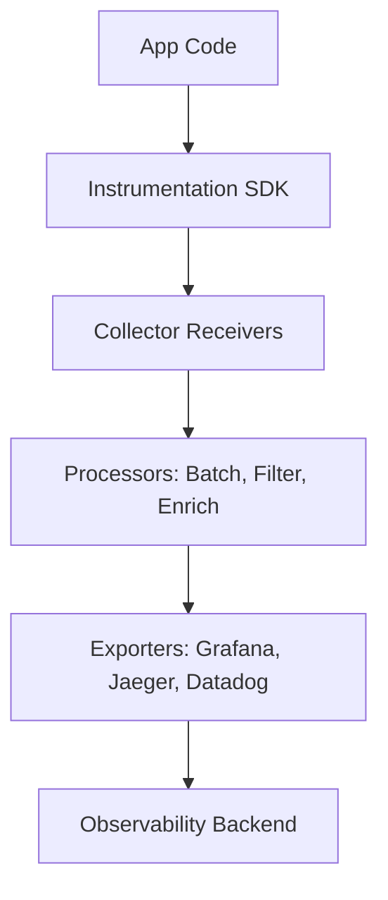

# 📡 OpenTelemetry (OTel)

> _📖 Unified Observability Framework for Metrics, Logs, and Traces._

**OpenTelemetry** is a vendor-neutral, open-source framework for collecting, processing, and exporting **telemetry data** — including **metrics**, **logs**, and **traces** — from applications and infrastructure. It’s designed to standardize observability across distributed systems, making it a strategic backbone for **SRE**, **DevOps**, and **cloud-native architectures**.

---

## 🧠 Architectural Overview

OpenTelemetry is built around a **modular pipeline** architecture:

| Component                   | Role                                                                       |
| --------------------------- | -------------------------------------------------------------------------- |
| 🧰 **Instrumentation SDKs** | Language-specific libraries (Java, Python, Go, etc.) to collect telemetry. |
| 📡 **Receivers**            | Ingest telemetry data (OTLP, Zipkin, Prometheus, etc.).                    |
| 🔄 **Processors**           | Modify, filter, batch, or enrich telemetry data.                           |
| 📤 **Exporters**            | Send data to backends (Grafana, Jaeger, Datadog, etc.).                    |
| 🧱 **Collector**            | Central service that runs pipelines for telemetry processing.              |

Each pipeline handles one data type — **traces**, **metrics**, or **logs** — and can be customized with multiple receivers, processors, and exporters.

---

## 📦 Key Features

- 🧬 **Unified Telemetry**: Collect metrics, logs, and traces using one standard.
- 🔁 **Automatic & Manual Instrumentation**: Choose between SDKs or auto-instrumentation agents.
- 🧰 **Multi-language Support**: Java, Python, Go, .NET, Node.js, and more.
- 📡 **OTLP Protocol**: Standardized transport for telemetry data.
- 🔌 **Vendor-Agnostic Exporting**: Send data to Prometheus, Jaeger, Zipkin, Datadog, New Relic, etc.
- 🧪 **Sampling & Filtering**: Reduce noise and control data volume.
- 📊 **Context Propagation**: Track requests across services for distributed tracing.
- 🔐 **Security & Compliance**: Encrypt telemetry, control access, and audit flows.
- 🧩 **Extensibility**: Add custom processors, exporters, and receivers.

---

## 🚀 When to Use OpenTelemetry

OpenTelemetry is ideal for:

- 🧠 **Distributed systems** needing deep visibility across services.
- 🧰 **Cloud-native apps** running on Kubernetes, serverless, or microservices.
- 🔁 **Unified observability** across metrics, logs, and traces.
- 📊 **Performance tuning** and bottleneck identification.
- 🔐 **Compliance and auditability** in regulated environments.
- 🧪 **CI/CD pipelines** that need telemetry for deployment validation.

It’s especially powerful when paired with observability platforms like **Grafana**, **Prometheus**, **Jaeger**, or **Datadog**.

---

## ⚔️ OpenTelemetry vs Prometheus vs OpenTracing

| Feature         | 📡 **OpenTelemetry**        | 📈 **Prometheus**            | 🔍 **OpenTracing**        |
| --------------- | --------------------------- | ---------------------------- | ------------------------- |
| Scope           | Metrics, logs, traces       | Metrics only                 | Traces only               |
| Instrumentation | SDKs + auto-instrumentation | Exporters + client libraries | Manual instrumentation    |
| Backend Support | Vendor-agnostic             | Prometheus server            | Jaeger, Zipkin            |
| Protocol        | OTLP                        | Prometheus exposition format | Varies                    |
| Ecosystem       | CNCF-backed, unified        | CNCF-backed                  | Merged into OpenTelemetry |
| Extensibility   | High (modular pipeline)     | Moderate                     | Low                       |
| Use Case Fit    | Full-stack observability    | Metrics monitoring           | Distributed tracing       |

**TL;DR**:

- Use **OpenTelemetry** for **end-to-end observability**.
- Use **Prometheus** for **metrics-only monitoring**.
- OpenTracing is now merged into OpenTelemetry.

---

## 🗺️ Visual Model (Mermaid-style)

This shows how telemetry flows from your app through OpenTelemetry’s pipeline to your chosen backend.

---

## 🧩 Strategic Fit for You, Hady

- 🧠 **Architectural clarity**: OpenTelemetry models observability as modular pipelines — perfect for your system design mindset.
- 📁 **Portfolio-ready**: Showcase unified telemetry pipelines with multi-cloud support and backend flexibility.
- 🧪 **Tool benchmarking**: Compare OpenTelemetry vs Prometheus vs Datadog for cost, support, and extensibility.
- 🔐 **Security signaling**: Demonstrate encrypted telemetry flows and audit-ready observability.
- 📊 **Interview leverage**: Model distributed tracing, context propagation, and telemetry-driven reliability patterns.
