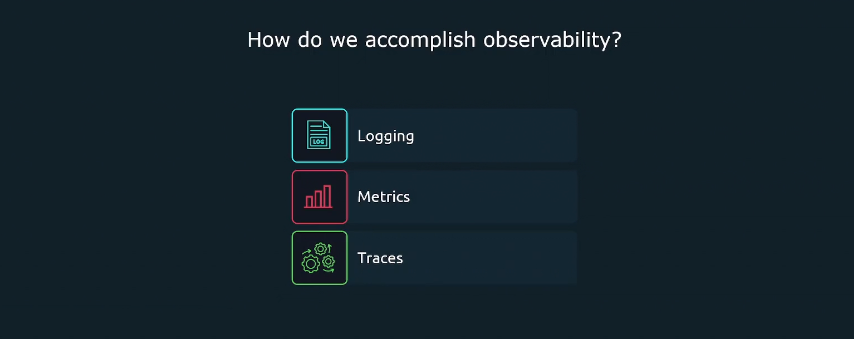
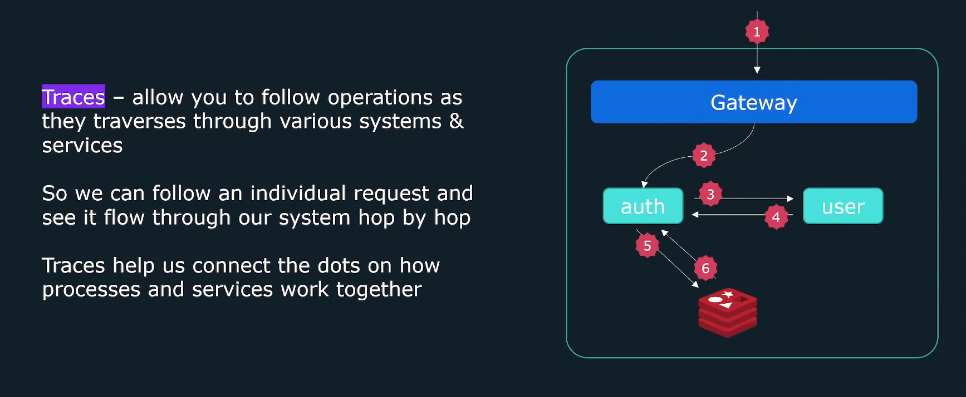
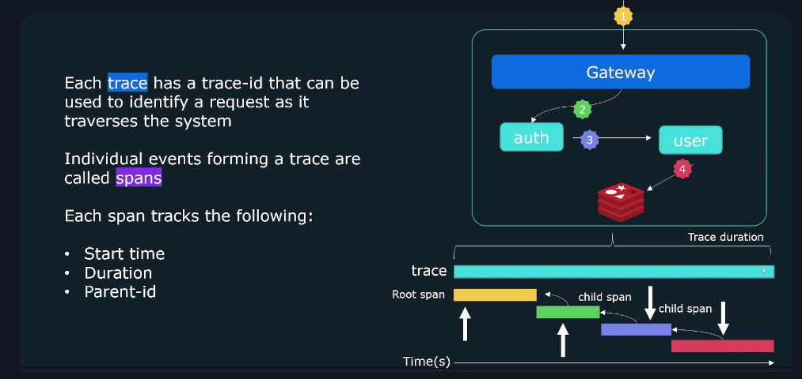
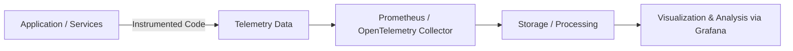
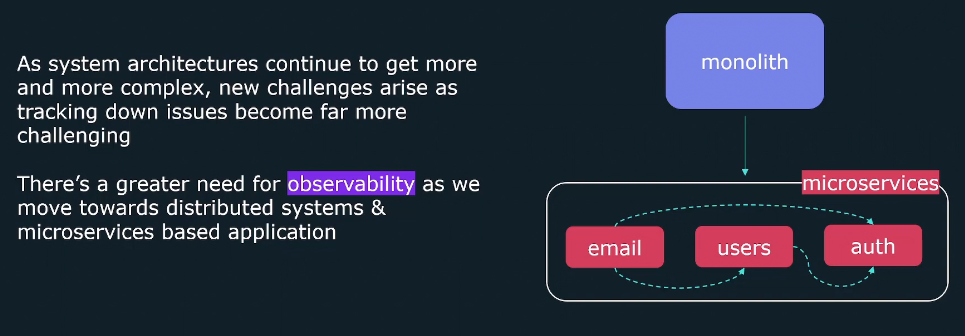
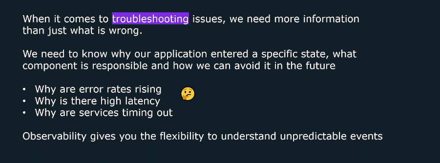

# 🌌 Observability — The Art of Seeing the Unseen

> 🧠 _“Monitoring tells you that something’s wrong. Observability tells you why.”_

---

## 📚 Table of Contents — Observability

1. [📖 What Is Observability?](#1)
2. [🏛️ The Three Pillars of Observability](#2)  
   2.1 [🧮 Metrics — “The heartbeat of your system”](#2.1)  
   2.2 [📜 Logs — “The black box recordings”](#2.2)  
   2.3 [🕵️‍♂️ Traces — “The detective story”](#2.3)
3. [⚙️ How Observability Works (The Flow)](#3)
4. [🚀 Why Observability Matters](#4)
5. [💡 Observability vs Debugging vs Monitoring](#5)
6. [🧠 Core Principle](#6)
7. [🎯 TL;DR Summary](#7)

---

<a id="1"></a>

## 📖 **What Is Observability?**

> _Observability is the measure of how well the internal states of a system can be <u title="مستنتجة">inferred</u> from knowledge of its external outputs._

Translated into tech language 👇  
Observability means **understanding what’s happening inside your complex system** by analyzing what it _emits_ — like **metrics**, **logs**, and **traces**.

**🧠 Think of it like this:**

You’re a doctor diagnosing a patient (your application):

- Monitoring = checking if the patient’s heart rate is normal.
- Observability = using MRI, blood tests, and symptoms to understand _why_ the patient feels dizzy.

**📒 Notes:**

- The main purpose of **Observability** is to provide a complete picture of your system's health and performance.
- **Observability** is a combination of **monitoring** and **logging** to provide a complete picture of your system's health and performance.
- **Observability** gives you the ability to understand unpredicted behavior and identify issues before they cause damage.
- it allows you to generate actionable outputs from `unexpected behavior`, such as an error message or a failed test case.
- it help you to build **Proactive monitoring** which is the ability to monitor the health of your system and identify issues before they cause damage.

---

<a id="2"></a>

## 🏛️ **The Three Pillars of Observability**

Observability in modern systems is built on three golden pillars

<div align="center" style="background-color: #141a19ff;color: #a8a5a5ff; border-radius: 10px; border: 2px solid">

| Pillar         | Description                            | Tools / Examples                      |
| -------------- | -------------------------------------- | ------------------------------------- |
| 🧮 **Metrics** | Numeric measurements over time         | Prometheus, CloudWatch, Azure Monitor |
| 📜 **Logs**    | Textual event records                  | Loki, Elasticsearch, Fluentd          |
| 🕵️‍♂️ **Traces**  | Record of request flow across services | Jaeger, Zipkin, OpenTelemetry         |

</div>

---

<div align="center" style="background-color:#112028; border-radius: 10px; border: 2px solid">
    
</div>

---

Let’s break them down visually 👇

<a id="2.1"></a>

### 🧮 **1. Metrics** — _“The heartbeat of your system”_

Metrics are **quantitative data** collected at regular intervals.
Example:

- `http_requests_total{method="GET", status="200"}`
- `cpu_usage_seconds_total{instance="web01"}`

They’re **lightweight**, **structured**, and perfect for **alerts and dashboards**.

---

<a id="2.2"></a>

### 📜 **2. Logs** — _“The black box recordings”_

Logs are records of **detailed event data** that explain what _actually happened_.

**📝 Example:**

```ini
2025-10-30 14:32:01 ERROR [PaymentService] Timeout connecting to DB
```

**📜 Logs are comprised of:**

- `Timestamp`: when the event occurred.
- `Message`: containing information about the event.

**📒 Notes:**

- Logs are the most common form of observation produced by systems.  
  However, they can be difficult to use due to the <u title="كثرة">verbosity</u> of the logs outputted by the system/applications
- Logs of processes are likely to be <u title="متشابكة مع">interwoven with</u> other concurrent processes spread across multiple systems.
- They’re **context-rich** but **heavy**, so you need log aggregation and indexing tools (like Loki or ELK stack).

---

<a id="2.3"></a>

### 🕵️‍♂️ **3. Traces** — _“The detective story”_

Traces show **the journey of a single request** through multiple microservices.
Each request gets a **trace ID**, helping you see _where latency or errors occurred_.

Example visualization:

<div align="center" style="background-color:#112028; border-radius: 10px; border: 2px solid">
    
</div>

<div align="center" style="background-color:#111721; border-radius: 10px; border: 2px solid">
    
</div>

---

> 👉 With tracing, you can pinpoint _which hop failed and why._

---

<a id="3"></a>

## ⚙️ **How Observability Works (The Flow)**

<div align="center" style="background-color: #141a19ff;color: #a8a5a5ff; border-radius: 10px; border: 2px solid">



</div>

---

> **💡Key Idea:** You **instrument** your code → generate telemetry → **collect** data → **analyze** in Grafana → **act** on insights.

---

## 🔧 **Instrument**

In software and systems, **"instrument"** means:

> 👉🏻 To **add code or configuration** that enables a system to emit telemetry data — like metrics, logs, or traces.

### 📝 **Example:**

- You “instrument” your application by adding **OpenTelemetry SDKs** so it can send trace data to **Jaeger**.
- Think of it like wiring sensors into a machine so you can monitor its behavior.

### 🚨 **Related Terms:**

- **Instrumentation**: The process of adding observability hooks.
- **Telemetry**: The data emitted as a result of instrumentation.

---

<a id="4"></a>

## 🚀 **Why Observability Matters**

### 🔴 **Problem**

Modern systems are:

- 🔹 **Distributed (microservices, containers)**
- 🔹 **Dynamic (auto-scaling, ephemeral workloads)**
- 🔹 **Complex (hundreds of services, each logging differently)**

<div align="center" style="background-color:#112028; border-radius: 10px; border: 2px solid">
    
</div>

<div align="center" style="background-color:#112028; border-radius: 10px; border: 2px solid">
    
</div>

### 🟢 **Solution**

Observability gives you:

- ✅ **Faster incident response**
- ✅ **Root cause analysis (RCA)**
- ✅ **Better system reliability (SLO/SLI tracking)**
- ✅ **Predictive insights (via trends)**

---

<a id="5"></a>

## 💡 **Observability vs Debugging vs Monitoring**

<div align="center" style="background-color: #141a19ff;color: #a8a5a5ff; border-radius: 10px; border: 2px solid">

| Concept           | Goal                       | When Used          |
| ----------------- | -------------------------- | ------------------ |
| **📈 Monitoring**    | Detect issues              | _Known knowns_     |
| **🧪 Debugging**     | Fix issues                 | _Known unknowns_   |
| **🌌 Observability** | Understand why it happened | _Unknown unknowns_ |

</div>

---

<a id="6"></a>

## 🧠 **Core Principle**

> Observability is not a tool — it’s a **capability**.  
> It’s the ability to **ask new questions** about your system without redeploying it.

---

<a id="7"></a>

## 🎯 **TL;DR Summary**

<div align="center" style="background-color: #141a19ff;color: #a8a5a5ff; border-radius: 10px; border: 2px solid">

| Term          | Quick Definition                                   | Example                                       |
| ------------- | -------------------------------------------------- | --------------------------------------------- |
| Observability | Understanding _why_ a system behaves a certain way | “Why are checkout requests slow in region A?” |
| Foundation    | Metrics + Logs + Traces                            | The 3 Pillars                                 |
| Goal          | System introspection                               | Identify unknown issues                       |
| Tools         | Prometheus, Grafana, Loki, Jaeger                  | Observability Stack                           |

</div>
