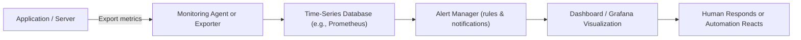
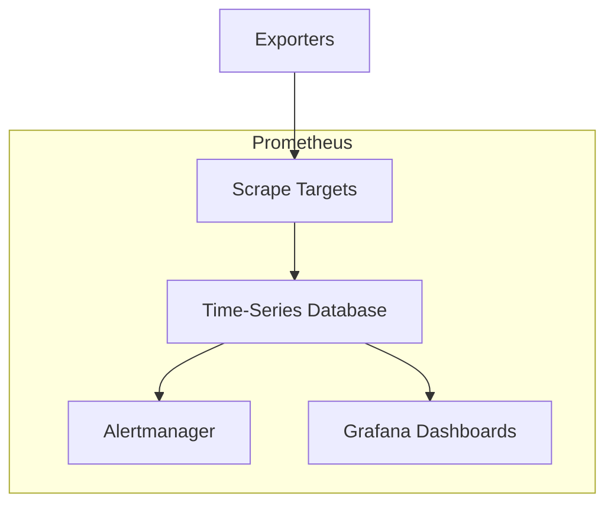

# 📈 **Monitoring** — The System’s Early Warning Radar

> _“If observability is about asking new questions, monitoring is about watching known ones.”_

---

## 📚 Table of Contents — Monitoring

1. [📖 What Is Monitoring?](#1)
2. [🎯 The Purpose of Monitoring](#2)
3. [⚙️ How Monitoring Works (Simplified Flow)](#3)
4. [🧮 Types of Monitoring](#4)
5. [📈 Key Components in Monitoring](#5)
6. [🧰 What Prometheus Brings to the Table](#6)
7. [🔴 When Monitoring Falls Short](#7)
8. [🪄 Quick Analogy](#8)

---

<a id="1"></a>

## 📖 **What Is Monitoring?**

Monitoring is the process of **collecting, analyzing, and visualizing data** from your systems to ensure that everything is working as expected — and to **alert you when it’s not**.

In short:

> Monitoring = Detect → Alert → React

---

### 💭 Think of it like this:

If observability is a full medical diagnosis,  
then **monitoring is the smartwatch** that tells you your heart rate just spiked 🫀💥

---

<a id="2"></a>

## 🎯 **The Purpose of Monitoring**

Monitoring answers the questions:

- 📊 _Is my application healthy?_
- ⚙️ _Are my services running within expected thresholds?_
- 🔔 _Do I need to take action right now?_

Its primary goals:

- Detect **abnormal system behavior**
- Trigger **alerts**
- Provide **historical trends**
- Support **capacity planning**

---

<a id="3"></a>

## ⚙️ **How Monitoring Works (Simplified Flow)**

<div align="center" style="background-color: #141a19ff;color: #a8a5a5ff; border-radius: 10px; border: 2px solid">



</div>

---

### 🪜 Step-by-step Breakdown:

1. **Instrumentation:**
   Code or exporters emit metrics like CPU usage, memory, latency.

2. **Collection:**
   Prometheus _scrapes_ these metrics periodically via HTTP endpoints.

3. **Storage:**
   Metrics are stored in a **time-series database** — every value tied to a timestamp.

4. **Alerting:**
   Alert rules (like `up == 0` or `cpu_usage > 90`) trigger notifications.

5. **Visualization:**
   Grafana displays these metrics through dashboards for analysis.

---

<a id="4"></a>

## 🤹🏻 **Types of Monitoring**

<div align="center" style="background-color: #141a19ff;color: #a8a5a5ff; border-radius: 10px; border: 2px solid">

| Type                             | Description                             | Example Metrics                       |
| -------------------------------- | --------------------------------------- | ------------------------------------- |
| **📍 Infrastructure Monitoring** | Tracks hardware & OS-level performance  | CPU, Memory, Disk, Network            |
| **📍 Application Monitoring**    | Tracks app-level metrics                | Request rate, error rate, latency     |
| **📍 Network Monitoring**        | Monitors traffic & connectivity         | Packet loss, bandwidth                |
| **📍 Log Monitoring**            | Watches for specific log patterns       | “ERROR”, “Timeout”                    |
| **📍 SLA/SLO Monitoring**        | Ensures service meets user expectations | 99.9% uptime, 95th percentile latency |

</div>

---

<a id="5"></a>

## 🧩 **Key Components in Monitoring**

<div align="center" style="background-color: #141a19ff;color: #a8a5a5ff; border-radius: 10px; border: 2px solid">

| Component                  | Purpose                       | Example                 |
| -------------------------- | ----------------------------- | ----------------------- |
| **🔹 Metrics Collection**  | Capture numerical system data | Prometheus exporters    |
| **🔹 Storage Engine**      | Store time-series data        | Prometheus TSDB         |
| **🔹 Alerting Engine**     | Detect anomalies              | Alertmanager            |
| **🔹 Visualization Layer** | Present dashboards            | Grafana                 |
| **🔹 Notification System** | Send alerts                   | Slack, Email, PagerDuty |

</div>

---

<a id="6"></a>

## 🧰 **What Prometheus Brings to the Table**

Prometheus is a **pull-based monitoring system** designed for cloud-native environments.

### 🧩 Architecture Overview

<div align="center" style="background-color: #141a19ff;color: #a8a5a5ff; border-radius: 10px; border: 2px solid">



</div>

### 🔑 Core Concepts

- **Targets:** The endpoints Prometheus scrapes (e.g., `/metrics`)
- **Jobs:** Logical groupings of targets
- **Exporters:** Convert system data (like node stats) into Prometheus metrics
- **Time-series:** Each metric with labels and timestamps
- **PromQL:** Query language to analyze and alert on data

---

### ⚠️ **Alerting in Monitoring**

Example PromQL rule:

```yaml
- alert: HighCPUUsage
  expr: node_cpu_seconds_total{mode="idle"} < 0.1
  for: 2m
  labels:
    severity: warning
  annotations:
    summary: "High CPU Usage detected on {{ $labels.instance }}"
```

This fires an alert if CPU usage stays above 90% for 2 minutes.

---

<a id="7"></a>

## 🔴 **When Monitoring Falls Short**

Monitoring is great for **known** issues, but it struggles with:

- Dynamic systems (like Kubernetes pods scaling up/down)
- Unknown failure patterns
- Complex distributed tracing

That’s where **observability** steps in — it helps you **explore unknowns** beyond predefined metrics.

---

<a id="8"></a>

## 🪄 **Quick Analogy**

<div align="center" style="background-color: #141a19ff;color: #a8a5a5ff; border-radius: 10px; border: 2px solid">

| Concept              | Analogy                                               |
| -------------------- | ----------------------------------------------------- |
| **🚨 Monitoring**    | Fire alarm (detects fire but doesn’t explain cause)   |
| **🔍 Observability** | Fire investigation (explains _why_ the fire happened) |

</div>
