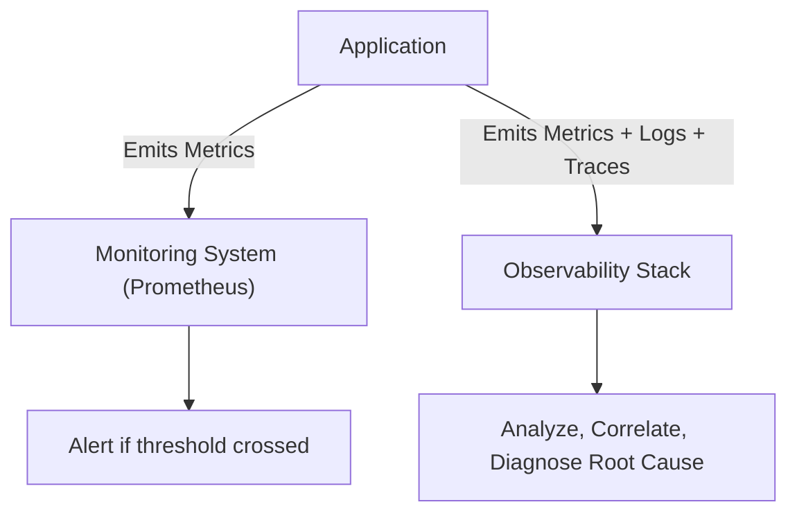
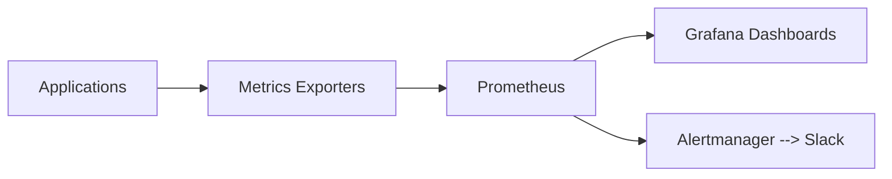
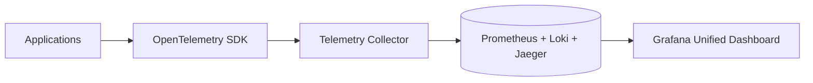
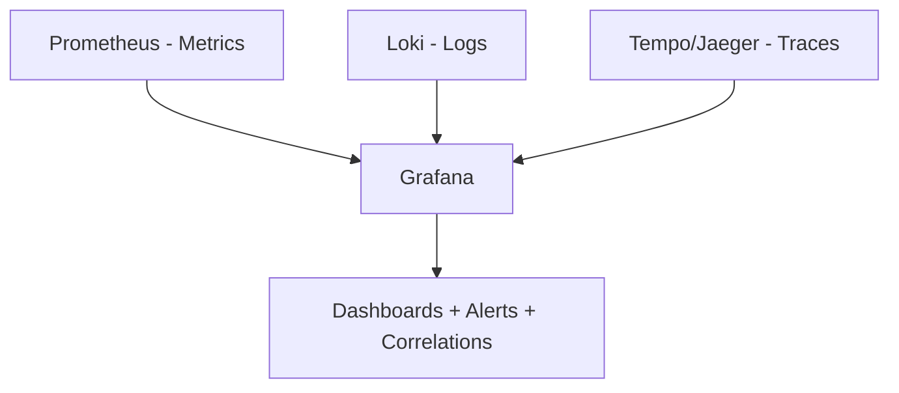

# ⚖️ **Observability vs Monitoring**

> _“Monitoring tells you the system is on fire.“_  
> _“Observability tells you why the fire started, how fast it spreads, and whether you’ve accidentally built your servers out of gasoline.”_

---

## 📚 Table of Contents

1. [🧭 The Big Picture](#1)
2. [🧩 The Core Difference Explained Visually](#2)
3. [🔍 Example Scenario — The Web App Slowdown](#3)
4. [⚙️ How the Data Flows Differ](#4)
5. [🧠 Known Knowns vs Unknown Unknowns](#5)
6. [🧮 Comparing Signal Types](#6)
7. [🧰 Tool Landscape](#7)
8. [🪄 Analogy You’ll Never Forget 😄](#8)
9. [🧩 Integration in Prometheus + Grafana Ecosystem](#9)
10. [🧠 TL;DR Summary Table](#10)
11. [🧩 Key Takeaway](#11)

---

## 🧭 **The Big Picture**

| Concept               | Monitoring                         | Observability                                    |
| --------------------- | ---------------------------------- | ------------------------------------------------ |
| **Purpose**           | Detect and alert on known problems | Understand unknown issues and root causes        |
| **Question Answered** | “Is it working?”                   | “Why isn’t it working?”                          |
| **Data Sources**      | Metrics (mostly numeric)           | Metrics + Logs + Traces                          |
| **Approach**          | Reactive (watch thresholds)        | Proactive (explore behavior)                     |
| **Focus**             | System health and uptime           | System behavior and context                      |
| **Tools**             | Prometheus, CloudWatch, Nagios     | Prometheus, Grafana, Loki, Jaeger, OpenTelemetry |

---

## 🧩 **The Core Difference Explained Visually**

### 💡 Interpretation:

- **Monitoring** focuses on the _symptom_ (CPU 95%)
- **Observability** digs into the _reason_ (Memory leak in checkout service causing retries)

---

## 🔍 **Example Scenario — The Web App Slowdown**

| Step         | Monitoring View                   | Observability View                                                |
| ------------ | --------------------------------- | ----------------------------------------------------------------- |
| 🧠 Question  | “Is the service healthy?”         | “Why are 20% of checkout requests failing only in EU region?”     |
| 📊 Metric    | 95% CPU usage detected on `web01` | 95% CPU usage traced to `cart-service` under `/checkout` endpoint |
| 🔔 Alert     | “CPU High on web01”               | “High latency due to DB lock in cart-service (trace ID: 4e9f7)”   |
| 📜 Data Used | CPU metric                        | CPU + Trace + Logs (DB timeout, slow query pattern)               |
| 🎯 Action    | Restart instance                  | Fix DB connection pool leak                                       |

---

## ⚙️ **How the Data Flows Differ**

### Monitoring Flow:

### Observability Flow:

---

> 👉 **Observability integrates multiple signal types**, not just metrics.  
> Grafana becomes your **central observability portal**, connecting Prometheus (metrics), Loki (logs), and Tempo/Jaeger (traces).

---

## 🧠 **Known Knowns vs Unknown Unknowns**

| Category             | Description                            | Example                                                   |
| -------------------- | -------------------------------------- | --------------------------------------------------------- |
| **Known Knowns**     | Things you know and can monitor easily | CPU usage, memory utilization                             |
| **Known Unknowns**   | Things you expect might break          | API latency, failed payments                              |
| **Unknown Unknowns** | Things you can’t predict               | A specific user flow failing due to feature flag conflict |

---

> Monitoring helps with the first two.  
> Observability helps with the _third one_ — where real chaos hides 🕵️‍♂️🔥

---

## 🧮 **Comparing Signal Types**

| Signal      | Purpose                                  | Used By                    |
| ----------- | ---------------------------------------- | -------------------------- |
| **Metrics** | Fast numeric tracking, used for alerting | Monitoring & Observability |
| **Logs**    | Detailed event context                   | Observability              |
| **Traces**  | End-to-end request flow                  | Observability              |
| **Events**  | External triggers (deploys, outages)     | Observability              |

---

## 🧰 **Tool Landscape**

| Category         | Tool                                | Description                                    |
| ---------------- | ----------------------------------- | ---------------------------------------------- |
| 🧮 Metrics       | **Prometheus**                      | Collects, stores, and queries time-series data |
| 📜 Logs          | **Loki / ELK**                      | Aggregates textual events                      |
| 🕵️‍♂️ Traces        | **Jaeger / Tempo**                  | Distributed tracing                            |
| 📊 Visualization | **Grafana**                         | Unified visualization and correlation          |
| 🔔 Alerting      | **Alertmanager / Grafana Alerting** | Sends actionable notifications                 |

---

## 🪄 **Analogy You’ll Never Forget 😄**

| Example      | Monitoring                                 | Observability                                                         |
| ------------ | ------------------------------------------ | --------------------------------------------------------------------- |
| 🚗 Car       | Dashboard lights show “Engine Overheating” | Mechanic investigates oil leak, coolant pressure, and thermostat logs |
| 🧑‍⚕️ Doctor | Heart monitor beeping fast                 | MRI + blood tests + patient history                                   |
| 🖥️ DevOps    | “CPU at 95%” alert                         | “Why only the EU region’s checkout API spikes CPU at night?”          |

---

## 🧩 **Integration in Prometheus + Grafana Ecosystem**

| Component        | Role                           | Observability Layer      |
| ---------------- | ------------------------------ | ------------------------ |
| **Prometheus**   | Metrics storage & query engine | Metrics                  |
| **Loki**         | Centralized log aggregation    | Logs                     |
| **Tempo/Jaeger** | Trace collector and visualizer | Traces                   |
| **Grafana**      | Unified visualization layer    | Integration of all three |

---

### 🧭 Unified Observability Stack in Grafana

---

> 💡 In Grafana, you can **click a metric → jump to related logs → trace the exact request**.  
> That’s the power of _correlation_ — the essence of observability.

---

## 🧠 **TL;DR Summary Table**

| Feature           | Monitoring          | Observability                           |
| ----------------- | ------------------- | --------------------------------------- |
| **Goal**          | Detect issues       | Understand cause                        |
| **Data Type**     | Metrics             | Metrics + Logs + Traces                 |
| **Nature**        | Reactive            | Proactive                               |
| **Questions**     | Known               | Unknown                                 |
| **Setup**         | Simpler             | More complex                            |
| **Primary Tools** | Prometheus, Grafana | Prometheus, Grafana, Loki, Tempo/Jaeger |
| **Focus**         | Alerts              | Insights                                |

---

## 🧩 **Key Takeaway**

> Monitoring keeps the system **alive**.  
> Observability keeps the system **understood**.

You need both.

- Monitoring helps you _detect_;
- observability helps you _explain_.

In practice, Prometheus + Grafana = monitoring base,  
and adding Loki + Tempo = full observability stack.
