# 🧲 [Grafana Alloy](https://grafana.com/docs/alloy/latest/)

> **Grafana Alloy** is a **vendor-neutral, programmable observability agent** that runs as a **single binary** and is responsible for **collecting, processing, and exporting telemetry data** (logs, metrics, traces, profiles). Alloy **does not store data**. It acts as a **pipeline engine**, wiring sources → processors → destinations using a **declarative component graph**.

---


---

## 🧠 One-Sentence Mental Model (Very Important)

> **Alloy is to observability what kube-proxy is to networking**:
> It doesn’t own the data — it **routes, transforms, and forwards it correctly**.

---

## 🔴 **Problem: Why Alloy Exists**

### 1️⃣ Before Alloy (The Old World)

| Signal   | Tool                    |
| -------- | ----------------------- |
| Logs     | Promtail                |
| Metrics  | Prometheus Agent        |
| Traces   | OpenTelemetry Collector |
| Profiles | Pyroscope Agent         |

❌ **Problems**:

- Too many agents
- Duplicate logic (discovery, relabeling, auth)
- Hard to operate at scale
- Inconsistent configuration models

---

### 2️⃣ Grafana’s Answer: Alloy

Grafana unified **everything** into **one programmable agent**:

| Capability     | Alloy |
| -------------- | ----- |
| Logs           | ✅    |
| Metrics        | ✅    |
| Traces         | ✅    |
| Profiles       | ✅    |
| Routing        | ✅    |
| Fan-out        | ✅    |
| Vendor neutral | ✅    |

---

## 🟢 **What Alloy Is (and Is NOT)**

### ✅ Alloy IS:

- A **data plane**
- A **pipeline engine**
- A **runtime for observability components**
- A **Promtail replacement**
- An **OTel-compatible agent**

### ❌ Alloy is NOT:

- A database
- A UI
- Loki / Prometheus / Tempo
- A control plane

---

## ⚙️ **Alloy Core Architecture**

<div align="center" style="background-color:#1f2a2aff;border-radius:10px;border:2px solid">


</div>

---

### 🔑 Alloy Design Rule

> **Everything in Alloy is a Component**
> Components are wired together using **explicit references**

---

## 🧩 **Alloy Component Types**

### 1️⃣ **Sources** – _Where data comes from_

Examples:

- Kubernetes pods
- Files
- Journald
- OTLP
- Prometheus scrape targets

```alloy
loki.source.kubernetes "pods" { }
```

---

### 2️⃣ **Processors** – _How data is transformed_

Examples:

- Label extraction
- JSON parsing
- Filtering
- Enrichment
- Redaction

```alloy
loki.process "enrich" { }
```

---

### 3️⃣ **Destinations** – _Where data goes_

Examples:

- Loki
- Prometheus Remote Write
- Tempo
- Grafana Cloud

```alloy
loki.write "default" { }
```

---

## 🧠 **Alloy Is a Directed Graph (Not a Script)**

This is critical.

- There is **no execution order**
- Only **data flow**
- Components exist independently
- Connections define behavior

> If it’s not wired, it doesn’t run.

---

## 🌐 **Full Log Pipeline Example (Mental Model)**

```mermaid
sequenceDiagram
    title Alloy Log Pipeline Flow 📜

    participant Pod as 📦 Pod
    participant FS as 🗂️ /var/log/pods
    participant Src as 📥 loki.source.kubernetes
    participant Proc as ⚙️ loki.process
    participant Write as 📤 loki.write
    participant Loki as 🧱 Loki

    Pod->>FS: Write container logs
    FS->>Src: Tail log files
    Src->>Proc: Attach k8s metadata
    Proc->>Proc: Parse / filter / label
    Proc->>Write: Forward logs
    Write->>Loki: Push logs via HTTP
```

<div align="center" style="background-color:#232b2dff;border-radius:10px;border:2px solid">



</div>

---

## 🔍 **Why Alloy Configuration Feels “Hard” at First**

Because Alloy:

- Is **explicit**
- Avoids magic
- Forces correctness
- Exposes all moving parts

This is **good**, but brutal without guardrails.

---

## 🔴 **Common Failure Points (You Experienced These)**

| Mistake             | Result               |
| ------------------- | -------------------- |
| Wrong log path      | No logs              |
| Missing relabel     | Logs without labels  |
| Wrong CRI parsing   | Garbled logs         |
| Missing permissions | Silent failure       |
| Wrong wiring        | Component never runs |

👉 This is exactly why **k8s-monitoring exists** (next topic).

---

## 🧠 **Key Alloy Concepts You Must Memorize**

### 🔑 1. Components don’t auto-connect

You must explicitly wire them:

```alloy
forward_to = [loki.write.default.receiver]
```

---

### 🔑 2. Kubernetes metadata is NOT automatic

It comes from:

- discovery
- relabeling
- processing

---

### 🔑 3. Alloy is stateless

If Alloy dies:

- Logs still exist
- They resume tailing

---

### 🔑 4. Alloy replaces Promtail completely

Promtail is deprecated.

---

## 🧭 **Where Alloy Runs**

| Environment | Pattern          |
| ----------- | ---------------- |
| Kubernetes  | DaemonSet        |
| VM          | systemd service  |
| Bare metal  | binary           |
| Containers  | sidecar / daemon |

---

## 🧠 **When You Should Use Raw Alloy**

Use **raw Alloy config** if:

- You need conditional routing
- You want multiple pipelines
- You need per-tenant logic
- You ingest non-K8s sources
- You are building a platform

---

## 🟢 **When You Should NOT Use Raw Alloy**

Do **not** start with raw Alloy if:

- You only need pod logs
- You are learning
- You want reliability fast
- You operate multiple clusters

This is where **`k8s-monitoring` wins**.

---

## 🧠 Memorization Block

### 🔑 Alloy = **S-P-D**

| Letter | Meaning     | Remember           |
| ------ | ----------- | ------------------ |
| **S**  | Source      | Where data enters  |
| **P**  | Process     | Transform / enrich |
| **D**  | Destination | Where data leaves  |

> If logs don’t appear → one of S, P, or D is broken.

---

## 🧠 Final Takeaway

- Alloy is **not scary**
- It is **honest**
- It exposes observability mechanics
- Helm charts exist to **protect you from foot-guns**
- Mastery comes from **reading generated configs**
