# 🤖 **`k8s-monitoring-alloy` Helm Chart Internals**

> The **`k8s-monitoring-alloy` Helm chart** is an **opinionated compiler** that converts **high-level Kubernetes observability intent** into a **fully wired Grafana Alloy runtime**.
> It does **not invent new behavior** — it **generates correct Alloy components**, Kubernetes RBAC, mounts, and pipelines so you don’t accidentally break log collection.

---


---

## 🔗 Docs

- [Overview of Grafana Kubernetes Monitoring Helm chart](https://grafana.com/docs/grafana-cloud/monitor-infrastructure/kubernetes-monitoring/configuration/helm-chart-config/helm-chart/)

- [Grafana Kubernetes Monitoring Helm chart Reference](https://grafana.com/docs/grafana-cloud/monitor-infrastructure/kubernetes-monitoring/configuration/helm-chart-config/helm-chart/customize-helm-chart/)

---

## 🧪 Full Demo

- [Monitor Kubernetes logs with Grafana Alloy](https://grafana.com/docs/alloy/latest/monitor/monitor-kubernetes-logs/)
- [Github Repo](https://github.com/grafana/alloy-scenarios/tree/main/k8s)

---

## 🔴 **Why This Chart Exists (The Real Reason)**

You already learned Alloy.
Now here’s the truth:

> **Raw Alloy + Kubernetes = expert-only territory**

### Why raw Alloy fails so often in K8s

| Area        | Why it breaks                            |
| ----------- | ---------------------------------------- |
| Log paths   | `/var/log/pods` vs `/var/log/containers` |
| CRI formats | containerd vs docker                     |
| Metadata    | Requires discovery + relabel             |
| RBAC        | Missing pod/node permissions             |
| Mounts      | HostPath mistakes                        |
| Ordering    | One missing `forward_to` = silence       |

Grafana observed:

- Thousands of broken Promtail configs
- Same mistakes repeated
- Silent failures (worst kind)

So they built **one canonical solution**.

---

## 🟢 **What the Chart Actually Deploys**

When you install:

```bash
helm install k8s-monitoring grafana/k8s-monitoring
```

You get **five layers**, not “magic”.

---

## ⚙️ **Layer 1: Alloy Runtime (Data Plane)**

| Resource  | Purpose                 |
| --------- | ----------------------- |
| DaemonSet | One Alloy pod per node  |
| Binary    | Grafana Alloy           |
| Mode      | Stateless, restart-safe |

> Alloy is **not special here** — it’s the same Alloy you learned.

---

## 🔐 **Layer 2: Kubernetes Permissions (RBAC)**

The chart creates:

- ServiceAccount
- ClusterRole
- ClusterRoleBinding

Permissions include:

- Pods
- Namespaces
- Nodes
- Endpoints

Why?

> Because Kubernetes metadata **does not magically exist** — Alloy must read it.

---

## 🗂️ **Layer 3: Host Mounts (The Log Truth)**

The chart mounts **exactly the correct paths**:

| Path               | Why                    |
| ------------------ | ---------------------- |
| `/var/log/pods`    | Canonical CRI pod logs |
| `/var/lib/kubelet` | Metadata correlation   |
| `/run/containerd`  | Runtime awareness      |

This is where **most manual setups fail**.

---

## 🧩 **Layer 4: Generated Alloy Component Graph**

This is the heart of the chart.

The Helm chart **renders Alloy configuration**, roughly equivalent to:

```alloy
discovery.kubernetes "pods" {
  role = "pod"
}

loki.source.kubernetes "pods" {
  targets    = discovery.kubernetes.pods.targets
  forward_to = [loki.process.k8s.receiver]
}

loki.process "k8s" {
  stage.cri {}
  stage.labels {
    values = {
      namespace = "kubernetes_namespace",
      pod       = "kubernetes_pod_name",
      container = "kubernetes_container_name",
      node      = "kubernetes_node_name",
    }
  }
  forward_to = [loki.write.default.receiver]
}

loki.write "default" {
  endpoint {
    url = "http://loki-gateway/loki/api/v1/push"
  }
}
```

👉 **Nothing hidden. Nothing proprietary. Just correct Alloy.**

---

## 🌐 **End-to-End Log Flow (Exactly Like Ingress)**

```mermaid
sequenceDiagram
    title k8s-monitoring Alloy Log Flow 📜

    participant Pod as 📦 Pod
    participant Node as 🖥️ Node FS
    participant Alloy as ⚙️ Alloy (DaemonSet)
    participant API as 🧭 K8s API
    participant Loki as 🧱 Loki

    Pod->>Node: Write logs (/var/log/pods)
    Node->>Alloy: File tailing
    Alloy->>API: Fetch pod metadata
    Alloy->>Alloy: Parse CRI + labels
    Alloy->>Loki: Push logs
```

<div align="center" style="background-color:#232b2dff;border-radius:10px;border:2px solid">



</div>

---

## 🧠 **Why You Felt “Blind” (And Why That’s OK)**

The chart intentionally:

- Hides **relabeling hell**
- Hides **CRI quirks**
- Hides **RBAC boilerplate**

This is **good abstraction**, not loss of control.

> You are not blind — you are **shielded**.

---

## 🔎 **How to De-Blackbox the Chart (Mandatory for Mastery)**

### Step 1️⃣ Inspect Generated Alloy Config

```bash
kubectl get configmap -n logging | grep alloy
kubectl get configmap k8s-monitoring-alloy -n logging -o yaml
```

This is **the single most important learning step**.

---

### Step 2️⃣ Map `values.yaml` → Alloy Components

| values.yaml               | Alloy Result              |
| ------------------------- | ------------------------- |
| `logs.enabled=true`       | `loki.source.kubernetes`  |
| `destinations.loki.url`   | `loki.write.endpoint.url` |
| `logs.processing`         | `loki.process` stages     |
| `logs.podLogs.namespaces` | relabel filters           |

---

## 🧩 **Extending the Chart Safely (Your Main Concern)**

You asked:

> “What if in future I need to collect something else?”

This is **exactly what the chart is designed for**.

---

### 🟢 Example 1: Namespace Filtering

```yaml
logs:
  podLogs:
    namespaces:
      include:
        - prod
        - staging
```

➡ Generates relabel rules automatically.

---

### 🟢 Example 2: JSON Log Parsing

```yaml
logs:
  processing:
    stages:
      - json:
          expressions:
            level: level
            message: msg
```

➡ Injects `loki.process` stages safely.

---

### 🟢 Example 3: Add Host Logs

```yaml
logs:
  hostLogs:
    enabled: true
```

➡ Adds file + journald sources.

---

### 🟢 Example 4: Multi-Destination Fan-out

```yaml
destinations:
  loki:
    url: http://loki-a/loki/api/v1/push
  lokiBackup:
    url: http://loki-b/loki/api/v1/push
```

➡ Alloy fans out internally.

---

## 🔴 **When You Should STOP Using This Chart**

The chart is **not forever**.

You should graduate to raw Alloy if:

- You need per-namespace pipelines
- You need conditional routing logic
- You build an internal observability platform
- You want per-tenant headers
- You need non-K8s custom sources

Until then:

> This chart is **the correct production choice**.

---

## 🧠 **Comparison (Ingress Analogy)**

| Concept           | Ingress      | k8s-monitoring |
| ----------------- | ------------ | -------------- |
| Low-level engine  | NGINX        | Alloy          |
| High-level config | Ingress YAML | values.yaml    |
| Generated config  | nginx.conf   | alloy config   |
| Safe defaults     | Yes          | Yes            |
| Escape hatch      | Custom NGINX | Raw Alloy      |

---

## 🧠 Memorization Block

### 🔑 Mnemonic: **D-R-M-P-W**

| Letter | Meaning            |
| ------ | ------------------ |
| **D**  | DaemonSet          |
| **R**  | RBAC               |
| **M**  | Mounts             |
| **P**  | Pipelines          |
| **W**  | Write destinations |

If logs fail → inspect **D-R-M-P-W**.

---

## 🧠 Final Takeaway (Very Important)

- `k8s-monitoring-alloy` is **not magic**
- It is a **compiler**
- It encodes Grafana’s production knowledge
- You can inspect everything
- You can extend safely
- You can outgrow it later

> **This chart saved you because it removed foot-guns, not control.**
