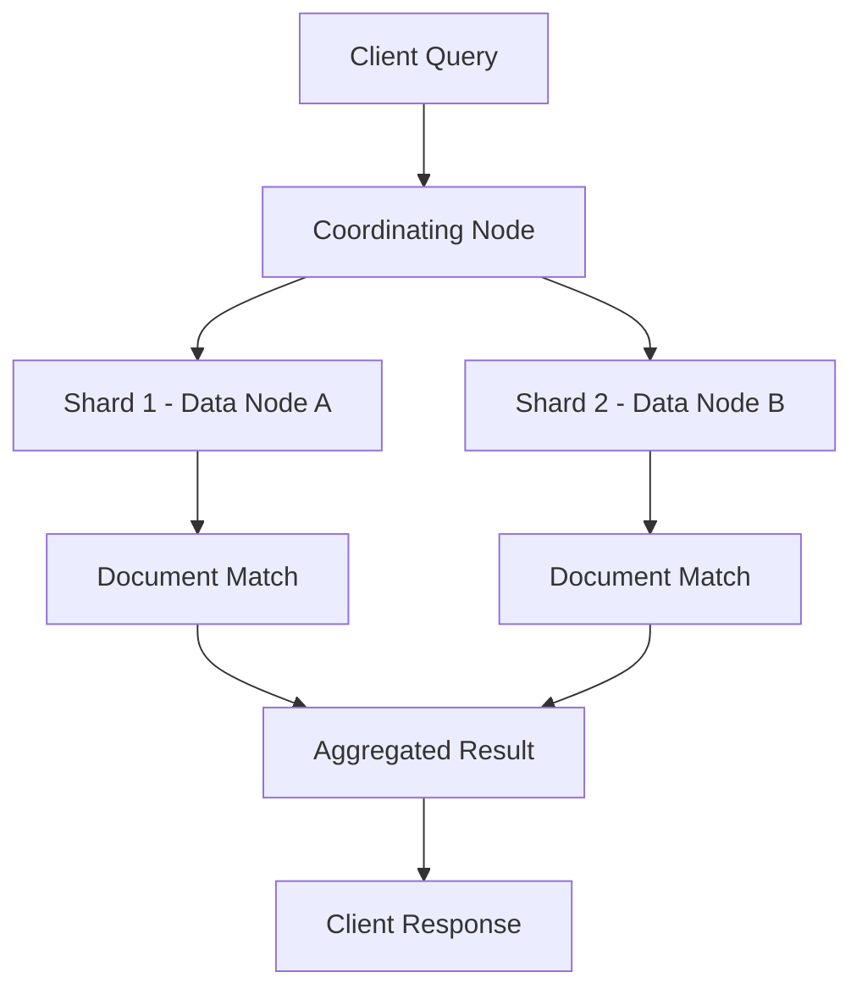

# 🔍 Elasticsearch

> _📖 Distributed Search & Analytics Engine for Real-Time Observability and Data Exploration._

**Elasticsearch** is a powerful, open-source, distributed search and analytics engine built on top of **Apache Lucene**. It’s designed for **horizontal scalability**, **real-time querying**, and **structured + unstructured data indexing** — making it a cornerstone of modern observability stacks, log analytics, and search-driven applications.

---

## 🧠 Architectural Overview

Elasticsearch operates as a **cluster of nodes**, each playing a specific role in indexing, querying, and storing data:

| Component       | Role                                                                      |
| --------------- | ------------------------------------------------------------------------- |
| 🧠 **Cluster**  | A group of nodes working together to provide search/indexing.             |
| 🖥️ **Node**     | A single instance of Elasticsearch; can be master, data, or coordinating. |
| 📦 **Index**    | Logical namespace for documents (like a database).                        |
| 📄 **Document** | JSON object representing a unit of data (like a row).                     |
| 🧩 **Shard**    | A partition of an index for scalability and parallelism.                  |
| 🔁 **Replica**  | Copy of a shard for fault tolerance and high availability.                |

Each document is automatically indexed, and fields are searchable with near real-time latency.

---

## 📦 Key Features

- 🔍 **Full-Text Search**: Fast, flexible querying with relevance scoring and fuzzy matching.
- 📊 **Analytics Engine**: Aggregations for metrics, histograms, trends, and dashboards.
- 🧬 **Schema-Free JSON Storage**: Index any structured or semi-structured data.
- 🔁 **Real-Time Indexing**: Data is searchable within seconds of ingestion.
- 🧱 **Horizontal Scalability**: Add nodes to scale out storage and query capacity.
- 🔐 **Security & RBAC**: TLS, authentication, field-level access control (via X-Pack).
- 📡 **RESTful API**: Interact via HTTP with rich query DSL.
- 🧰 **Multi-Tenancy**: Separate indices and roles for isolated workloads.
- 🧪 **Machine Learning**: Anomaly detection, forecasting, and pattern recognition.
- 🔄 **Snapshot & Restore**: Backup indices to S3, GCS, Azure Blob, etc.

---

## 🚀 When to Use Elasticsearch

Elasticsearch is ideal for:

- 📈 **Log and event analytics** (e.g., via Logstash, Fluentd, or Beats).
- 🔍 **Search-driven applications** (e.g., e-commerce, document search).
- 🧠 **Observability stacks** (metrics, traces, logs — often via ELK or EFK).
- 🧰 **Security analytics** and SIEM platforms.
- 🧪 **Real-time dashboards** with Grafana or Kibana.
- 🧱 **Data lake indexing** for fast exploration of semi-structured data.

It’s especially powerful when paired with **Kibana** for visualization and **Logstash/Filebeat** for ingestion.

---

## ⚔️ Elasticsearch vs OpenSearch vs Solr

| Feature          | 🔍 **Elasticsearch**                 | 🔎 **OpenSearch**             | 🔍 **Apache Solr**                   |
| ---------------- | ------------------------------------ | ----------------------------- | ------------------------------------ |
| Origin           | Elastic (Apache Lucene)              | AWS fork of Elasticsearch 7.x | Apache Lucene-based                  |
| License          | Elastic License / SSPL               | Apache 2.0                    | Apache 2.0                           |
| Visualization    | Kibana                               | OpenSearch Dashboards         | Solr Admin UI                        |
| Query Language   | Elasticsearch DSL                    | Same as Elasticsearch         | Solr Query Syntax                    |
| Ecosystem        | ELK Stack (Logstash, Kibana, Beats)  | OpenSearch plugins            | SolrCloud, Zookeeper                 |
| Machine Learning | ✅ Native (X-Pack)                   | 🔶 Limited via plugins        | ❌ None                              |
| Community        | Large, but split post-license change | Growing AWS-backed community  | Stable Apache community              |
| Use Case Fit     | Observability, search, analytics     | Same as Elasticsearch         | Enterprise search, document indexing |

**TL;DR**:

- Use **Elasticsearch** for **real-time search and analytics** with rich ecosystem support.
- Use **OpenSearch** for **open-source compliance** and AWS-native integration.
- Use **Solr** for **traditional enterprise search** with strong stability.

---

## 🗺️ Visual Model (Mermaid-style)

This shows how a query is distributed across shards, matched, and aggregated before returning to the client.

---

## 🧩 Strategic Fit for You, Hady

- 🧠 **Architectural clarity**: Elasticsearch’s distributed model and shard-based indexing align with your modular thinking.
- 📁 **Portfolio-ready**: Showcase log pipelines (Fluentd → Elasticsearch → Kibana) with alerting and dashboards.
- 🧪 **Tool benchmarking**: Compare Elasticsearch vs OpenSearch vs Loki for log analytics and observability.
- 🔐 **Security signaling**: Demonstrate RBAC, TLS, and audit logging for compliance-heavy environments.
- 📊 **Interview leverage**: Model index mappings, shard strategies, and query optimization patterns.

---

You can explore Elastic’s [reference architectures](https://www.elastic.co/docs/deploy-manage/reference-architectures) or check out [DevOps best practices for Elasticsearch](https://codezup.com/unlocking-elasticsearchs-potential-best-practices-for-devops/) for deeper implementation insights.
