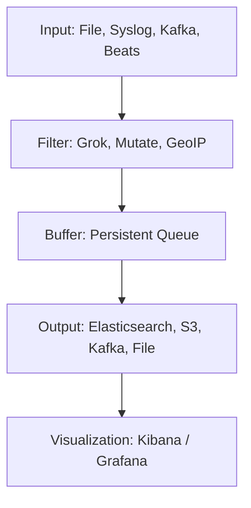

# 🔄 Logstash

> _📖 Real-Time Data Ingestion, Transformation, and Routing for the Elastic Stack._

**Logstash** is a powerful, open-source **data processing pipeline** that ingests data from multiple sources, transforms it, and routes it to various destinations — most commonly **Elasticsearch**. It’s a core component of the **ELK Stack** (Elasticsearch, Logstash, Kibana), designed for **flexible ETL**, **real-time analytics**, and **observability workflows** in DevOps and SRE environments.

---

## 🧠 Architectural Overview

Logstash operates as a **modular, plugin-driven pipeline engine**:

| Component                | Role                                                          |
| ------------------------ | ------------------------------------------------------------- |
| 📥 **Input Plugins**     | Ingest data from logs, metrics, APIs, databases, queues, etc. |
| 🔍 **Filter Plugins**    | Parse, enrich, transform, and conditionally modify data.      |
| 📤 **Output Plugins**    | Send processed data to Elasticsearch, Kafka, S3, files, etc.  |
| 🧱 **Pipeline**          | Defines the flow: input → filter → output.                    |
| 🧪 **Persistent Queues** | Buffer data to handle spikes and ensure durability.           |
| 🔧 **Codec Plugins**     | Encode/decode data formats (e.g., JSON, CSV, protobuf).       |

Each pipeline is defined in a config file (`logstash.conf`) and can be scaled horizontally across nodes for high-throughput environments.

---

## 📦 Key Features

- 🧬 **Multi-source Ingestion**: Logs, metrics, events, databases, cloud services, message queues.
- 🔁 **Real-Time Processing**: ETL on the fly — parse, enrich, and transform data before indexing.
- 🧰 **Plugin Ecosystem**: 200+ plugins for inputs, filters, outputs, codecs.
- 🔐 **Secure Transport**: TLS encryption, authentication, and secure endpoints.
- 🧪 **Durable Queues**: Disk-based buffering for resilience against ingestion spikes.
- 📊 **Conditional Logic**: Route data based on content, source, or metadata.
- 🧱 **Multiple Pipelines**: Run isolated pipelines for different data flows or teams.
- 📡 **Integration with Beats**: Use Filebeat, Metricbeat, etc. to ship data to Logstash.
- 🧩 **Cloud & Hybrid Ready**: Ingest from AWS, Azure, GCP, and on-prem systems.

---

## 🚀 When to Use Logstash

Logstash is ideal for:

- 🧠 **Centralized log aggregation** across diverse systems.
- 🧰 **ETL workflows** for observability, analytics, and compliance.
- 🔁 **Multi-destination routing** (e.g., Elasticsearch + S3 + Kafka).
- 🔐 **Security monitoring** with enriched log pipelines.
- 📊 **Real-time dashboards** via Kibana or Grafana.
- 🧪 **CI/CD observability** to track deployments, failures, and trends.

It’s especially powerful when paired with **Elasticsearch** for storage and **Kibana** for visualization.

---

## ⚔️ Logstash vs Fluentd vs Vector

| Feature                 | 🔄 **Logstash**                       | 🔥 **Fluentd**               | 📈 **Vector**              |
| ----------------------- | ------------------------------------- | ---------------------------- | -------------------------- |
| Language                | JRuby                                 | Ruby + C                     | Rust                       |
| Resource Usage          | 🔶 Moderate to high                   | 🔶 Moderate                  | ✅ Very low                |
| Plugin Ecosystem        | ✅ 200+ plugins                       | ✅ 500+ plugins              | 🔶 Growing                 |
| Buffering & Reliability | ✅ Persistent queues                  | ✅ File/memory buffers       | ✅ Disk buffers            |
| Transformation Power    | ✅ Strong (grok, mutate, geoip, etc.) | ✅ Strong                    | 🔶 Limited                 |
| Kubernetes Integration  | ✅ Native                             | ✅ Native                    | ✅ Native                  |
| Performance             | 🔶 Moderate                           | ✅ High throughput           | ✅ Very high               |
| Use Case Fit            | ETL, multi-destination, filtering     | ETL, log shipping, filtering | Lightweight log forwarding |

**TL;DR**:

- Use **Logstash** for **complex, multi-stage data pipelines**.
- Use **Fluentd** for **flexible log shipping and enrichment**.
- Use **Vector** for **high-performance, low-resource log forwarding**.

---

## 🗺️ Visual Model (Mermaid-style)

This shows how Logstash ingests, transforms, buffers, and routes data to destinations for analysis.

---

## 🧩 Strategic Fit for You, Hady

- 🧠 **Architectural clarity**: Logstash’s plugin-based pipeline mirrors your modular design mindset — each stage is isolated and configurable.
- 📁 **Portfolio-ready**: Showcase multi-source log pipelines with filtering, enrichment, and multi-destination routing.
- 🧪 **Tool benchmarking**: Compare Logstash vs Fluentd vs Vector for cost, performance, and extensibility.
- 🔐 **Security signaling**: Demonstrate encrypted log forwarding, tenant isolation, and compliance-ready pipelines.
- 📊 **Interview leverage**: Model log ingestion flows, buffer strategies, and plugin configurations for real-time observability.

---

You can explore Logstash’s deployment patterns and scaling strategies in [Elastic’s reference guide](https://www.elastic.co/docs/reference/logstash/deploying-scaling-logstash) or dive into pipeline architecture via [DeepWiki’s breakdown](https://deepwiki.com/elastic/reference-architecture-docs/2.4-logstash).
