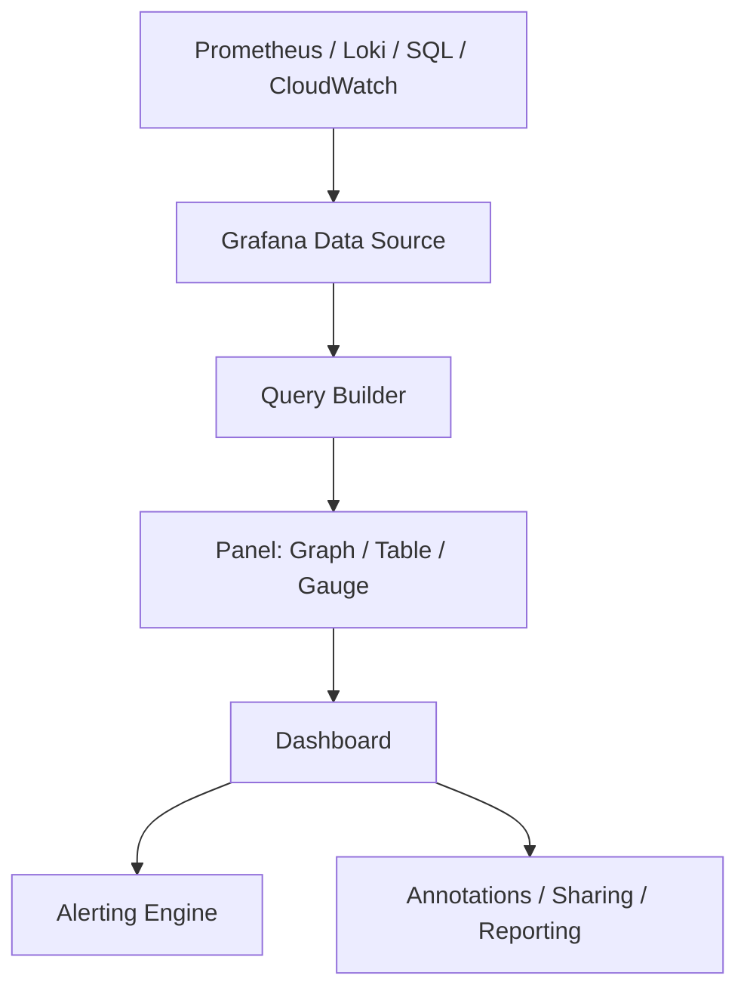

# 📊 Grafana

> _📖 Unified Observability & Dashboarding for Metrics, Logs, and Traces._

**Grafana** is an open-source **visualization and observability platform** that lets you query, analyze, and display data from multiple sources — all in customizable, interactive dashboards. It’s a central hub for **monitoring infrastructure**, **debugging applications**, and **tracking business KPIs**, making it a must-have in any **DevOps, SRE, or cloud-native stack**.

---

## 🧠 Architectural Overview

Grafana is built around a **plugin-based, data-source-agnostic architecture**:

| Component              | Role                                                                  |
| ---------------------- | --------------------------------------------------------------------- |
| 📦 **Data Sources**    | Connects to Prometheus, Loki, Elasticsearch, InfluxDB, MySQL, etc.    |
| 📊 **Panels**          | Visual elements (graphs, tables, heatmaps) that display queried data. |
| 🧩 **Dashboards**      | Collections of panels organized for specific use cases or teams.      |
| 🔔 **Alerting Engine** | Triggers alerts based on thresholds or anomalies.                     |
| 🔐 **Auth & RBAC**     | Supports LDAP, OAuth, SSO, and granular access control.               |
| 🧰 **Plugins**         | Extend Grafana with custom panels, data sources, and apps.            |
| 📡 **Live Streaming**  | Real-time data push via Grafana Live (no external backend needed).    |

Grafana can run as a **self-hosted service** or via **Grafana Cloud**, which offers managed hosting and integrations.

---

## 📦 Key Features

- 🧬 **Multi-Source Dashboards**: Combine metrics, logs, and traces from different backends.
- 🔍 **Query Builders**: Visual editors for Prometheus, Loki, and more — no need to memorize DSLs.
- 📊 **Rich Panel Types**: Graphs, tables, heatmaps, gauges, bar charts, and custom visualizations.
- 🔔 **Alerting & Notification**: Trigger alerts and send to Slack, PagerDuty, email, etc.
- 🧪 **Annotations & Event Markers**: Overlay deployments, incidents, or notes on graphs.
- 🔐 **Role-Based Access Control**: Secure dashboards with user/team-level permissions.
- 🧱 **Templating & Variables**: Build reusable dashboards with dynamic filters.
- 📡 **Grafana Live**: Stream real-time data directly into dashboards.
- 🧰 **Plugin Ecosystem**: Extend with community or enterprise plugins (e.g., Zabbix, Splunk, Snowflake).
- 📁 **Reporting & Sharing**: Schedule reports, export dashboards, and share links securely.

---

## 🚀 When to Use Grafana

Grafana is ideal for:

- 📈 **Infrastructure Monitoring**: CPU, memory, disk, network — across VMs, containers, and cloud.
- 🧰 **Application Performance Monitoring (APM)**: Visualize latency, error rates, throughput.
- 🔍 **Log Analytics**: Integrate with Loki or Elasticsearch to correlate logs with metrics.
- 🧪 **CI/CD Observability**: Track pipeline health, deployment frequency, and failure rates.
- 📊 **Business Intelligence**: Connect to SQL or cloud data warehouses for KPI dashboards.
- 🔐 **Security Monitoring**: Visualize audit logs, access patterns, and threat indicators.

---

## ⚔️ Grafana vs Kibana vs Chronograf

| Feature        | 📊 **Grafana**                             | 🔍 **Kibana**                     | ⏱️ **Chronograf**   |
| -------------- | ------------------------------------------ | --------------------------------- | ------------------- |
| Data Sources   | Multi-source (Prometheus, Loki, SQL, etc.) | Elasticsearch only                | InfluxDB only       |
| Visualization  | Rich panel types + plugins                 | Strong for logs and search        | Time-series focused |
| Alerting       | Built-in + integrations                    | Basic (via Watcher or ElastAlert) | Via Kapacitor       |
| Query Language | PromQL, LogQL, SQL, etc.                   | Lucene Query DSL                  | Flux or InfluxQL    |
| Extensibility  | ✅ Plugin ecosystem                        | 🔶 Limited                        | ❌ Minimal          |
| Use Case Fit   | Unified observability                      | Log analytics                     | IoT and time-series |

**TL;DR**:

- Use **Grafana** for **multi-source observability and dashboards**.
- Use **Kibana** for **deep log search and Elasticsearch analytics**.
- Use **Chronograf** for **InfluxDB-centric time-series monitoring**.

---

## 🗺️ Visual Model (Mermaid-style)

This shows how Grafana pulls data, visualizes it, and enables alerting and collaboration.

---

## 🧩 Strategic Fit for You, Hady

- 🧠 **Architectural clarity**: Grafana’s modular dashboards and data-source abstraction align with your visualization-first mindset.
- 📁 **Portfolio-ready**: Showcase unified dashboards integrating metrics, logs, and traces across cloud platforms.
- 🧪 **Tool benchmarking**: Compare Grafana vs Kibana vs Power BI vs Microsoft Fabric for cost, support, and integration.
- 🔐 **Security signaling**: Demonstrate RBAC, SSO, and audit-ready dashboarding for enterprise-grade observability.
- 📊 **Interview leverage**: Model CI/CD observability, multi-tenant dashboards, and real-time alerting flows.

---

You can explore Grafana’s DevOps applications in [this practical guide](https://www.eyer.ai/blog/grafana-for-devops-a-practical-guide/) or dive into its top features via [Grafana Labs’ feature breakdown](https://grafana.com/blog/2023/07/14/celebrating-grafana-10-top-10-grafana-features-you-need-to-know-about/).
