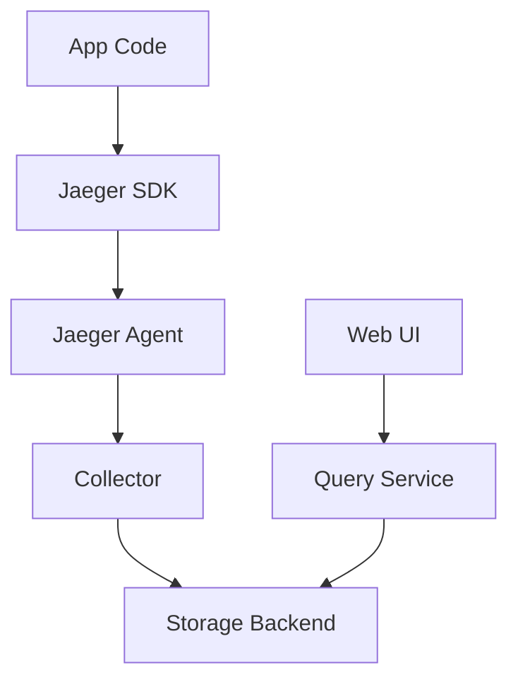

# 🕵️ Jaeger

> _📖 Distributed Tracing for Microservices Observability and Performance Debugging._

**Jaeger** is an open-source, CNCF-hosted **distributed tracing system** originally developed by Uber. It helps DevOps and SRE teams **visualize, monitor, and debug** the flow of requests across microservices — making it a critical tool for **performance optimization**, **root cause analysis**, and **dependency mapping** in cloud-native environments.

---

## 🧠 Architectural Overview

Jaeger can be deployed as a **monolithic binary** or as a **scalable, distributed system**. Here’s the modular architecture:

| Component              | Role                                                                       |
| ---------------------- | -------------------------------------------------------------------------- |
| 🧑‍💻 **Client SDKs**  | Instrument your app to generate spans (OpenTelemetry or OpenTracing).      |
| 📡 **Jaeger Agent**    | Lightweight daemon that receives spans over UDP and forwards to Collector. |
| 📥 **Collector**       | Receives spans, batches them, and writes to storage.                       |
| 🗃️ **Storage Backend** | Stores trace data (Elasticsearch, Cassandra, Kafka, etc.).                 |
| 🔍 **Query Service**   | Retrieves trace data from storage for visualization.                       |
| 🖥️ **UI**              | Web interface to explore traces, latencies, and service maps.              |

Each **trace** is a directed acyclic graph of **spans**, representing the lifecycle of a request across services.

---

## 📦 Key Features

- 🧬 **Distributed Tracing**: Track requests across services with full context propagation.
- 🔍 **Root Cause Analysis**: Identify bottlenecks and latency hotspots.
- 📊 **Service Dependency Graphs**: Visualize how services interact.
- 🧪 **Sampling Strategies**: Control trace volume with probabilistic or adaptive sampling.
- 🔁 **OpenTelemetry & OpenTracing Support**: Compatible with modern tracing standards.
- 🔧 **Multi-Backend Storage**: Elasticsearch, Cassandra, Kafka, etc.
- 📡 **Agent-Based Collection**: Efficient span forwarding with minimal overhead.
- 🖥️ **Web UI**: Explore traces, errors, and performance metrics visually.
- 🔐 **Security & Isolation**: Deploy per-tenant agents and collectors for multi-tenancy.

---

## 🚀 When to Use Jaeger

Jaeger is ideal for:

- 🧠 **Microservices architectures** needing end-to-end request visibility.
- 🧰 **Performance debugging** across distributed systems.
- 🔁 **CI/CD validation** to trace deployment impacts.
- 📊 **SRE workflows** for latency analysis and SLIs.
- 🔐 **Compliance and audit trails** for request-level tracking.

It’s especially powerful when paired with **Prometheus (metrics)** and **Grafana (dashboards)** for full-stack observability.

---

## ⚔️ Jaeger vs Zipkin vs OpenTelemetry Collector

| Feature               | 🕵️ **Jaeger**                   | 🧭 **Zipkin**                   | 📡 **OTel Collector**                      |
| --------------------- | ------------------------------- | ------------------------------- | ------------------------------------------ |
| Origin                | Uber                            | Twitter                         | CNCF                                       |
| UI                    | ✅ Rich trace explorer          | ✅ Basic trace viewer           | ❌ None (backend only)                     |
| Protocol Support      | OpenTracing, OpenTelemetry      | Zipkin format                   | OTLP, Jaeger, Zipkin, Prometheus, etc.     |
| Storage Backends      | Elasticsearch, Cassandra, Kafka | Elasticsearch, MySQL, Cassandra | External (pluggable)                       |
| Sampling              | ✅ Configurable                 | 🔶 Limited                      | ✅ Advanced                                |
| Ecosystem Integration | ✅ Prometheus, Grafana          | 🔶 Limited                      | ✅ Full observability stack                |
| Use Case Fit          | Tracing + visualization         | Lightweight tracing             | Telemetry pipeline (metrics, logs, traces) |

**TL;DR**:

- Use **Jaeger** for **visual distributed tracing** and debugging.
- Use **Zipkin** for **lightweight tracing** with simpler setup.
- Use **OTel Collector** for **multi-signal telemetry pipelines**.

---

## 🗺️ Visual Model (Mermaid-style)

This shows how spans flow from your app to storage, and how Jaeger visualizes them.

---

## 🧩 Strategic Fit for You, Hady

- 🧠 **Architectural clarity**: Jaeger’s span-based model aligns with your modular thinking — each service interaction is traceable and visual.
- 📁 **Portfolio-ready**: Showcase trace graphs, latency breakdowns, and root cause flows across microservices.
- 🧪 **Tool benchmarking**: Compare Jaeger vs Zipkin vs OTel Collector for cost, performance, and integration.
- 🔐 **Security signaling**: Demonstrate tenant isolation, encrypted span transport, and trace retention policies.
- 📊 **Interview leverage**: Model trace propagation, sampling strategies, and service dependency graphs.

---

You can explore Jaeger’s architecture in depth via [Jaeger’s official docs](https://www.jaegertracing.io/docs/1.23/architecture/) or check out [DevOpsSchool’s use case guide](https://www.devopsschool.com/blog/what-is-jaeger-and-use-cases-of-jaeger/).
