# 🧠 **Grafana Loki Internals** (_Log Database, Not Log Storage_)

> **Grafana Loki** is a **horizontally scalable, multi-tenant log aggregation system** that **indexes only metadata (labels)** instead of log content.
> Loki is designed to be **cheap, simple, and cloud-native**, delegating log shipping to agents (Alloy) and storage to **object storage** (S3, GCS, MinIO).

---


---

## 🧠 One-Sentence Mental Model (Critical)

> **Loki is Prometheus for logs**:
> It indexes **labels**, not **log lines**, and retrieves log content only **at query time**.

If this sentence is clear → everything else is easy.

---

## 🔴 **Problem: Why Loki Exists**

### 1️⃣ Traditional Log Systems (ELK-style)

| Component       | Role          |
| --------------- | ------------- |
| Beats / Fluentd | Shippers      |
| Elasticsearch   | Index + store |
| Kibana          | UI            |

❌ **Problems**:

- Full-text indexing = expensive
- Huge storage cost
- Heavy operational overhead
- Scaling Elasticsearch is painful

---

### 2️⃣ Loki’s Different Philosophy

Grafana asked:

> “Why do we index _every word_ in logs when we usually filter by metadata?”

Answer:

- Kubernetes already gives labels
- Prometheus already proved label-based querying works

So Loki was born.

---

## 🟢 **What Loki Is (and Is NOT)**

### ✅ Loki IS:

- A **log database**
- A **label-indexed system**
- A **query engine**
- A **multi-tenant backend**

### ❌ Loki is NOT:

- A log shipper
- A full-text search engine
- A metrics system
- A UI (Grafana is)

---

## ⚙️ **High-Level Loki Architecture**

<div align="center" style="background-color:#1f2a2aff;border-radius:10px;border:2px solid">

```mermaid
graph LR
    A[📥 Log Agent<br/>(Alloy)]
    B[🚪 Gateway]
    C[✍️ Write Path]
    D[📦 Object Storage]
    E[📖 Read Path]
    F[🖥️ Grafana UI]

    A --> B --> C --> D
    F --> B --> E --> D

    classDef agent fill:#2b8a3e,color:#fff;
    classDef write fill:#b08900,color:#fff;
    classDef store fill:#364fc7,color:#fff;
    classDef read fill:#8f2d56,color:#fff;

    class A agent
    class C write
    class D store
    class E read
```

</div>

---

## 🧱 **Core Loki Components (Simple Scalable Mode)**

This is the mode you are using.

| Component          | Responsibility               |
| ------------------ | ---------------------------- |
| **Gateway**        | Entry point (read + write)   |
| **Distributor**    | Validates & distributes logs |
| **Ingester**       | Buffers & chunks logs        |
| **Object Storage** | Stores chunks + index        |
| **Querier**        | Executes queries             |
| **Query Frontend** | Splits & caches queries      |
| **Compactor**      | Retention & cleanup          |

---

## ✍️ **Write Path (Log Ingestion)**

```mermaid
sequenceDiagram
    title Loki Write Path ✍️

    participant Alloy as ⚙️ Alloy
    participant Gateway as 🚪 Gateway
    participant Dist as 📤 Distributor
    participant Ing as 🧱 Ingester
    participant Store as 📦 Object Storage

    Alloy->>Gateway: Push logs (HTTP)
    Gateway->>Dist: Forward request
    Dist->>Dist: Validate labels & limits
    Dist->>Ing: Hash by label set
    Ing->>Ing: Buffer logs in memory
    Ing->>Store: Flush chunks periodically
```

<div align="center" style="background-color:#232b2dff;border-radius:10px;border:2px solid">



</div>

---

### 🔑 Important Write Concepts

- Logs are grouped by **label set**
- Same labels → same stream
- Streams are chunked
- Chunks are compressed
- Index points to chunks

---

## 📖 **Read Path (Query Execution)**

```mermaid
sequenceDiagram
    title Loki Read Path 📖

    participant User as 👤 User
    participant Grafana as 🖥️ Grafana
    participant Gateway as 🚪 Gateway
    participant QF as 🧭 Query Frontend
    participant Querier as 🔍 Querier
    participant Store as 📦 Object Storage

    User->>Grafana: LogQL query
    Grafana->>Gateway: HTTP request
    Gateway->>QF: Forward query
    QF->>Querier: Split query
    Querier->>Store: Fetch index + chunks
    Querier-->>Grafana: Return logs
```

<div align="center" style="background-color:#232b2dff;border-radius:10px;border:2px solid">



</div>

---

## 🏷️ **Labels: The Heart of Loki**

This is the **single most important concept**.

### Example label set:

```ini
{namespace="prod", pod="api-123", container="web"}
```

### What Loki indexes:

- namespace
- pod
- container
- node
- app
- environment

### What Loki does NOT index:

- log message content

---

## 🧠 **LogQL: Loki Query Language**

LogQL = **PromQL + logs**

### 1️⃣ Log filtering

```ini
{namespace="prod"} |= "error"
```

### 2️⃣ Regex filtering

```ini
{app="api"} |~ "timeout|failed"
```

### 3️⃣ Metrics from logs

```ini
count_over_time({app="api"} |= "error" [5m])
```

This is why Loki integrates so well with Prometheus.

---

## 📦 **Storage Model (Why Loki Is Cheap)**

| Data       | Stored Where          |
| ---------- | --------------------- |
| Log chunks | Object storage        |
| Index      | Object storage        |
| Cache      | Memory / Redis        |
| WAL        | Local disk (optional) |

You already use:

- MinIO (S3-compatible)
- Buckets per tenant / environment

---

## 🧠 **Why Object Storage Is Mandatory**

Because:

- Infinite scale
- Cheap
- Durable
- No shard rebalancing

Loki **does not care** where data lives — only how to reference it.

---

## 🔐 **Multi-Tenancy (Critical in Production)**

Loki is **multi-tenant by design**.

Tenancy is enforced by:

```ini
X-Scope-OrgID: tenant-a
```

Each tenant has:

- Isolated indexes
- Isolated chunks
- Isolated limits

You can:

- Map cluster → tenant
- Map namespace → tenant
- Map customer → tenant

---

## 🧠 **Retention & Compaction**

Handled by **Compactor**:

- Deletes old chunks
- Enforces retention rules
- Merges small index files
- Reduces query cost

Retention is **not** a Loki write concern — it’s async.

---

## 🔴 **Common Loki Misunderstandings**

| Myth                        | Reality                  |
| --------------------------- | ------------------------ |
| Loki stores logs in memory  | ❌                       |
| Loki indexes log content    | ❌                       |
| Loki replaces Elasticsearch | ❌ (different model)     |
| Loki is slow                | ❌ (bad labels are slow) |

---

## 🟢 **When Loki Shines**

- Kubernetes
- High cardinality metadata
- Cost-sensitive environments
- Metrics + logs correlation
- Multi-cluster logging

---

## 🔴 **When Loki Is a Bad Fit**

- Google-style full-text search
- Ad-hoc grep across years
- Unknown log structure
- No labels at all

---

## 🧠 Memorization Block

### 🔑 Mnemonic: **L-I-C-Q**

| Letter | Meaning                  |
| ------ | ------------------------ |
| **L**  | Labels indexed           |
| **I**  | Ingester buffers         |
| **C**  | Chunks in object storage |
| **Q**  | Query pulls chunks       |

If logs are slow → **labels are wrong**.

---

## 🧠 Final Mental Stack (Everything You Learned)

```in
Pods
 → Alloy (collect + enrich)
 → Loki (index labels + store chunks)
 → Grafana (query + visualize)
```

Each layer has **one job only**.

---

## 🧠 Final Takeaway

- Loki is **simple by design**
- Cheap because it avoids full-text indexing
- Powerful because of labels
- Scales because of object storage
- Safe because of multi-tenancy

> **If Alloy is the courier, Loki is the warehouse with a perfect catalog.**

---

If you want next, I can:

- Deep dive **Simple Scalable vs Monolithic vs Microservices**
- Explain **Loki ring & memberlist** (you saw those errors)
- Explain **index types (boltdb-shipper vs TSDB)**
- Explain **limits, cardinality, and performance tuning**
- Walk through **your exact Loki values.yaml**

Just tell me the next topic.
