# 🧠 **Loki Ring & Memberlist**

_(Why those scary errors appear, and when they are harmless)!_

> The **Loki Ring** is a **distributed coordination mechanism** that keeps track of **which ingesters own which log streams**.
> **Memberlist** is one way Loki uses to **discover peers and maintain that ring** without an external database.

---


---

## 🧠 One-Sentence Mental Model (Critical)

> **The Ring is Loki’s shared memory. Memberlist is how that memory stays in sync.**

If the ring is broken → Loki can’t safely write or read logs.

---

## 🧩 First: Why Loki Even Needs a Ring

Unlike a database, Loki:

- Has **many ingesters**
- Each ingester holds **temporary state**
- Logs arrive **continuously**
- Writes must be **replicated**

So Loki must answer:

> “Which ingesters are responsible for this log stream?”

That answer lives in the **Ring**.

---

## 🧱 What the Loki Ring Actually Stores

The ring tracks:

| Item        | Purpose                    |
| ----------- | -------------------------- |
| Ingester ID | Unique identity            |
| Address     | How to reach it            |
| Tokens      | Hash ownership             |
| State       | JOINING / ACTIVE / LEAVING |
| Timestamp   | Heartbeat                  |

The ring does **not store logs**.
It stores **ownership metadata**.

---

## 🔁 Consistent Hashing (Why Tokens Exist)

Loki uses **consistent hashing** (like DynamoDB, Cassandra).

### Label set → hash → token → ingester

```ini
{namespace="prod", app="api"}
   ↓ hash
   ↓ token range
   ↓ ingester A
```

This ensures:

- Even load distribution
- Minimal reshuffling on scale events

---

## 🧠 Ring States (Very Important)

Each ingester can be in one of these states:

| State         | Meaning               |
| ------------- | --------------------- |
| **JOINING**   | Starting up           |
| **ACTIVE**    | Ready to receive logs |
| **LEAVING**   | Draining              |
| **UNHEALTHY** | Missed heartbeats     |

Only **ACTIVE** ingesters receive writes.

---

## 🔐 Replication Factor (HA Logic)

If:

```ini
replication_factor = 3
```

Then:

- Each log stream is written to **3 ingesters**
- Ring decides _which_ 3
- Ensures HA

If fewer than 3 ingesters exist:

- Loki warns
- May block writes (depending on config)

---

## 🌐 Memberlist – How the Ring Is Shared

Now the key question:

> “Where is the ring stored?”

Answer: **Depends on configuration**

---

### Option 1️⃣ Memberlist (Most Common)

Memberlist is:

- Gossip-based
- Peer-to-peer
- No external dependency

Each Loki pod:

- Talks to others over TCP/UDP
- Exchanges ring info
- Keeps eventual consistency

---

### Option 2️⃣ External KV Store (Advanced)

Alternatives:

- Consul
- Etcd

Used when:

- Very large clusters
- Multi-region
- Strict consistency requirements

For you: **Memberlist is correct**.

---

## 🧠 How Memberlist Works (Simplified)

```mermaid
sequenceDiagram
    title Memberlist Gossip Flow 🗣️

    participant A as Ingester A
    participant B as Ingester B
    participant C as Ingester C

    A->>B: Gossip ring state
    B->>C: Gossip updated tokens
    C->>A: Gossip heartbeat
```

<div align="center" style="background-color:#232b2dff;border-radius:10px;border:2px solid">



</div>

---

## 🔴 The Error You Saw (Let’s Decode It)

You saw something like:

```ini
failed to fast-join the memberlist cluster at startup
err="no memberlist node reached during fast-join procedure"
```

This looks scary — but **it is usually harmless**.

---

## 🧠 Why This Error Appears

### Scenario 1️⃣: First Pod Starts (Most Common)

- No other Loki pods exist yet
- Memberlist tries to “fast-join”
- Finds nobody
- Logs an error
- **Then creates a new ring**

✅ This is **NORMAL**.

---

### Scenario 2️⃣: Pods Start at the Same Time

- DNS not ready yet
- Headless service not resolved
- Temporary network gap
- Retry succeeds

✅ Also **NORMAL**.

---

### Scenario 3️⃣: Misconfiguration (Real Problem)

Only worry if:

- Error repeats forever
- Ring never stabilizes
- Ingester never becomes ACTIVE

---

## 🟢 How to Verify Ring Health (Do This Instead of Panicking)

### 1️⃣ Check ingester state

```bash
kubectl logs -n logging deploy/loki-write | grep ACTIVE
```

You should see:

```ini
state=ACTIVE
```

---

### 2️⃣ Query ring via HTTP

```bash
kubectl port-forward -n logging svc/loki-gateway 3100
curl http://localhost:3100/ring
```

You want:

- Tokens assigned
- No UNHEALTHY ingesters

---

### 3️⃣ Check Loki metrics

Key metrics:

- `loki_ring_members`
- `loki_ingester_healthy`

---

## 🔴 When the Error IS a Real Problem

🚨 Act **only if** you see:

| Symptom            | Meaning             |
| ------------------ | ------------------- |
| Writes failing     | No ACTIVE ingesters |
| Logs missing       | Ring not stable     |
| Constant rejoining | Network/RBAC issue  |
| UNHEALTHY state    | Heartbeats blocked  |

---

## 🔍 Common Root Causes (Real Failures)

| Cause                        | Result             |
| ---------------------------- | ------------------ |
| Wrong `memberlist.bind_addr` | No gossip          |
| Missing headless service     | No peer discovery  |
| NetworkPolicy blocking ports | No heartbeats      |
| Wrong DNS name               | Infinite join loop |
| Single replica + RF=3        | Write rejection    |

---

## 🧠 Simple Scalable + Memberlist (Your Case)

In **Simple Scalable mode**:

- Write pods use the ring
- Read pods query the ring
- Backend compactor does not

This is **expected behavior**.

---

## 🧠 Why Helm Charts “Hide” This

The Helm chart:

- Creates correct headless services
- Sets bind ports
- Configures memberlist automatically

That’s why:

- You saw scary logs
- But everything still worked

> Helm prevents **ring foot-guns**.

---

## 🧠 Memorization Block (Very Important)

### 🔑 Mnemonic: **R-A-T-E**

| Letter | Meaning                         |
| ------ | ------------------------------- |
| **R**  | Ring stores ownership           |
| **A**  | ACTIVE ingesters receive writes |
| **T**  | Tokens map streams              |
| **E**  | Errors at startup are expected  |

If logs work → ignore startup ring errors.

---

## 🧠 Final Takeaway (This Matters)

- Ring errors ≠ system failure
- Memberlist is eventually consistent
- First pod _always_ complains
- Stability matters, not silence
- Look at **state**, not **logs alone**

> **If ingesters are ACTIVE and logs flow, your ring is healthy.**

---

## 🔜 What You Should Learn Next (Perfect Continuation)

Based on everything you’ve done, the next **high-value deep dives** are:

1. **Replication factor & HA math (why RF=3 matters)**
2. **Index types: boltdb-shipper vs TSDB**
3. **Loki limits & cardinality tuning**
4. **Why queries get slow**
5. **Your actual Loki Helm values.yaml explained**

Tell me which one you want next, and we’ll continue building this **end-to-end mental model** properly.
