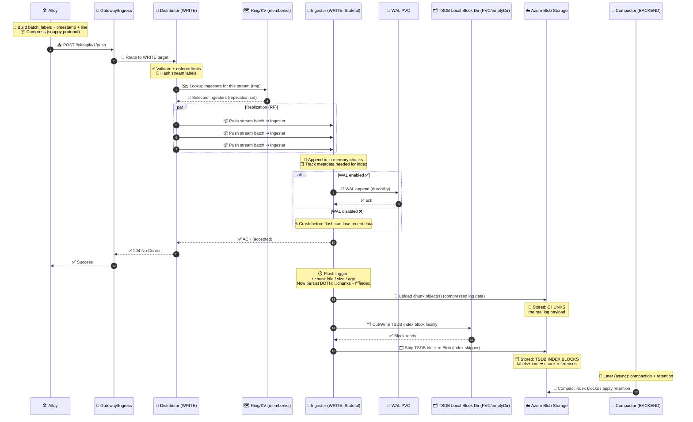

# 🟦 Loki Write Workflow

> From Alloy ➜ Loki ➜ Azure Blob (with Indexing)

## 🎯 Goal of the write path

Turn a firehose of log lines into durable, queryable data:

- **Durable** (doesn’t disappear when pods restart)
- **Queryable** (fast “find logs by labels/time”)
- **Cheap** (object storage is the long-term system of record)

Loki does that by storing **two main things** in object storage:

1. 🧊 **Chunks** (compressed log content)
2. 🗂️ **Index** (TSDB blocks / shipped index metadata that maps labels+time → chunks)

---

## 🧩 The write-path components (who does what)

## 🛠️ 0. Grafana Alloy (client/agent)

- Collects logs from files/journald/k8s
- Adds labels (job, namespace, pod, app, cluster…)
- Batches logs and sends them to Loki using:
  - `POST /loki/api/v1/push`
  - usually **snappy-compressed protobuf**

**Alloy’s job:** _ship logs efficiently and consistently labeled._

---

## 🚪 1. Gateway / Ingress (Nginx in Helm)

- Receives Alloy traffic
- Routes the request to the correct Loki target:
  - Write API calls → **write**
  - Query API calls → **read**

**Gateway’s job:** _traffic routing + a stable endpoint._

---

## 🧭 2. `Distributor (D)` — “write router + replication”

First Loki component in write path.

### What it does

- ✅ Validates the request
  - tenant / auth (if enabled)
  - label rules, max label count/length
  - rate limits, ingestion limits

- ✅ Computes a **stream hash**
  - A “stream” is `{labels}`; each unique label-set is a stream

- ✅ Uses the **ring** to choose ingesters
- ✅ Replicates to multiple ingesters (replication factor)

**Distributor’s job:** _decide “which ingesters should own this stream” and ensure redundancy._

---

## 🗺️ 3. Ring / KV (memberlist, etcd, consul…)

Not a “worker component” but essential for routing.

### What it does

- Tracks:
  - which ingesters are alive
  - token ranges (shards)

- Distributor queries it to pick ingesters for a stream.

**Ring’s job:** _consistent sharding + membership._

---

## 🧱 4. `Ingester (I)` — “buffer + WAL + flush + TSDB index creator”

This is the heart of the write path.

### A. In-memory chunk building (hot buffer)

- Appends log entries to **in-memory chunks**
- Chunk is per stream; it grows until it’s:
  - too big, or
  - too old, or
  - idle long enough

**Ingester memory = the “hot area” of Loki.**

---

### B. 💾 WAL (Write-Ahead Log) on disk (recommended in prod)

If enabled, ingester writes incoming data to WAL:

- Stored on the ingester PVC
- Ensures that if the pod/node crashes before flush:
  - ingester can restart
  - replay WAL
  - rebuild chunks
  - avoid losing recent logs

**WAL is durability for the “before flush” window.**

---

### C. 🧊 Chunk flush to Azure Blob (persistent log content)

When flush triggers occur, the ingester:

- compresses the chunk
- uploads it as an object to Azure Blob

This is where the actual log payload becomes durable long-term.

---

### D. 🗂️ TSDB index block creation (THIS is your missing piece ✅)

**TSDB indexing is created by the Ingester.**

When ingester flushes (or during periodic block cutting), it also:

- writes index data into **local TSDB structures**
- produces **TSDB blocks** (index blocks)
- then ships those blocks to object storage

So indexing is _not_ a separate microservice. It is a storage engine behavior executed in the ingester.

**Ingester job includes:**
✅ “Create TSDB index blocks” + ✅ “Ship them to object storage”.

---

## ☁️ 5. Azure Blob Storage — “system of record”

Blob becomes the source of truth:

- 🧊 chunk objects: the compressed logs
- 🗂️ TSDB index blocks: metadata for lookup
- 🧹 retention/compaction markers: produced later (backend)

---

## 🧹 6. `Compactor (C)` — not on hot write path, but crucial later

Compactor runs in **backend** target and:

- compacts TSDB blocks (merge/optimize)
- applies retention/deletes (depending on your retention mode)

It doesn’t handle the initial ingestion, but it keeps storage efficient and enforces lifecycle.

---

## 🔥 End-to-end write sequence diagram (with indexing) 😈🧊🗂️💾☁️

---

## 🧾 What is stored where (super clear)

### In Azure Blob (durable)

✅ **Chunks** (compressed log data)
✅ **TSDB Index Blocks** (metadata for fast lookup)
✅ **Compactor metadata** (retention/compaction markers)

### On Write PVC (stateful ingester)

✅ WAL files (if enabled)
✅ sometimes local TSDB temp/index directories (depends on config + chart)

### In memory (ingester)

✅ active chunks (recent logs not flushed yet)
✅ stream metadata

---

## 🎛️ The main knobs that control write behavior

### 1) Replication factor (durability vs cost)

- How many ingesters receive the same write
- More replicas = safer, more resource use

### 2) WAL enabled (recommended prod)

- `enabled: true` improves crash safety

### 3) Chunk flush behavior (frequency of blob writes)

Chunk idle/age/size thresholds decide:

- how often blobs get created
- how much WAL space can accumulate before flush

### 4) TSDB block shipping

TSDB blocks are created + shipped as part of ingester write lifecycle.
(Compactor later optimizes.)

---

## ✅ Final mental model (easy)

- **Distributor**: validates + sharding + replication
- **Ingester**: buffers logs, WAL for safety, **flushes chunks**, **creates TSDB blocks**, ships both to Blob
- **Azure Blob**: durable store for chunks + index
- **Compactor**: later cleanup + retention enforcement
