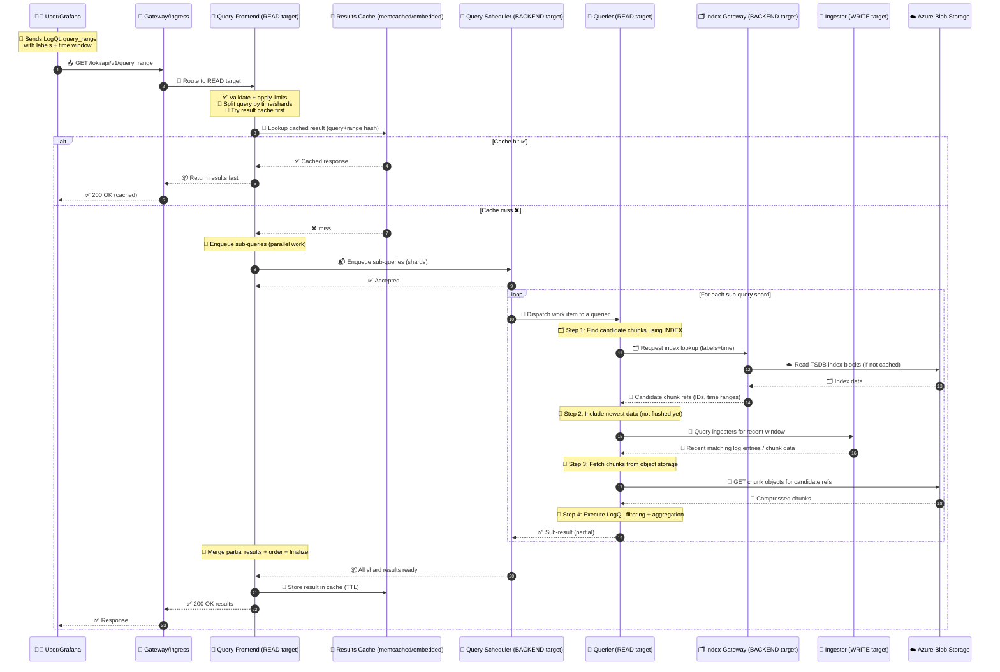

# 🟩 Loki Read Workflow

> From Grafana Query ➜ Loki ➜ Azure Blob (with Indexing + Caching)

You asked for the **same quality as the write topic**, but for the **read path**. Here it is: every component, when index is used, who fetches chunks, what gets cached, and where Azure Blob fits.

---

## 🎯 Goal of the read path

Turn a LogQL query like:

> “Show me logs for `{app="api", env="prod"}` over last 6h”

…into results fast and safely, without melting the cluster.

To do that Loki must:

1. Use the **index** to find which chunks might match (cheap-ish metadata)
2. Fetch and filter **chunks** from storage (expensive-ish data)
3. Return merged/ordered results

---

## 🧩 Read-path components (who does what)

## 🧑‍💻 0. Client (Grafana / curl / API consumer)

- Sends LogQL queries to Loki:
  - instant: `/loki/api/v1/query`
  - range: `/loki/api/v1/query_range`

- Often repeats similar queries (dashboards) → caching matters

---

## 🚪 1. Gateway / Ingress (Nginx in Helm)

- Routes query APIs to the **READ target** in SSD mode

---

## 🧠 2. Query Frontend (FE) — “query brains + splitter + cache”

This is the **first Loki read component**.

### What it does

- ✅ Parses and validates the query
- ✅ Splits large time ranges into smaller sub-queries (sharding)
- ✅ Retries failed sub-queries
- ✅ Enforces fairness / limits
- ✅ **Result cache** (very important for dashboards)

**Mental model:** _API layer for queries + “make this query run fast and safe”._

---

## 🚦 3. Query Scheduler (QS) — “central queue for queriers”

Optional but strongly recommended for production stability.

### What it does

- Receives sub-queries from FE
- Queues them fairly (multi-tenant fairness)
- Hands them to queriers when they’re free

**Mental model:** _Traffic control for queriers._

---

## 💪 4. Querier (Q) — “the worker that actually runs the query”

The querier does the real work:

### What it does (core)

1. Uses the **index** to get candidate chunk references for label/time
2. Fetches candidate **chunks**
3. Decompresses + filters lines by LogQL
4. Aggregates/merges results

**Mental model:** _CPU that reads index + chunks and produces answers._

---

## 🗂️ 5. Index Gateway (IG) — “index access accelerator”

Index lives in object storage (TSDB blocks shipped there).

Querier needs index data to map:

> labels+time → chunk refs

Index Gateway helps by:

- caching/serving index data to reduce expensive object-store reads
- improving query latency and lowering object storage GETs

**Mental model:** _CDN for index metadata._

---

## 🧱 6. Ingester (I) — “recent data that might not be flushed yet”

Even though read is “stateless”, Loki still needs to include the newest logs that may still be in ingesters (not yet flushed to Blob).

So queriers often query:

- **Ingester** for “recent window”
- **Object storage** for older data

**Mental model:** _Hot cache for the most recent logs._

---

## ☁️ 7. Azure Blob Storage — “system of record”

Querier reads from Blob:

- 🗂️ TSDB index blocks (or index metadata)
- 🧊 chunk objects

---

## 🔥 End-to-end READ sequence diagram (with indexing + caching) 🟩🗂️🧊⚡

---

## 🗂️ Where indexing fits in the read workflow (the key steps)

### ✅ Step A — “Index lookup”

- **Querier** needs to find **which chunks to read**
- It uses index data (TSDB blocks) to map:
  - `{labels}` + `[time range]` → chunk references

- **Index Gateway** helps serve/cache that index data
- Index ultimately lives in **Azure Blob**

So:

> **Index is read before chunks**, otherwise querier would have to scan everything (impossible).

### ✅ Step B — “Chunk fetch”

Once the querier has chunk refs:

- it GETs chunks from Blob
- decompresses and filters by LogQL

---

## 🧊 Caching in the read path (what, why, where)

### 1. 🧊 Results Cache (Query Frontend)

- Caches the final response for repeated dashboard queries
- Huge ROI for Grafana dashboards
- Control with:
  - enable/disable
  - TTL
  - embedded vs memcached

**This reduces repeated query execution.**

---

### 2. 🗂️ Index cache (Index Gateway)

- Caches index blocks/segments to avoid repeated Blob reads
- Biggest win for “same labels/time patterns” queries

**This reduces object store GETs and speeds up chunk discovery.**

---

### 3. 🧊 Chunk cache (optional / external)

- Caches chunk objects so repeated queries don’t refetch blobs
- Usually external (memcached) if you want shared caching

**This reduces chunk GETs + decompression work.**

---

## 🎛️ The knobs that control the read path (practical)

### Query splitting / performance

- Query-frontend splitting window and parallelism
- Max outstanding requests per tenant/user
- Query timeouts

### Scheduler fairness

- Enable query-scheduler
- Queue depth, fairness limits

### Caches

- results cache TTL (frontend)
- index caching behavior (index-gateway)
- chunk cache TTL and size

### “Read fresh data” window

- Controls how much queriers ask ingesters vs only object storage
- Bigger window = fresher results but more ingester load

---

## ✅ Quick mental model (super easy)

- **Frontend** = splits + caches + merges
- **Scheduler** = fair queue
- **Querier** = reads **index → chunks** + filters
- **Index Gateway** = speeds up index reads
- **Ingester** = serves the “not yet flushed” recent logs
- **Azure Blob** = source of truth for index+chunks
