```mermaid
graph TD
    A[⚙️ Loki Pod<br/>target=all]
    B[(📦 Object Storage)]

    A --> B
```

```mermaid
graph LR
    A[✍️ Write Pods<br/>distributor + ingester]
    B[📖 Read Pods<br/>querier + query-frontend]
    C[🧠 Backend Pods<br/>compactor + index]
    D[(📦 Object Storage)]

    A --> D
    B --> D
    C --> D
```

```mermaid
graph LR
    D[Distributor]
    I[Ingester]
    QF[Query Frontend]
    Q[Querier]
    C[Compactor]
    G[Gateway]
    S[(📦 Object Storage)]

    D --> I --> S
    QF --> Q --> S
    C --> S
```

# 🧠 **Grafana Loki Deployment Modes – Deep Dive**

_(Monolithic vs Simple Scalable vs Microservices)!_

> **Loki deployment modes are not different products**.
> They are **different ways of running the same internal components** depending on **scale, reliability, and operational maturity**.

---


---

## 🧠 One-Sentence Mental Model (Critical)

> **All Loki modes run the same components** — the only difference is **how many processes you run and how they are separated**.

---

## 🧩 First: The Canonical Loki Components (Always the Same)

No matter the mode, Loki internally has:

| Category     | Components              |
| ------------ | ----------------------- |
| Write path   | Distributor, Ingester   |
| Read path    | Querier, Query Frontend |
| Storage      | Object Store            |
| Background   | Compactor               |
| Routing      | Gateway                 |
| Coordination | Ring (memberlist / KV)  |

👉 **Deployment mode only decides _where_ these run.**

---

## 🟥 **Mode 1: Monolithic**

### 🧠 Definition

> **Monolithic mode** runs **ALL Loki components inside a single process** using `-target=all`.

---

### 🧱 Architecture

<div align="center" style="background-color:#1f2a2aff;border-radius:10px;border:2px solid">



</div>

---

### 🧠 Characteristics

| Aspect     | Value                       |
| ---------- | --------------------------- |
| Processes  | 1                           |
| Pods       | 1–N                         |
| Scaling    | Horizontal (shared storage) |
| Complexity | Very low                    |
| HA         | Manual                      |
| Ring       | Optional                    |

---

### ✅ Pros

- Easiest to run
- Fast to bootstrap
- Perfect for:

  - Labs
  - Demos
  - Dev clusters
  - ≤ ~20GB/day logs

---

### ❌ Cons

- No separation of concerns
- Write & read compete for CPU/memory
- HA is fragile
- Scaling is coarse-grained

---

### ⚠️ Reality Check

> Monolithic works **until it doesn’t** — and when it breaks, everything breaks.

---

### 🟢 When to Use Monolithic

- Single-node or small cluster
- Non-critical environments
- Learning Loki internals

---

## 🟨 **Mode 2: Simple Scalable (Recommended)**

### 🧠 Definition

> **Simple Scalable mode** splits Loki into **three logical execution groups**, while keeping deployment and operations simple.

---

### 🧱 Architecture

<div align="center" style="background-color:#232b2dff;border-radius:10px;border:2px solid">



</div>

---

### 🧠 Execution Targets

| Target    | Components              |
| --------- | ----------------------- |
| `write`   | Distributor, Ingester   |
| `read`    | Querier, Query Frontend |
| `backend` | Compactor, Index        |

---

### 🧠 Characteristics

| Aspect     | Value       |
| ---------- | ----------- |
| Processes  | 3           |
| Pods       | Independent |
| Scaling    | Per-path    |
| Complexity | Medium      |
| HA         | Native      |
| Ring       | Required    |

---

### ✅ Pros

- Independent scaling
- Clear read/write isolation
- HA by default
- Helm-native
- Operationally sane

---

### ❌ Cons

- Slightly more complex than monolithic
- Requires ring config (memberlist)

---

### 🟢 When to Use Simple Scalable

✔ **90% of real-world production setups**
✔ Kubernetes-native environments
✔ Multi-node clusters
✔ Shared object storage (S3 / MinIO)

> This is why **Grafana Helm chart defaults to Simple Scalable**.

---

## 🟦 **Mode 3: Microservices (Full Split)**

### 🧠 Definition

> **Microservices mode** runs **each Loki component as its own service**, allowing extreme scale and fine-grained control.

---

### 🧱 Architecture

<div align="center" style="background-color:#141a19ff;border-radius:10px;border:2px solid">



</div>

---

### 🧠 Characteristics

| Aspect     | Value         |
| ---------- | ------------- |
| Processes  | 7+            |
| Pods       | Many          |
| Scaling    | Per component |
| Complexity | High          |
| HA         | Excellent     |
| Ring       | Mandatory     |

---

### ✅ Pros

- Maximum scalability
- Fine-grained tuning
- Ideal for:

  - Very large clusters
  - SaaS providers
  - Multi-region Loki

---

### ❌ Cons

- Operationally heavy
- Hard to debug
- Requires deep Loki expertise
- Overkill for most users

---

### 🟢 When to Use Microservices

- > 1 TB/day logs
- Hundreds of tenants
- Dedicated observability team
- Need per-component autoscaling

---

## 🧠 **Side-by-Side Comparison (This Is the Exam Table)**

| Feature          | Monolithic | Simple Scalable | Microservices    |
| ---------------- | ---------- | --------------- | ---------------- |
| Complexity       | ⭐         | ⭐⭐            | ⭐⭐⭐⭐⭐       |
| HA               | ❌         | ✅              | ✅               |
| Scaling          | Coarse     | Per-path        | Per-component    |
| Recommended      | ❌         | ✅              | ❌ (unless huge) |
| Helm support     | Limited    | Native          | Advanced         |
| Production-ready | ❌         | ✅              | ✅               |

---

## 🔴 **Why Simple Scalable Is the Sweet Spot**

Grafana learned (the hard way):

- Monolithic breaks under load
- Microservices breaks humans
- Simple Scalable balances:

  - Safety
  - Scale
  - Simplicity

> **Simple Scalable is Loki’s “Ingress Controller moment.”**

---

## 🧠 **How the Ring Fits into All This**

| Mode            | Ring Usage |
| --------------- | ---------- |
| Monolithic      | Optional   |
| Simple Scalable | Required   |
| Microservices   | Required   |

The ring:

- Tracks ingesters
- Ensures replication
- Enables HA
- Uses memberlist / KV store

(We can deep dive this next.)

---

## 🧠 **Decision Flow (Memorize This)**

```in
Is this prod?
 └─ No → Monolithic
 └─ Yes
     └─ <100GB/day → Simple Scalable
     └─ >1TB/day → Microservices
```

---

## 🧠 Memorization Block

### 🔑 Mnemonic: **M-S-M = Learn → Run → Scale**

| Mode                | Meaning |
| ------------------- | ------- |
| **M**onolithic      | Learn   |
| **S**imple Scalable | Run     |
| **M**icroservices   | Scale   |

---

## 🧠 Final Takeaway (Very Important)

- All modes run the **same Loki**
- Deployment mode = **process topology**
- Simple Scalable is **not a compromise**
- It is the **production default**
- Move to microservices **only when forced**

> **Choosing Microservices too early is a design smell.**

---

### 🔜 Recommended Next Topics (Based on Your History)

Given what you already hit (ring errors, memberlist logs), the **next logical deep dives** are:

1. **Loki Ring & Memberlist (Why those errors appear)**
2. **Replication factor & HA math**
3. **Index types: boltdb-shipper vs TSDB**
4. **Limits & cardinality tuning**
5. **Your actual Loki Helm values.yaml – line by line**

Tell me which one you want next.
