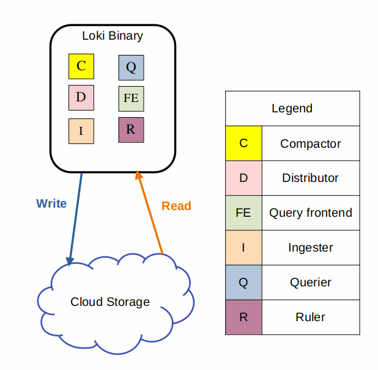

# Loki deployment modes

## References

- [Loki deployment modes](https://grafana.com/docs/loki/latest/get-started/deployment-modes/#monolithic-mode)

## Overview

> Loki is a distributed system consisting of many microservices. It also has a unique build model where all of those microservices exist within the same binary.

## Monolithic Mode

  

---

## Simple Scalable Mode

  

---

## Microservices Mode

  

---
