```mermaid
graph LR
    A[🧱 Ingester]
    B[(📁 Local BoltDB Index)]
    C[(📦 Object Storage)]
    D[🔍 Querier]

    A --> B --> C
    D --> C
```

```mermaid
graph LR
    A[🧱 Ingester]
    B[(📊 TSDB Blocks)]
    C[(📦 Object Storage)]
    D[🔍 Querier]

    A --> B --> C
    D --> C
```

# 🧠 **Loki Index Types – Deep Dive**

_(boltdb-shipper vs TSDB)!_

> **Loki index types define how Loki maps label queries to log chunks stored in object storage.**
> They do **not change how logs are written**, only **how they are indexed, compacted, and queried**.

---


---

## 🧠 One-Sentence Mental Model (Critical)

> **The index is Loki’s “table of contents”; chunks are the pages.**
> boltdb-shipper and TSDB are **two different ways to build that table of contents**.

---

## 🔴 **Why Loki Needs an Index at All**

Loki stores **log data (chunks)** in object storage, but object storage cannot answer questions like:

```ini
{namespace="prod", app="api"} last 1h
```

So Loki must maintain an **index** that answers:

- Which label sets exist?
- Which time ranges do they cover?
- Which chunks should be fetched?

---

## 🧱 **Loki Storage Model (Invariant)**

This never changes, regardless of index type:

| Layer          | Role                   |
| -------------- | ---------------------- |
| Log chunks     | Compressed log content |
| Object storage | Durable, cheap storage |
| Index          | Maps labels → chunks   |
| Cache          | Speeds up queries      |

👉 Only the **index implementation** differs.

---

## 🟥 **Index Type 1: boltdb-shipper (Legacy, Still Supported)**

### 🧠 Definition

> **boltdb-shipper** stores the index as **BoltDB files**, built locally by ingesters and **shipped to object storage**.

---

### 🧱 Architecture

<div align="center" style="background-color:#1f2a2aff;border-radius:10px;border:2px solid">



</div>

---

### 🧠 How boltdb-shipper Works

1. Ingester writes log chunks
2. Ingester builds BoltDB index locally
3. Periodically uploads index files
4. Querier downloads index files
5. Querier scans index → fetches chunks

---

### ✅ Pros

- Simple
- Stable
- Well-understood
- Works well at small–medium scale

---

### ❌ Cons

- Large index files
- Expensive scans
- Slower queries at scale
- Inefficient for high cardinality
- Heavy object storage reads

---

### 🟢 When boltdb-shipper Is OK

- Existing clusters
- Small environments
- Low cardinality labels
- Legacy deployments

---

## 🟦 **Index Type 2: TSDB (Modern, Recommended)**

### 🧠 Definition

> **TSDB index** uses a **Prometheus-style time-series index**, optimized for **label lookups and time-bounded queries**.

---

### 🧱 Architecture

<div align="center" style="background-color:#232b2dff;border-radius:10px;border:2px solid">



</div>

---

### 🧠 How TSDB Index Works

1. Logs grouped into streams
2. Streams indexed by labels + time
3. Index blocks created (time-partitioned)
4. Blocks uploaded to object storage
5. Querier fetches **only relevant blocks**

---

### 🔑 Key Difference (Very Important)

| boltdb-shipper    | TSDB                |
| ----------------- | ------------------- |
| Scan index files  | Binary-search index |
| File-based lookup | Block-based lookup  |
| Broad scans       | Narrow time windows |

---

### ✅ Pros

- Much faster queries
- Lower object storage IO
- Better cache efficiency
- Handles high cardinality better
- Scales to very large clusters

---

### ❌ Cons

- Slightly more complex
- Newer (but now stable)
- Requires newer Loki versions

---

### 🟢 When TSDB Is the Right Choice

✔ Production
✔ Medium → large scale
✔ Kubernetes workloads
✔ High label cardinality
✔ Long retention

> **TSDB is the present and the future of Loki indexing.**

---

## 🧠 **Side-by-Side Comparison (Memorize This)**

| Feature               | boltdb-shipper | TSDB        |
| --------------------- | -------------- | ----------- |
| Status                | Legacy         | Recommended |
| Query speed           | Slow at scale  | Fast        |
| Index size            | Large          | Compact     |
| Object storage IO     | High           | Lower       |
| Cardinality tolerance | Low            | High        |
| Future investment     | ❌             | ✅          |

---

## 🔴 **Why Grafana Moved to TSDB**

Real-world pain with boltdb-shipper:

- Queries touching days of data
- Thousands of index files per query
- Expensive S3/MinIO reads
- Slow dashboards

TSDB fixed this by:

- Time partitioning
- Better caching
- Efficient label lookup

---

## 🧠 **Does Index Type Affect Writes?**

❌ No.

Writes always:

- Hit ingesters
- Create chunks
- Replicate via ring

Index type affects:

- Query planning
- Index storage
- Compaction behavior

---

## 🧠 **Compactor Behavior (Important)**

| Index          | Compactor Role    |
| -------------- | ----------------- |
| boltdb-shipper | Merge index files |
| TSDB           | Compact blocks    |

TSDB compaction is:

- Faster
- More predictable
- Less IO-heavy

---

## 🟢 **What You Should Use Today**

> **Use TSDB unless you have a very specific reason not to.**

Grafana’s own guidance:

- New installs → TSDB
- Existing installs → migrate when possible

---

## 🧠 **Migration (High-Level)**

- You **cannot mix** index types
- Migration requires:

  - New schema
  - New index prefix

- Old data remains readable
- New data uses TSDB

(We can deep dive this separately.)

---

## 🧠 Memorization Block (Critical)

### 🔑 Mnemonic: **F-S-T**

| Letter | Meaning            |
| ------ | ------------------ |
| **F**  | Files (boltdb)     |
| **S**  | Scans              |
| **T**  | TSDB = Time blocks |

If queries are slow → **index choice matters**.

---

## 🧠 Final Takeaway (Very Important)

- Index ≠ data
- boltdb-shipper is legacy
- TSDB is optimized for:

  - Kubernetes
  - Labels
  - Time

- Most Loki performance issues are **index-related**
- Choosing TSDB early avoids pain later

> **Chunks store logs. Index decides speed.**
