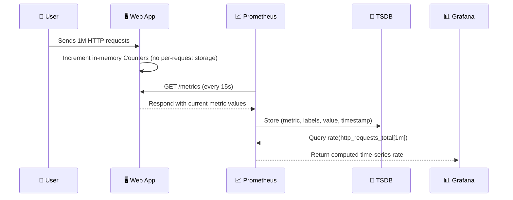

# 🧠 Prometheus Scraping — Complete Q&A Deep Dive

## ❓Q1. What actually happens when I configure Prometheus to scrape every 15 seconds?

**🟢 Answer:**

When you set:

```yaml
scrape_interval: 15s
```

Prometheus will **poll (scrape)** your target endpoint (e.g. `http://webapp:8080/metrics`) **once every 15 seconds**.
It sends an HTTP GET request, expecting a response in Prometheus **text exposition format**, like this:

```ini
http_requests_total{method="GET", status="200"} 12345
http_requests_total{method="POST", status="500"} 12
```

Prometheus doesn’t run any code in your app — it just reads these exported numbers, records them as **samples**, and stores them in its internal **time-series database (TSDB)**.

Each sample =
→ Metric name + Labels + Value + Timestamp.

---

## ❓Q2. If my web app handles a million requests within those 15 seconds, does Prometheus store them all?

**🔴 No.**
Prometheus **never** stores individual requests.

Instead, your web app (via a Prometheus client library) keeps **numeric counters in memory** that aggregate data.
Every request only increments those counters — for example:

```python
REQUEST_COUNT.labels(method="GET", status="200").inc()
```

If one million requests occur, the counter increases by one million.
When Prometheus scrapes, it only records the **current total value**, not every increment.

So, in 15 seconds:

- Before scrape → counter = 1,000,000
- After scrape → counter = 2,000,000
  Prometheus stores these two snapshots and computes the rate using the difference.

---

## ❓Q3. Where are those request counters stored?

**🟢 In memory inside your web app process.**

The Prometheus client library (for Python, Java, Go, etc.) defines metric objects like Counters, Gauges, Summaries, and Histograms.
They live as **in-memory variables**, updated during runtime by your application.

For example:

- Counter → monotonically increasing number (`.inc()` each request)
- Gauge → current value (e.g. memory usage, temperature)
- Histogram → buckets (e.g. request durations)
- Summary → quantile snapshots

All these exist only while the process is alive.
When your app restarts, unless you persist or restore them, their values reset.

---

## ❓Q4. So during those 15 seconds, is every request saved somewhere?

**🔴 Not at all.**
Each request only increments a metric variable in memory.

Prometheus doesn’t know or see individual requests — it just pulls **aggregated results** at scrape time.
If you need per-request visibility (like request logs, payloads, IPs, timestamps), you’d use **a logging system** instead — e.g.:

- **Grafana Loki** (log aggregation)
- **ELK Stack** (Elasticsearch + Logstash + Kibana)
- **Fluentd**, **Datadog**, etc.

Prometheus = metrics (numbers)
Logging systems = events (details)

---

## ❓Q5. What data does Prometheus actually store?

**🟢 Prometheus stores only time-series samples.**

Each metric becomes a _time series_ identified by its name and labels.

Example:

```ini
http_requests_total{method="GET",status="200"}
```

Every scrape adds a new **sample point** like:

| Timestamp (UTC) | Value     |
| --------------- | --------- |
| 10:00:00        | 1,000,000 |
| 10:00:15        | 2,000,000 |
| 10:00:30        | 3,000,000 |

This gives you a trend line in Grafana or PromQL like:

```promql
rate(http_requests_total[1m])
```

→ which calculates “requests per second” over the last minute.

---

## ❓Q: If my `scrape_interval` is 15 seconds, and my counter goes from 1M → 2M in that period, can I know _when_ (like at second 10) it actually reached 2M?

**🔴 No — you cannot know the exact timing inside that 15-second window.**

Prometheus only knows **two points in time**:

| Time          | Value     |
| ------------- | --------- |
| t₀ (00:00:00) | 1,000,000 |
| t₁ (00:00:15) | 2,000,000 |

That’s it.

Prometheus does **not** continuously record — it just _samples_ the metric once every 15 seconds.
It assumes that the value might have increased gradually or suddenly, but it doesn’t know when.

---

### 🧩 Here’s what could’ve happened between those two scrapes:

#### Scenario A (steady traffic)

```ini
t=0s   : 1,000,000
t=3s   : 1,200,000
t=6s   : 1,400,000
t=9s   : 1,600,000
t=12s  : 1,800,000
t=15s  : 2,000,000
```

#### Scenario B (sudden burst)

```ini
t=0s   : 1,000,000
t=10s  : 2,000,000
t=15s  : 2,000,000 (no change for last 5s)
```

Prometheus sees the _same_ two samples in both cases.
So from its perspective, the **average rate** over 15 seconds is the same:
→ `(2,000,000 - 1,000,000) / 15 = 66,666.67 requests/sec`.

But it cannot tell that in Scenario B, you actually had a 10-second spike and then 5 seconds idle.

---

### 🧠 So what does `rate()` or `irate()` really do?

- `rate(metric[15s])`: gives you **average increase per second** over the last 15 seconds.
  → smooths out the burst.

- `irate(metric[15s])`: gives you **instantaneous rate** between the _last two samples_ inside that range.
  → slightly more responsive, but still limited to scrape granularity.

Both rely on **discrete samples**, not continuous recording.

---

### 🔎 Why this matters

Prometheus gives you **trend accuracy**, not exact micro-timing.

It’s designed for _monitoring_ and _alerting_, not for _forensic timing_ or _per-request precision_.

If you want second-by-second precision, you have two options:

1. **Reduce `scrape_interval`**
   → e.g. 5s or 1s, to increase sampling resolution.
   ⚠️ But this increases load on both your web app and Prometheus.

2. **Use logs or traces (e.g. OpenTelemetry)**
   → Those record each request and its exact timestamp, latency, etc.

---

### ⚙️ Analogy (simple way to remember)

Think of Prometheus like a **speed camera** that takes one photo every 15 seconds.

- You see that the car moved from 0 km → 1500 m in 15 seconds.
- You can compute average speed = 100 m/s.
- But you don’t know _when_ it accelerated or slowed down inside that interval.

To get that level of detail, you’d need **continuous telemetry (tracing)**, not **sampling (metrics)**.

---

### ✅ TL;DR Summary

| Concept                    | Explanation                                           |
| -------------------------- | ----------------------------------------------------- |
| `scrape_interval`          | Sampling period (how often Prometheus polls your app) |
| What’s recorded            | Only metric value + timestamp at each scrape          |
| What’s unknown             | Exact timing of metric changes between scrapes        |
| Can we know the 10s spike? | ❌ No — Prometheus only gives the 15s average         |
| How to improve granularity | Reduce `scrape_interval` or use tracing/logs          |

---

## ❓Q6. How does Prometheus compute request rate or throughput from these samples?

**🧮 Using PromQL functions like `rate()` or `irate()`.**

Example:

```promql
rate(http_requests_total[15s])
```

This tells Prometheus to calculate the **per-second rate** of increase in that counter over the last 15 seconds.
If `http_requests_total` jumped by 1,000,000 between scrapes, then:

```ini
rate = 1,000,000 / 15 = ~66,666.67 requests/sec
```

Prometheus doesn’t need all requests — it derives rate from the difference between consecutive samples.

---

## ❓Q7. Does Prometheus push metrics into the app?

**🔴 No. It pulls them.**

Prometheus uses a **pull-based model**:

- Every `scrape_interval`, it calls your endpoint (`/metrics`).
- The app responds with text-formatted metrics.
- Prometheus parses and stores them.

So you don’t push metrics to Prometheus — it pulls them.

Exceptions:

- In isolated networks, **Pushgateway** can be used for short-lived jobs to push metrics temporarily.

---

## ❓Q8. How much memory does my web app use for metrics?

**🟢 Memory usage depends on the number of metric series, not the number of requests.**

Each unique combination of labels (`method`, `status`, etc.) creates a separate time series.
If you have many unique labels, you can blow up memory.

For example:

| Label Dimension       | Example                  |
| --------------------- | ------------------------ |
| method                | GET, POST                |
| status                | 200, 404, 500            |
| user_id ❌ (bad idea) | 10,000,000 unique values |

⚠️ High-cardinality labels (like `user_id`, `session_id`, or `url_path`) can make your memory usage explode.
Prometheus works best with **low-cardinality** metrics.

---

## ❓Q9. What happens inside the Prometheus Time Series Database (TSDB)?

**🧩 TSDB stores metrics as compressed blocks on disk.**

For each time series:

- Each scrape adds a sample: (timestamp, value)
- Samples are batched into **chunks** (~2 hours worth)
- Chunks are stored as **block files**
- Older blocks can be **compacted or deleted** via retention rules

By default:

- Data retention is **15 days** (`--storage.tsdb.retention.time`)
- You can change it or ship old data to long-term storage systems like **Thanos** or **Cortex**

---

## ❓Q10. What’s the complete flow from request → metric → Prometheus → Grafana?

**🧭 Here’s the full sequence:**



At no point are the **1M individual requests** stored or transferred — only **aggregated numbers**.

---

## ❓Q11. What if my web app crashes — do I lose all metric values?

**🟠 Usually yes, unless you persist them manually.**

Prometheus client libraries store metrics in-memory by default.
When the app restarts, counters reset to 0.
Prometheus can handle counter resets automatically (e.g. using `rate()`), but if you want persistence:

- Some languages (e.g., Go, Python) allow you to **export to disk** or use a **registry snapshot**.
- Or you can **store state externally** and restore it at startup.

---

## ❓Q12. What’s the difference between Prometheus and log systems like ELK or Loki?

| Feature     | Prometheus                   | ELK / Loki              |
| ----------- | ---------------------------- | ----------------------- |
| Data Type   | Numeric metrics (aggregated) | Raw logs / events       |
| Data Source | `/metrics` endpoints         | App log files, stdout   |
| Storage     | Time-series DB (TSDB)        | Document DB / Log index |
| Query       | PromQL                       | Lucene / LogQL          |
| Use Case    | Performance, SLO, alerting   | Debugging, tracing      |
| Granularity | Aggregate level              | Per-request / detailed  |

They complement each other — Prometheus for “how much”, ELK/Loki for “what happened”.

---

## ❓Q13. Can Prometheus scale to handle 1M requests/second web apps?

**🟢 Absolutely — but carefully.**

Prometheus doesn’t record each request; it only scrapes counters.
So even a high-traffic app can be monitored efficiently as long as:

- You keep metrics low-cardinality.
- Your scrape interval isn’t too aggressive (15s or 30s is fine).
- You don’t expose too many metrics (thousands are okay; millions are not).

If you outgrow one Prometheus, you can **federate** or use **Thanos/Cortex/Mimir** for horizontal scaling and long-term storage.

---

## ❓Q14. Can I see metrics between scrapes?

**🔴 Not directly.**

Prometheus scrapes periodically, so **data between scrapes is invisible**.
If something happens between two scrapes (e.g., a short traffic spike at 7.5s), Prometheus only sees the total after 15s.

If you need higher granularity:

- Reduce `scrape_interval` (e.g., 5s or 1s)
- Or use metrics sampling inside your app

However, decreasing scrape intervals increases load on both your app and Prometheus.

---

## ❓Q15. TL;DR Summary — How Prometheus Really Works

| Concept         | What Actually Happens                                   |
| --------------- | ------------------------------------------------------- |
| Scrape Interval | Prometheus pulls metrics every N seconds                |
| App Behavior    | Aggregates requests into counters (no logs)             |
| Data Stored     | Only values + timestamps                                |
| 1M Requests     | Reflected as counter increments, not individual entries |
| Storage Type    | Time Series Database (TSDB)                             |
| Granularity     | Controlled by scrape interval                           |
| Memory Usage    | Depends on metric cardinality                           |
| Visualization   | Tools like Grafana use PromQL queries on TSDB           |

---

## 💡 Real-life Tip

If you expose this metric:

```python
http_requests_total{method="GET", status="200"} 1000000
```

Prometheus just sees that number every 15 seconds.
It doesn’t know _which_ requests those were — only that “1M happened”.

👉 Prometheus = _What’s the rate / latency / error ratio?_
👉 Logs = _Which user caused it / what payload was sent?_

---

Would you like me to extend this Q&A with **a live mini-demo (Python or Node.js)** showing:

- a web app exposing `/metrics`
- a Prometheus scrape config
- and how the counter changes between scrapes (with sample queries in PromQL)?

That would complete the mental model perfectly.
