# 🧠 **Prometheus Architecture & Data Flow**

> 🧩 _“Prometheus doesn’t wait for data to come to it — it goes out and scrapes it.”_

Let’s break it down piece by piece, visually and practically 👇

---

## 📚 Table of Contents — Prometheus Architecture & Data Flow

1. [📖 What Is Prometheus?](#1)
2. [🧩 Prometheus Core Concepts](#2)
3. [🧭 Prometheus Architecture Overview](#3)
4. [🔍 The Prometheus Data Flow](#4)
5. [⚙️ The Pull Model Explained](#5)
6. [⚡ Service Discovery (Dynamic Targets)](#6)
7. [🧮 Time-Series Data Storage (TSDB)](#7)
8. [🧠 PromQL — The Power Query Language](#8)
9. [🔔 Alertmanager — The Nerve Center of Alerts](#9)
10. [🧱 Prometheus & Grafana Together](#10)
11. [🧩 Real-World Example Stack](#11)
12. [📦 Prometheus in Observability Stack](#12)
13. [🧠 TL;DR Summary](#13)

---

<a id="1"></a>

## 📖 **What Is Prometheus?**

Prometheus is an **open-source monitoring and alerting toolkit** originally built at **SoundCloud** and now part of the **Cloud Native Computing Foundation (CNCF)** — _just like Kubernetes_.

It’s designed for **reliability**, **scalability**, and **cloud-native environments** — especially **dynamic infrastructures** like containers and microservices.

---

<a id="2"></a>

## 🧩 **Prometheus Core Concepts**

<div align="center" style="background-color: #141a19ff;color: #a8a5a5ff; border-radius: 10px; border: 2px solid">

| Concept                   | Description                                          | Example                                          |
| ------------------------- | ---------------------------------------------------- | ------------------------------------------------ |
| **Target**                | Endpoint exposing metrics in Prometheus format       | `http://app1:9100/metrics`                       |
| **Job**                   | Logical group of targets performing same role        | `job="web-servers"`                              |
| **Metric**                | Time-series identified by a name + labels            | `http_requests_total{method="GET",status="200"}` |
| **Exporter**              | Converts raw system data into Prometheus format      | Node Exporter, cAdvisor, etc.                    |
| **Push Gateway**          | For Short Lived Jobs that don’t need to be scraped   | No static config needed                          |
| **Retrieval**             | Pulls or scrapes metrics from targets                | `http://app1:9100/metrics`                       |
| **Time-Series DB (TSDB)** | Internal storage engine for metrics over time        | Stores `[timestamp → value]` pairs               |
| **PromQL**                | Query language for selecting & aggregating metrics   | `rate(http_requests_total[5m])`                  |
| **Service Discovery**     | Dynamically finds targets (e.g., via Kubernetes API) | No static config needed                          |
| **Alert Manager**         | Handles alerts, deduplication, and notifications     | Sends alerts to Slack, Email, PagerDuty          |

</div>

---

<a id="3"></a>

## 🧭 **Prometheus Architecture Overview**

<div align="center" style="background-color:#111720; border-radius: 10px; border: 2px solid">
    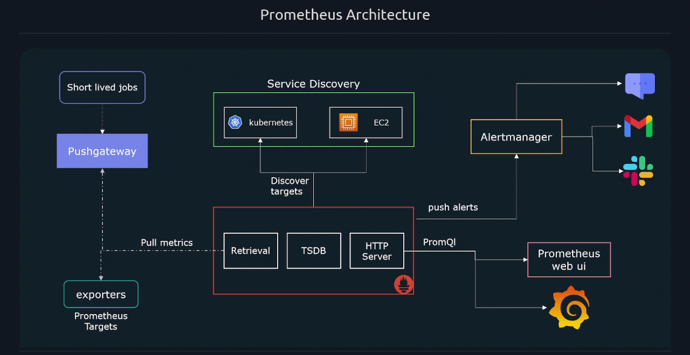
</div>

---

### 🔑 The Core Components

<div align="center" style="background-color: #141a19ff;color: #a8a5a5ff; border-radius: 10px; border: 2px solid">

| Component                          | Role                     | Description                                            |
| ---------------------------------- | ------------------------ | ------------------------------------------------------ |
| 🧩 **Prometheus Server**           | Heart of the system      | Scrapes metrics, stores them, runs queries             |
| 📦 **Time-Series Database (TSDB)** | Storage layer            | Stores metrics efficiently with timestamps             |
| ⚙️ **Service Discovery**           | Dynamic target detection | Auto-discovers instances via Kubernetes, EC2, etc.     |
| 🔔 **Alertmanager**                | Notification handler     | Manages alerts, grouping, silencing, routing           |
| 📊 **Grafana**                     | Visualization tool       | Connects via PromQL to display dashboards              |
| 🔄 **Exporters**                   | Data adapters            | Expose metrics from systems (e.g., Node, MySQL, Nginx) |

</div>

### 📊 **Exporter**

<div align="center" style="background-color:#111720; border-radius: 10px; border: 2px solid">
    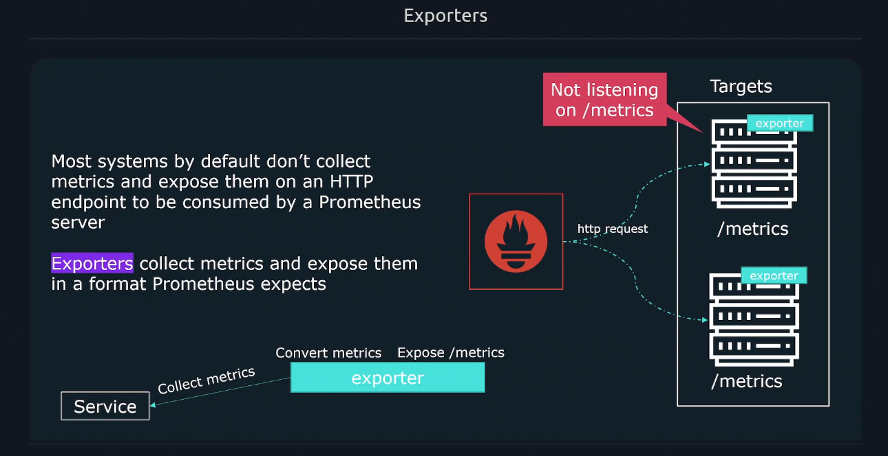
</div>

<div align="center" style="background-color:#111720; border-radius: 10px; border: 2px solid">
    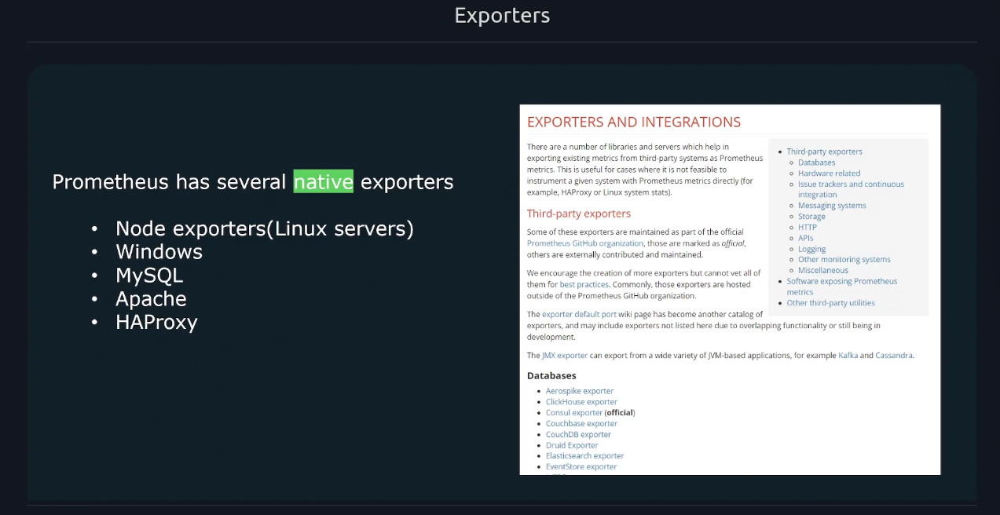
</div>

<div align="center" style="background-color:#111720; border-radius: 10px; border: 2px solid">
    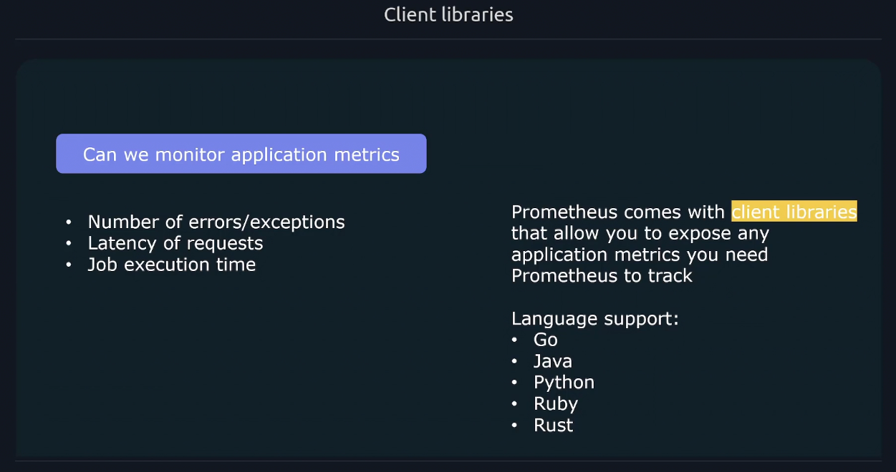
</div>

### 🪢 **Metric Collector**

<div align="center" style="background-color:#111720; border-radius: 10px; border: 2px solid">
    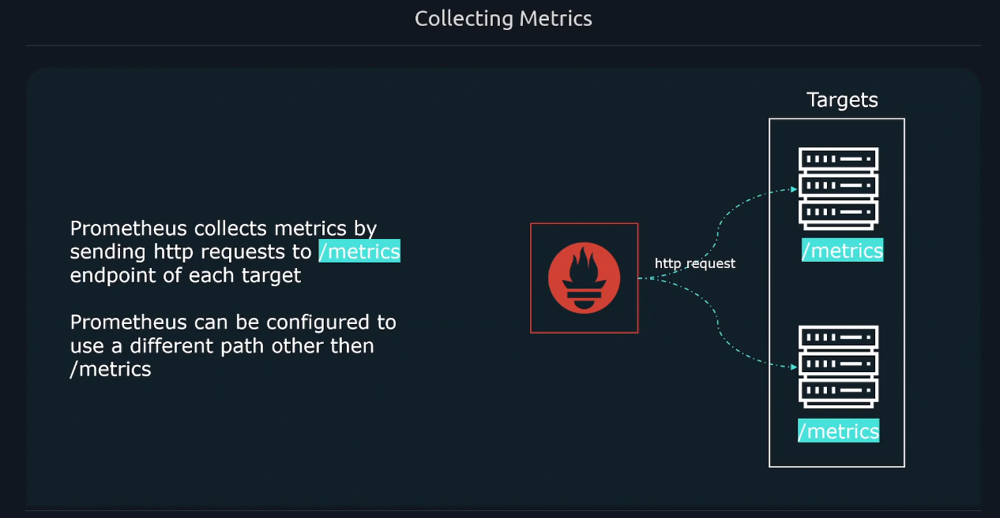
</div>

---

<a id="4"></a>

## 🔍 **The Prometheus Data Flow**

Let’s visualize the journey of a metric from source to alert 🚀

<div align="center" style="background-color: #141a19ff;color: #a8a5a5ff; border-radius: 10px; border: 2px solid">

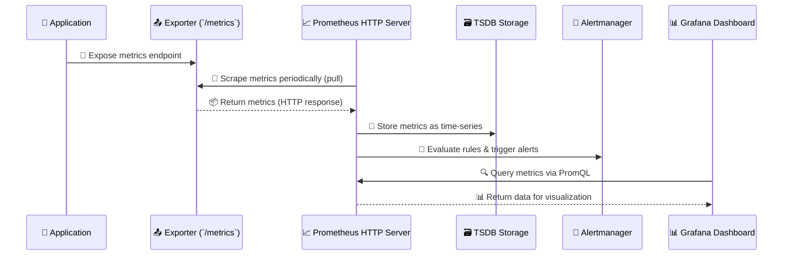

</div>

---

### 🔁 Step-by-Step Breakdown

1. **Instrumentation**
   Apps or systems expose metrics at `/metrics` endpoint — manually (via SDK) or automatically (via exporters).

2. **Scraping**
   Prometheus **pulls** metrics at regular intervals (default 15s).

3. **Storage**
   Data is stored locally in the **time-series database** (TSDB).

4. **Evaluation & Rules**
   Recording and alerting rules process data (e.g., averages, thresholds).

5. **Alerting**
   Alerts are sent to the **Alertmanager** which groups, silences, and routes them to channels.

6. **Visualization**
   Grafana queries Prometheus using **PromQL** for dashboards.

---

<a id="5"></a>

## ⚔️ **Push vs Pull Model**

<div align="center" style="background-color:#111720; border-radius: 10px; border: 2px solid">
    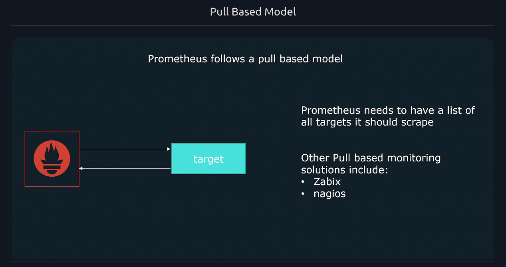
</div>

---

<div align="center" style="background-color:#111720; border-radius: 10px; border: 2px solid">
    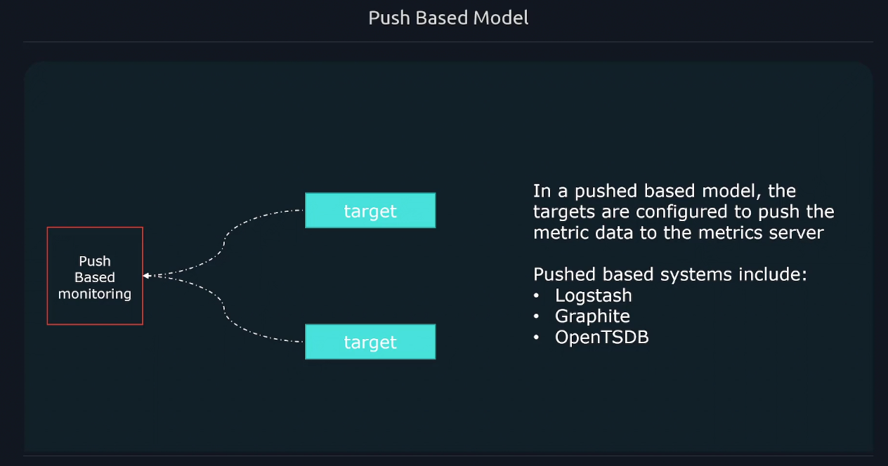
</div>

---

<div align="center" style="background-color:#111720; border-radius: 10px; border: 2px solid">
    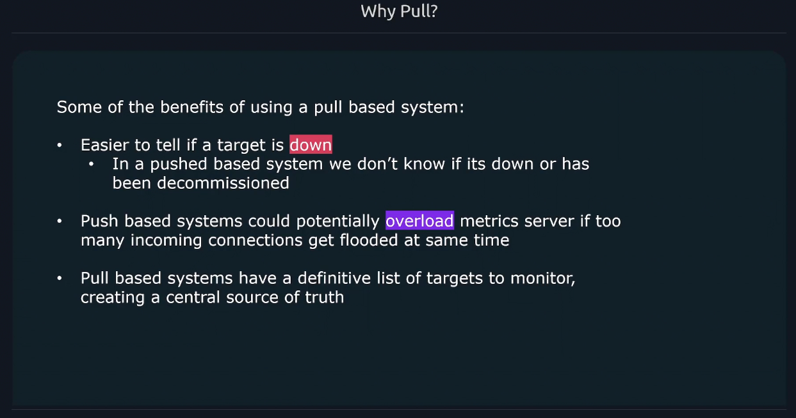
</div>

---

<div align="center" style="background-color:#111720; border-radius: 10px; border: 2px solid">
    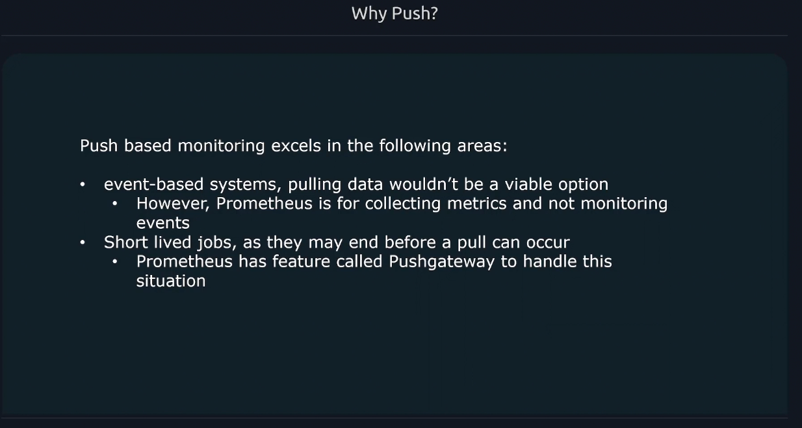
</div>

---

## ⚙️ **The Pull Model Explained**

Prometheus uses a **pull-based architecture**:

- It _actively scrapes_ metrics endpoints.
- Each target exposes data in a standard **HTTP text format**.

Example metrics endpoint:

```ini
# HELP http_requests_total Total number of HTTP requests
# TYPE http_requests_total counter
http_requests_total{method="GET",status="200"} 3256
http_requests_total{method="POST",status="500"} 42
```

This format is **lightweight, human-readable, and label-rich**.

---

<a id="6"></a>

## ⚡ **Service Discovery (Dynamic Targets)**

Prometheus automatically discovers targets using:

- Kubernetes API
- EC2 / Azure / GCE metadata
- Consul
- Static configs

Example `prometheus.yml` config:

```yaml
scrape_configs:
  - job_name: "kubernetes-nodes"
    kubernetes_sd_configs:
      - role: node
  - job_name: "node-exporter"
    static_configs:
      - targets: ["192.168.1.10:9100", "192.168.1.11:9100"]
```

---

> 👉 It can monitor **thousands of containers** without manual configuration.

---

<a id="7"></a>

## 🧮 **Time-Series Data Storage (TSDB)**

Prometheus TSDB stores metrics in **chunks**:

- Each chunk holds multiple samples (`timestamp, value`)
- Organized as:

  - **Metric Name**
  - **Labels**
  - **Timestamps**
  - **Values**

Example internal representation:

```ini
http_requests_total{method="GET",status="200"}
→ [ [1698668400, 3256], [1698668460, 3302], [1698668520, 3321] ]
```

---

<a id="8"></a>

## 🧠 **PromQL — The Power Query Language**

PromQL (Prometheus Query Language) lets you:

- Filter:
  `http_requests_total{status="500"}`
- Aggregate:
  `sum(rate(http_requests_total[5m])) by (service)`
- Compare:
  `cpu_usage > 0.9`

PromQL is what Grafana uses to power your dashboards and alerts.

---

<a id="9"></a>

## 🔔 **Alertmanager — The Nerve Center of Alerts**

Handles:

- **Alert routing** (which channel)
- **Grouping** (combine similar alerts)
- **Inhibition** (suppress noise)
- **Silencing** (mute during maintenance)

Example config:

```yaml
route:
  receiver: "slack"
receivers:
  - name: "slack"
    slack_configs:
      - channel: "#alerts"
```

---

<a id="10"></a>

## 🧬 **Prometheus & Grafana Together**

<div align="center" style="background-color: #141a19ff;color: #a8a5a5ff; border-radius: 10px; border: 2px solid">

| Role    | Prometheus                      | Grafana                   |
| ------- | ------------------------------- | ------------------------- |
| Data    | Collects, stores metrics        | Reads from Prometheus     |
| Query   | PromQL                          | PromQL via data source    |
| Purpose | Backend monitoring engine       | Frontend visualization    |
| Example | `rate(http_requests_total[5m])` | Beautiful dashboard chart |

</div>

---

<a id="11"></a>

## 🧩 **Real-World Example Stack**

<div align="center" style="background-color: #141a19ff;color: #a8a5a5ff; border-radius: 10px; border: 2px solid">

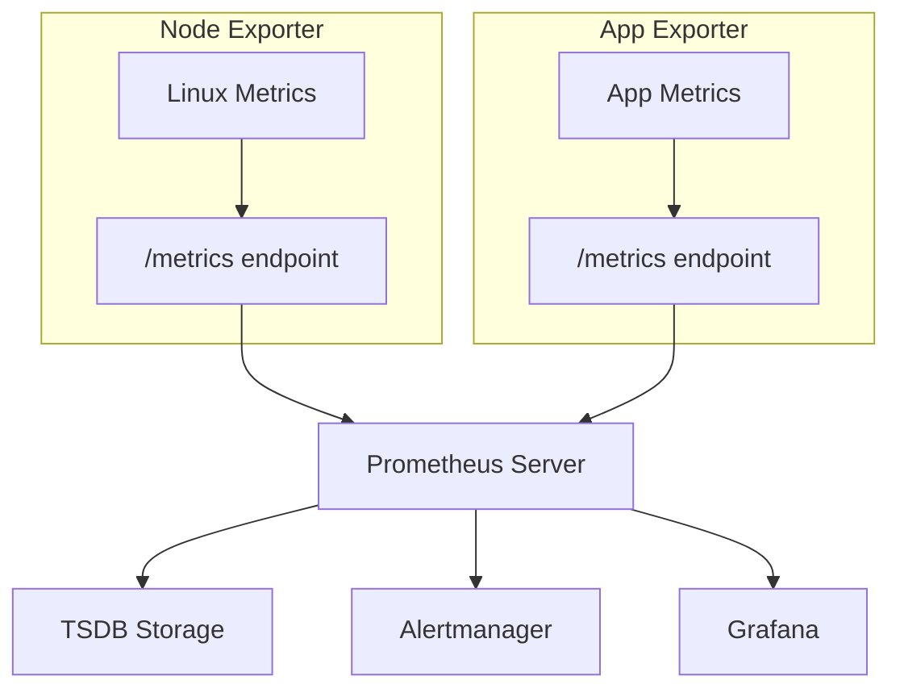

</div>

---

💡 Example:

- Node Exporter → System metrics (CPU, memory)
- App Exporter → Business metrics (requests, latency)
- Prometheus → Stores and alerts
- Grafana → Visualizes everything

---

<a id="12"></a>

## 📦 **Prometheus in Observability Stack**

<div align="center" style="background-color: #141a19ff;color: #a8a5a5ff; border-radius: 10px; border: 2px solid">

| Signal Type       | Handled By            | Description              |
| ----------------- | --------------------- | ------------------------ |
| **Metrics**       | ✅ Prometheus         | Core time-series storage |
| **Logs**          | ❌ Use Loki           | Log aggregation          |
| **Traces**        | ❌ Use Tempo / Jaeger | Request-level tracing    |
| **Visualization** | 🧭 Grafana            | Correlates all three     |

</div>

---

> So Prometheus is the **metrics backbone** of the observability pyramid 🏛️.

---

<a id="13"></a>

## 🧠 **TL;DR Summary**

<div align="center" style="background-color: #141a19ff;color: #a8a5a5ff; border-radius: 10px; border: 2px solid">

| Feature               | Description                                            |
| --------------------- | ------------------------------------------------------ |
| **Architecture Type** | Pull-based time-series monitoring                      |
| **Data Format**       | Text-based metrics with labels                         |
| **Core Components**   | Prometheus server, Alertmanager, Exporters, Grafana    |
| **Query Language**    | PromQL                                                 |
| **Storage**           | Local TSDB (retention configurable)                    |
| **Integration**       | Grafana, Loki, Tempo, Alertmanager                     |
| **Use Case**          | Application, Infrastructure, and Kubernetes monitoring |

</div>
