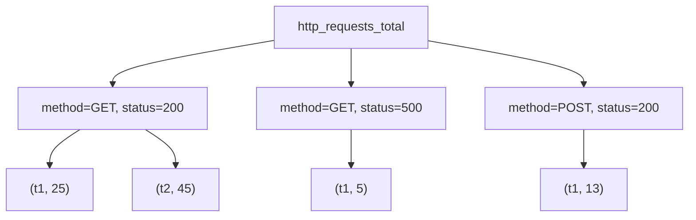

# 🧩 1. Metric Types & Prometheus Data Model

_(a.k.a. “How Prometheus thinks about your data before you even query it”)!_

---


---

## 🧠 What Is Prometheus’s Data Model?

Prometheus doesn’t store tables or JSON—it stores **time series**.
A _time series_ = a sequence of `(timestamp, value)` pairs attached to a metric **name** and a set of **labels**.

Think of it as:

```ini
http_requests_total{method="GET", status="200"} → [
  (1730700000, 25),
  (1730700060, 45),
  (1730700120, 75)
]
```

In English:

> The metric `http_requests_total` for GET requests with 200 OK status
> had values 25 → 45 → 75 over time.

---

### 🧩 Data Model Breakdown

| Component        | Meaning                      | Example                                             |
| ---------------- | ---------------------------- | --------------------------------------------------- |
| **Metric name**  | Describes _what_ is measured | `http_requests_total`                               |
| **Labels**       | Add context (metadata)       | `method="POST"`, `status="500"`, `instance="app01"` |
| **Sample value** | The numeric data point       | `123.0`                                             |
| **Timestamp**    | UNIX time (seconds or ms)    | `1730700120`                                        |

So the **real identity** of a time series is `(metric name + label set)`.
Each unique combination is one series.

---

## 🧮 4 Core Metric Types

Prometheus scrapes raw numeric data, but it classifies each metric into one of **4 fundamental types**.
Knowing these will prevent you from using the wrong PromQL function later (like using `rate()` on a gauge 😅).

---

### 1️⃣ **Counter**

- 📈 _Only increases_ (resets to 0 on restart)
- Use for things like total requests, errors, jobs processed.
- Query examples:

  ```promql
  http_requests_total
  rate(http_requests_total[5m])
  ```

- ⚠️ Use `rate()` or `increase()` to get _per-second rate_ or _delta_.
- Example:

  - Value goes 10 → 15 → 20 → 25 (in 5 mins)
  - `rate()` ≈ (25-10)/300 = 0.05 req/sec

---

### 2️⃣ **Gauge**

- ⚖️ _Goes up or down_ freely.
- Represents a measurement at a single point in time (memory usage, temperature, active connections).
- Query examples:

  ```promql
  node_memory_Active_bytes
  avg(node_memory_Active_bytes) by (instance)
  ```

- ⚠️ Don’t use `rate()`—use it _as is_.

---

### 3️⃣ **Histogram**

- 📊 Measures _distribution_ of observed values (e.g., request latency).
- Stores multiple time series per bucket:

  ```ini
  http_request_duration_seconds_bucket{le="0.1"}  → count of requests ≤ 0.1s
  http_request_duration_seconds_bucket{le="1"}    → count ≤ 1s
  http_request_duration_seconds_bucket{le="+Inf"} → all requests
  ```

- Also includes:

  ```ini
  http_request_duration_seconds_sum
  http_request_duration_seconds_count
  ```

- ⚙️ Use `rate()` and `histogram_quantile()` to get percentiles:

  ```promql
  histogram_quantile(0.95, sum(rate(http_request_duration_seconds_bucket[5m])) by (le))
  ```

---

### 4️⃣ **Summary**

- 🧾 Similar to histogram but **client-side** calculated quantiles.
- Emits precomputed quantiles like:

  ```ini
  http_request_duration_seconds{quantile="0.95"}
  ```

- Easier but less flexible than histograms.
- Not aggregatable across instances (⚠️ a common trap!).

---

## 🧭 Mental Map: Which Function Goes with Which Type

| Metric Type   | Common Use                   | Recommended Functions                |
| ------------- | ---------------------------- | ------------------------------------ |
| **Counter**   | Total number of events       | `rate()`, `increase()`, `irate()`    |
| **Gauge**     | Current state / snapshot     | raw value, `avg()`, `max()`, `min()` |
| **Histogram** | Latency or size distribution | `rate()`, `histogram_quantile()`     |
| **Summary**   | Local quantiles per instance | read directly by quantile label      |

---

### 🧩 Visual: Metric → Time Series Explosion



Each label combo = a unique time series Prometheus stores.

---

### 🧩 Quick Real-Life Analogy

- **Counter** → Odometer (always goes up)
- **Gauge** → Speedometer (goes up/down)
- **Histogram** → Speed distribution over time
- **Summary** → Speed report pre-summarized by each car

---

### 🧰 Tip for Memorization

> “C-G-H-S” → _Counters Grow_, _Gauges Swing_, _Histograms Quantify_, _Summaries Simplify._
