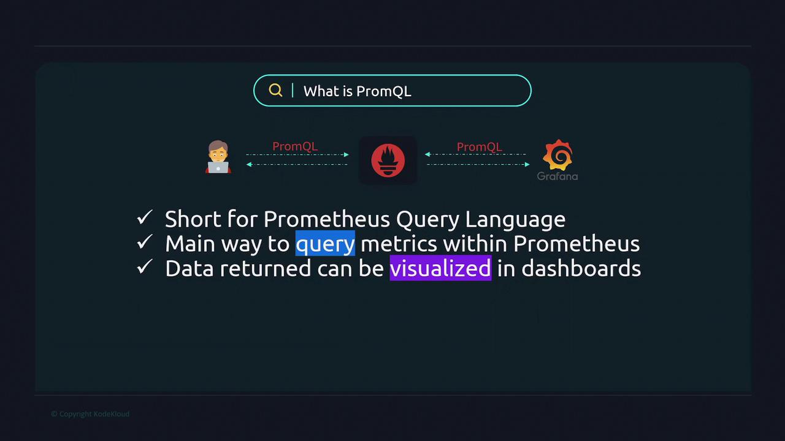

# 📃 PromQL — The Complete Guide

**PromQL (Prometheus Query Language) is a powerful tool for querying time-series metrics in Prometheus. It lets you extract, filter, aggregate, and visualize metrics for monitoring, alerting, and debugging.**

---

<div align="center" style="background-color: #11171F; border-radius: 10px; border: 2px solid">
    
</div>

---

## 🚀 1. What Is PromQL?

PromQL is the query language used by Prometheus to retrieve and manipulate metrics. It powers:

- **Grafana dashboards**
- **Prometheus alerts**
- **Ad-hoc metric exploration**

It works on **time-series data**, where each metric is a stream of timestamped values.

---

## 🧩 2. Prometheus Metric Types

<div align="center" style="background-color: #141a19ff;color: #a8a5a5ff; border-radius: 10px; border: 2px solid">

| Type          | Description                            | Example Metric Name             |
| ------------- | -------------------------------------- | ------------------------------- |
| **Counter**   | Always increases (e.g., request count) | `http_requests_total`           |
| **Gauge**     | Can go up/down (e.g., memory usage)    | `memory_usage_bytes`            |
| **Histogram** | Buckets of values + count/sum          | `http_request_duration_seconds` |
| **Summary**   | Quantiles + count/sum                  | `rpc_duration_seconds`          |

</div>

---

## 🔍 3. Basic Query Syntax

### 📌 Select all time series for a metric

```promql
http_requests_total
```

### 📌 Filter by label

```promql
http_requests_total{method="GET", status="200"}
```

### 📌 Time range query

```promql
http_requests_total[5m]
```

---

## 📈 4. Aggregation Functions

<div align="center" style="background-color: #141a19ff;color: #a8a5a5ff; border-radius: 10px; border: 2px solid">

| Function  | Purpose                          | Example                         |
| --------- | -------------------------------- | ------------------------------- |
| `rate()`  | Per-second increase for counters | `rate(http_requests_total[1m])` |
| `avg()`   | Average across series            | `avg(memory_usage_bytes)`       |
| `sum()`   | Total across series              | `sum(http_requests_total)`      |
| `max()`   | Maximum value                    | `max(cpu_usage_seconds_total)`  |
| `min()`   | Minimum value                    | `min(disk_free_bytes)`          |
| `count()` | Number of series                 | `count(up)`                     |

</div>

---

## 🔁 5. Time Modifiers

<div align="center" style="background-color: #141a19ff;color: #a8a5a5ff; border-radius: 10px; border: 2px solid">

| Modifier    | Description                   | Example                             |
| ----------- | ----------------------------- | ----------------------------------- |
| `[5m]`      | Range vector (last 5 minutes) | `rate(metric_name[5m])`             |
| `offset 1h` | Shift data back in time       | `cpu_usage_seconds_total offset 1h` |

</div>

---

## 🧠 6. Label Matchers

<div align="center" style="background-color: #141a19ff;color: #a8a5a5ff; border-radius: 10px; border: 2px solid">

| Matcher | Meaning        | Example             |
| ------- | -------------- | ------------------- |
| `=`     | Exact match    | `{status="200"}`    |
| `!=`    | Not equal      | `{method!="POST"}`  |
| `=~`    | Regex match    | `{path=~"/api/.*"}` |
| `!~`    | Negative regex | `{job!~"db.*"}`     |

</div>

---

## 🔄 7. Math and Binary Operators

You can do math on metrics:

```promql
cpu_usage_seconds_total / system_cpu_cores
```

Or combine metrics:

```promql
rate(http_requests_total[1m]) * 100
```

---

## 🧵 8. Recording Rules and Alerts

### 📌 Recording rule (store query result as new metric)

```yaml
- record: job:http_increase_1m
  expr: rate(http_requests_total[1m])
```

### 📌 Alert rule

```yaml
- alert: HighErrorRate
  expr: rate(http_errors_total[5m]) > 0.1
  for: 2m
  labels:
    severity: critical
```

---

## 📊 9. Visualizing in Grafana

Use PromQL directly in Grafana panels:

- **Query**: `rate(http_requests_total[5m])`
- **Legend**: `{{method}} - {{status}}`
- **Transform**: Use `sum()` or `avg()` for aggregation

---

## 🧠 10. Common Pitfalls

- **Counters reset** → Use `rate()` not raw values
- **High cardinality** → Avoid per-user or per-request labels
- **Missing data** → Use `or` or `absent()` to detect gaps

---

## 🎯 11. Real-World Examples

### 🔹 Requests per second

```promql
rate(http_requests_total[1m])
```

### 🔹 CPU usage per core

```promql
sum(rate(cpu_usage_seconds_total[1m])) by (instance)
```

### 🔹 Memory usage alert

```promql
memory_usage_bytes > 1e+09
```

---

## 💡 12. Learn More

- [PromQL Handbook – Better Stack](https://betterstack.com/community/guides/monitoring/promql/)
- [PromQL Cheat Sheet – SigNoz](https://signoz.io/guides/promql-cheat-sheet/)
- [PromLabs PromQL Explorer](https://promlabs.com/promql-cheat-sheet/)
