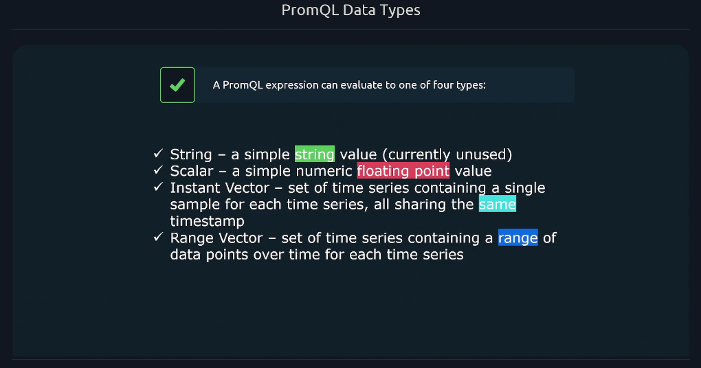
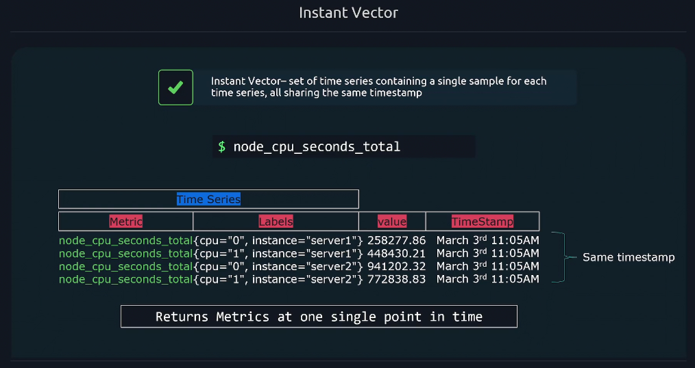
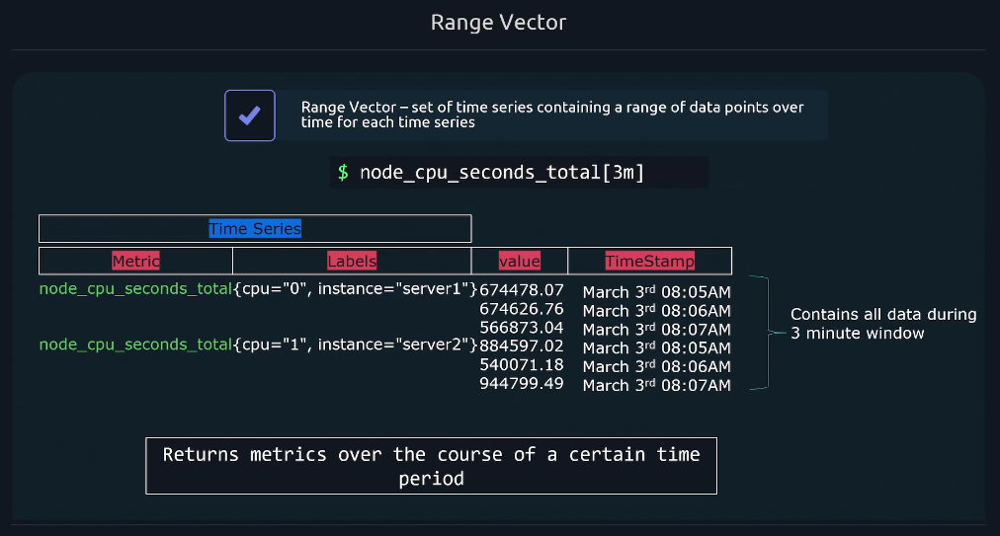

# 📅 **PromQL Data Types**

PromQL (Prometheus Query Language) can return **4 types of data** when you run a query.
These types define **how your metric values** are shaped — single number? one value per instance? many over time?

Let’s go one by one 👇

<div align="center" style="background-color:#11171F; border-radius: 10px; border: 2px solid">
    
</div>

---

## 📸 **1. Instant Vector**

### 💬 What it is:

An **instant vector** gives you **the latest value** for each time series — one sample per series, all at the same timestamp.
Think of it like:

> “Show me how things look right now.”

---

<div align="center" style="background-color:#11171F; border-radius: 10px; border: 2px solid">
    
</div>

---

### 🧱 Example:

```promql
node_cpu_seconds_total
```

Let’s say Prometheus scrapes every **15 seconds**.
At the current time, it will show the **most recent sample** for each `cpu` and `instance`:

<div align="center" style="background-color: #141a19ff;color: #a8a5a5ff; border-radius: 10px; border: 2px solid">

| Metric                 | Labels                        | Value     | Timestamp |
| ---------------------- | ----------------------------- | --------- | --------- |
| node_cpu_seconds_total | {cpu="0", instance="server1"} | 258277.86 | 11:05 AM  |
| node_cpu_seconds_total | {cpu="1", instance="server1"} | 448430.21 | 11:05 AM  |
| node_cpu_seconds_total | {cpu="0", instance="server2"} | 941202.32 | 11:05 AM  |
| node_cpu_seconds_total | {cpu="1", instance="server2"} | 772838.83 | 11:05 AM  |

</div>

---

All of them share **the same timestamp** (11:05 AM).  
That’s what makes it an **instant** vector — a single “snapshot”.

---

### 🔍 Used For:

- Simple queries like `up`, `cpu_usage_total`, `node_memory_Active_bytes`
- Current metric value visualization in Grafana
- Functions like `sum()`, `avg()`, `max()` over **current** values

---

## 🎥 **2. Range Vector**

### 💬 What it is:

A **range vector** gives you **a range of samples over time** for each series.
Think of it like:

> “Show me how this metric changed during the last X minutes.”

---

<div align="center" style="background-color:#11171F; border-radius: 10px; border: 2px solid">
    
</div>

---

### 🧱 Example:

```promql
node_cpu_seconds_total[3m]
```

This means:

> Get all values from the **last 3 minutes** for each time series.

If scrape interval = **15s**,
3 minutes = 180 seconds → 180 ÷ 15 = **12 samples per series**.

So each time series will look like:

<div align="center" style="background-color: #141a19ff;color: #a8a5a5ff; border-radius: 10px; border: 2px solid">

| Metric                 | Labels                        | Values                                 | Timestamps     |
| ---------------------- | ----------------------------- | -------------------------------------- | -------------- |
| node_cpu_seconds_total | {cpu="0", instance="server1"} | [674478.07, 674626.76, 674873.04, ...] | 8:05 → 8:07 AM |
| node_cpu_seconds_total | {cpu="1", instance="server2"} | [884597.02, 885001.18, 944799.49, ...] | 8:05 → 8:07 AM |

</div>

---

Each has **multiple values** during that time window.

---

### 🔍 Used For:

- Calculating **rates** or **averages** over time:

  ```promql
  rate(node_cpu_seconds_total[3m])
  ```

  → Computes per-second CPU usage rate using 3 minutes of data.

- Used in functions like:

  - `increase()`
  - `avg_over_time()`
  - `max_over_time()`
  - `min_over_time()`
  - `quantile_over_time()`

---

## 🔣 **3. Scalar**

### 💬 What it is:

A **scalar** is just **one numeric value** — not tied to any metric name or labels.
Think of it like:

> “Just give me a number.”

---

### 🧱 Example 1:

```promql
5
```

→ returns simply: `5`

---

### 🧱 Example 2:

```promql
count(up)
```

If 3 instances are up → returns `3`

---

### 🧱 Example 3:

```promql
(sum(rate(http_requests_total[5m])) > 10)
```

Here `10` is a scalar.
PromQL checks if the rate exceeds that number.

---

### 🔍 Used For:

- Thresholds and comparisons
- Multiplying or dividing by constants

  ```promql
  rate(http_requests_total[1m]) * 60
  ```

---

## 🧾 **4. String**

### 💬 What it is:

A **string** is just **text** — not used in calculations.
It exists mostly for completeness (rare in real queries).

---

### 🧱 Example:

```promql
"hello world"
```

→ Returns `"hello world"`

You can’t add, compare, or use it in math — it’s just text.

---

## ⏲️ **Scrape Interval Connection**

Let’s say your `scrape_interval = 15s`.

<div align="center" style="background-color: #141a19ff;color: #a8a5a5ff; border-radius: 10px; border: 2px solid">

| Query    | Meaning                       | Samples per Series |
| -------- | ----------------------------- | ------------------ |
| `up`     | Latest value (instant vector) | 1                  |
| `up[1m]` | Last 1 minute                 | 4 samples          |
| `up[5m]` | Last 5 minutes                | 20 samples         |
| `up[1h]` | Last 1 hour                   | 240 samples        |

</div>

---

The **range vector** includes all samples scraped within that window.  
The **instant vector** always has **just one** (the most recent).

---

## 🧠 **Think Visually**

<div align="center" style="background-color: #141a19ff;color: #a8a5a5ff; border-radius: 10px; border: 2px solid">

| Type                  | Feels Like    | Description                                           |
| --------------------- | ------------- | ----------------------------------------------------- |
| 🕒 **Instant Vector** | 📸 Snapshot   | One sample per time series at current time            |
| 🧭 **Range Vector**   | 🎥 Video clip | Multiple samples per time series across a time window |
| 🔢 **Scalar**         | 🔣 Number     | Single numeric value                                  |
| 🗒️ **String**         | 🧾 Text       | Simple string value (rare)                            |

</div>

---

## ✅ **Quick Recap**

<div align="center" style="background-color: #141a19ff;color: #a8a5a5ff; border-radius: 10px; border: 2px solid">

| Type           | Example               | What It Returns           | Common Use       |
| -------------- | --------------------- | ------------------------- | ---------------- |
| Instant Vector | `up`                  | One value per time series | Current metrics  |
| Range Vector   | `rate(cpu_usage[5m])` | Values over last 5m       | Trends, rates    |
| Scalar         | `count(up)`           | One number                | Math, thresholds |
| String         | `"ok"`                | Text                      | Rare/debug       |

</div>

---

Would you like me to continue with **how PromQL functions handle each data type** (e.g. `rate()` only works on range vectors, `sum()` on instant vectors, etc.) — with real examples like `rate()`, `increase()`, `avg_over_time()`? That’s the natural next piece.
