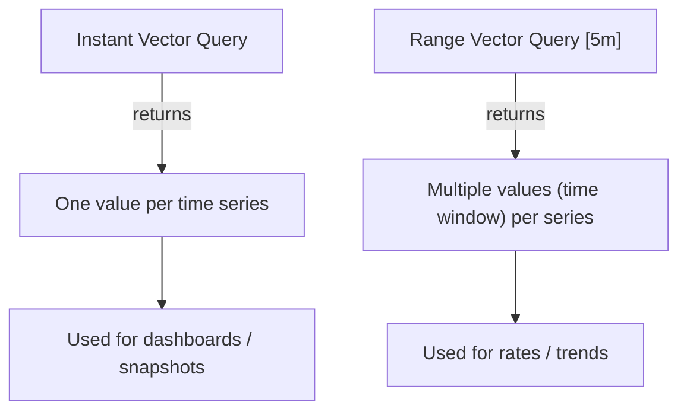

# ⏱️ Instant vs Range Vectors

_(a.k.a. “How Prometheus sees time when you ask for data”)!_

---

## 🧠 Big Picture

Prometheus doesn’t just store values — it stores **values _over time_**.
So when you query it, you can either ask:

1. 👉 “What’s the value _right now_?” → **Instant Vector**
2. 👉 “What’s the _series of values_ over the last X time?” → **Range Vector**

That’s it. These two are the foundation of PromQL.
Everything else (functions, aggregations, rates) builds on them.

---

## 🎯 1️⃣ Instant Vector (Snapshot View)

Think of an **instant vector** as a photo — a _single value per time series at one timestamp._

### 💡 Definition

> An **instant vector** returns the _latest sample value_ for each time series that matches the query at the evaluation time.

### 🔍 Example

```promql
node_memory_MemFree_bytes
```

This query returns:

| instance | value  |
| -------- | ------ |
| node1    | 12.3e9 |
| node2    | 8.1e9  |
| node3    | 9.5e9  |

⏰ **Evaluation time:** Now  
📸 **Result:** A snapshot at that time

---

### 🧠 You Can Still Use Filters

```promql
node_memory_MemFree_bytes{instance="node1"}
```

Still an **instant vector** — just fewer series.

---

### ⚙️ When to Use Instant Vectors

✅ Dashboard gauges (Grafana single-stat panels)  
✅ Aggregations like `sum()` or `avg()` _at this moment_  
✅ Threshold-based alerts (“if CPU > 90% right now”)

---

## ⏳ 2️⃣ Range Vector (Time Window View)

Now, imagine instead of a photo, you record a short _video clip_ of metric values — that’s a **range vector**.

### 💡 Definition

> A **range vector** represents a _set of samples over a specific time range_ for each matching time series.

### 🔍 Example

```promql
node_cpu_seconds_total[5m]
```

This means:

> “Give me all samples of `node_cpu_seconds_total` for the last 5 minutes.”

---

### 🧱 Structure Example

```ini
node_cpu_seconds_total{instance="node1"} = [
  (t-300s, 1000),
  (t-240s, 1012),
  (t-180s, 1023),
  (t-120s, 1031),
  (t-60s, 1044),
  (t, 1050)
]
```

Each time series → a _list_ of timestamp-value pairs covering the 5-minute window.

---

## 🧮 Functions That _Require_ Range Vectors

Some PromQL functions _only_ work on range vectors because they analyze _changes over time_.

| Function          | Works On | Meaning                               |
| ----------------- | -------- | ------------------------------------- |
| `rate()`          | Range    | Per-second rate of increase           |
| `increase()`      | Range    | Total increase over time              |
| `delta()`         | Range    | Difference between first & last value |
| `avg_over_time()` | Range    | Average value in range                |
| `max_over_time()` | Range    | Highest value in range                |

Example:

```promql
rate(http_requests_total[5m])
```

💬 “How fast are requests increasing over the last 5 minutes?”

---

### 🧠 Remember:

- Instant vectors → **1 value per series**
- Range vectors → **many values per series**

---

## 🧩 Conversion: Range → Instant

Functions like `rate()`, `increase()`, or `avg_over_time()`  
**convert a range vector into an instant vector.**

That’s why `rate()` can be used inside `sum()`:

```promql
sum(rate(http_requests_total[5m])) by (job)
```

✅ `rate()` returns instant vectors (one per time series)  
✅ `sum()` can then aggregate those

---

## 🧮 Subquery Example (Advanced Teaser)

You can even _nest_ range queries:

```promql
avg_over_time(
  rate(http_requests_total[5m])[30m:]
)
```

- Inner `rate(http_requests_total[5m])` → instant vector every step
- Outer `[30m:]` → converts that into a range
- Outer `avg_over_time()` → averages those

This is called a **subquery** — you’ll learn that in topic #7.

---

## 🧭 Visual Comparison



---

## 🧩 Quick Analogy

| Concept            | Analogy                  | Description                                       |
| ------------------ | ------------------------ | ------------------------------------------------- |
| **Instant Vector** | 🖼️ Photo                 | Single moment in time                             |
| **Range Vector**   | 🎞️ Video clip            | Sequence of samples                               |
| **rate()**         | 🎚️ Motion speed detector | Calculates how fast the value changes in the clip |

---

## 🧠 Quick Summary

| Concept        | Symbol          | Description                | Used In                 |
| -------------- | --------------- | -------------------------- | ----------------------- |
| Instant Vector | _(none)_        | Single sample at eval time | Dashboards, thresholds  |
| Range Vector   | `[5m]`          | Window of samples          | Rate, increase, trends  |
| Conversion     | Function result | Turns range → instant      | rate(), avg_over_time() |

---

✅ **Memory Trick:**

> “If it has `[time]`, it’s a _range vector_.  
> If not, it’s an _instant vector_.”
