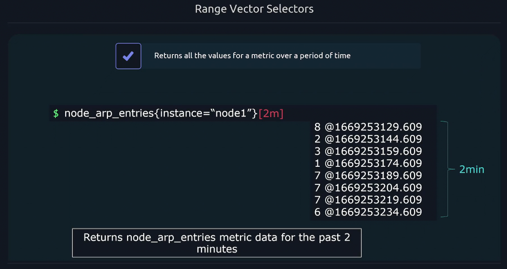

# 🎯 **Selection in PromQL**

PromQL (Prometheus Query Language) is built around the concept of **selecting time series**. Selection is the foundation of every query — whether you're visualizing metrics, calculating rates, or triggering alerts.

This guide breaks down **selection** into its core types, with clear examples, diagrams, and edge-case notes.

---

<div align="center" style="background-color: #11171F; border-radius: 10px; border: 2px solid">
    
</div>

---

<div align="center" style="background-color: #11171F; border-radius: 10px; border: 2px solid">
    
</div>

---

## 📌 **What Is a Time Series in Prometheus?**

A **time series** in Prometheus is uniquely identified by:

- A **metric name** (e.g. `http_requests_total`)
- A set of **labels** (e.g. `{method="GET", status="200"}`)
- A stream of **timestamped values**

Selection means: **which time series do you want to work with?**

---

## 🎭 **Types of Selection**

| Type               | Description                              | Example                       |
| ------------------ | ---------------------------------------- | ----------------------------- |
| **Instant Vector** | Selects the latest value per time series | `cpu_usage_seconds_total`     |
| **Range Vector**   | Selects all values over a time window    | `cpu_usage_seconds_total[5m]` |

---

## ⚡ **1. Instant Vector Selection**

### ✅ Syntax

```promql
metric_name{label_filters}
```

### 🔹 Example

```promql
http_requests_total{method="POST", status="500"}
```

This selects the **latest value** of all time series matching the labels.

### 🧠 Use Cases

- Current CPU usage
- Latest memory consumption
- Alerting on current state

---

## ⏱️ **2. Range Vector Selection (Focus)**

### ✅ Syntax

```promql
metric_name{label_filters}[duration]
```

### 🔹 Example

```promql
http_requests_total{method="GET"}[5m]
```

This selects **all samples** from the last 5 minutes for each matching time series.

### 🧠 Use Cases

- Calculating **rates** or **increases**
- Averaging over time
- Detecting trends or spikes

---

## ⚙️ **How Range Selection Works**

Prometheus stores data as **discrete samples** (e.g., every 15s). A range vector collects all samples in a time window.

### 🔹 Example: `cpu_usage_seconds_total[1m]`

If scraped every 15s, this returns 5 samples:

```ini
t=0s   →  100
t=15s  →  102
t=30s  →  104
t=45s  →  106
t=60s  →  108
```

This is the input for functions like:

```promql
rate(cpu_usage_seconds_total[1m]) → 0.133/sec
```

---

## 🧩 **Matchers: Label Filtering in Selection**

You can filter time series using **label matchers**:

<div align="center" style="background-color: #141a19ff;color: #a8a5a5ff; border-radius: 10px; border: 2px solid">

| Matcher | Meaning        | Example                        |
| ------- | -------------- | ------------------------------ |
| `=`     | Exact match    | `{job="api"}`                  |
| `!=`    | Not equal      | `{instance!="localhost:9090"}` |
| `=~`    | Regex match    | `{method=~"GET\|POST"}`        |
| `!~`    | Negative regex | `{status!~"4..\|5.."}`         |

</div>

---

<div align="center" style="background-color: #11171F; border-radius: 10px; border: 2px solid">
    
</div>

---

<div align="center" style="background-color: #11171F; border-radius: 10px; border: 2px solid">
    
</div>

---

<div align="center" style="background-color: #11171F; border-radius: 10px; border: 2px solid">
    
</div>

---

## 🔄 **Combining Selectors**

You can combine selection with math, aggregation, or functions.

### 🔹 Example: Requests per second per endpoint

```promql
sum(rate(http_requests_total{job="frontend"}[5m])) by (handler)
```

### 🔹 Example: Average memory usage over time

```promql
avg_over_time(memory_usage_bytes{job="api"}[10m])
```

---

## 🧠 **Selection vs Evaluation**

| Concept        | Description                        |
| -------------- | ---------------------------------- |
| **Selection**  | Chooses time series and samples    |
| **Evaluation** | Applies functions to selected data |

---

## 🧪 **Edge Cases and Gotchas**

- **Range selection requires functions**: You can’t graph a raw range vector.
- **Missing data**: If no samples exist in the range, the result is empty.
- **Counter resets**: Use `rate()` to handle resets safely.
- **High cardinality**: Avoid over-selecting with too many label combinations.

---

## ✅ **Summary**

<div align="center" style="background-color: #141a19ff;color: #a8a5a5ff; border-radius: 10px; border: 2px solid">

| Selector Type  | Syntax Example            | Returns                    |
| -------------- | ------------------------- | -------------------------- |
| Instant Vector | `metric_name{labels}`     | Latest value per series    |
| Range Vector   | `metric_name{labels}[5m]` | All samples in time window |

</div>
