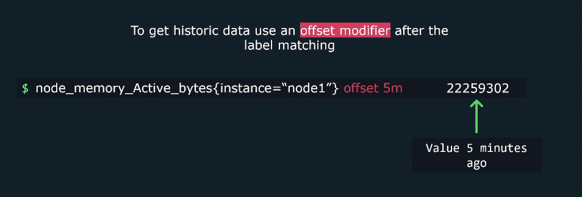
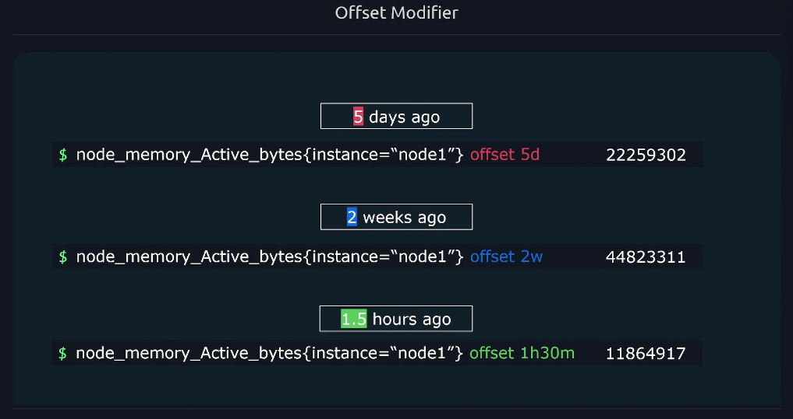
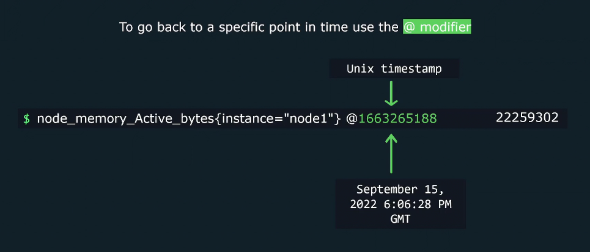

# 🧭 PromQL Modifiers: `offset`, `@`, and Combined Use — With Real-Time Examples

Modifiers in PromQL allow you to **shift or fix the evaluation time** of a query. This is essential for comparing past behavior, reproducing incidents, or aligning metrics across services.

---

<div align="center" style="background-color: #11171F; border-radius: 10px; border: 2px solid">
    
</div>

---

## 🔁 1. `offset` Modifier — Shift Back in Time

### ✅ Purpose

Shifts the query evaluation **backward** by a fixed duration.

### 📌 Syntax

```promql
metric_name offset 1h
```

---

<div align="center" style="background-color: #11171F; border-radius: 10px; border: 2px solid">
    
</div>

<div align="center" style="background-color: #11171F; border-radius: 10px; border: 2px solid">
    
</div>

<div align="center" style="background-color: #11171F; border-radius: 10px; border: 2px solid">
    
</div>

---

### 🔹 Example

```promql
rate(http_requests_total[5m] offset 1h)
```

### 🧠 Behavior

This calculates the **rate of increase** in `http_requests_total` from **1 hour ago**, using samples from:

- **Start**: 1 hour + 5 minutes ago
- **End**: 1 hour ago

### 📊 Real-Time Example

Assume current time is **Nov 7, 2025 at 3:00 PM**  
Then:

```promql
rate(http_requests_total[5m] offset 1h)
```

Evaluates the rate between:

- **Start**: 1:55 PM
- **End**: 2:00 PM

If:

- Value at 1:55 PM = 100
- Value at 2:00 PM = 130

Then:

$$
\frac{130 - 100}{300 \text{ seconds}} = 0.1
$$

---

## 📍 2. `@` Modifier — Fix Evaluation Time

### ✅ Purpose

Fixes the query evaluation at an **exact timestamp**.

### 📌 Syntax

```promql
metric_name @ <timestamp>
```

---

<div align="center" style="background-color: #11171F; border-radius: 10px; border: 2px solid">
    
</div>

---

### 🔹 Example

```promql
http_requests_total @ 1699350000
```

### 🧠 Behavior

Returns the value of `http_requests_total` **at Unix timestamp `1699350000`**, which is:

> 🕒 **Nov 7, 2023 at 10:00 PM UTC**  
> 🕒 **Nov 8, 2023 at 12:00 AM Egypt time**

### 📊 Expected Output

If:

- Value at that time = `250`

Then:

```promql
http_requests_total @ 1699350000 → 250
```

---

## 🔀 3. Combined: `offset` + `@`

### ✅ Purpose

Shifts the query back in time **and** evaluates it at a fixed timestamp.

### 📌 Syntax

```promql
rate(metric_name[5m] offset 1h @ 1699350000)
```

---

<div align="center" style="background-color: #11171F; border-radius: 10px; border: 2px solid">
    
</div>

> 💡 Order doesn't matter when combine @ modifier with `offset` modifier  
> 💡 You can combine range vector with offset modifier and `@` modifier

---

### 🔹 Example

```promql
rate(http_requests_total[5m] offset 1h @ 1699350000)
```

### 🧠 Behavior

Evaluates the rate of `http_requests_total` **1 hour before timestamp `1699350000`**, using samples from:

- **Start**: `1699350000 − 65m` → **Nov 7, 2023 at 8:55 PM UTC**
- **End**: `1699350000 − 60m` → **Nov 7, 2023 at 9:00 PM UTC**

### 📊 Expected Output

If:

- Value at 8:55 PM = 400
- Value at 9:00 PM = 430

Then:

```promql
rate(...) = (430 − 400) / 300 = 0.1 req/sec
```

---

## ✅ Summary Table

<div align="center" style="background-color: #141a19ff;color: #a8a5a5ff; border-radius: 10px; border: 2px solid">

| Modifier | Purpose                      | Example                                      | Evaluates At                | Output Example         |
| -------- | ---------------------------- | -------------------------------------------- | --------------------------- | ---------------------- |
| `offset` | Shift query back in time     | `cpu_usage offset 30m`                       | 30 minutes before now       | Value at t−30m         |
| `@`      | Fix query at exact timestamp | `cpu_usage @ 1699350000`                     | Nov 7, 2023 at 10:00 PM UTC | Value at that time     |
| Both     | Shift + fix evaluation time  | `rate(cpu_usage[5m] offset 1h @ 1699350000)` | Nov 7, 2023 at 9:00 PM UTC  | Rate from 8:55–9:00 PM |

</div>
