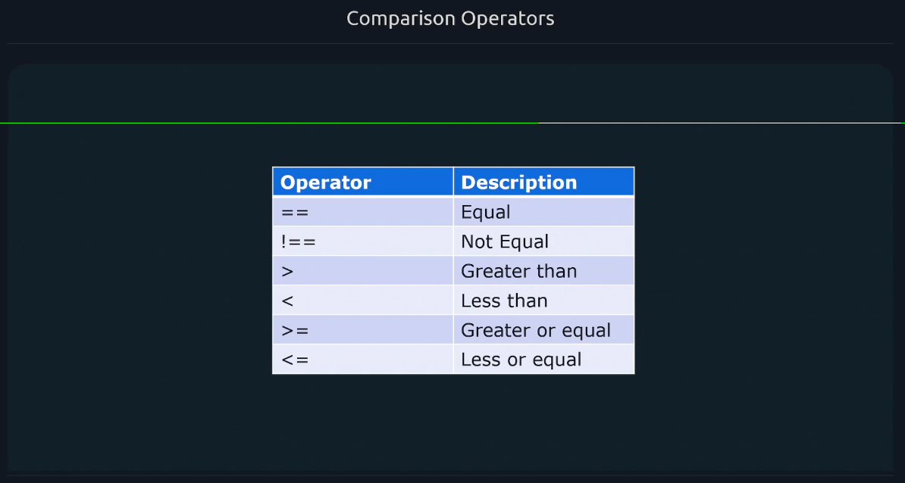
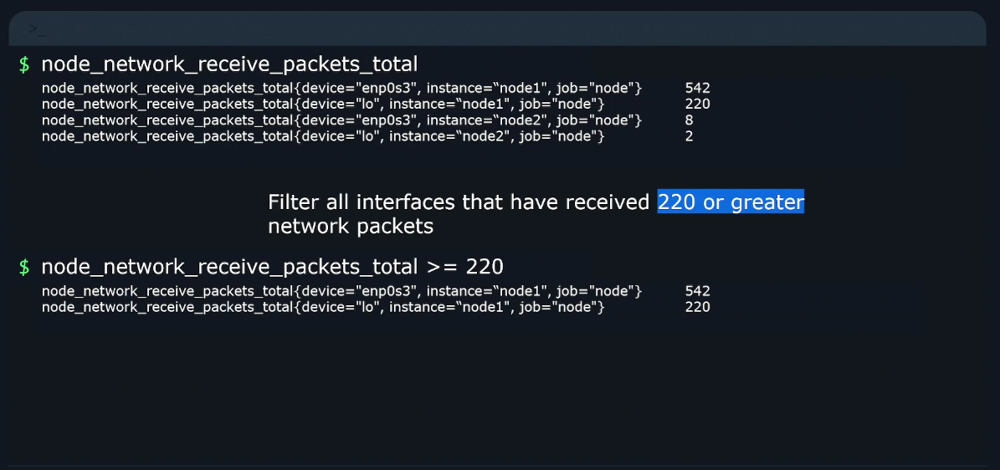
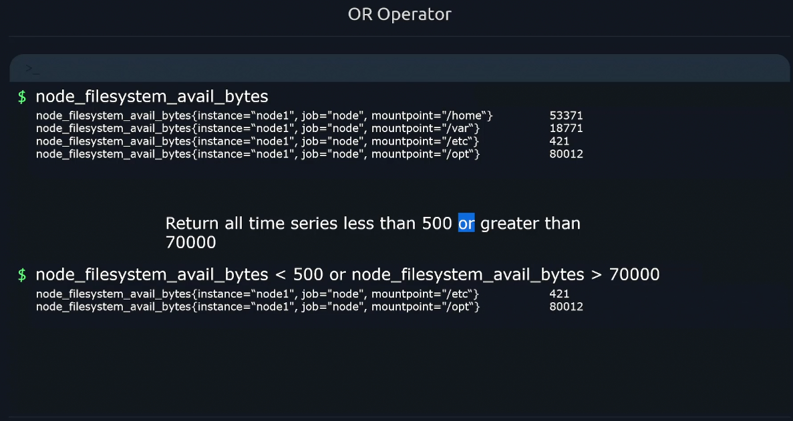
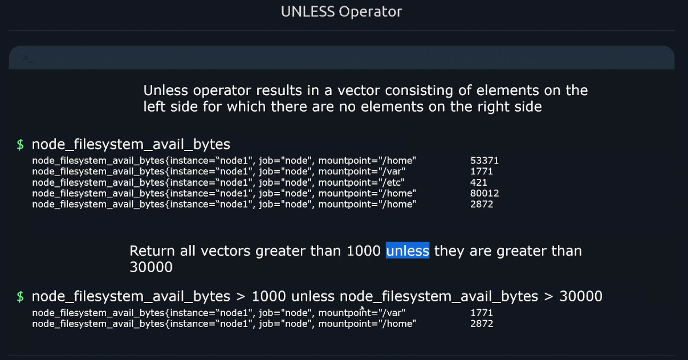

# 🔧 **PromQL Operators**

PromQL supports a rich set of **operators** to manipulate and compare time series. These operators work on **instant vectors**, **range vectors**, and **scalars**, and are essential for building expressive queries.

---

## ➕ **1. Arithmetic Operators**

Used to perform math on time series or scalars.

<div align="center" style="background-color: #141a19ff;color: #a8a5a5ff; border-radius: 10px; border: 2px solid">

| Operator | Meaning        | Example                               | Output Description        |
| -------- | -------------- | ------------------------------------- | ------------------------- |
| `+`      | Addition       | `cpu_user + cpu_system`               | Sum of both series        |
| `-`      | Subtraction    | `cpu_total - cpu_idle`                | Active CPU usage          |
| `*`      | Multiplication | `rate(http_requests_total[1m]) * 100` | Requests per second × 100 |
| `/`      | Division       | `cpu_usage / system_cpu_cores`        | Usage per core            |
| `%`      | Modulo         | `uptime % 60`                         | Seconds remainder         |
| `^`      | Exponentiation | `2 ^ 3`                               | Scalar result = 8         |

</div>

---

<div align="center" style="background-color: #11171F; border-radius: 10px; border: 2px solid">
    
</div>

---

<div align="center" style="background-color: #11171F; border-radius: 10px; border: 2px solid">
    
</div>

---

### 🧠 Example

```promql
rate(http_requests_total[1m]) * 100
```

If rate = `0.2`, output = `20`

---

## ⚖️ **2. Comparison Operators**

Used to **filter time series** based on value comparisons.

<div align="center" style="background-color: #141a19ff;color: #a8a5a5ff; border-radius: 10px; border: 2px solid">

| Operator | Meaning          | Example            | Output Description       |
| -------- | ---------------- | ------------------ | ------------------------ |
| `==`     | Equal            | `cpu_usage == 0.5` | Series where value = 0.5 |
| `!=`     | Not equal        | `cpu_usage != 0.5` | Series where value ≠ 0.5 |
| `>`      | Greater than     | `cpu_usage > 0.7`  | Series where usage > 70% |
| `<`      | Less than        | `cpu_usage < 0.3`  | Series where usage < 30% |
| `>=`     | Greater or equal | `cpu_usage >= 0.9` | Series where usage ≥ 90% |
| `<=`     | Less or equal    | `cpu_usage <= 0.1` | Series where usage ≤ 10% |

</div>

---

<div align="center" style="background-color: #11171F; border-radius: 10px; border: 2px solid">
    
</div>

---

<div align="center" style="background-color: #11171F; border-radius: 10px; border: 2px solid">
    
</div>

---

<div align="center" style="background-color: #11171F; border-radius: 10px; border: 2px solid">
    
</div>

---

### 🧠 Example

```promql
http_errors_total > 0
```

Returns only series where errors occurred.

---

## 🔗 **3. Logical Operators**

Used to **combine or exclude** time series based on label sets.

<div align="center" style="background-color: #141a19ff;color: #a8a5a5ff; border-radius: 10px; border: 2px solid">

| Operator | Meaning      | Example                | Output Description                     |
| -------- | ------------ | ---------------------- | -------------------------------------- |
| `and`    | Intersection | `up and job:api_up`    | Series present in both                 |
| `or`     | Union        | `up or job:api_up`     | Series present in either               |
| `unless` | Exclusion    | `up unless job:api_up` | Series in `up` but not in `job:api_up` |

</div>

---

<div align="center" style="background-color: #11171F; border-radius: 10px; border: 2px solid">
    
</div>

---

<div align="center" style="background-color: #11171F; border-radius: 10px; border: 2px solid">
    
</div>

---

<div align="center" style="background-color: #11171F; border-radius: 10px; border: 2px solid">
    
</div>

---

### 🧠 Example

```promql
up and on(instance) job:api_up
```

Returns series where `instance` is common in both.

---

## 🔢 **4. Binary Operator Precedence**

PromQL evaluates operators in this order:

1. `^` (exponentiation)
2. `*`, `/`, `%` (multiplication/division/modulo)
3. `+`, `-` (addition/subtraction)
4. Comparison: `==`, `!=`, `<`, `>`, `<=`, `>=`
5. Logical: `and`, `or`, `unless`

Use parentheses `()` to control precedence.

---

<div align="center" style="background-color: #11171F; border-radius: 10px; border: 2px solid">
    
</div>

---

### 🧠 Example

```promql
(cpu_usage + cpu_idle) / system_cpu_cores
```

Ensures addition happens before division.

---

## 🧠 **Real-World Use Case**

### 🔹 Alert: High CPU Usage

```promql
cpu_usage > 0.85
```

### 🔹 Filter active pods

```promql
up == 1 and on(pod) kube_pod_info
```

### 🔹 Exclude test jobs

```promql
http_requests_total unless job=~"test.*"
```
