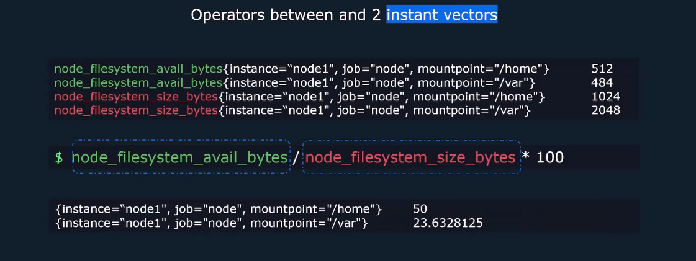
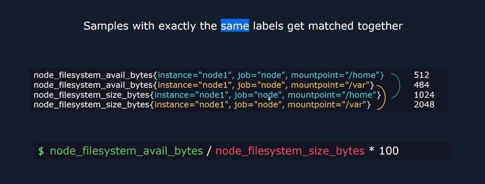
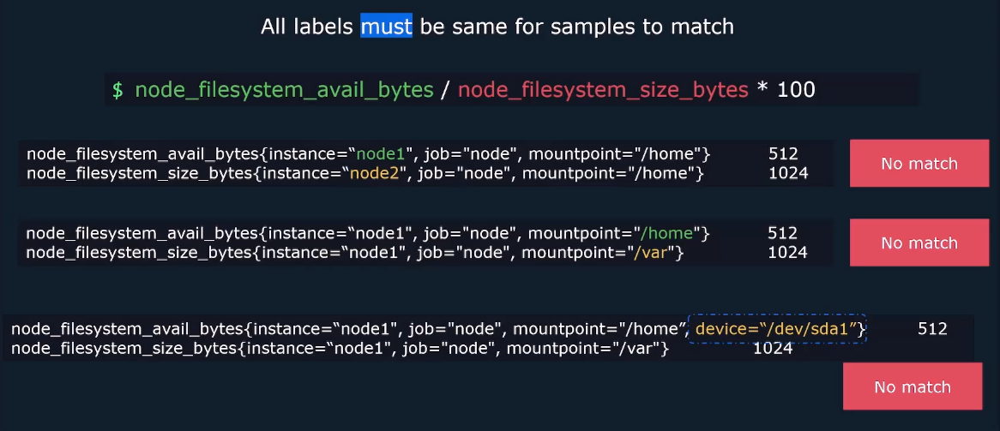
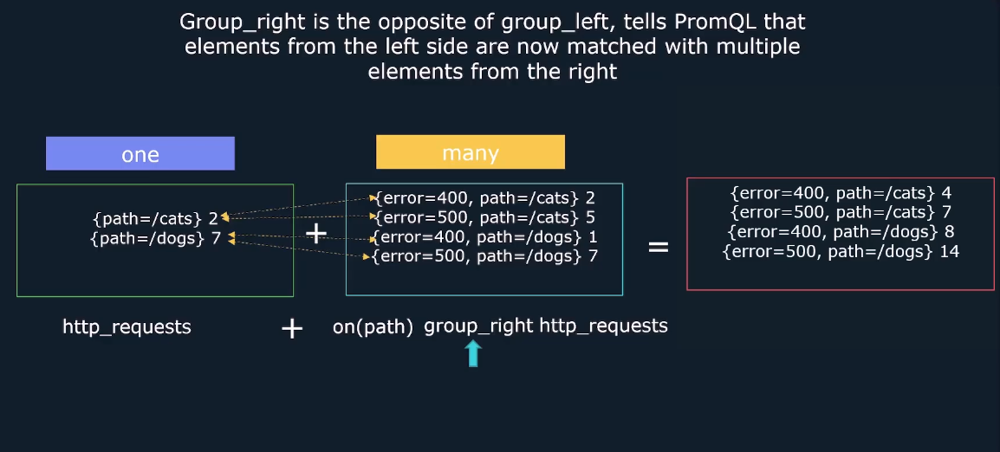

# 🔗 PromQL Vector Matching — Default Behavior, Modifiers, and Match Types

In PromQL, when you use **binary operators** (like `+`, `/`, `>`, `and`, etc.) between two sets of time series, Prometheus must decide **how to match** the series from the left and right sides.

This process is called **vector matching**.

---

<div align="center" style="background-color: #11171F; border-radius: 10px; border: 2px solid">
    
</div>

---

## 🧠 1. Default Matching Behavior

By default, Prometheus matches time series **only if their label sets are identical** (excluding the metric name).

### 🔹 Example

```promql
http_requests_total{method="GET", instance="A"} / http_requests_total{method="GET", instance="A"}
```

✅ This matches — same labels.

But:

```promql
http_requests_total{method="GET", instance="A"} / http_requests_total{method="GET", instance="B"}
```

❌ No match — different `instance`.

---

<div align="center" style="background-color: #11171F; border-radius: 10px; border: 2px solid">
    
</div>

<div align="center" style="background-color: #11171F; border-radius: 10px; border: 2px solid">
    
</div>

<div align="center" style="background-color: #11171F; border-radius: 10px; border: 2px solid">
    
</div>

<div align="center" style="background-color: #11171F; border-radius: 10px; border: 2px solid">
    
</div>

---

## 🧩 2. Modifying Matching with `on()` and `ignoring()`

### 🔸 `on(label1, label2, ...)`

Specifies **which labels to use** for matching. All other labels are ignored.

```promql
metricA / on(instance) metricB
```

→ Match only on `instance`, ignore all other labels.

---

<div align="center" style="background-color: #11171F; border-radius: 10px; border: 2px solid">
    
</div>

---

### 🔸 `ignoring(label1, label2, ...)`

Specifies **which labels to ignore** during matching. All others must match.

```promql
metricA / ignoring(mode) metricB
```

→ Ignore `mode`, match on everything else.

---

<div align="center" style="background-color: #11171F; border-radius: 10px; border: 2px solid">
    
</div>

---

## 🔀 3. One-to-One Matching

### ✅ Definition

Each time series on the left matches **exactly one** time series on the right.

---

<div align="center" style="background-color: #11171F; border-radius: 10px; border: 2px solid">
    
</div>

---

### 🔹 Example

```promql
app_errors_total{instance="A", method="GET"} / app_requests_total{instance="A", method="GET"}
```

Both sides have:

- `instance="A"`
- `method="GET"`

→ Safe to divide directly.

## 🔁 Many-to-One vs One-to-Many

When using binary operators (like `+`, `/`, `>`, etc.) between two metrics, Prometheus must **match time series** from both sides. If one side has **extra labels**, it creates ambiguity — and you must resolve it using `on(...)` and `group_left` or `group_right`.

---

### 🧠 Default Matching Recap

Prometheus matches time series **only when label sets are identical** (excluding metric name). If labels differ, you must guide Prometheus using:

- `on(...)` → specify which labels to match
- `group_left(...)` or `group_right(...)` → resolve many-to-one ambiguity

---

<div align="center" style="background-color: #11171F; border-radius: 10px; border: 2px solid">
    
</div>

<div align="center" style="background-color: #11171F; border-radius: 10px; border: 2px solid">
    
</div>

<div align="center" style="background-color: #11171F; border-radius: 10px; border: 2px solid">
    
</div>

---

## 🅰️ 1. Many-to-One Matching

### ✅ Definition

**Left side** has **many series** per label combination  
**Right side** has **one series** per label combination

### 🔹 Example

#### Left: `http_errors`

```ini
{error="400", path="/cats"} → 2
{error="404", path="/cats"} → 5
{error="500", path="/cats"} → 4
```

#### Right: `http_requests`

```ini
{path="/cats"} → 2
```

### ❌ Invalid Query

````promql
http_errors + on(path) http_requests
```ini
Fails with:

```ini
Error executing query: many-to-one matching must be explicit (group_left/group_right)
````

### ✅ Correct Query

```promql
http_errors + on(path) group_left(error) http_requests
```

### 🧠 Behavior

- Match on `path`
- Keep `error` label from left
- Result:

  ```ini
  {error="400", path="/cats"} → 2 + 2 = 4
  {error="404", path="/cats"} → 5 + 2 = 7
  {error="500", path="/cats"} → 4 + 2 = 6
  ```

---

## 🅱️ 2. One-to-Many Matching

### ✅ Definition

**Left side** has **one series** per label combination  
**Right side** has **many series** per label combination

### 🔹 Example

#### Left: `http_requests`

```ini
{path="/cats"} → 2
```

#### Right: `http_errors`

```ini
{error="400", path="/cats"} → 2
{error="404", path="/cats"} → 5
```

### ❌ Invalid Query

```promql
http_requests + on(path) http_errors
```

### ✅ Correct Query

```promql
http_requests + on(path) group_right(error) http_errors
```

### 🧠 Behavior

- Match on `path`
- Keep `error` label from right
- Result:

  ```ini
  {error="400", path="/cats"} → 2 + 2 = 4
  {error="404", path="/cats"} → 2 + 5 = 7
  ```

---

## 🧠 Summary Table

<div align="center" style="background-color: #141a19ff;color: #a8a5a5ff; border-radius: 10px; border: 2px solid">

| Match Type  | Description            | Modifier Needed        | Example                                                |
| ----------- | ---------------------- | ---------------------- | ------------------------------------------------------ |
| One-to-One  | Labels match exactly   | ❌ No                  | `A{instance="X"} / B{instance="X"}`                    |
| Many-to-One | Left has extra labels  | ✅ Yes (`group_left`)  | `A{error, path} + on(path) group_left(error) B{path}`  |
| One-to-Many | Right has extra labels | ✅ Yes (`group_right`) | `A{path} + on(path) group_right(error) B{error, path}` |

</div>
