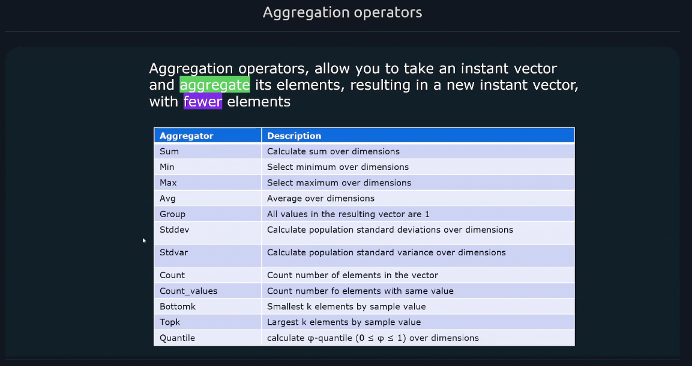
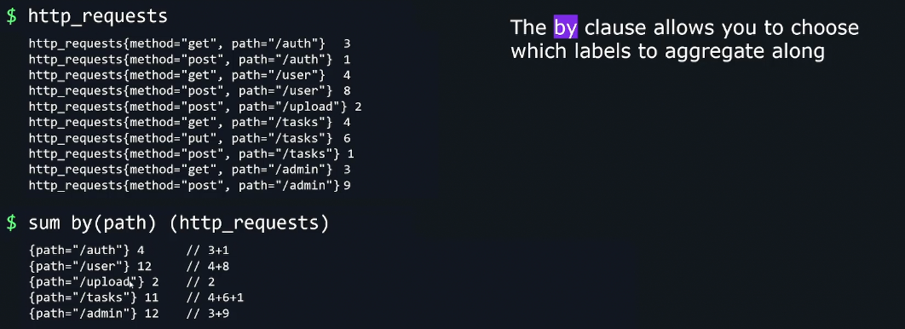

# 📊 PromQL Aggregation Operators — Full Guide with Grouping Logic

Aggregation operators in PromQL allow you to **combine multiple time series into fewer ones**, based on shared labels. They’re essential for summarizing metrics across pods, nodes, jobs, or any dimension.

---

<div align="center" style="background-color: #11171F; border-radius: 10px; border: 2px solid">
    
</div>

---

## 📌 **What Aggregators Do**

They take an **instant vector** (a set of time series at a single timestamp) and **reduce** it by applying a function:

<div align="center" style="background-color: #141a19ff;color: #a8a5a5ff; border-radius: 10px; border: 2px solid">

| Aggregator          | Description                                   |
| ------------------- | --------------------------------------------- |
| `sum`               | Total value across series                     |
| `avg`               | Average value                                 |
| `min` / `max`       | Minimum / maximum value                       |
| `count`             | Number of series in the group                 |
| `stddev` / `stdvar` | Standard deviation / variance                 |
| `topk` / `bottomk`  | Top/bottom K values                           |
| `quantile`          | φ-quantile (e.g. median, 95th percentile)     |
| `count_values`      | Count how many series have each value         |
| `group`             | Replace all values with `1` (preserve labels) |

</div>

---

## 🔍 **Default Behavior (No Clause)**

If you use an aggregator **without `by()` or `without()`**, Prometheus **drops all labels** and aggregates **everything together**.

---

<div align="center" style="background-color: #11171F; border-radius: 10px; border: 2px solid">
    
</div>

---

### 🔹 Example

```promql
sum(http_requests_total)
```

### ✅ Result

Single value:

```ini
{} → 123456
```

All labels are removed — you get the **total across all instances, methods, paths, etc.**

---

## 🧩 **Using `by(...)` Clause**

Use `by(label1, label2)` to **group by specific labels** — Prometheus keeps those labels and aggregates across the rest.

---

<div align="center" style="background-color: #11171F; border-radius: 10px; border: 2px solid">
    
</div>

---

<div align="center" style="background-color: #11171F; border-radius: 10px; border: 2px solid">
    
</div>

---

### 🔹 Example

```promql
sum(http_requests_total) by (instance)
```

### ✅ Result

```ini
{instance="A"} → 5000
{instance="B"} → 7000
```

Prometheus:

- Groups by `instance`
- Sums across other labels (e.g. `method`, `status`, `path`)

---

## 🚫 **Using `without(...)` Clause**

Use `without(label1, label2)` to **drop specific labels** and group by the rest.

---

<div align="center" style="background-color: #11171F; border-radius: 10px; border: 2px solid">
    
</div>

---

### 🔹 Example

```promql
sum(http_requests_total) without (method)
```

### ✅ Result

Prometheus:

- Drops `method`
- Groups by remaining labels (e.g. `instance`, `status`, `path`)

---

## 🔁 **`sum` vs `count` — Key Difference**

### 🔸 `sum(...)`

- Adds **values** of time series
- Result depends on **metric values**

### 🔸 `count(...)`

- Counts **how many time series** exist in each group
- Ignores values — just counts presence

---

### 🧠 Example

#### Input:

```promql
http_requests_total:
{instance="A", method="GET"} → 100
{instance="A", method="POST"} → 200
{instance="B", method="GET"} → 300
```

#### `sum(...) by (instance)`

```promql
{instance="A"} → 100 + 200 = 300
{instance="B"} → 300
```

#### `count(...) by (instance)`

```promql
{instance="A"} → 2 series
{instance="B"} → 1 series
```

> 🔍 `sum` gives total requests, `count` gives how many request types (series) exist.

---

## ✅ Summary Table

<div align="center" style="background-color: #141a19ff;color: #a8a5a5ff; border-radius: 10px; border: 2px solid">

| Aggregator | What It Does            | With `by()`               | With `without()`           |
| ---------- | ----------------------- | ------------------------- | -------------------------- |
| `sum`      | Adds values             | Group by labels           | Drop labels, group by rest |
| `count`    | Counts series           | Group by labels           | Drop labels, group by rest |
| `avg`      | Mean of values          | Same                      | Same                       |
| `group`    | Replace values with `1` | Preserves label structure | Same                       |

</div>
