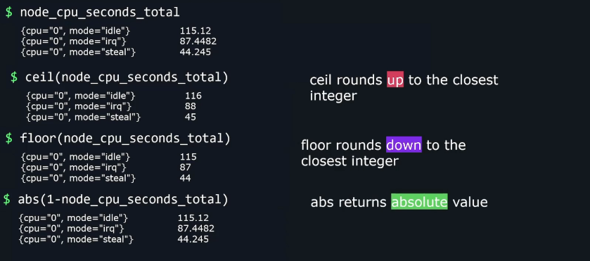
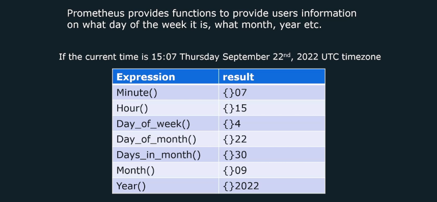
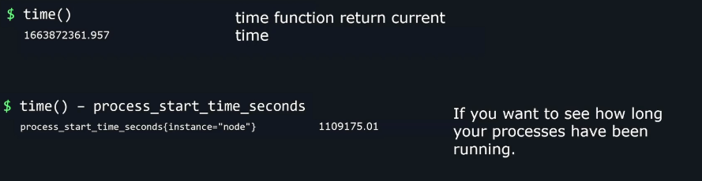
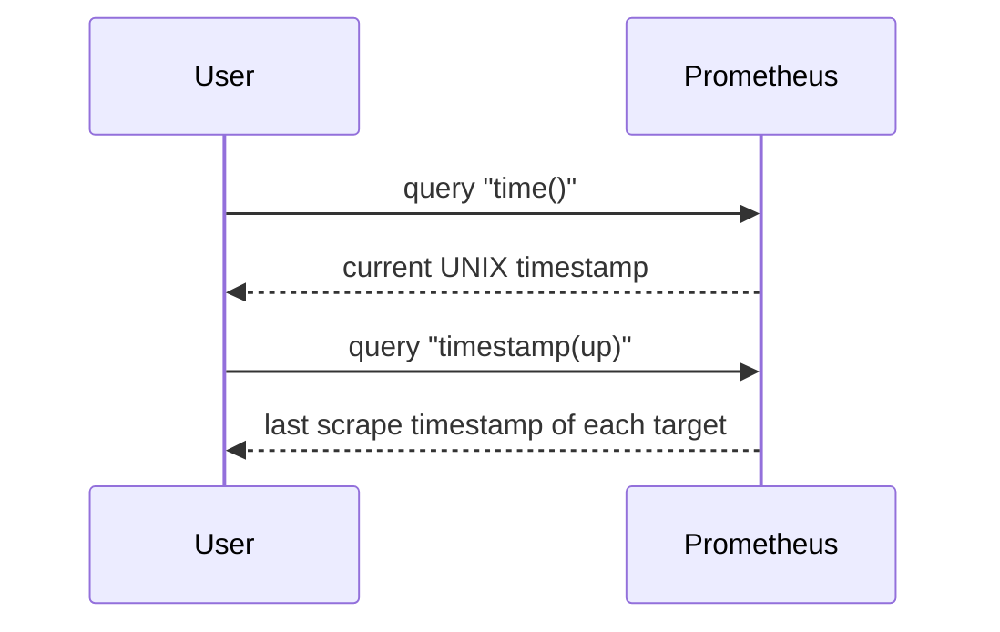
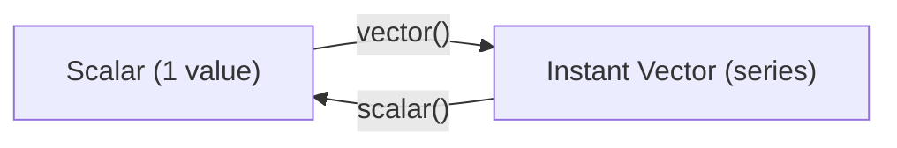
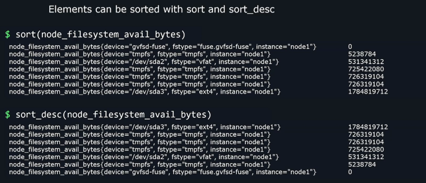
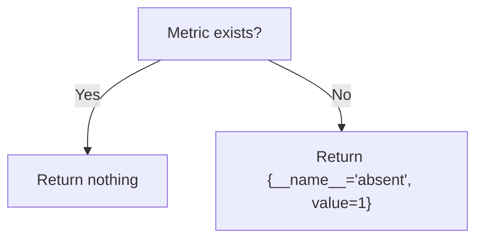
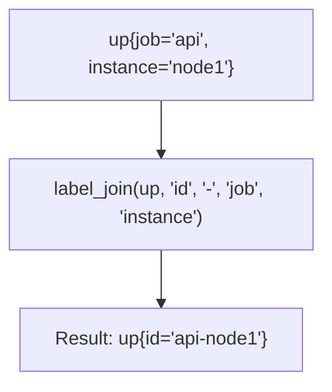

# ⚙️ **PromQL Functions** — The Ultimate Guide

## 📚 Table of Contents — Prometheus Architecture & Data Flow

1. [🧮 Math Functions](#1)
2. [⏰ Date / Time Functions](#2)
3. [🔄 Changing Type Functions](#3)
4. [🔢 Sorting Functions](#4)
5. [🚫 Absence Functions](#5)
6. [✅ Present Functions](#6)
7. [🔤 String (Label) Functions](#7)
8. [🧾 Final Summary Table](#8)
9. [💡 Real-World Examples](#9)

---

<a id="1"></a>

## 🧮 **Math Functions**

_(Used to transform or normalize metric values)!_

 <div align="center" style="background-color: #11171F; border-radius: 10px; border: 2px solid">
    
</div>

PromQL allows you to perform **arithmetic** directly on metric values.
These math functions modify numeric values (scalars or vectors) without changing labels.

---

### 🔹 `abs(v)` — Absolute Value

Removes the negative sign from values.

📘 **Definition:**

> Returns the absolute value of each element in the vector.

🧩 **Example:**

```promql
abs(node_filesystem_free_bytes - node_filesystem_size_bytes)
```

➡️ If disk space calculation produces `-5000000` (because of scrape delay),
`abs()` ensures it becomes positive `5000000`.

✅ **Use Case:** Prevent invalid negatives when doing subtraction on Counters or Gauges.

---

### 🔹 `ceil(v)` — Round Up

Rounds each value **up** to the nearest integer.

📘 **Example:**

```promql
ceil(node_load1)
```

If `node_load1 = 1.2`, → `2`.

✅ **Use Case:** Display rounded values in dashboards.

---

### 🔹 `floor(v)` — Round Down

Rounds each value **down** to the nearest integer.

📘 **Example:**

```promql
floor(cpu_utilization_percent)
```

If `cpu_utilization_percent = 99.8`, → `99`.

✅ **Use Case:** Clean up floating numbers before alert comparison.

---

### 🔹 `round(v, to)` — Round to a Specific Multiple

📘 **Syntax:**

```promql
round(v, to)
```

If `to` is omitted, rounds to nearest integer.

📘 **Example:**

```promql
round(node_memory_MemFree_bytes / 1e9, 0.1)
```

→ Rounds to nearest 0.1 GB.

✅ **Use Case:** Human-readable dashboards (e.g., round to 0.5 GB increments).

---

### 🔹 `clamp_max(v, max)` / `clamp_min(v, min)`

Limits metric values to within a threshold.

📘 **Examples:**

```promql
clamp_max(cpu_usage_percent, 100)
clamp_min(cpu_usage_percent, 0)
```

So if a buggy metric reports 120%, it’s clamped to 100.

✅ **Use Case:** Prevent false alerts or visual overshoots in graphs.

---

### 🔹 `sqrt(v)` — Square Root

📘 **Example:**

```promql
sqrt(metric)
```

Useful in variance or normalization formulas.

---

### 🔹 `ln(v)`, `log2(v)`, `log10(v)` — Logarithmic Scaling

Used to express exponential growth patterns (like latency or exponential backoffs).

📘 **Example:**

```promql
log10(request_latency_seconds)
```

✅ **Use Case:** Log-scale visualizations for latency distributions.

---

### 🔹 `exp(v)` — Exponential

Inverse of logarithm — computes eˣ.

📘 **Example:**

```promql
exp(cpu_usage_ratio)
```

Used in anomaly detection formulas (advanced use).

---

🧠 **Key Tip:**
You can chain math functions:

```promql
round(clamp_min(cpu_temp_celsius, 0), 0.5)
```

➡️ Clamp below 0°C → Round to nearest 0.5°C.

---

### 🧩 Summary Table

<div align="center" style="background-color: #141a19ff;color: #a8a5a5ff; border-radius: 10px; border: 2px solid">

| Function                    | Description    | Example               |
| --------------------------- | -------------- | --------------------- |
| `abs()`                     | Absolute value | `abs(a - b)`          |
| `ceil()`                    | Round up       | `ceil(node_load1)`    |
| `floor()`                   | Round down     | `floor(temp)`         |
| `round(v, to)`              | Round to step  | `round(x, 0.1)`       |
| `clamp_min()`               | Lower bound    | `clamp_min(cpu, 0)`   |
| `clamp_max()`               | Upper bound    | `clamp_max(cpu, 100)` |
| `sqrt()`                    | Square root    | `sqrt(latency)`       |
| `ln()`, `log2()`, `log10()` | Logs           | `log10(size)`         |
| `exp()`                     | Exponent       | `exp(rate)`           |

</div>

---

<a id="2"></a>

## ⏰ **Date / Time Functions**

<div align="center" style="background-color: #11171F; border-radius: 10px; border: 2px solid">
    
</div>

<div align="center" style="background-color: #11171F; border-radius: 10px; border: 2px solid">
    
</div>

These functions are critical for **time-based comparisons, freshness checks, and temporal alerts**.

---

### 🔹 `time()`

Returns the **current evaluation time** as a UNIX timestamp (seconds since epoch).

📘 **Example:**

```promql
time()
```

➡️ Might return `1730998100`.

✅ **Use Case:**
Used to compare time elapsed since last metric update.

---

### 🔹 `timestamp(v)`

Returns the **timestamp** of each sample in vector `v`.

📘 **Example:**

```promql
timestamp(up)
```

If `up{instance="app1"} = 1` was scraped at 1730998000,
you get `1730998000` as the value.

✅ **Use Case:**
Detect stale metrics:

```promql
(time() - timestamp(up)) > 300
```

➡️ If > 300 seconds since last scrape → target is stale.

---

### 🧩 Visual Understanding

<div align="center" style="background-color: #141a19ff;color: #a8a5a5ff; border-radius: 10px; border: 2px solid">



</div>

---

### 🔹 Other Date Functions (less common)

<div align="center" style="background-color: #141a19ff;color: #a8a5a5ff; border-radius: 10px; border: 2px solid">

| Function         | Description         |
| ---------------- | ------------------- |
| `year(v)`        | Year part (2025)    |
| `month(v)`       | Month number (1–12) |
| `day_of_week(v)` | 0–6 (Sunday=0)      |
| `hour(v)`        | Hour of day (0–23)  |

</div>

---

Example:

```promql
hour(time()) >= 9 and hour(time()) <= 17
```

➡️ Useful for “working hours” alerts.

---

✅ **Real-World Example:**  
Alert if a service hasn’t reported in 5 minutes:

```promql
(time() - timestamp(up{job="backend"})) > 300
```

---

<a id="3"></a>

## 🔄 **Changing Type Functions**

These convert between **scalar** (single number) and **vector** (series of metrics).

---

### 🔹 `scalar(v)`

Converts a **single-element instant vector** into a **scalar number**.

📘 **Example:**

```promql
scalar(up{instance="node1"})
```

If `up{instance="node1"} = 1`, result → `1`.

✅ **Use Case:** Extract numeric constants from metrics.

---

### 🔹 `vector(scalar)`

Converts a **scalar constant** into a **single-sample vector**.

📘 **Example:**

```promql
vector(100)
```

Result → A vector with one element: `{}` = 100

✅ **Use Case:**  
When you need to compare metric values to a constant threshold:

```promql
node_memory_MemFree_bytes / vector(1073741824)
```

➡️ Convert bytes → gigabytes.

---

🧩 Diagram: Type Conversion

<div align="center" style="background-color: #141a19ff;color: #a8a5a5ff; border-radius: 10px; border: 2px solid">



</div>

---

<a id="4"></a>

## 🔢 **Sorting Functions**

<div align="center" style="background-color: #11171F; border-radius: 10px; border: 2px solid">
    
</div>

These organize your results for **ranking dashboards** or **finding top consumers**.

---

### 🔹 `sort(v)`

Sorts series **ascending** by value.

📘 **Example:**

```promql
sort(node_load1)
```

➡️ From lowest → highest load.

---

### 🔹 `sort_desc(v)`

Sorts series **descending** by value.

📘 **Example:**

```promql
sort_desc(rate(http_requests_total[5m]))
```

➡️ From highest → lowest request rate.

✅ **Use Case:**
Show _Top 10_ busiest services in Grafana.

---

### 🧩 Combine With `topk()` and `bottomk()`

```promql
topk(5, sort_desc(rate(http_requests_total[5m])))
```

➡️ Top 5 busiest services.

---

🧠 **Tip:** Sorting doesn’t aggregate — it just orders values visually.

---

<a id="5"></a>

## 🚫 **Absence Functions**

Used to **detect missing metrics or targets**, one of the most useful alerting tricks in Prometheus.

---

### 🔹 `absent(v)`

Returns a vector with value `1` _if the expression returns no data_.

📘 **Example:**

```promql
absent(up{job="api"})
```

If no API target is reporting → returns `1`.

✅ **Use Case:**
Alert if a target stops exposing its metrics:

```promql
absent(up{job="web"}) == 1
```

---

### 🔹 `absent_over_time(v[range])`

Returns 1 if a metric was **absent during the entire range**.

📘 **Example:**

```promql
absent_over_time(up{job="db"}[10m])
```

If the DB didn’t send any data for 10 minutes → returns 1.

✅ **Use Case:**
Alert when a service hasn’t sent any data for a while.

---

🧩 Visual Explanation

<div align="center" style="background-color: #141a19ff;color: #a8a5a5ff; border-radius: 10px; border: 2px solid">



</div>

---

<a id="6"></a>

## ✅ **Present Functions**

Used in some advanced PromQL-compatible systems (like **Thanos** and **VictoriaMetrics**)
to detect **presence** instead of absence.

> Not part of classic Prometheus, but commonly seen in large observability setups.

---

### 🔹 `present(v)`

Returns `1` if the expression has _any_ result.

📘 **Example:**

```promql
present(up{job="api"})
```

➡️ Returns `1` if `up{job="api"}` exists.

---

### 🔹 `present_over_time(v[range])`

Returns `1` if the metric existed _at any point_ during that range.

📘 **Example:**

```promql
present_over_time(http_requests_total[1h])
```

➡️ `1` if any sample appeared in last hour.

✅ **Use Case:**  
Confirm data was reported at least once during a period.

---

🧠 Think of it as:

> `present()` = “Is anyone here right now?”  
> `present_over_time()` = “Has anyone been here recently?”

---

<a id="7"></a>

## 🔤 **String (Label) Functions**

PromQL doesn’t directly modify numeric values using strings,  
but **label manipulation functions** let you rewrite, merge, and extract parts of label values.

---

### 🔹 `label_replace(v, dst_label, replacement, src_label, regex)`

Creates or modifies a label using regex capture groups.

📘 **Example:**

```promql
label_replace(up, "region", "$1", "instance", "(.*):.*")
```

If `instance="us-east-1:9100"`
→ Adds `region="us-east-1"`

✅ **Use Case:** Extract structured info from existing labels (e.g., region, cluster).

---

### 🔹 `label_join(v, dst_label, separator, src1, src2, …)`

Joins multiple labels into a new one using a separator.

📘 **Example:**

```promql
label_join(up, "full_id", "-", "job", "instance")
```

If `job="api"` and `instance="node1"`,
→ `full_id="api-node1"`

✅ **Use Case:** Build unique labels for correlation or aggregation.

---

### 🧩 Visual Example

<div align="center" style="background-color: #141a19ff;color: #a8a5a5ff; border-radius: 10px; border: 2px solid">



</div>

---

### ⚙️ Combining String Functions

Sometimes used together for complex transformations:

```promql
label_join(
  label_replace(up, "region", "$1", "instance", "(.*)-node.*"),
  "target_id", "_", "region", "job"
)
```

➡️ Extract region → combine region + job → `target_id="us-west_api"`

---

<a id="8"></a>

## 🧾 **Final Summary Table**

<div align="center" style="background-color: #141a19ff;color: #a8a5a5ff; border-radius: 10px; border: 2px solid">

| Category            | Functions                                                                        | What They Do                  |
| ------------------- | -------------------------------------------------------------------------------- | ----------------------------- |
| **Math**            | `abs`, `ceil`, `floor`, `round`, `clamp_min`, `clamp_max`, `sqrt`, `ln`, `log10` | Numeric operations            |
| **Date/Time**       | `time`, `timestamp`, `year`, `month`, `hour`                                     | Handle timestamps             |
| **Type Conversion** | `scalar`, `vector`                                                               | Convert between scalar/vector |
| **Sorting**         | `sort`, `sort_desc`                                                              | Order vectors                 |
| **Absence**         | `absent`, `absent_over_time`                                                     | Detect missing metrics        |
| **Present**         | `present`, `present_over_time`                                                   | Detect existing metrics       |
| **String**          | `label_replace`, `label_join`                                                    | Manipulate labels             |

</div>

---

<a id="9"></a>

## 💡 **Real-World Examples**

### 🔸 CPU Utilization (%)

```promql
100 - (avg by(instance)(rate(node_cpu_seconds_total{mode="idle"}[5m])) * 100)
```

### 🔸 Top 5 APIs by request rate

```promql
topk(5, sort_desc(rate(http_requests_total{job="api"}[5m])))
```

### 🔸 Alert if Prometheus hasn’t scraped any metrics in 10 mins

```promql
absent_over_time(up[10m])
```

### 🔸 Extract region from instance name

```promql
label_replace(up, "region", "$1", "instance", "(.*)-node.*")
```
