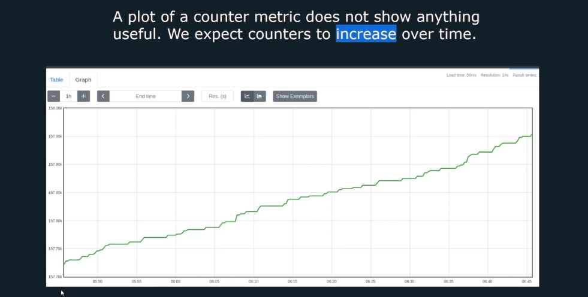
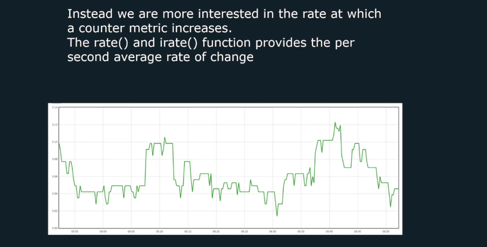
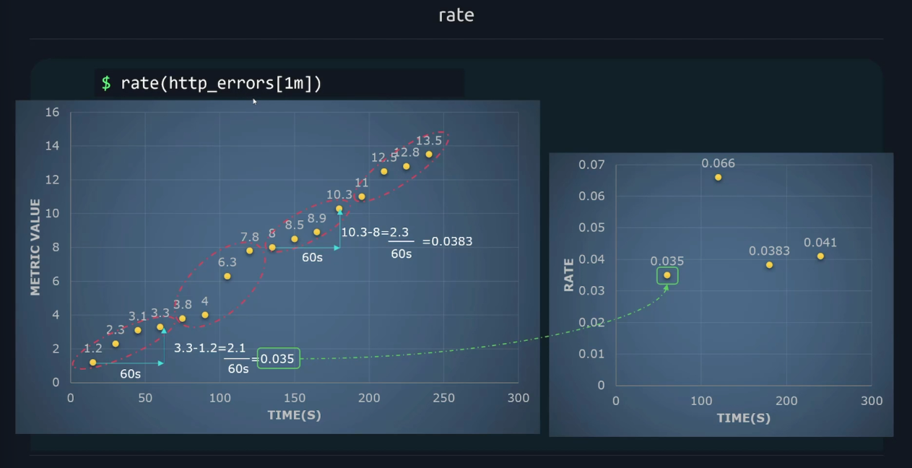
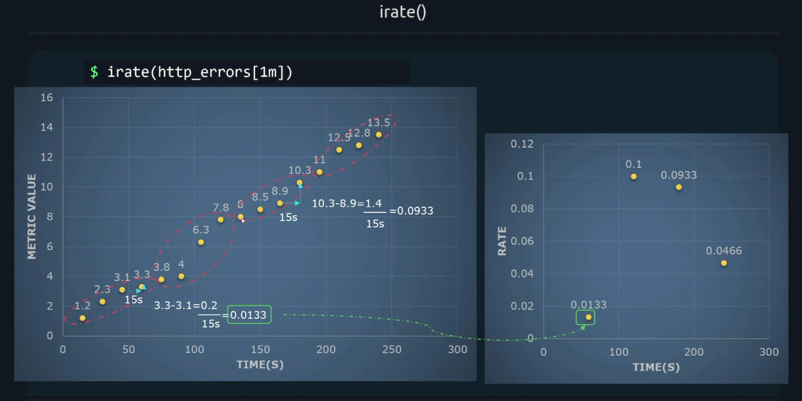
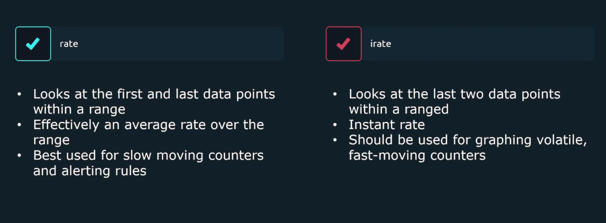

# ⚡️ PromQL: `rate()` vs `irate()` — The Speedometers of Prometheus

Raw counter values aren’t useful by themselves—you want the **speed of increase**:

- “How many requests per second?”
- “How fast are bytes being received?”
- “What’s the error rate right now?”

> 💡 imagine Prometheus as your car dashboard.  
> Metrics like `http_requests_total` are your **odometer** — always going up as long as the app runs.  
> But what you _actually care about_ is **speed** — how fast those requests are happening _right now_.

That’s what **`rate()`** and **`irate()`** tell you.

---

<div align="center" style="background-color: #11171F; border-radius: 10px; border: 2px solid">
    
</div>

---

<div align="center" style="background-color: #11171F; border-radius: 10px; border: 2px solid">
    
</div>

---

## 🧮 What They Do in One Line

<div align="center" style="background-color: #141a19ff;color: #a8a5a5ff; border-radius: 10px; border: 2px solid">

| Function  | Meaning                 | Analogy                                       |
| --------- | ----------------------- | --------------------------------------------- |
| `rate()`  | Average speed over time | Cruise control — smooth, stable               |
| `irate()` | Instantaneous speed     | Your speedometer needle — jumpy but real-time |

</div>

---

## 🧩 How `rate()` Works (the Smooth Operator)

Think of `rate()` like this:

> “Tell me the average increase per second in the last X minutes.”

It looks at **all data points** in your chosen time range (e.g., `[5m]`),
handles resets, and calculates the average slope of the line.

```promql
rate(http_requests_total[5m])
```

If 300 requests happened in 5 minutes,
`rate()` = `300 / (5 * 60)` = **1 request per second**.

✅ **Perfect for**: dashboards, alerts, SLAs — anything long-term and stable.  
❌ **Not ideal for**: super short bursts or debugging latency spikes.

---

<div align="center" style="background-color: #11171F; border-radius: 10px; border: 2px solid">
    
</div>

---

## ⚡ How `irate()` Works (the Impulsive One)

`irate()` says:

> “Forget the past! What’s my rate **right now**, based on the last two scrapes?”

```promql
irate(http_requests_total[5m])
```

It only uses the **most recent two points** inside `[5m]`.

So if you’re scraping every 15 seconds,
that’s basically “the last 30 seconds of activity”.

✅ **Perfect for**: spotting sudden spikes or debugging  
❌ **Too noisy for**: alerts or steady dashboards

---

<div align="center" style="background-color: #11171F; border-radius: 10px; border: 2px solid">
    
</div>

---

## 📊 Let’s See an Example

### Data from `http_requests_total`:

| Timestamp | Value |
| --------- | ----- |
| 0s        | 1000  |
| 15s       | 1020  |
| 30s       | 1040  |
| 45s       | 1060  |
| 60s       | 1080  |

---

### 🧮 Using `rate(http_requests_total[1m])`

Average increase = 1080 - 1000 = 80
Time = 60s
`rate()` = 80 / 60 = **1.33 requests/sec**

➡️ A smooth average over 1 minute.

---

### ⚡ Using `irate(http_requests_total[1m])`

Only looks at the last two:
(1080 - 1060) / (60 - 45) = 20 / 15 = **1.33 req/sec**

➡️ In this case, same result — but if traffic spiked for 5s, `irate()` would instantly jump, while `rate()` would smooth it.

---

## 🧨 Counter Reset Example

Imagine your app restarts, resetting the counter to 0:

| Timestamp | Value |         |
| --------- | ----- | ------- |
| 0s        | 500   |         |
| 30s       | 800   |         |
| 60s       | 50    | ← reset |
| 90s       | 200   |         |

`rate()` automatically detects that reset
and continues counting as if it was 800 → 850.
So no spike or negative rate.
That’s why you _never_ need to manually fix resets — Prometheus handles it. 💪

---

## 🕒 Which Window to Use?

<div align="center" style="background-color: #11171F; border-radius: 10px; border: 2px solid">
    
</div>

---

Scrape interval = how often Prometheus collects metrics.

<div align="center" style="background-color: #141a19ff;color: #a8a5a5ff; border-radius: 10px; border: 2px solid">

| Scrape interval | Recommended `[range]` |
| --------------- | --------------------- |
| 15s             | `[1m]` or `[5m]`      |
| 30s             | `[2m]` or `[5m]`      |
| 60s             | `[5m]` or `[10m]`     |

</div>

---

Why? Because you need at least **2 samples**,  
and ideally ~4–5× your scrape interval for a stable trend.

---

## 📒 Notes

- Make sure there at least 4 sample points in the time series, ideally more.
- 15 s scrape interval 60 s = 4 samples

## 💻 Real Examples You’ll Actually Use

### 🔸 Requests per second (smooth dashboard)

```promql
sum by (job) (rate(http_requests_total[5m]))
```

### 🔸 Instantaneous request spikes (debug)

```promql
sum by (job) (irate(http_requests_total[1m]))
```

### 🔸 Network throughput

```promql
sum by (instance) (rate(node_network_transmit_bytes_total[5m]))
```

### 🔸 Error percentage

```promql
100 *
sum(rate(http_requests_total{status=~"5.."}[5m]))
/
sum(rate(http_requests_total[5m]))
```

### 🔸 95th percentile latency (histogram)

```promql
histogram_quantile(0.95,
  sum by (le) (rate(http_request_duration_seconds_bucket[5m]))
)
```

> ⚠️ Always use `rate()` (not `irate()`) with histograms — `irate()` makes percentiles nonsense.

---

## 💡 Common Mistakes to Avoid

❌ Using `rate()` on a gauge metric (like memory usage)

> It’s not cumulative, so rate() gives garbage values.

❌ Using too small a window (`[15s]`)

> Prometheus may only have one sample → returns nothing.

❌ Using `irate()` for alerts

> You’ll get noisy, unreliable results.

✅ Combine `rate()` with `sum by()` for meaningful totals.  
✅ Always match window size to your scrape frequency.

---

## 🧾 TL;DR — Quick Comparison

<div align="center" style="background-color: #141a19ff;color: #a8a5a5ff; border-radius: 10px; border: 2px solid">

| Feature               | `rate()`             | `irate()`           |
| --------------------- | -------------------- | ------------------- |
| Looks at              | All samples in range | Only last 2 samples |
| Behavior              | Smooth, average      | Spiky, instant      |
| Best for              | Alerts, dashboards   | Quick debugging     |
| Sensitive to bursts   | Less                 | Very                |
| Works with histograms | ✅                   | ❌                  |
| Example window        | `[5m]`               | `[1m]`              |

</div>

---

## 🧠 Human Memory Trick

> “`rate()` thinks like your **doctor** — average heart rate over time.  
> `irate()` thinks like your **Apple Watch** — your pulse right now.”
