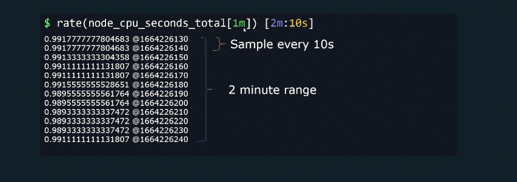
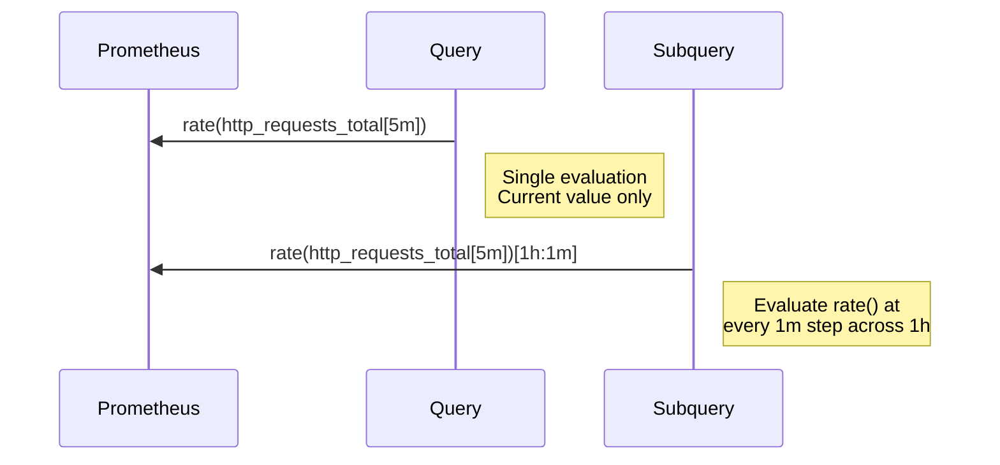
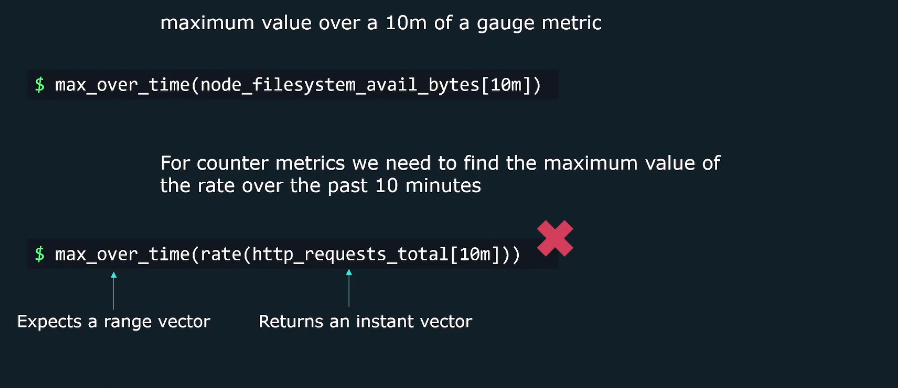
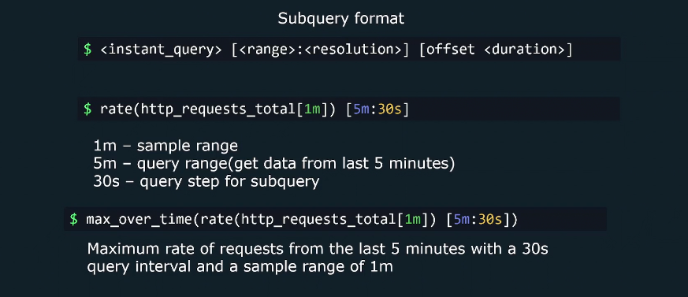

# 🔎 **PromQL Subqueries** — The Power of Querying a Query

## 💬 **The Simple Idea**

A **subquery** is when you take a normal PromQL expression  
👉 wrap it with `[range:step]`  
👉 and then query it _over time_, instead of _at a single point_.

> In short: “Let’s evaluate this query over time, not just once.”

Think of it like watching **how your graph itself changes** over time.

---

### 🔹 Without Subquery

You might run:

```promql
rate(http_requests_total[5m])
```

This gives the **current per-second rate**, averaged over the last 5 minutes.

That’s fine — but it’s _just one moment_.  
What if you want to see how that rate has been changing for the past **2 hours**?

---

### 🔹 With Subquery

Boom 💥 — that’s where you use a subquery:

```promql
rate(http_requests_total[5m])[2h:1m]
```

Now you’re saying:

> “Calculate the 5-minute rate for every 1-minute step across the last 2 hours.”

So Prometheus will:

1. Go back 2 hours in time
2. At every 1-minute step, calculate `rate(http_requests_total[5m])`
3. Return all those results as a **range vector** you can then analyze further!

---

<div align="center" style="background-color: #11171F; border-radius: 10px; border: 2px solid">
    
</div>

---

## ⚙️ **The Syntax**

```promql
<expression>[<range>:<resolution>]
```

- `<expression>` → any PromQL query
- `<range>` → how far back you want to look
- `<resolution>` → how often to evaluate it (the “step”)

**Example:**

```promql
rate(node_cpu_seconds_total[5m])[1h:30s]
```

➡️ “Over the last 1 hour, every 30 seconds, compute the 5-minute rate.”

---

## 🎯 **Why We Use Subqueries**

<div align="center" style="background-color: #141a19ff;color: #a8a5a5ff; border-radius: 10px; border: 2px solid">

| Use Case                | Description                                                         |
| ----------------------- | ------------------------------------------------------------------- |
| **Trend analysis**      | See how a metric evolves, not just its current rate                 |
| **Rolling averages**    | Smooth out noisy metrics with functions like `avg_over_time()`      |
| **Nested aggregations** | First compute per-second rate, then average that over a longer time |
| **Alert stability**     | Reduce false alarms by applying range functions to subqueries       |

</div>

---

## 🔍 **Real Example — Nested Rate Analysis**

You want to know:

> “What’s the average _request rate_ over the last 1 hour, based on 5-minute windows?”

```promql
avg_over_time(rate(http_requests_total[5m])[1h:1m])
```

Let’s decode it:

| Part                            | Meaning                                                     |
| ------------------------------- | ----------------------------------------------------------- |
| `rate(http_requests_total[5m])` | Get the per-second rate (smooth trend)                      |
| `[1h:1m]`                       | Recalculate that rate every 1 minute for the past hour      |
| `avg_over_time(...)`            | Take all those recalculated rates and compute their average |

So instead of a single static rate, you get a **1-hour rolling average of rates** — ultra-smooth and perfect for dashboards.

---

## 🧩 **Visual Explanation**

<div align="center" style="background-color: #141a19ff;color: #a8a5a5ff; border-radius: 10px; border: 2px solid">



</div>

---

## 🧪 **Let’s Compare: Normal Query vs Subquery**

### 🔸 Normal query:

```promql
rate(http_requests_total[5m])
```

➡️ One line per instance → current rate.

### 🔸 Subquery:

```promql
rate(http_requests_total[5m])[2h:1m]
```

➡️ Each instance now has **a full time series** of its rate over 2 hours.

---

## 🧠 **You Can Nest Subqueries Too**

Yup. You can get wild like this:

```promql
max_over_time(
  avg(rate(http_requests_total[1m])[30m:1m])[2h:5m]
)
```

Here’s what happens:

1. `rate()` → short-term request rate
2. `avg(...)[30m:1m]` → average that rate over rolling 30-minute windows
3. `max_over_time(...)[2h:5m]` → find the maximum of those rolling averages in the past 2 hours

Result: “The highest 30-min average request rate in the last 2 hours.”

---

## 🔴 **Use Case**

### ❌ Without Subquery

<div align="center" style="background-color: #11171F; border-radius: 10px; border: 2px solid">
    
</div>

---

### ✅ With Subquery

<div align="center" style="background-color: #11171F; border-radius: 10px; border: 2px solid">
    
</div>

---

## 🧰 **Common Range Functions Used with Subqueries**

<div align="center" style="background-color: #141a19ff;color: #a8a5a5ff; border-radius: 10px; border: 2px solid">

| Function             | Purpose                     |
| -------------------- | --------------------------- |
| `avg_over_time()`    | Smooth out trends           |
| `max_over_time()`    | Find peaks                  |
| `min_over_time()`    | Find dips                   |
| `stddev_over_time()` | Measure volatility          |
| `count_over_time()`  | Count samples in the window |

</div>

---

These are usually combined **after** a subquery — to summarize trends over time.

---

## ⚠️ **Important Notes (Gotchas)**

### 1. ⏱ Don’t confuse `[range]` vs `[range:step]`

- `[range]` → Range selector (used inside functions like `rate()`)
- `[range:step]` → Subquery (evaluate the expression multiple times)

### 2. 🧮 Be mindful of step size

- A too-small `:step` (like `1s`) → too many samples → heavy Prometheus load.
  Start with 1m or 5m steps.

### 3. 💾 Subqueries consume more memory

- They calculate results for each step in your range → more data in memory.

### 4. 🧱 Works on **instant vectors**, not range vectors directly

- Subqueries apply to queries that normally return instant vectors (like `rate()`), not range vectors.

---

## ✅ **Real Dashboard Use Case**

Imagine your service’s request rate fluctuates wildly.  
You want to smooth it over 30 minutes and alert if it stays high.

```promql
avg_over_time(rate(http_requests_total[1m])[30m:1m]) > 10
```

Interpretation:

> “If the _average_ of the per-second request rate (calculated every minute)  
> over the last 30 minutes is greater than 10 → fire alert.”

✅ Smooth  
✅ Accurate  
✅ No false spikes

---

## 🧾 **TL;DR Summary**

<div align="center" style="background-color: #141a19ff;color: #a8a5a5ff; border-radius: 10px; border: 2px solid">

| Concept         | Meaning                                               |
| --------------- | ----------------------------------------------------- |
| **Subquery**    | Runs a query repeatedly over time                     |
| **Syntax**      | `<query>[range:step]`                                 |
| **Use it when** | You need to analyze how a metric evolves over time    |
| **Good for**    | Trends, smoothing, stable alerts                      |
| **Avoid if**    | You just need a single current value                  |
| **Example**     | `avg_over_time(rate(http_requests_total[5m])[1h:1m])` |

</div>

---

## 🧠 **Human Analogy**

> A normal query is a _snapshot_ — one photo.
>
> A subquery is a _timelapse video_ — many photos stitched together
> so you can see how things changed over time.
