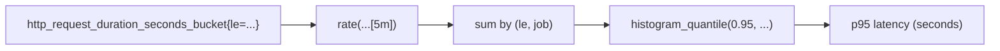

# 🎯 `histogram_quantile()` — Turning Buckets into Percentiles

## 💬 What It Does (in one line)

> The `histogram_quantile()` function estimates a **quantile (percentile)** (like p90, p95, p99)
> from **Prometheus histogram buckets** — typically produced by your app or exporters (e.g., latency histograms).

So instead of just “average latency”, you can say:

> “95% of requests complete in under _X seconds_.”

That’s a **p95 (95th percentile)** — and `histogram_quantile()` gives it to you.

---

## 🧠 Why We Need It

A simple `avg()` hides outliers:

- 99 fast requests (10ms)
- 1 slow request (10 seconds)
  → Average ≈ 0.1 second — looks fine, but your users are screaming. 😅

**Percentiles** reveal the _worst-case user experience_:

- p50 (median) → typical user
- p95 → 95% of users faster than this
- p99 → 99% faster than this (top 1% slowest)

That’s what `histogram_quantile()` computes.

---

## 📦 Where Data Comes From — The Histogram Metric

Applications instrumented with Prometheus client libraries expose **histogram metrics**.
Example metric name:

```ini
http_request_duration_seconds_bucket
```

They come with **buckets**, like this:

| Label                     | Meaning                            |
| ------------------------- | ---------------------------------- |
| `le` (less than or equal) | Upper bound of each latency bucket |
| `_count`                  | Total number of observations       |
| `_sum`                    | Sum of all observed values         |

### Example data

| Metric                                          | Value | description         |
| ----------------------------------------------- | ----- | ------------------- |
| http_request_duration_seconds_bucket{le="0.1"}  | 100   | 100 requests ≤ 0.1s |
| http_request_duration_seconds_bucket{le="0.5"}  | 350   | 350 requests ≤ 0.5s |
| http_request_duration_seconds_bucket{le="1"}    | 480   | 480 requests ≤ 1s   |
| http_request_duration_seconds_bucket{le="2"}    | 490   | 490 requests ≤ 2s   |
| http_request_duration_seconds_bucket{le="+Inf"} | 500   | 500 requests total  |

---

## 📈 How `histogram_quantile()` Works (step-by-step)

### Step 1: Find the right bucket range

We want, say, the **95th percentile** (p95).
Total = 500 → 95% = 475th observation.

Between which buckets does it lie?

- 480 requests ≤ 1s
- 350 requests ≤ 0.5s
  → 475th observation lies **between 0.5s and 1s**.

---

### Step 2: Interpolate between the buckets

Find where between the buckets the 95th percentile falls.

Use linear interpolation:
[
quantile_value = lower_bound + (upper_bound - lower_bound) * (target_count - lower_count) / (upper_count - lower_count)
]

Plug in:

- lower = 0.5s
- upper = 1s
- target = 475
- lower_count = 350
- upper_count = 480

---

$$
\begin{align*}
& 0.5 + (1 - 0.5) \cdot \frac{475 - 350}{480 - 350} &= 0.5 + 0.5 \cdot \frac{125}{130} &\approx 0.98\ \text{seconds}
\end{align*}
$$

---

✅ So **p95 ≈ 0.98 seconds.**

That’s what Prometheus does internally when you call `histogram_quantile(0.95, ...)`.

---

## 🧩 The PromQL Formula

```promql
histogram_quantile(φ, sum(rate(metric_name_bucket[range])) by (le))
```

### Parameters

| Parameter            | Meaning                                         |
| -------------------- | ----------------------------------------------- |
| `φ`                  | Quantile value (e.g., 0.95 for p95)             |
| `metric_name_bucket` | Your histogram bucket metric                    |
| `[range]`            | Time window for rate calculation (e.g., `[5m]`) |

---

### Example (real-world)

Compute 95th percentile request duration per service:

```promql
histogram_quantile(
  0.95,
  sum by (le, job) (rate(http_request_duration_seconds_bucket[5m]))
)
```

🧩 Explanation:

1. `rate(...[5m])` → convert counters to per-second rates
2. `sum by (le, job)` → combine buckets per job
3. `histogram_quantile(0.95, ...)` → find latency where 95% of traffic is faster

Result → one value per job: “95% of requests took less than X seconds.”

---

## 🧮 Typical Percentiles You’ll See

| Quantile (φ) | Meaning           |
| ------------ | ----------------- |
| `0.5`        | Median (p50)      |
| `0.9`        | 90th percentile   |
| `0.95`       | 95th percentile   |
| `0.99`       | 99th percentile   |
| `0.999`      | 99.9th percentile |

---

## 🧰 Common Variations

### 🔸 Per-route latency p95

```promql
histogram_quantile(
  0.95,
  sum by (le, route) (rate(http_request_duration_seconds_bucket[5m]))
)
```

### 🔸 Global service-wide p99 latency

```promql
histogram_quantile(
  0.99,
  sum by (le) (rate(http_request_duration_seconds_bucket[5m]))
)
```

### 🔸 Compare p95 latency across jobs

```promql
histogram_quantile(
  0.95,
  sum by (le, job) (rate(http_request_duration_seconds_bucket[10m]))
)
```

---

## ⚠️ Key Rules to Remember

### ✅ Always use `rate()` or `increase()`

Histogram buckets are **counters**, so use `rate()` or `increase()` to get per-second or per-window values.
Otherwise, resets break your math.

Bad ❌

```promql
histogram_quantile(0.95, sum by (le) (http_request_duration_seconds_bucket))
```

Good ✅

```promql
histogram_quantile(0.95, sum by (le) (rate(http_request_duration_seconds_bucket[5m])))
```

---

### ✅ Always `sum` by `le`

Buckets must be aggregated by their upper bound `le` — otherwise the interpolation fails.

---

### ⚙️ Optional: Add `job`, `service`, or `instance` to `by()`

To get per-service or per-instance latency distributions:

```promql
sum by (le, service) (...)
sum by (le, instance) (...)
```

---

### ⚠️ Don’t confuse `_sum` and `_count`

- `_sum` = total latency (seconds) across requests
- `_count` = number of requests

> Use those to get **average latency**:

```promql
rate(http_request_duration_seconds_sum[5m])
/
rate(http_request_duration_seconds_count[5m])
```

…but for **p95/p99**, you must use `_bucket` + `histogram_quantile()`.

---

## 📊 Visual Example (Grafana)

**Query:**

```promql
histogram_quantile(0.95,
  sum by (le) (rate(http_request_duration_seconds_bucket[5m]))
)
```

**Graph:**
Shows a curve over time — “95% of requests complete under X seconds.”

You can easily change `0.95` → `0.99` → `0.5` to visualize different percentiles.

---

## 🧠 Mental Model Summary

| Concept                | Think of it as...                                  |
| ---------------------- | -------------------------------------------------- |
| Buckets (`_bucket`)    | “Cumulative frequency table”                       |
| `le` label             | “Upper limit of each bucket”                       |
| `rate()`               | “Requests per second per bucket”                   |
| `sum by (le)`          | “Merge all instances’ buckets together”            |
| `histogram_quantile()` | “Calculate percentile cutoff across those buckets” |

---

## 💬 Human Analogy

> Imagine 500 people waiting at an airport security line.
> Each bucket is a time threshold (≤5 min, ≤10 min, ≤15 min…).
>
> You want to know:
> “How long did 95% of people wait or less?”
>
> You look at how many people cleared each line (bucket) and interpolate the 95th percentile.
> That’s exactly what `histogram_quantile()` does.

---

## ✅ TL;DR Summary

| Term             | Meaning                                                          |
| ---------------- | ---------------------------------------------------------------- |
| **Function**     | `histogram_quantile(φ, sum by (le)(rate(metric_bucket[range])))` |
| **Purpose**      | Estimate p90/p95/p99 from histogram buckets                      |
| **Used With**    | Histogram metrics ending in `_bucket`                            |
| **Why `rate()`** | Buckets are counters; rate prevents resets                       |
| **Common Uses**  | Latency SLAs, response time SLOs, request durations              |
| **Outputs**      | Single value per label set = “X seconds for φ percentile”        |

---

### 🎯 Example SLO Alert

> Alert if 95th percentile latency > 2 seconds for 10 minutes:

```promql
histogram_quantile(
  0.95,
  sum by (le, job) (rate(http_request_duration_seconds_bucket[5m]))
) > 2
```

Set duration in alert rule YAML:

```yaml
for: 10m
```

---

## 🧩 Final Visualization


