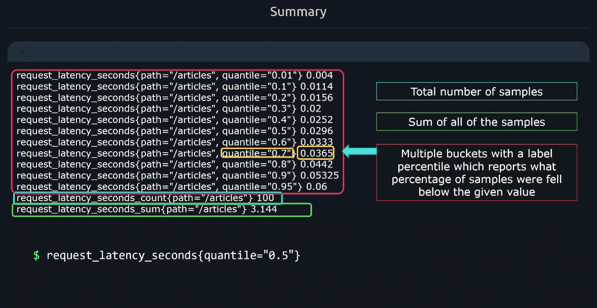
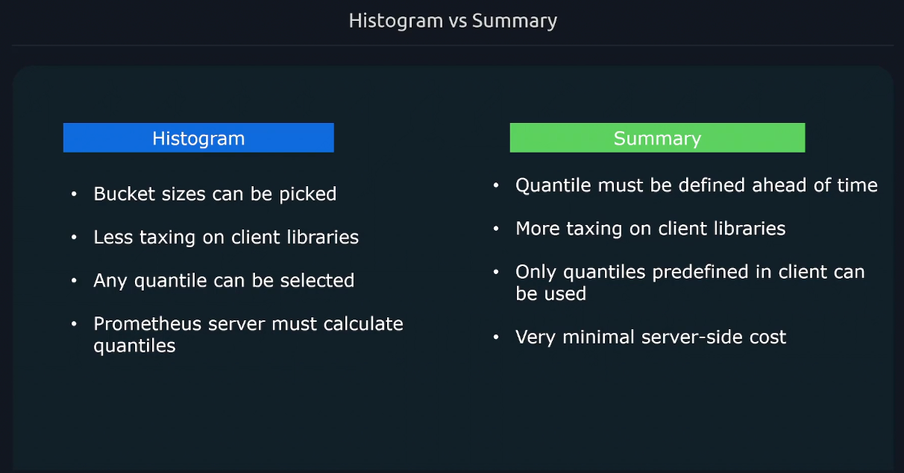
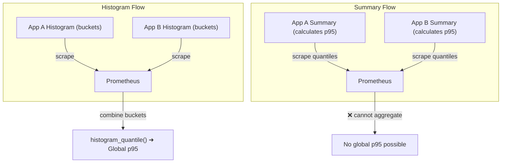

# 🧩 Understanding `summary` in Prometheus

## 💬 What Is a Summary?

A **Summary** in Prometheus is a metric type that measures:

> 💡 “How long things take” (latency) or “how big things are” (sizes),
> and **calculates quantiles (like p90, p95, p99)** **directly inside the client application** before Prometheus even scrapes it.

Think of it like this:

> A **Histogram** stores _raw bucket data_ for Prometheus to calculate percentiles later.
> A **Summary** calculates those percentiles itself before exporting them.

---

<div align="center" style="background-color: #11171F; border-radius: 10px; border: 2px solid">
    
</div>

---

## ⁉️ How a Summary Metric Looks

Let’s say your code measures request duration like this:

```go
requestDuration := prometheus.NewSummary(prometheus.SummaryOpts{
    Name: "http_request_duration_seconds",
    Help: "Request duration in seconds.",
})
```

Prometheus will expose **three types of time series** for this metric:

| Metric Name                                      | Meaning                       |
| ------------------------------------------------ | ----------------------------- |
| `http_request_duration_seconds_sum`              | Total sum of all observations |
| `http_request_duration_seconds_count`            | Number of observations        |
| `http_request_duration_seconds{quantile="0.5"}`  | 50th percentile (median)      |
| `http_request_duration_seconds{quantile="0.9"}`  | 90th percentile               |
| `http_request_duration_seconds{quantile="0.99"}` | 99th percentile               |

---

## 📝 Example Output

```ini
http_request_duration_seconds{quantile="0.5"}  0.245
http_request_duration_seconds{quantile="0.9"}  0.512
http_request_duration_seconds{quantile="0.99"} 1.221
http_request_duration_seconds_sum  1234.56
http_request_duration_seconds_count  5021
```

Interpretation:

- 50% of requests finished in ≤ 0.245s
- 90% finished in ≤ 0.512s
- 99% finished in ≤ 1.221s

Prometheus just scrapes those numbers — it doesn’t calculate them.

---

## ⚙️ How Summaries Work Internally

Summaries use an **algorithm** (like _CKMS Quantile Estimation_) inside the app to approximate quantiles.

- They maintain a sliding window of observations (default 10 min).
- When scraped, they expose the quantiles you configured (e.g., 0.5, 0.9, 0.99).
- The calculation happens _before_ Prometheus gets the data.

> 🧮 You can’t change the quantiles later — they’re baked into the metric at export time.

---

## 🧠 Why Summaries Exist

Summaries are useful when:

- You only care about latency percentiles _for that instance_.
- You don’t need to aggregate across multiple instances or jobs.
- You want **precise per-process quantiles** (not bucket-based approximations).

---

## ⚔️ Histogram vs Summary — The Ultimate Comparison

<div align="center" style="background-color: #11171F; border-radius: 10px; border: 2px solid">
    
</div>

---

| Feature                           | **Histogram**                                                                                | **Summary**                                                              |
| --------------------------------- | -------------------------------------------------------------------------------------------- | ------------------------------------------------------------------------ |
| **Calculation location**          | Prometheus calculates percentiles (using `histogram_quantile()`)                             | The **client app** calculates percentiles                                |
| **Quantile flexibility**          | You can compute _any_ quantile later (`0.5`, `0.95`, `0.99`, etc.)                           | Quantiles are fixed when instrumented (e.g., `0.9`, `0.99`)              |
| **Aggregatable across instances** | ✅ Yes (because buckets can be summed)                                                       | ❌ No (quantiles can’t be averaged or combined)                          |
| **Metric names**                  | `*_bucket`, `*_sum`, `*_count`                                                               | `*_sum`, `*_count`, `{quantile="..."}`                                   |
| **Function used**                 | `histogram_quantile()`                                                                       | Directly scrape `quantile="..."` metrics                                 |
| **Accuracy**                      | Approximate (depends on bucket setup)                                                        | More precise (depends on algorithm)                                      |
| **Configuration complexity**      | You choose bucket boundaries                                                                 | You define quantile values & error                                       |
| **When to use**                   | When you need **global**, **aggregated**, or **flexible** quantiles                          | When you need **local**, **precise**, or **instance-specific** quantiles |
| **Example**                       | `histogram_quantile(0.95, sum by (le, job)(rate(http_request_duration_seconds_bucket[5m])))` | `http_request_duration_seconds{quantile="0.95"}`                         |

---

## 🧠 Visual Comparison



---

## 💬 Example Use Cases

| Scenario                                                 | Best Choice  | Why                                          |
| -------------------------------------------------------- | ------------ | -------------------------------------------- |
| You want **global p95 latency across all pods**          | 🟩 Histogram | Prometheus can merge buckets                 |
| You want **per-instance accurate latency p95**           | 🟦 Summary   | Direct, no aggregation                       |
| You want **flexible percentiles (p50, p90, p99)** later  | 🟩 Histogram | You can choose φ on demand                   |
| You want **simple metrics in a single binary**           | 🟦 Summary   | No external function required                |
| You use **Kubernetes + Prometheus + Grafana dashboards** | 🟩 Histogram | Easier to aggregate across pods and services |

---

## 💡 Quick Example of Each

### 🟦 Summary

Client-side quantile estimation:

```promql
http_request_duration_seconds{quantile="0.95"}
```

### 🟩 Histogram

Server-side quantile calculation:

```promql
histogram_quantile(
  0.95,
  sum by (le, job) (rate(http_request_duration_seconds_bucket[5m]))
)
```

Both give a number like “p95 latency = 0.85s”
—but only the histogram version can be aggregated globally.

---

## ⚠️ Common Mistakes

### ❌ Trying to aggregate summaries

```promql
avg(http_request_duration_seconds{quantile="0.95"})  # meaningless
```

Each app’s quantile algorithm uses different data — you can’t average p95s.

### ❌ Mixing histogram and summary data

They represent different collection methods; treat them separately.

---

## 🧩 Summary (pun intended 😄)

| Concept                                | Histogram                              | Summary       |
| -------------------------------------- | -------------------------------------- | ------------- |
| **Where quantiles are calculated**     | In Prometheus (`histogram_quantile()`) | In client app |
| **Can aggregate?**                     | ✅ Yes                                 | ❌ No         |
| **Can choose φ later?**                | ✅ Yes                                 | ❌ No         |
| **Used for global dashboards**         | ✅ Ideal                               | 🚫 Not ideal  |
| **Used for single instance precision** | ⚙️ Okay                                | ✅ Perfect    |
| **Has buckets?**                       | ✅ Yes (`_bucket`)                     | ❌ No         |
| **Needs configuration**                | Buckets                                | Quantiles     |

---

## 🧠 TL;DR (Remember This!)

| Metric Type   | Best For                                    | Aggregation | Quantile Flexibility      |
| ------------- | ------------------------------------------- | ----------- | ------------------------- |
| **Histogram** | Aggregated metrics, dashboards, global SLOs | ✅ Yes      | ✅ Any quantile (runtime) |
| **Summary**   | Precise local metrics, simple services      | ❌ No       | ❌ Fixed quantiles only   |

---

💬 **Human Analogy:**

- **Histogram**: You record how many people finished a race under 5, 10, 15 minutes, etc.
  Later, you can compute any percentile you want.
- **Summary**: The runner tells you, “My 95th percentile speed was X.”
  You can’t recompute it or merge it with others.
