# 🧾 Prometheus Recording Rules

> **“Pre-compute expensive queries so you can use them instantly later.”**

---

## 💬 What Is a Recording Rule?

A **Recording Rule** is like a **saved, automatically updated query result** in Prometheus.

It tells Prometheus:

> “Hey, regularly run this PromQL query, and save the result as a new time series metric.”

So instead of recalculating heavy queries in Grafana or alerts, you just use this precomputed metric.

---

<div align="center" style="background-color: #11171F; border-radius: 10px; border: 2px solid">
    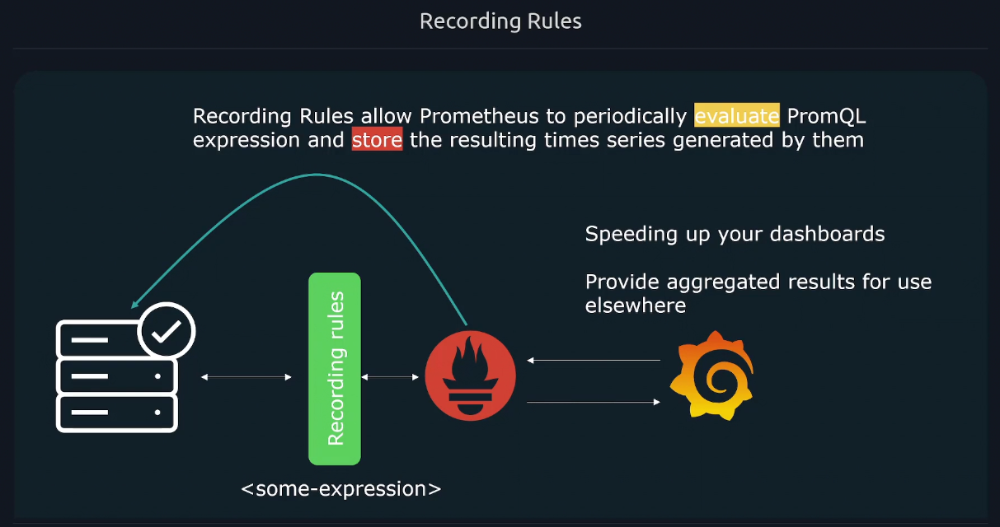
</div>

---

### 🧠 Example in one line:

Without a recording rule 👎:

```promql
rate(http_requests_total[5m])
```

With a recording rule 👍:

```promql
record: job:http_requests_per_second:rate5m
expr: rate(http_requests_total[5m])
```

Then you can simply use:

```promql
job:http_requests_per_second:rate5m
```

everywhere — Grafana, alerts, CLI — instantly! ⚡

---

## 🎯 Why We Need Recording Rules

<div align="center" style="background-color: #141a19ff;color: #a8a5a5ff; border-radius: 10px; border: 2px solid">

| Problem                               | Recording Rule Solution                      |
| ------------------------------------- | -------------------------------------------- |
| **Complex queries take forever**      | Precompute them in the background            |
| **Repeated queries everywhere**       | Define once, reuse many times                |
| **Alerts with expensive expressions** | Simplify with pre-recorded metrics           |
| **Grafana dashboards lagging**        | Use light-weight recorded metrics            |
| **Maintain consistent query logic**   | Keep one source of truth for derived metrics |

</div>

---

## ⚙️ How Recording Rules Work Internally

Prometheus’s rule engine runs on a fixed schedule (like every 30 seconds or 1 minute).  
At each interval:

1. It evaluates your `expr:` (the PromQL expression).
2. Stores the result as a new **time series metric** (the `record:` name).
3. Next scrape, you can query it like any other metric.

These results are stored in the same TSDB as your other metrics — so they behave just like native ones.

---

## 🏗️ Recording Rule File Structure

Recording rules live in YAML files (commonly named `rules.yml` or `recording_rules.yml`).

They are defined under `groups`, each group containing multiple rules.

### 🧩 Example

```yaml
groups:
  - name: example-recording-rules
    interval: 1m
    rules:
      - record: job:http_requests_per_second:rate5m
        expr: sum by (job) (rate(http_requests_total[5m]))
      - record: instance:cpu_usage:avg5m
        expr: avg by (instance) (rate(node_cpu_seconds_total{mode!="idle"}[5m]))
```

---

<div align="center" style="background-color: #11171F; border-radius: 10px; border: 2px solid">
    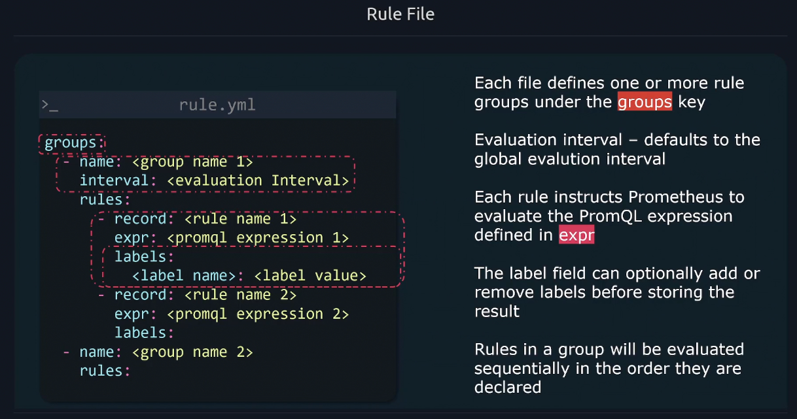
</div>

<div align="center" style="background-color: #11171F; border-radius: 10px; border: 2px solid">
    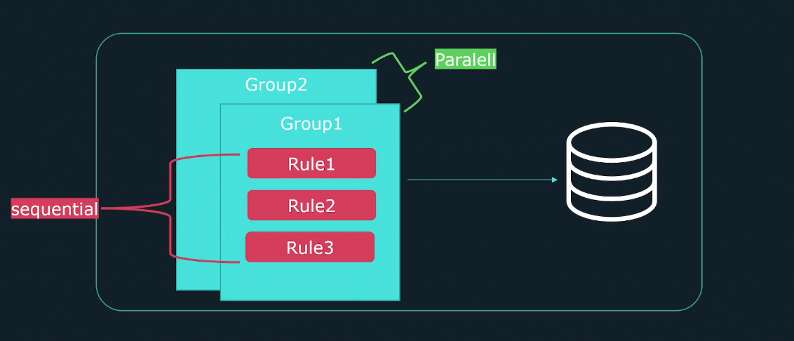
</div>

---

## 🧩 File Structure Breakdown

<div align="center" style="background-color: #141a19ff;color: #a8a5a5ff; border-radius: 10px; border: 2px solid">

| Field       | Description                                                                      |
| ----------- | -------------------------------------------------------------------------------- |
| `groups:`   | A list of groups of rules (logical separation)                                   |
| `name:`     | Group name (used in logs, not metric name)                                       |
| `interval:` | How often to evaluate rules in this group (default = global evaluation interval) |
| `rules:`    | The actual list of recording (or alerting) rules                                 |
| `record:`   | The name of the new metric to store the result under                             |
| `expr:`     | The PromQL query expression to evaluate                                          |

</div>

---

## 📦 How to Load the Rules

You tell Prometheus where your rules live in `prometheus.yml`:

```yaml
rule_files:
  - "rules/*.yml"
  - "recording_rules.yml"
```

After you restart (or reload) Prometheus:

```bash
curl -X POST http://localhost:9090/-/reload
```

Prometheus will start executing your rules on schedule.

---

<div align="center" style="background-color: #11171F; border-radius: 10px; border: 2px solid">
    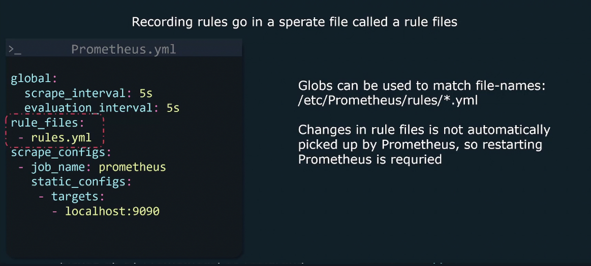
</div>

---

## 🧮 Real Examples of Recording Rules

### Example 1️⃣ — Average CPU Usage

```yaml
- record: instance:cpu_usage:rate5m
  expr: avg by (instance) (rate(node_cpu_seconds_total{mode!="idle"}[5m]))
```

Now you can just query:

```promql
instance:cpu_usage:rate5m
```

instead of writing the full rate query every time.

---

### Example 2️⃣ — Request Rate Per Job

```yaml
- record: job:http_requests_per_second:rate5m
  expr: sum by (job) (rate(http_requests_total[5m]))
```

**Use Case:** Grafana panel showing per-job request rates.

---

### Example 3️⃣ — Error Ratio

```yaml
- record: job:http_error_ratio:rate5m
  expr: sum by (job) (rate(http_requests_total{status=~"5.."}[5m]))
    /
    sum by (job) (rate(http_requests_total[5m]))
```

**Use Case:** Alert on error ratio exceeding SLO.

---

### Example 4️⃣ — Latency p95

```yaml
- record: job:http_request_duration_seconds:p95
  expr: histogram_quantile(
    0.95,
    sum by (le, job) (rate(http_request_duration_seconds_bucket[5m]))
    )
```

Then your Grafana dashboard can just do:

```promql
job:http_request_duration_seconds:p95
```

Super fast ⚡

---

## ✍🏻 Step by step example

<div align="center" style="background-color: #11171F; border-radius: 10px; border: 2px solid">
    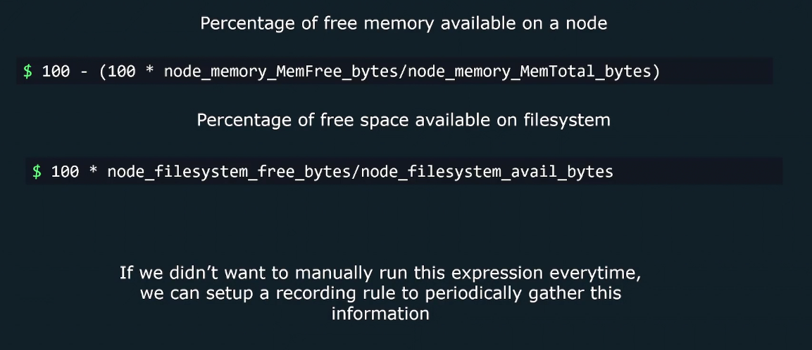
</div>

---

<div align="center" style="background-color: #11171F; border-radius: 10px; border: 2px solid">
    
</div>

---

<div align="center" style="background-color: #11171F; border-radius: 10px; border: 2px solid">
    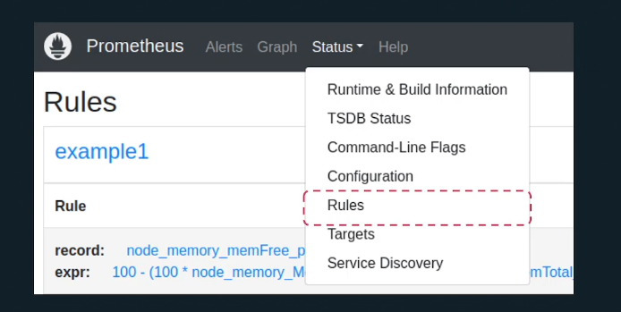
</div>

---

<div align="center" style="background-color: #11171F; border-radius: 10px; border: 2px solid">
    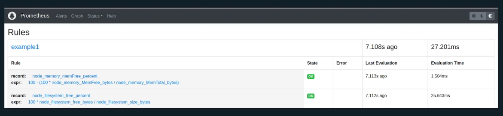
</div>

---

<div align="center" style="background-color: #11171F; border-radius: 10px; border: 2px solid">
    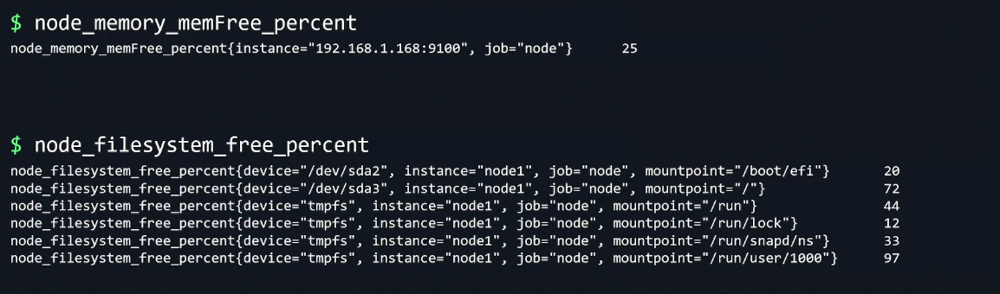
</div>

---

## 🚨 Rule can reference each other

<div align="center" style="background-color: #11171F; border-radius: 10px; border: 2px solid">
    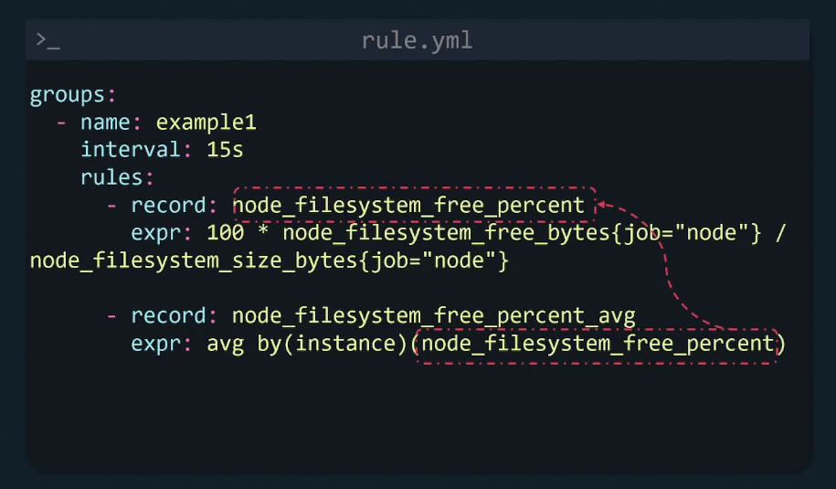
</div>

---

## 🧩 Rule Naming Convention (Very Important)

Follow a clear, consistent convention — Prometheus encourages **structured metric names**.

### 💡 Format:

```ini
<scope>:<metric>:<operation>
```

<div align="center" style="background-color: #141a19ff;color: #a8a5a5ff; border-radius: 10px; border: 2px solid">

| Part          | Meaning                    | Example                                    |
| ------------- | -------------------------- | ------------------------------------------ |
| **scope**     | What the metric applies to | `job`, `instance`, `namespace`             |
| **metric**    | The underlying metric name | `http_requests`, `cpu_usage`, `latency`    |
| **operation** | The function applied       | `rate5m`, `avg5m`, `p95`, `ratio`, `total` |

</div>

---

**Example Names:**

- `job:http_requests_per_second:rate5m`
- `instance:cpu_usage:avg5m`
- `namespace:http_errors:ratio`
- `job:http_request_duration_seconds:p95`

This makes it clear what the metric means **without** opening the rule file.

---

<div align="center" style="background-color: #11171F; border-radius: 10px; border: 2px solid">
    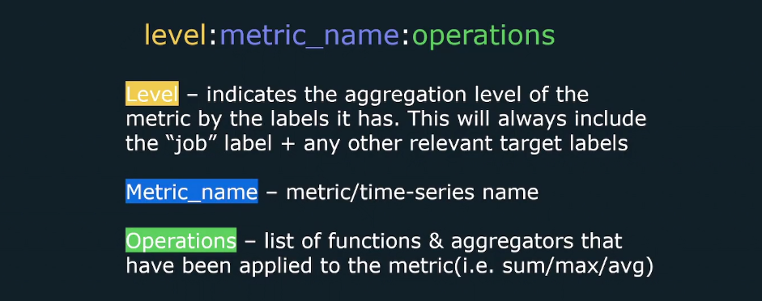
</div>

---

<div align="center" style="background-color: #11171F; border-radius: 10px; border: 2px solid">
    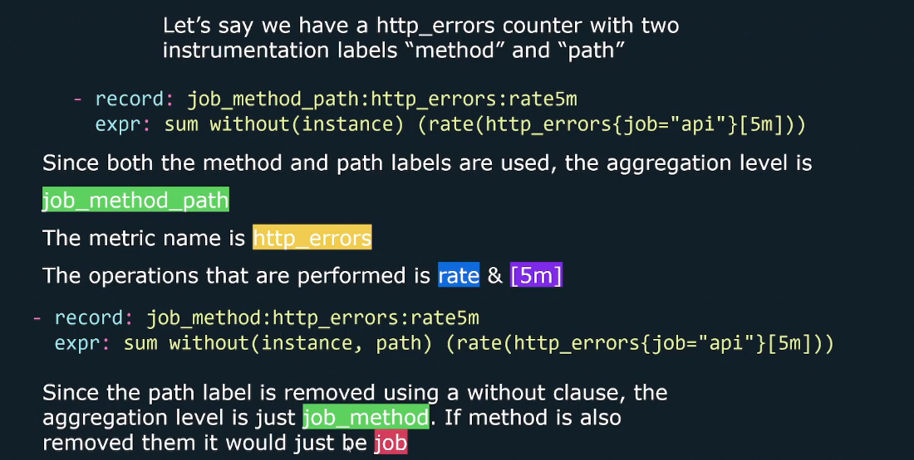
</div>

---

<div align="center" style="background-color: #11171F; border-radius: 10px; border: 2px solid">
    
</div>

---

## 📊 How to Verify Rules Are Loaded

Run this in Prometheus UI:

```ini
http://localhost:9090/rules
```

Or via CLI:

```bash
curl http://localhost:9090/api/v1/rules
```

You’ll see your recording rules listed under their group names.

---

## 🔍 How to Query Recorded Rules

Recorded metrics behave like any other metric:

```promql
job:http_requests_per_second:rate5m{job="api-server"}
```

You can apply functions, aggregations, etc., just like raw metrics.

---

## ⚙️ Combining Recording Rules and Alerts

Often, you’ll create **alerting rules** that _use_ your recording rules.

### Example:

```yaml
groups:
  - name: alerting-rules
    rules:
      - alert: HighErrorRate
        expr: job:http_error_ratio:rate5m > 0.05
        for: 10m
        labels:
          severity: warning
        annotations:
          summary: "High HTTP error rate on {{ $labels.job }}"
```

This makes your alerts clean and fast, since Prometheus doesn’t have to recompute complex queries during alert evaluation.

---

## ⚙️ Evaluation Order

1. Prometheus evaluates all **recording rules** first.
2. Then it evaluates **alerting rules** (which may depend on recorded metrics).
3. Then it stores all results and exposes them for querying.

So your alerts can safely depend on your recording rules.

---

## 🧠 Best Practices

<div align="center" style="background-color: #141a19ff;color: #a8a5a5ff; border-radius: 10px; border: 2px solid">

| Rule                                                | Why                                            |
| --------------------------------------------------- | ---------------------------------------------- |
| Use **recording rules** for metrics you query often | Saves CPU time and makes dashboards instant    |
| Group logically related rules together              | Easier maintenance and reload                  |
| Stick to naming conventions                         | Avoid confusion when scaling up                |
| Keep rule files small and modular                   | Easier to debug                                |
| Use `interval:` carefully                           | Too frequent = CPU load; too rare = stale data |
| Combine with **alerting rules** for clean alerts    | Keeps alert expressions short and reusable     |

</div>

---

## ⚙️ Reloading Rules Without Restart

Prometheus supports hot-reload:

```bash
curl -X POST http://localhost:9090/-/reload
```

✅ Loads any changed rule or config files  
✅ No downtime

---

## 💬 Human Analogy

> Think of recording rules like **meal prep** for Prometheus:
>
> 🍳 Instead of cooking a full meal (query) every time you’re hungry (dashboard refresh),  
> you pre-cook it once every few minutes and store it.  
> Then when someone asks, “What’s the p95 latency?”, you serve it instantly!

---

## 🧾 TL;DR Summary

<div align="center" style="background-color: #141a19ff;color: #a8a5a5ff; border-radius: 10px; border: 2px solid">

| Concept            | Description                                      |
| ------------------ | ------------------------------------------------ |
| **What**           | Precomputed PromQL query stored as a new metric  |
| **Why**            | Speed up queries, reduce load, keep alerts clean |
| **How**            | Define `record:` and `expr:` in a rule file      |
| **File**           | YAML under `rule_files:` in `prometheus.yml`     |
| **Query later**    | Just use the new metric name like a normal one   |
| **Naming pattern** | `<scope>:<metric>:<operation>`                   |
| **Reload**         | `curl -X POST http://localhost:9090/-/reload`    |

</div>

---

Would you like me next to explain **Alerting Rules** — since they live in the same file, follow the same syntax, but have different evaluation logic and structure (with `alert:`, `for:`, `labels:`, and `annotations:`)?
