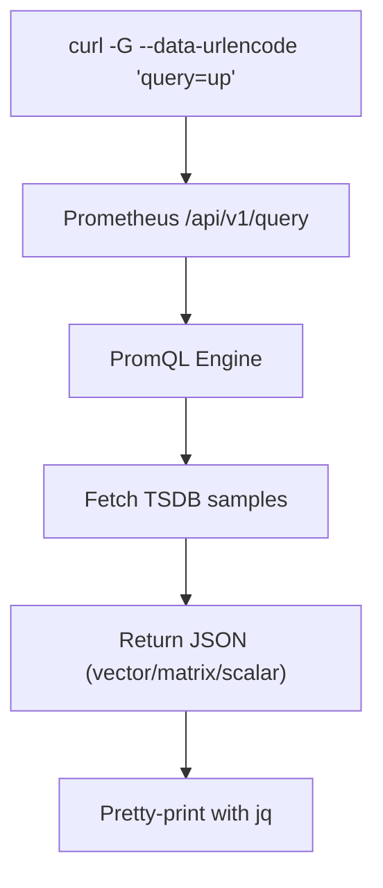

# 🌐 Prometheus HTTP API — “The Hidden Power Behind PromQL”

## 📖 What Is the Prometheus HTTP API?

The **Prometheus HTTP API** is a REST-like web interface that allows you to:

- Query metrics using **PromQL**
- Retrieve **time-series**, **labels**, and **metadata**
- Manage **rules**, **targets**, and **runtime information**
- Perform **administrative tasks** (snapshots, deletes, reload config)

It’s the **foundation** behind:

- 🎛️ Grafana dashboards
- 🧑🏻‍💻 `curl` / `wget` scripts
- 🐍 Python or Go clients
- 🤖 Monitoring automation

So even if you never open the Prometheus UI, you can query and control Prometheus programmatically.

---

## 🧱 The Base URL

Every Prometheus HTTP API endpoint lives under:

```ini
http://<prometheus-server>:9090/api/v1/
```

Example:

```bash
http://localhost:9090/api/v1/query
```

---

## ⚙️ API Endpoint Categories

<div align="center" style="background-color: #141a19ff;color: #a8a5a5ff; border-radius: 10px; border: 2px solid">

| Category             | Description                                               |
| -------------------- | --------------------------------------------------------- |
| 🧩 **Query APIs**    | Run PromQL queries for instant or range data              |
| 🔍 **Metadata APIs** | Inspect labels, targets, and metrics                      |
| 🧭 **Status APIs**   | View runtime information, rules, and configuration        |
| ⚠️ **Admin APIs**    | Perform administrative actions (delete, snapshot, reload) |

</div>

---

## 1️⃣ Query APIs — Fetching Data Like a Pro 📊

### 🕒 `/api/v1/query` — Instant Query

> Execute a PromQL query at a **single point in time** (default: now).

#### Example:

```bash
curl -sG "http://localhost:9090/api/v1/query" \
  --data-urlencode "query=rate(http_requests_total[5m])" | jq .
```

#### Output:

```json
{
  "status": "success",
  "data": {
    "resultType": "vector",
    "result": [
      {
        "metric": { "job": "api", "instance": "10.0.0.1:9100" },
        "value": [1730979000, "0.452"]
      }
    ]
  }
}
```

🧩 **Interpretation:**

- `"resultType": "vector"` → snapshot in time (instant vector)
- `"metric"` → labels
- `"value"` → `[timestamp, value]`

---

### ⏳ `/api/v1/query_range` — Range Query

> Run a PromQL query over a **time range**, returning multiple samples.

#### Example:

```bash
curl -sG "http://localhost:9090/api/v1/query_range" \
  --data-urlencode "query=rate(http_requests_total[5m])" \
  --data-urlencode "start=2025-11-07T08:00:00Z" \
  --data-urlencode "end=2025-11-07T10:00:00Z" \
  --data-urlencode "step=30s" | jq .
```

#### Output:

```json
{
  "status": "success",
  "data": {
    "resultType": "matrix",
    "result": [
      {
        "metric": { "job": "api", "instance": "10.0.0.1:9100" },
        "values": [
          [1730970000, "0.45"],
          [1730970030, "0.52"],
          [1730970060, "0.49"]
        ]
      }
    ]
  }
}
```

🧩 **Interpretation:**

- `"resultType": "matrix"` → multiple time samples (range vector)
- `"values"` → list of `[timestamp, value]` pairs

---

### 🧬 `/api/v1/series` — Discover Time Series

> Lists all time series matching specific label filters.

#### Example:

```bash
curl -sG "http://localhost:9090/api/v1/series" \
  --data-urlencode 'match[]=http_requests_total{job="api"}' \
  --data-urlencode "start=2025-11-07T00:00:00Z" \
  --data-urlencode "end=2025-11-07T12:00:00Z" | jq .
```

#### Output:

```json
{
  "data": [
    {
      "__name__": "http_requests_total",
      "job": "api",
      "method": "GET",
      "status": "200"
    }
  ]
}
```

---

### 🏷️ `/api/v1/labels` — List All Label Names

```bash
curl -sG "http://localhost:9090/api/v1/labels" | jq .
```

#### Output:

```json
{
  "data": ["__name__", "job", "instance", "method", "status"]
}
```

---

### 🧾 `/api/v1/label/<label_name>/values` — Label Values

```bash
curl -sG "http://localhost:9090/api/v1/label/job/values" | jq .
```

#### Output:

```json
{
  "data": ["api", "node", "prometheus"]
}
```

---

## 2️⃣ Metadata APIs — Inspecting the Ecosystem 🔍

### 🧩 `/api/v1/targets` — Scrape Targets

> Lists all active and dropped scrape targets.

```bash
curl -s "http://localhost:9090/api/v1/targets" | jq '.data.activeTargets[] | {instance, health, scrapeUrl}'
```

#### Output:

```json
{
  "instance": "localhost:9100",
  "health": "up",
  "scrapeUrl": "http://localhost:9100/metrics"
}
```

---

### 📜 `/api/v1/metadata` — Metric Metadata

> Get metric types, help text, and units.

```bash
curl -sG "http://localhost:9090/api/v1/metadata?metric=http_requests_total" | jq .
```

#### Output:

```json
{
  "data": {
    "http_requests_total": [{ "type": "counter", "help": "Total HTTP requests", "unit": "requests" }]
  }
}
```

---

### 📋 `/api/v1/rules` — Recording & Alerting Rules

```bash
curl -s "http://localhost:9090/api/v1/rules" | jq .
```

---

### 🚨 `/api/v1/alerts` — Firing Alerts

```bash
curl -s "http://localhost:9090/api/v1/alerts" | jq '.data.alerts[] | {labels, state}'
```

#### Output:

```json
{
  "labels": { "alertname": "HighErrorRate", "job": "api" },
  "state": "firing"
}
```

---

## 3️⃣ Status APIs — Understanding Prometheus Health 🩺

### ⚙️ `/api/v1/status/config` — Loaded Config

```bash
curl -s "http://localhost:9090/api/v1/status/config" | jq .
```

Shows current `prometheus.yml` configuration.

---

### 🧮 `/api/v1/status/flags` — Runtime Flags

```bash
curl -s "http://localhost:9090/api/v1/status/flags" | jq .
```

#### Example:

```json
{
  "config.file": "/etc/prometheus/prometheus.yml",
  "storage.tsdb.path": "/prometheus"
}
```

---

### ⏱️ `/api/v1/status/runtimeinfo` — System Info

Displays Go runtime details (uptime, memory, goroutines).

---

## 4️⃣ Admin APIs — The “Handle with Care” Zone ⚠️

### 🧨 `/api/v1/admin/tsdb/delete_series` — Delete Data

```bash
curl -s -X POST "http://localhost:9090/api/v1/admin/tsdb/delete_series?match[]=up&start=2025-11-01T00:00:00Z"
```

⚠️ Deletes matching series. Use with caution.

---

### 💾 `/api/v1/admin/tsdb/snapshot` — Take Snapshot

```bash
curl -s -X POST http://localhost:9090/api/v1/admin/tsdb/snapshot | jq .
```

#### Output:

```json
{
  "data": { "name": "20251107T100000Z-abcdef12" }
}
```

---

### 🧹 `/api/v1/admin/tsdb/clean_tombstones`

Cleans deleted series references from the TSDB.

---

### 🔁 `/-/reload` — Hot Reload Config

```bash
curl -s -X POST http://localhost:9090/-/reload
```

✅ Reloads configuration and rule files **without restarting** Prometheus.

---

## 💡 Using `curl` with Prometheus — Best Practices

### 🧱 Common Options

<div align="center" style="background-color: #141a19ff;color: #a8a5a5ff; border-radius: 10px; border: 2px solid">

| Option                 | Purpose                                          |
| ---------------------- | ------------------------------------------------ |
| **`-G`**               | Sends parameters as a GET request                |
| **`--data-urlencode`** | Encodes PromQL safely for URLs                   |
| **`--data`**           | Sends POST body (use for long/multiline queries) |
| **`-X POST`**          | Forces POST request (often implied)              |
| **`jq`**               | Pretty-prints JSON output                        |
| **`-s`**               | Silent mode (no progress bar)                    |

</div>

---

### ✅ When to Use Inline vs POST

<div align="center" style="background-color: #141a19ff;color: #a8a5a5ff; border-radius: 10px; border: 2px solid">

| Use Case                  | Inline (`-G + --data-urlencode`) | POST (`--data`)      |
| ------------------------- | -------------------------------- | -------------------- |
| Simple queries            | ✅ Yes                           | ❌ No need           |
| Complex/multiline queries | ❌ No                            | ✅ Yes               |
| Automation/scripts        | ✅ Works                         | ✅ Great for dynamic |
| Range queries             | ✅ Preferred                     | ✅ Also valid        |

</div>

---

## 📘 Examples

### Instant Query (inline)

```bash
curl -sG "http://localhost:9090/api/v1/query" \
  --data-urlencode "query=up" | jq .
```

### Range Query (inline)

```bash
curl -sG "http://localhost:9090/api/v1/query_range" \
  --data-urlencode "query=rate(http_requests_total[5m])" \
  --data-urlencode "start=2025-11-07T08:00:00Z" \
  --data-urlencode "end=2025-11-07T10:00:00Z" \
  --data-urlencode "step=30s" | jq .
```

### POST (for complex query)

```bash
curl -s -X POST "http://localhost:9090/api/v1/query" \
  -H "Content-Type: application/x-www-form-urlencoded" \
  --data 'query=sum by (job) (rate(http_requests_total{status=~"5.."}[5m]))' | jq .
```

---

## 🧩 JSON Result Types

<div align="center" style="background-color: #141a19ff;color: #a8a5a5ff; border-radius: 10px; border: 2px solid">

| Type     | Meaning                               |
| -------- | ------------------------------------- |
| `scalar` | Single numeric value                  |
| `vector` | One sample per series (instant query) |
| `matrix` | Time range samples (range query)      |
| `string` | Text (used in some metadata APIs)     |

</div>

---

## 🧠 Prometheus Query Flow (Visual)

<div align="center" style="background-color: #141a19ff;color: #a8a5a5ff; border-radius: 10px; border: 2px solid">



</div>

---

## 🧰 Bonus: Quick Automation Snippets

### 🐍 Python Example

```python
import requests

resp = requests.get("http://localhost:9090/api/v1/query",
                    params={"query": "up"})
for r in resp.json()["data"]["result"]:
    print(r["metric"]["instance"], r["value"])
```

### 🧾 Bash Example

```bash
value=$(curl -sG "http://localhost:9090/api/v1/query" \
  --data-urlencode "query=up" | jq -r '.data.result[0].value[1]')
echo "Prometheus UP value: $value"
```

---

## 🔒 Security Notes

⚠️ The API has **no authentication** by default!
Protect it in production with:

- 🔐 Reverse proxy (Nginx, Traefik) + Basic Auth
- 🔒 HTTPS termination
- 🔥 Firewall rules (block public access)

---

## 🧩 TL;DR Summary

<div align="center" style="background-color: #141a19ff;color: #a8a5a5ff; border-radius: 10px; border: 2px solid">

| Endpoint                      | Description                    |
| ----------------------------- | ------------------------------ |
| `/api/v1/query`               | Instant query                  |
| `/api/v1/query_range`         | Range query                    |
| `/api/v1/series`              | Discover series                |
| `/api/v1/labels`              | List all label names           |
| `/api/v1/label/<name>/values` | Label values                   |
| `/api/v1/targets`             | Scrape targets                 |
| `/api/v1/alerts`              | Current alerts                 |
| `/api/v1/rules`               | Recording/alerting rules       |
| `/api/v1/status/*`            | Runtime info                   |
| `/api/v1/admin/*`             | Admin tasks (snapshot, delete) |
| `/-/reload`                   | Reload config                  |

</div>

---

## 🎨 Human Analogy

> 🧍 Think of Prometheus’s HTTP API as a **waiter at a metrics restaurant**:
>
> - You say `query=up` 🍽️ → waiter brings current metric values.
> - You say `query_range` 🍱 → you get time-series data buffet.
> - You ask `/labels` 🍴 → waiter shows all menu categories.
> - You request `/-/reload` 🔁 → chef updates the recipes live!
