# X

## Selection

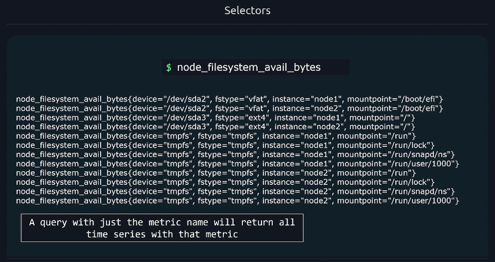

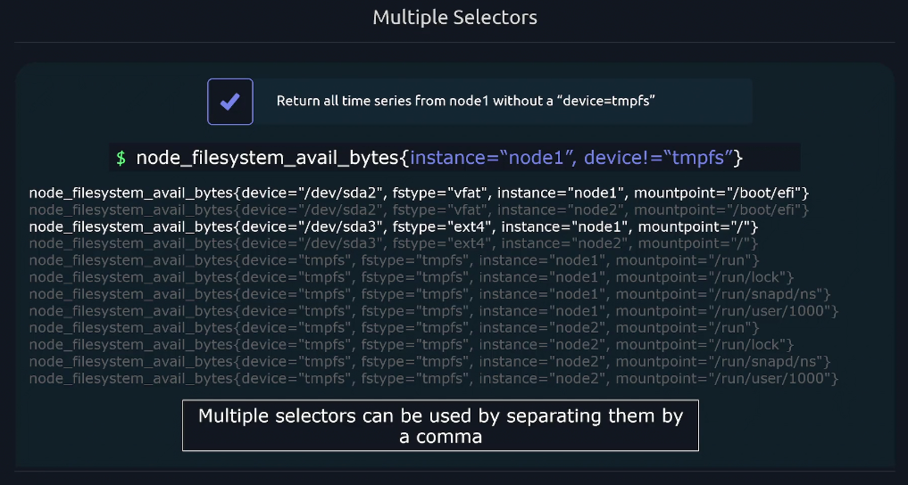

## Matchers

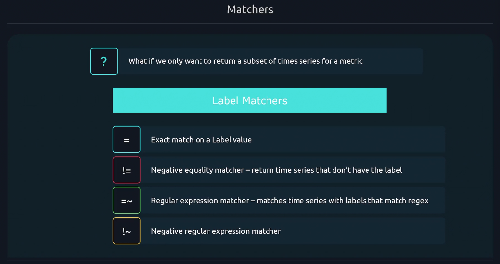

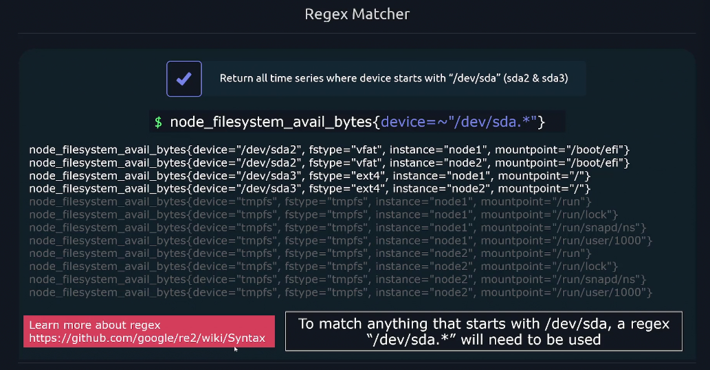


## modifiers

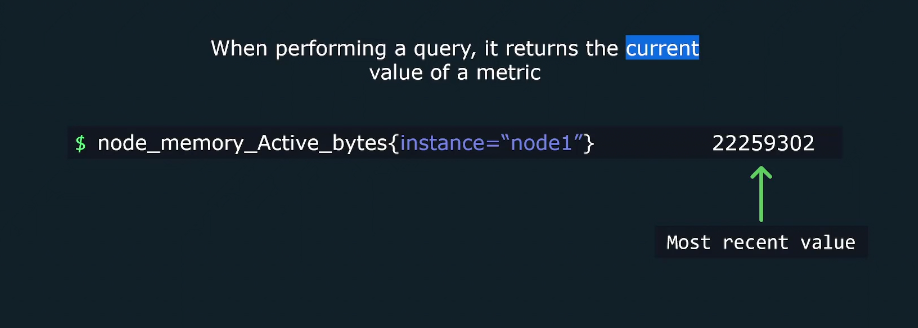

### offset modifier


---

### @ modifier


---

### offset with @ modifier

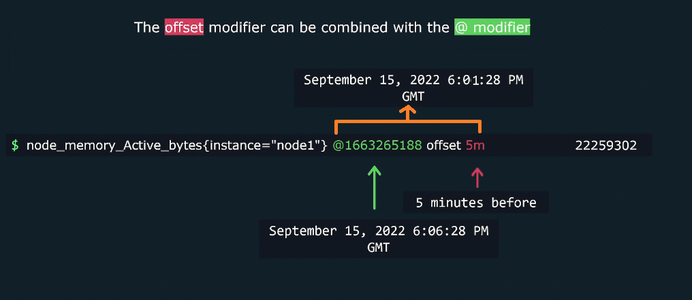

> order doesn't matter when combine @ modifier with offset modifer  
> you can combine range vector with offset modifier and @ modifier

---

## Operators

### Arithmetic Operators

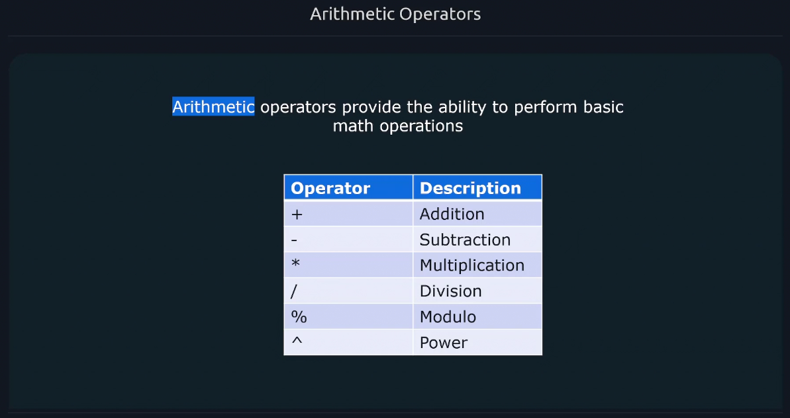

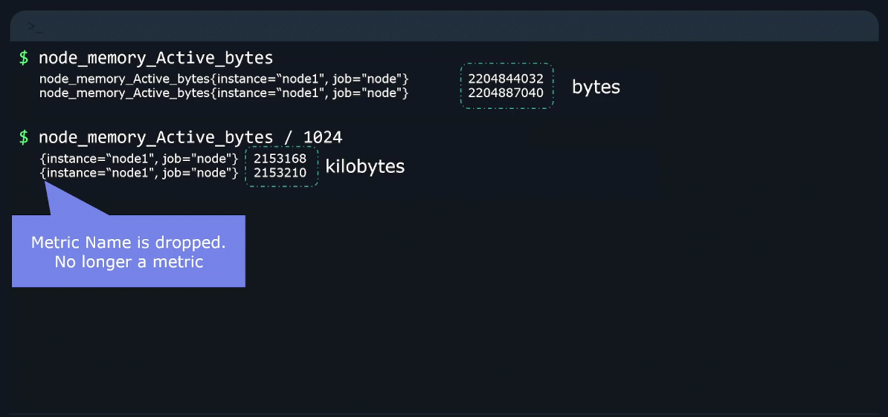

### Comparison Operators


### Binary Operators Precedence

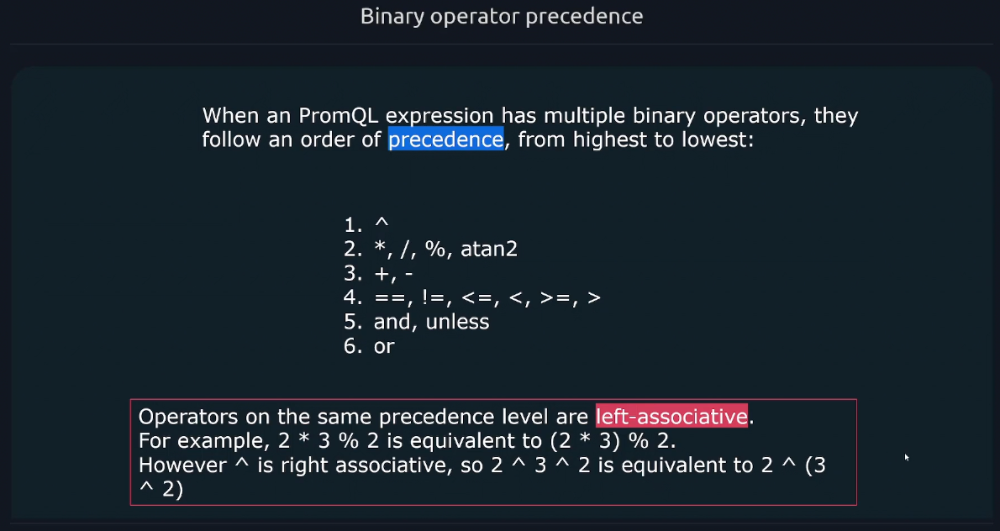

### Logical Operators

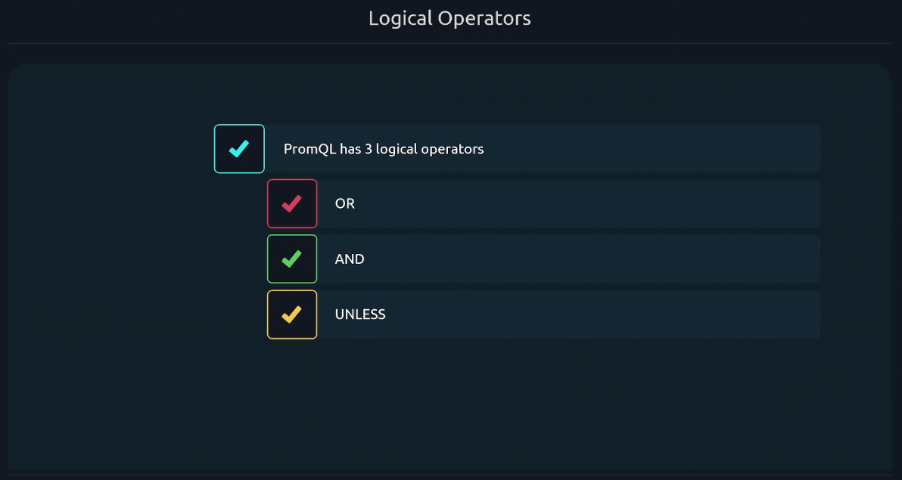

- and
  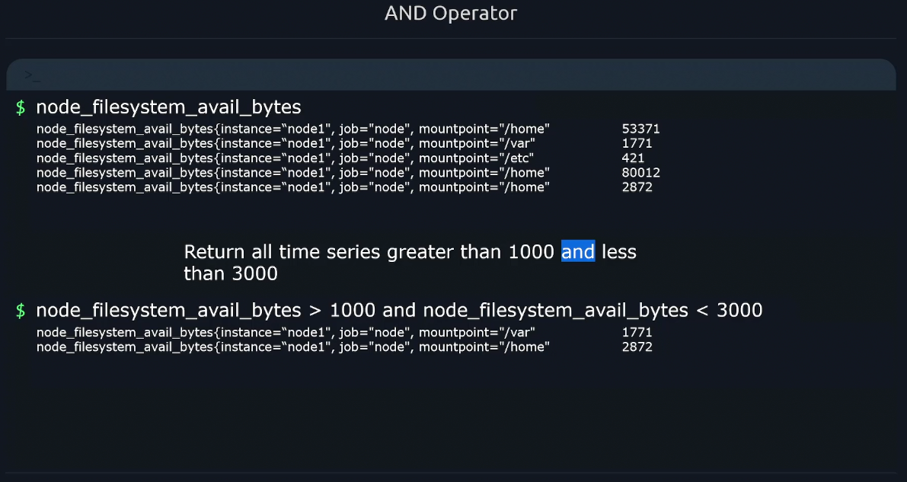

- or
  

- unless
  

---

## vector matching

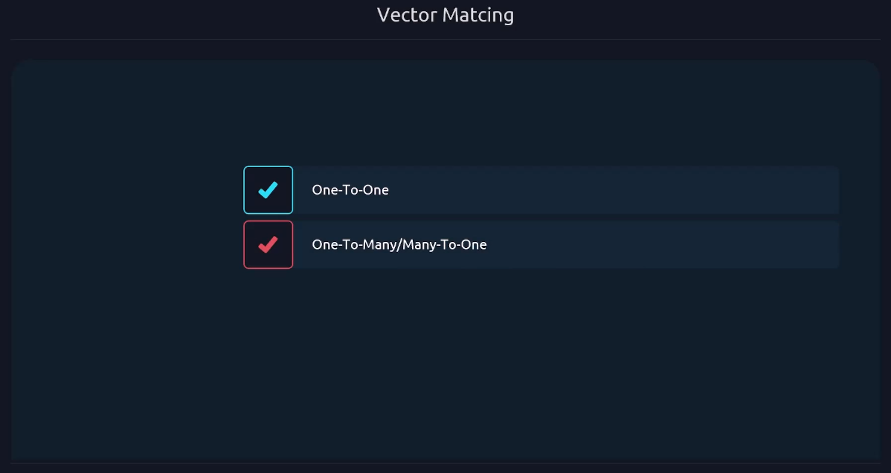


### ignore matching


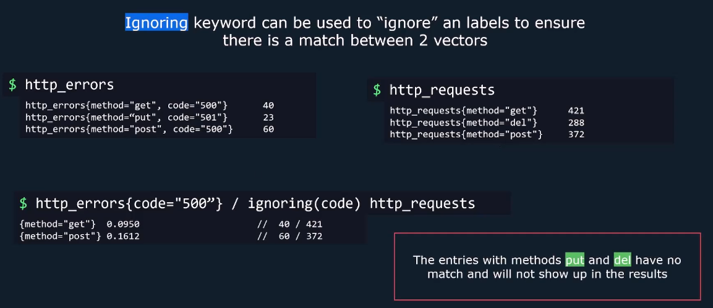

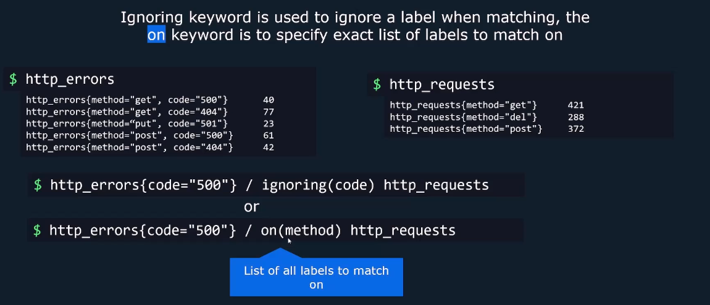


---

### one to one matching

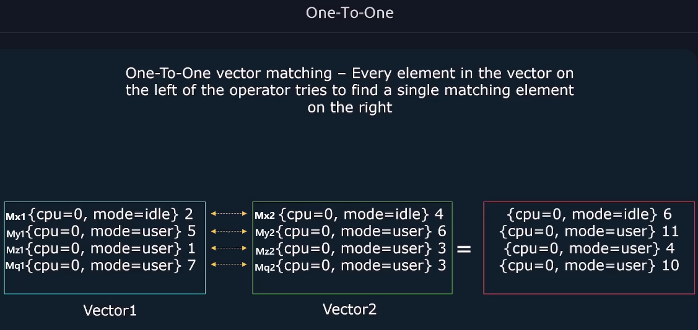

### Many to one matching

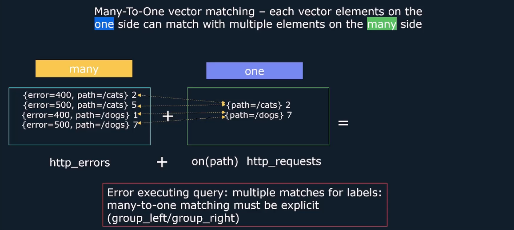

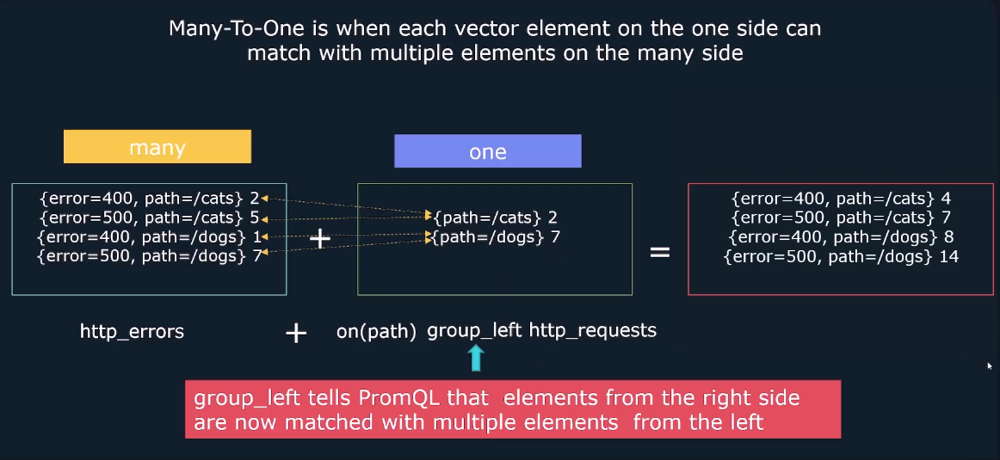


## Aggregators


### Default Behavior

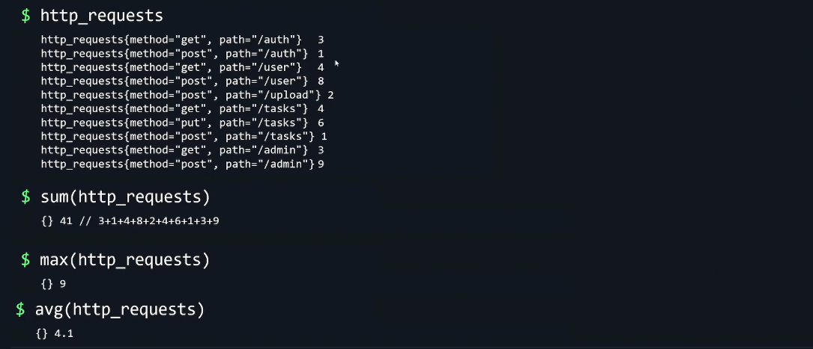

### `by` clause


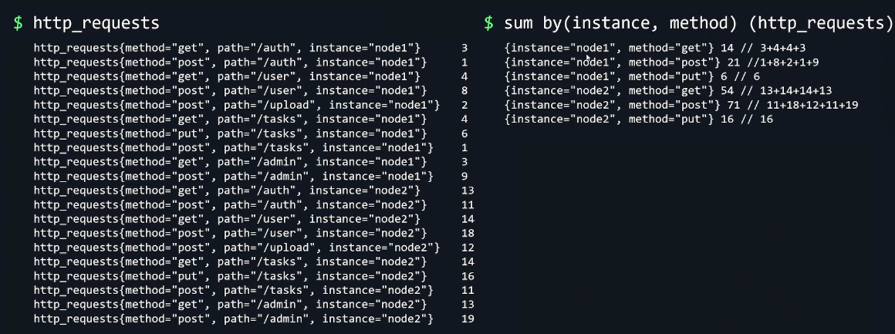

### `Without` clause

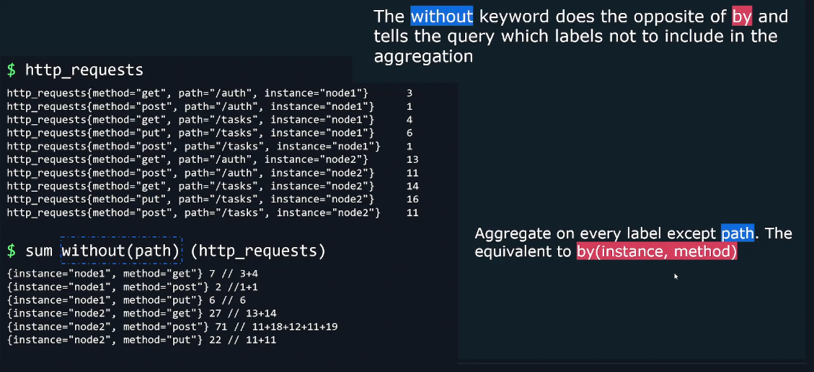

### Sum vs Count


🧠 **What the Question Is Asking**

You’re tasked with:

- Using the Prometheus metric `node_cpu_seconds_total`
- Counting how many **distinct CPUs** exist per instance
- Ensuring each CPU is counted **only once**
- Filtering by a single mode (`mode="idle"`) to avoid duplicates
- Saving the query to `/root/query8.txt`

---

### ✅ **Correct PromQL Query**

```promql
count(node_cpu_seconds_total{mode="idle"}) by (instance)
```

**✔ Why This Works:**

- `node_cpu_seconds_total{mode="idle"}`: Selects only idle-mode time series.
- Each CPU core has a unique `cpu` label (e.g. `cpu="0"`, `cpu="1"`, etc.).
- `count(...) by (instance)`: Counts how many distinct `cpu` label values exist per `instance`.

This gives you:

```ini
{instance="loadbalancer:9100"} → 4
{instance="webserver:9100"} → 8
```

→ Meaning: 4 CPUs on the load balancer, 8 on the web server.

---

### ❌ **Incorrect Alternative**

_`sum by(instance, cpu)(node_cpu_seconds_total{mode="idle"})`_

**🚫 Why It’s Wrong:**

- This **sums the idle time per CPU**, not the number of CPUs.
- You get values like:

  ```ini
  {instance="loadbalancer:9100", cpu="0"} → 123456.7
  {instance="loadbalancer:9100", cpu="1"} → 123789.2
  ```

- It’s useful for tracking CPU usage, but **not for counting CPUs**.

---

## Functions
