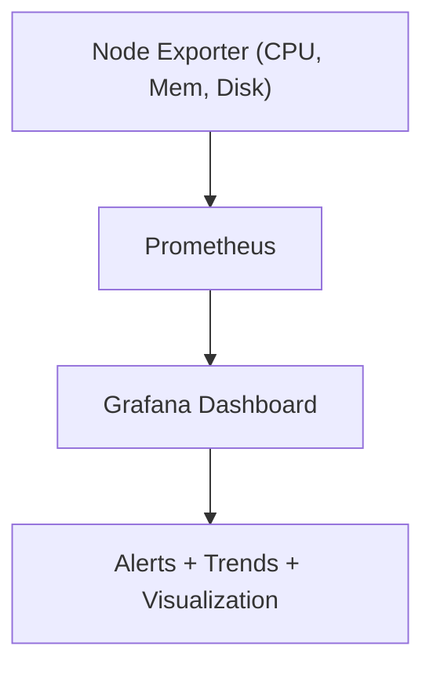

# ⚙️ **Prometheus Exporters**

> 📌 _“Prometheus can’t measure what isn’t exposed — that’s why exporters are the translators between systems and metrics.”_

---

## 📚 Table of Contents

1. [📖 What Are Exporters?](#1)
2. [🤹🏻 Types of Exporters](#2)
3. [⚙️ How Exporters Work (Visual Flow)](#3)
4. [📝 Node Exporter Example (System Metrics)](#4)
5. [🔨 Building Custom Exporters](#5)
6. [✍🏻 Real-World Example — Node Exporter + Prometheus + Grafana](#6)
7. [💭 Common Exporter Patterns in the Wild](#7)
8. [🏁 TL;DR Summary](#8)

---

<a id="1"></a>

## 📖 **What Are Exporters?**

An **exporter** is a small program or agent that **exposes metrics** from a target system in Prometheus-readable format (`/metrics` endpoint).  
Prometheus then **scrapes** this data via HTTP.

> 👉 Exporters **translate internal system data** (CPU, DB stats, etc.) into standardized Prometheus metrics.

**🧠 Analogy:**  
Think of Prometheus as a **journalist** 🕵️‍♂️ collecting stories (metrics) from various people (systems).  
Each exporter is like a **translator** who speaks the native language of that system.

---

<a id="2"></a>

## 🤹🏻 **Types of Exporters**

<div align="center" style="background-color: #141a19ff;color: #a8a5a5ff; border-radius: 10px; border: 2px solid">

| Type                       | Description                             | Example                          |
| -------------------------- | --------------------------------------- | -------------------------------- |
| **📑 Official Exporters**  | Maintained by Prometheus team           | Node Exporter, Blackbox Exporter |
| **🟢 Community Exporters** | Created by open-source community        | Nginx Exporter, MySQL Exporter   |
| **🧑🏻‍💻 Custom Exporters** | You build it yourself using client SDKs | Python, Go, Java, C#, etc.       |

</div>

---

### 📦 Commonly Used Exporters

<div align="center" style="background-color: #141a19ff;color: #a8a5a5ff; border-radius: 10px; border: 2px solid">

| Exporter                 | Purpose                                           | Default Port |
| ------------------------ | ------------------------------------------------- | ------------ |
| 🧮 **Node Exporter**     | System-level metrics (CPU, memory, disk, network) | `9100`       |
| 🧱 **cAdvisor**          | Container metrics (used in Kubernetes)            | `8080`       |
| 🧰 **Blackbox Exporter** | Probes endpoints (HTTP, TCP, ICMP)                | `9115`       |
| 🧩 **MySQL Exporter**    | MySQL database performance                        | `9104`       |
| 💾 **Redis Exporter**    | Redis database stats                              | `9121`       |
| 📡 **JMX Exporter**      | JVM / Java app metrics                            | `9404`       |

</div>

---

<a id="3"></a>

## ⚙️ **How Exporters Work (Visual Flow)**

<div align="center" style="background-color: #141a19ff;color: #a8a5a5ff; border-radius: 10px; border: 2px solid">


</div>

---

> 💡 Exporters make **non-Prometheus systems observable** by exposing standardized metrics endpoints.

---

<a id="4"></a>

## 📝 **Node Exporter Example (System Metrics)**

A classic example — **Node Exporter** exposes host-level stats.

Example `/metrics` output:

```ini
# HELP node_cpu_seconds_total Seconds the CPU spent in each mode
# TYPE node_cpu_seconds_total counter
node_cpu_seconds_total{cpu="0",mode="system"} 4829.2
node_cpu_seconds_total{cpu="0",mode="idle"} 27654.8
node_memory_MemAvailable_bytes 6.478e+08
node_network_transmit_bytes_total{device="eth0"} 1.245e+09
```

👉 Prometheus scrapes this data to visualize CPU, memory, and network trends.

---

<a id="5"></a>

## 🔨 **Building Custom Exporters**

You can instrument your own applications using **client libraries**:

<div align="center" style="background-color: #141a19ff;color: #a8a5a5ff; border-radius: 10px; border: 2px solid">

| Language  | Library                                          |
| --------- | ------------------------------------------------ |
| Go        | `github.com/prometheus/client_golang/prometheus` |
| Python    | `prometheus_client`                              |
| Java      | `io.prometheus:simpleclient`                     |
| .NET / C# | `prometheus-net`                                 |

</div>

### Example (Python)

```python
from prometheus_client import start_http_server, Summary
import random, time

# Create a Summary metric
REQUEST_TIME = Summary('request_processing_seconds', 'Time spent processing request')

@REQUEST_TIME.time()
def process_request():
    time.sleep(random.random())

if __name__ == '__main__':
    start_http_server(8000)
    while True:
        process_request()
```

✅ Opens `/metrics` endpoint on port `8000`
✅ Exposes metric: `request_processing_seconds_count`, `_sum`

---

<a id="6"></a>

## ✍🏻 **Real-World Example — Node Exporter + Prometheus + Grafana**

<div align="center" style="background-color: #141a19ff;color: #a8a5a5ff; border-radius: 10px; border: 2px solid">



</div>

Example PromQL Queries:

```promql
# CPU Usage
100 - (avg by(instance)(rate(node_cpu_seconds_total{mode="idle"}[5m])) * 100)

# Memory Usage
(node_memory_MemTotal_bytes - node_memory_MemAvailable_bytes) / node_memory_MemTotal_bytes * 100

# Disk I/O
rate(node_disk_written_bytes_total[5m])
```

---

<a id="7"></a>

## 💭 **Common Exporter Patterns in the Wild**

<div align="center" style="background-color: #141a19ff;color: #a8a5a5ff; border-radius: 10px; border: 2px solid">

| Layer     | Exporter          | Example Metrics            |
| --------- | ----------------- | -------------------------- |
| OS        | Node Exporter     | CPU, memory, disk, network |
| Container | cAdvisor          | Container CPU/memory usage |
| DB        | MySQL Exporter    | Query rate, connections    |
| App       | Custom Exporter   | Business KPIs (orders/sec) |
| Infra     | Blackbox Exporter | Ping, HTTP uptime          |

</div>

---

<a id="8"></a>

## 🏁 **TL;DR Summary**

<div align="center" style="background-color: #141a19ff;color: #a8a5a5ff; border-radius: 10px; border: 2px solid">

| Concept            | Key Idea                                       |
| ------------------ | ---------------------------------------------- |
| **Exporter**       | Translates system data into Prometheus metrics |
| **Metric Types**   | Counter, Gauge, Histogram, Summary             |
| **Scraping**       | Prometheus pulls data from `/metrics`          |
| **Custom Metrics** | Use Prometheus client libraries                |
| **Grafana**        | Visualizes metrics queried via PromQL          |

</div>
