# 📊 **Prometheus Metrics & Labels** — The DNA of Observability

> 🧠 _“Metrics are the heartbeat of your system. Labels are its fingerprints.”_

---

## 📚 Table of Contents

1. [📖 What Are Metrics?](#1)
2. [🧩 The Structure of a Prometheus Metric](#2)
3. [🎏 Prometheus Time Series](#3)
4. [⛑️ Metric Attributes — `HELP` and `TYPE`](#4)
5. [🤹🏻 Metric Types in Prometheus](#5)  
   5.1 [🔢 Counter](#5.1)  
   5.2 [🌡️ Gauge](#5.2)  
   5.3 [📊 Histogram](#5.3)  
   5.4 [📈 Summary](#5.4)
6. [🔠 Metric Naming Conventions](#6)
7. [🎯 Choosing the Right Metric Type](#7)
8. [🏷️ Labels — The Secret Sauce of Prometheus](#8)
9. [📝 Example Combined `/metrics` Output](#9)
10. [🔚 Summary](#10)

---

<a id="1"></a>

## 📖 **What Are Metrics?**

A **metric** in Prometheus is a **time-stamped numerical measurement** that represents some property of your system —
like CPU usage, HTTP requests, temperature, queue length, etc.

---

<div align="center" style="background-color:#111720; border-radius: 10px; border: 2px solid">
    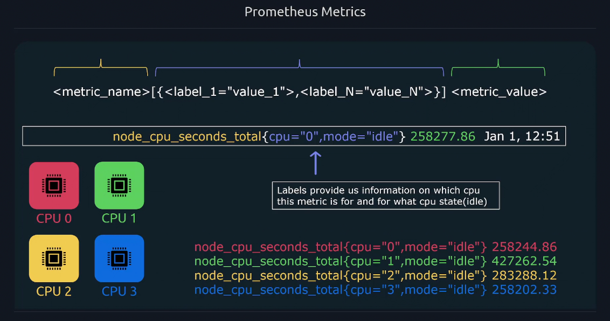
</div>

---

> Prometheus continuously collects these metrics from your applications or exporters and stores them as **time series** — meaning the same metric name with multiple timestamped values.

---

<a id="2"></a>

## 🧩 **The Structure of a Prometheus Metric**

<div align="center" style="background-color: #141a19ff;color: #a8a5a5ff; border-radius: 10px; border: 2px solid">

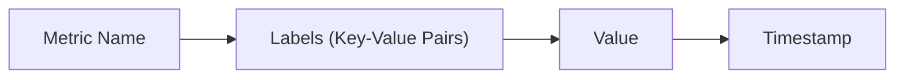

---

| Component       | Description                     | Example                        |
| --------------- | ------------------------------- | ------------------------------ |
| **Metric Name** | Describes what’s being measured | `http_requests_total`          |
| **Labels**      | Key-value pairs giving context  | `{method="GET", status="200"}` |
| **Value**       | The numeric data point          | `3489`                         |
| **Timestamp**   | When it was collected           | `2025-10-30T14:30:00Z`         |

---

Each metric stored looks like:

```ini
<metric_name>{<label_name>=<label_value>, ...} <value> [<timestamp>]
```

---

Example:

```ini
node_cpu_seconds_total{cpu="0",mode="user"} 129345.33 1698668400000
```

</div>

---

**📝 Example Metric:**

```ini
# 3489 successful GET requests have been served by the “checkout” service.
http_requests_total{method="GET",status="200",app="checkout"} 3489
```

---

<a id="3"></a>

## 🎏 **Prometheus Time Series**

Prometheus stores metrics in **time series**:

Each time series is uniquely defined by:

- A **metric name**
- A **set of labels**

Each time series contains:

- A stream of **samples**, where each sample = `timestamp + value`

---

<div align="center" style="background-color:#111720; border-radius: 10px; border: 2px solid">
    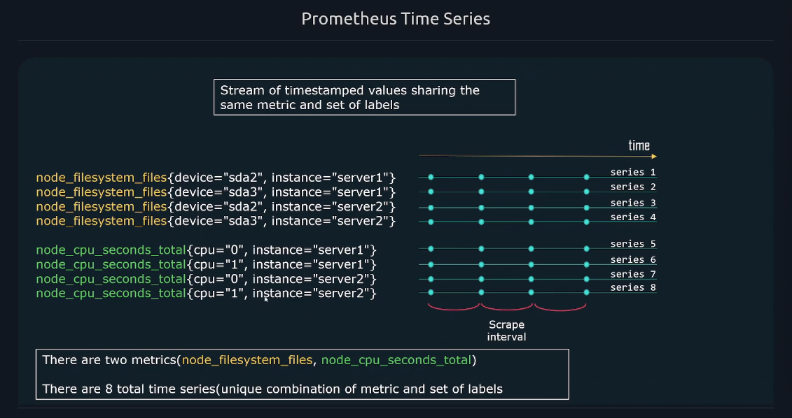
</div>

---

### 📝 Examples:

```ini
http_requests_total{method="GET",status="200"} → [ [1698668400, 3489], [1698668460, 3521] ]
```

This is **one time series** with two samples.  
Another label combination like `{method="POST"}` would be a **different time series**, even if the metric name is the same.

---

<a id="4"></a>

## ⛑️ **Metric Attributes** — `HELP` and `TYPE`

When Prometheus scrapes metrics from a `/metrics` endpoint, it receives metadata that describes each metric. These include:

- `# HELP` — a description of what the metric measures
- `# TYPE` — the kind of metric (e.g., counter, gauge)

<div align="center" style="background-color:#111720; border-radius: 10px; border: 2px solid">
    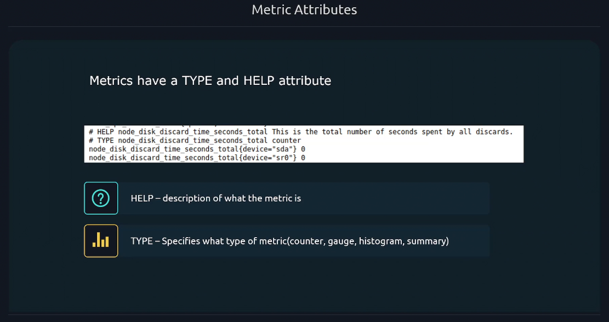
</div>

---

**Here’s a real example from a Node Exporter:**

```text
# HELP node_cpu_seconds_total Seconds the CPU spent in each mode
# TYPE node_cpu_seconds_total counter
node_cpu_seconds_total{cpu="0",mode="system"} 4829.2
node_cpu_seconds_total{cpu="0",mode="idle"} 27654.8
```

- **HELP**: Explains that `node_cpu_seconds_total` tracks CPU time per mode.
- **TYPE**: Declares it as a `counter`, meaning the value only increases.
- **Metric Data**: Shows actual values for CPU 0 in `system` and `idle` modes.

> These metadata lines make metrics **self-describing**, helping Prometheus and tools like Grafana interpret and visualize them correctly.

---

<a id="5"></a>

## 🤹🏻 **Metric Types in Prometheus**

Prometheus supports **4 official metric types**, each designed for a different use case.

<div align="center" style="background-color:#111720; border-radius: 10px; border: 2px solid">
    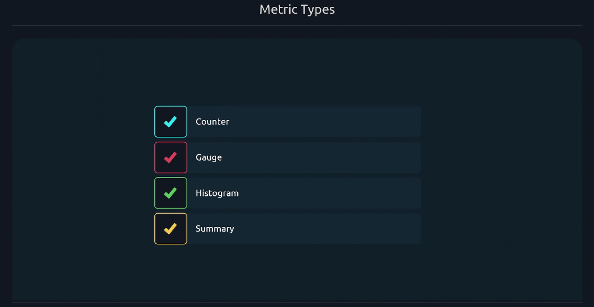
</div>

Let’s break them down with examples, use cases, and how Prometheus stores them internally 👇

---

<a id="5.1"></a>

## 🔢 **1. Counter**

**📘 Definition:**

A **Counter** is a cumulative metric that **only increases** (or resets to zero on restart).

Used for counting _events_ over time — e.g., total requests, errors, tasks completed.

---

<div align="center" style="background-color:#111720; border-radius: 10px; border: 2px solid">
    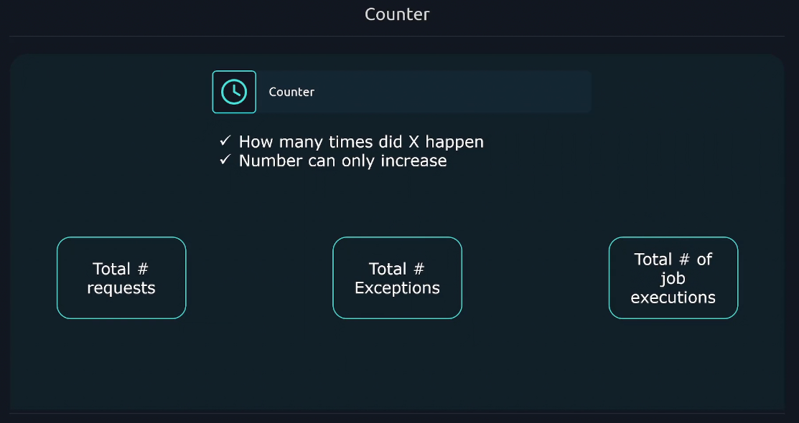
</div>

---

**📊 Example:**

```ini
http_requests_total{method="GET"} 15234
```

Prometheus stores the increasing value and uses **rate()** or **increase()** to compute per-second rates.

**🧮 PromQL Example:**

```promql
rate(http_requests_total[5m])
```

→ Requests per second in the last 5 minutes.

**🧠 Use Counters For:**

- HTTP request totals
- Processed jobs
- Error counts

---

<a id="5.2"></a>

## 🌡️ **2. Gauge**

**📘 Definition:**

A **Gauge** is a metric that **goes up or down** — representing a current value.

It’s perfect for _point-in-time measurements._

---

<div align="center" style="background-color:#111720; border-radius: 10px; border: 2px solid">
    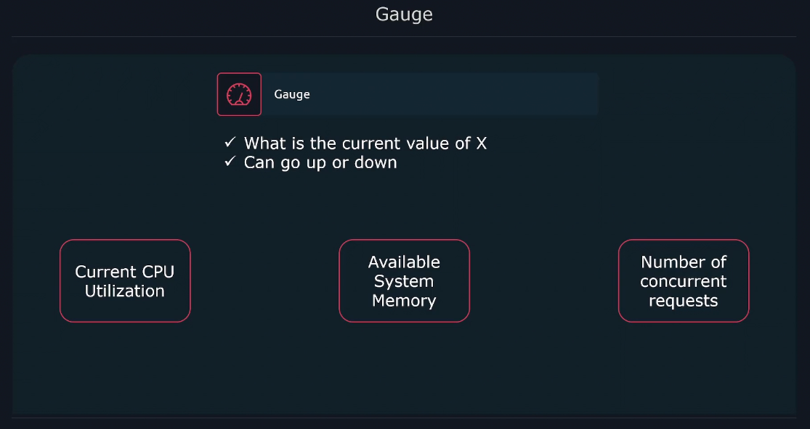
</div>

---

**📊 Example:**

```ini
node_memory_MemAvailable_bytes 3.245e+09
```

→ Memory currently available (3.2 GB)

**🧮 PromQL Example:**

```promql
avg(node_memory_MemAvailable_bytes) by (instance)
```

→ Average available memory per node.

**🧠 Use Gauges For:**

- Memory usage
- Temperature
- Queue size
- Number of active sessions

---

<a id="5.3"></a>

## 📊 **3. Histogram**

**📘 Definition:**

A **Histogram** samples observations (like request durations or payload sizes) into **buckets**.

It provides:

- The **count** of observations per bucket
- The **sum** of all observed values
- Total **observation count**

---

<div align="center" style="background-color:#111720; border-radius: 10px; border: 2px solid">
    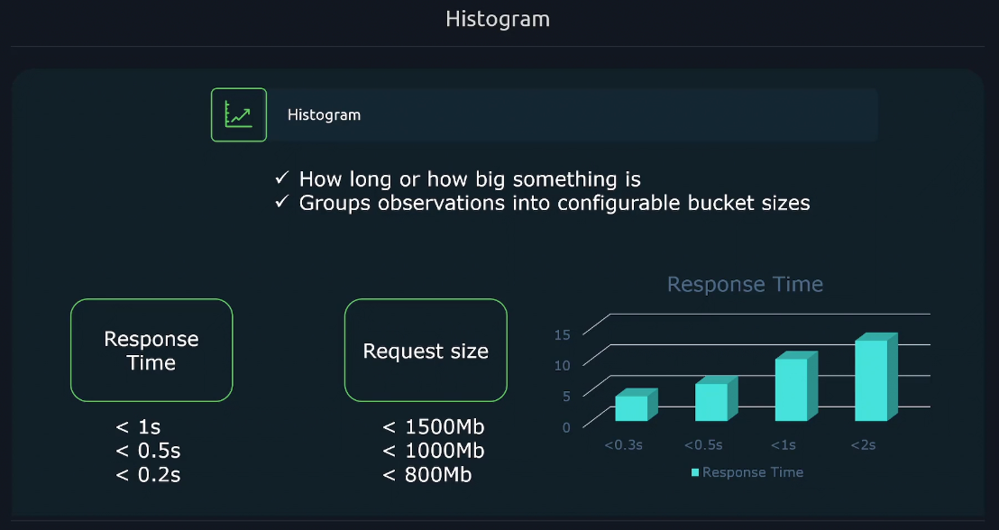
</div>

---

**📊 Example:**

```ini
http_request_duration_seconds_bucket{le="0.1"} 2401
http_request_duration_seconds_bucket{le="0.5"} 5501
http_request_duration_seconds_bucket{le="1"} 6300
http_request_duration_seconds_sum 2432.21
http_request_duration_seconds_count 6500
```

This means:

- 2,401 requests took ≤ 0.1s
- 5,501 requests took ≤ 0.5s
- 6,300 requests took ≤ 1s
- Average duration: `sum / count = 2432.21 / 6500`

**🧮 PromQL Example:**

```promql
histogram_quantile(0.95, sum(rate(http_request_duration_seconds_bucket[5m])) by (le))
```

→ 95th percentile latency over 5 minutes.

**🧠 Use Histograms For:**

- Request latency
- Response size
- API performance

---

<a id="5.4"></a>

## 📈 **4. Summary**

**📘 Definition:**

A **Summary** also measures observations (like latency) but **calculates quantiles** (like median, 95th percentile) **locally** on the client side.

It provides:

- `sum`
- `count`
- Quantiles like `0.5`, `0.9`, `0.99`

---

<div align="center" style="background-color:#111720; border-radius: 10px; border: 2px solid">
    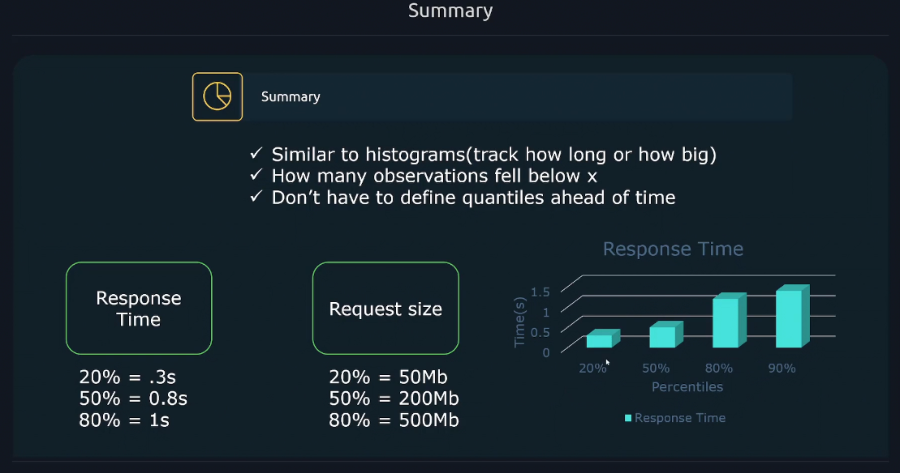
</div>

---

**📊 Example:**

```ini
request_duration_seconds{quantile="0.5"} 0.245
request_duration_seconds{quantile="0.9"} 0.548
request_duration_seconds{quantile="0.99"} 0.983
request_duration_seconds_sum 234.12
request_duration_seconds_count 457
```

**🧠 When to Use Summary:**

- When you only need **local quantiles**
- When you don’t aggregate across multiple instances

💬 **Note:** Histograms are generally preferred for large, distributed systems (e.g., Kubernetes).

---

<a id="6"></a>

## 🔠 **Metric Naming Conventions (Best Practices)**

✅ **Prometheus naming rules:**

- Use **snake_case**
- End counters with `_total`
- Use base units (seconds, bytes, etc.)
- Add clear prefixes per subsystem

| Good Example               | Bad Example        |
| -------------------------- | ------------------ |
| `http_requests_total`      | `HTTPRequestCount` |
| `node_cpu_seconds_total`   | `cpuStats`         |
| `request_duration_seconds` | `reqLatency`       |

---

<a id="7"></a>

## 🎯 **Choosing the Right Metric Type**

<div align="center" style="background-color: #141a19ff;color: #a8a5a5ff; border-radius: 10px; border: 2px solid">

| Situation                                           | Use Metric Type |
| --------------------------------------------------- | --------------- |
| Counting events (requests, errors)                  | **Counter**     |
| Measuring <u title="متذبذبة">fluctuating</u> values | **Gauge**       |
| Measuring durations or sizes with percentiles       | **Histogram**   |
| Single-instance percentiles (quantiles)             | **Summary**     |

</div>

---

<a id="8"></a>

## 🏷️ **Labels — The Secret Sauce of Prometheus**

Labels turn flat metrics into **multi-dimensional data**.

---

<div align="center" style="background-color:#111720; border-radius: 10px; border: 2px solid">
    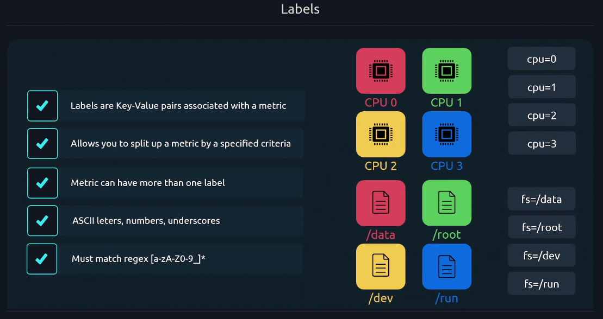
</div>

---

<div align="center" style="background-color:#111720; border-radius: 10px; border: 2px solid">
    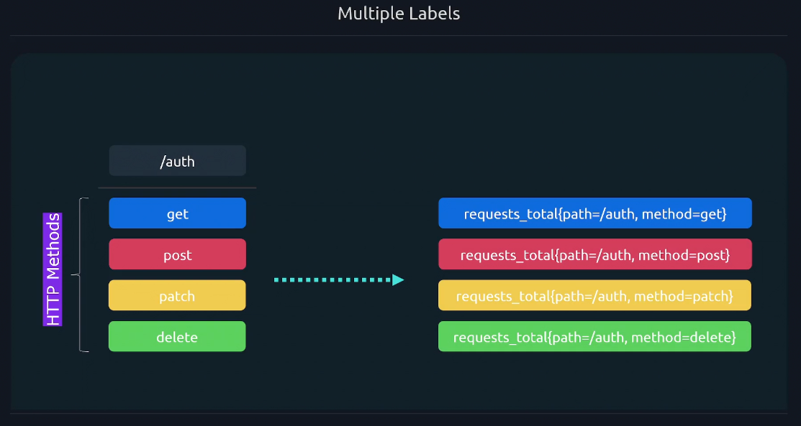
</div>

---

Without labels:

```ini
http_requests_total 10000
```

With labels:

```ini
http_requests_total{method="GET",status="200"} 7500
http_requests_total{method="POST",status="500"} 2500
```

Now you can **filter, group, and analyze** metrics by method, status, region, instance, etc.

---

<div align="center" style="background-color:#111720; border-radius: 10px; border: 2px solid">
    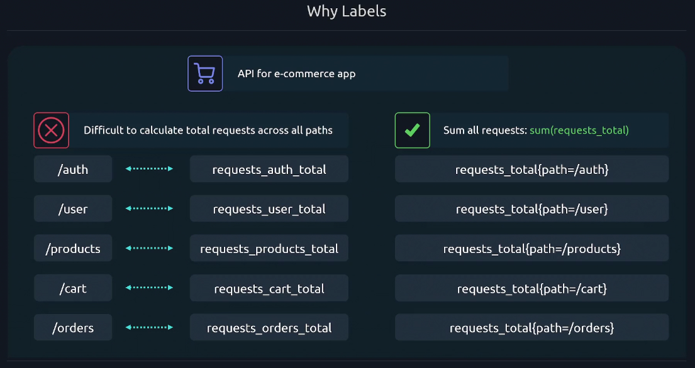
</div>

---

> 💡 Each combination of label values is a **unique time series**.

---

### ⚠️ **Label Best Practices**

✅ **Do:**

- Keep label values **bounded and low-cardinality**
  → e.g., `region`, `status_code`, `instance`, `job`
- Use labels for **dimensions you need to filter by**
  → e.g., `environment="prod"`, `region="eu-west-1"`

❌ **Don’t:**

- Use labels that change too frequently (like `user_id`, `request_id`)
  → causes **cardinality explosion** (millions of time series = bad)
- Use labels for high-cardinality text values (like error messages)

---

### 💡 **Label Example** (Node Exporter)

```text
node_cpu_seconds_total{cpu="0",mode="system"} 2563.7
node_cpu_seconds_total{cpu="0",mode="idle"} 11583.2
node_cpu_seconds_total{cpu="1",mode="user"} 873.5
```

You can filter:

```promql
rate(node_cpu_seconds_total{mode="user"}[5m])
```

👉 Gives CPU usage in user mode only.

---

### ⚙️ **Internal Labels**

In Prometheus, **internal labels** are special labels automatically added by Prometheus during the scraping and service discovery process. They are not part of the original metric data exposed by the target, but they help Prometheus manage and organize targets behind the scenes.

---

<div align="center" style="background-color:#111720; border-radius: 10px; border: 2px solid">
    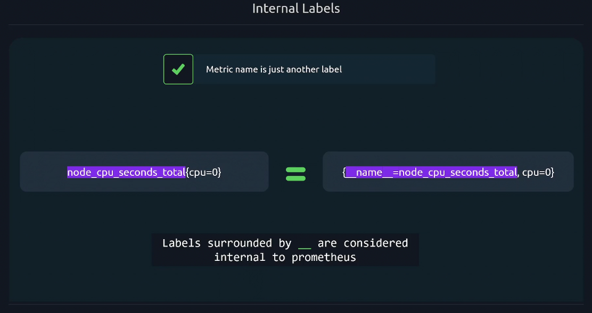
</div>

---

**🔹 What They Are:**

- Labels prefixed with `__` (double underscore)
- Used internally by Prometheus for configuration, discovery, and target management
- Not visible in regular queries unless explicitly referenced

---

**🧠 Common Internal Labels:**

| Label                     | Purpose                                                               |
| ------------------------- | --------------------------------------------------------------------- |
| `__address__`             | Target’s network address (e.g., `192.168.1.10:9100`)                  |
| `__scheme__`              | Protocol used to scrape (e.g., `http`, `https`)                       |
| `__metrics_path__`        | Path to scrape metrics (usually `/metrics`)                           |
| `__scrape_interval__`     | How often Prometheus scrapes the target                               |
| `__scrape_timeout__`      | Timeout for scraping the target                                       |
| `__param_<name>`          | Query parameters from the scrape URL                                  |
| `__meta_<source>_<field>` | Metadata from service discovery (e.g., Kubernetes pod name, EC2 tags) |

---

**🔍 Example Use Case:**

When Prometheus discovers a Kubernetes pod, it might assign internal labels like:

```yaml
__address__="10.0.0.5:8080"
__meta_kubernetes_pod_name="checkout-service-abc123"
```

These labels help Prometheus identify and manage the target, but they’re usually filtered out before metrics are stored — unless you use `relabel_configs` to convert them into regular labels.

---

**💡 Why They Matter:**

- Internal labels are essential for **dynamic environments** like Kubernetes or cloud platforms.
- They enable **automatic target discovery** and **flexible relabeling**.
- You can use them in `relabel_configs` to rename, filter, or enrich targets before scraping.

Would you like an example of how internal labels are used in a Prometheus config?

---

### 👉 **Default Labels**

In Prometheus, a **default label** refers to a label that is automatically added to metrics by the system or configuration — often during scraping or relabeling — to provide consistent context across metrics.

---

<div align="center" style="background-color:#111720; border-radius: 10px; border: 2px solid">
    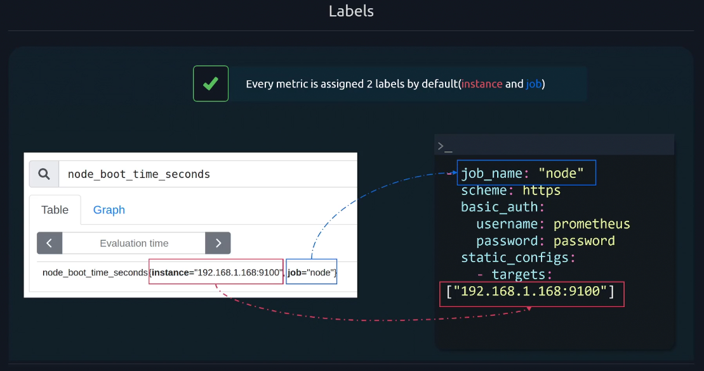
</div>

---

- **Purpose**: Add consistent metadata to metrics (e.g., instance name, job name, environment).
- **Common Examples**:
  - `instance`: the target’s address (e.g., `192.168.1.10:9100`)
  - `job`: the logical group name from `prometheus.yml`
- **How They’re Set**: Defined in the scrape configuration or added via `relabel_configs`.
- **Why They Matter**: They help organize, filter, and query metrics effectively in PromQL and Grafana.

---

**💡 Example Metric with Default Labels:**

```text
http_requests_total{job="web", instance="10.0.0.5:8080", method="GET"} 3489
```

Here, `job` and `instance` are default labels added by Prometheus during scraping. They’re essential for grouping and identifying where metrics come from.

Let me know if you'd like to see how to customize or relabel these in a config file.

---

<a id="9"></a>

## 📝 **Example Combined `/metrics` Output**

```text
# HELP http_requests_total Total HTTP requests
# TYPE http_requests_total counter
http_requests_total{method="GET",status="200",service="api"} 5480
http_requests_total{method="POST",status="500",service="api"} 45

# HELP cpu_temperature_celsius Current CPU temperature
# TYPE cpu_temperature_celsius gauge
cpu_temperature_celsius{core="0"} 64.5
cpu_temperature_celsius{core="1"} 67.1

# HELP request_duration_seconds Request duration histogram
# TYPE request_duration_seconds histogram
request_duration_seconds_bucket{le="0.1"} 105
request_duration_seconds_bucket{le="0.5"} 214
request_duration_seconds_bucket{le="+Inf"} 250
request_duration_seconds_sum 72.9
request_duration_seconds_count 250
```

---

<a id="10"></a>

## 🔚 **Summary**

<div align="center" style="background-color: #141a19ff;color: #a8a5a5ff; border-radius: 10px; border: 2px solid">

| Concept          | Description                             |
| ---------------- | --------------------------------------- |
| **Metric**       | Numeric measurement over time           |
| **Labels**       | Contextual key-value pairs              |
| **Time Series**  | Unique metric + label combination       |
| **4 Types**      | Counter, Gauge, Histogram, Summary      |
| **Naming**       | Snake case, base units, suffix `_total` |
| **PromQL Ready** | Metrics + Labels = Query Magic          |

</div>

---

<div align="center" style="background-color: #141a19ff;color: #a8a5a5ff; border-radius: 10px; border: 2px solid">

| Type          | Direction                  | Reset      | Common Use                 | Example Metric                  |
| ------------- | -------------------------- | ---------- | -------------------------- | ------------------------------- |
| **Counter**   | 🔼 Only increases          | On restart | Total requests, errors     | `http_requests_total`           |
| **Gauge**     | 🔼🔽 Up or down            | N/A        | Memory, temperature        | `node_memory_Active_bytes`      |
| **Histogram** | 🔼 Counts + sum + buckets  | On restart | Latency, size distribution | `http_request_duration_seconds` |
| **Summary**   | 🔼 Sum + count + quantiles | On restart | Local percentiles          | `request_latency_seconds`       |

</div>
