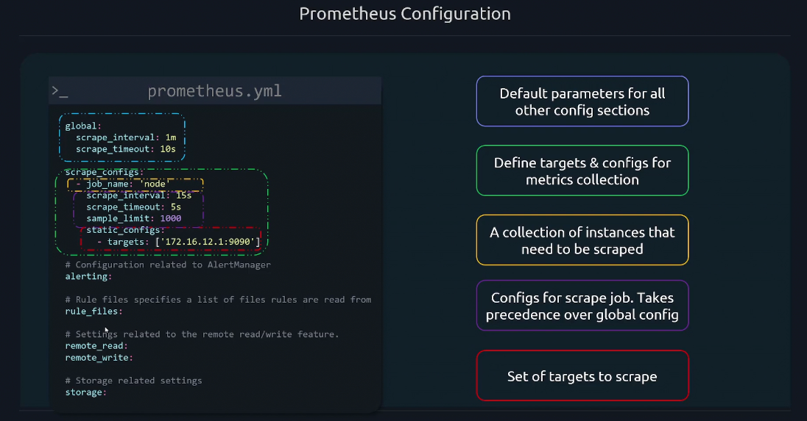
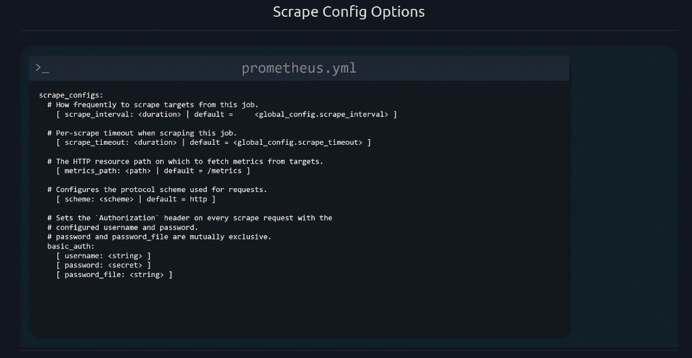
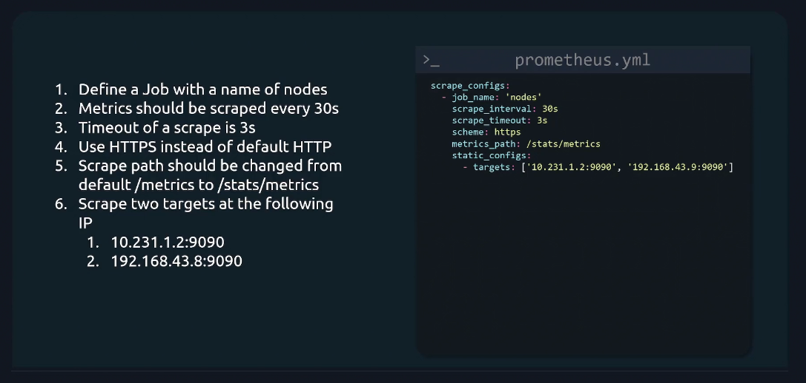
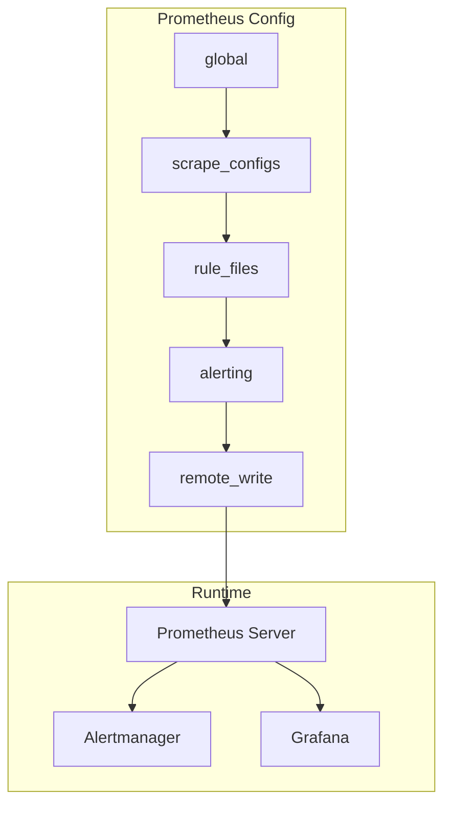

# ⚙️ **Prometheus Configuration Files**

> 🧠 _“If Prometheus is the brain, `prometheus.yml` is its neural wiring.”_

---

## 🧩 **The Core Configuration File: `prometheus.yml`**

When you start the Prometheus server, it looks for its **main configuration file**, usually located at:

```ini
/etc/prometheus/prometheus.yml
```

This file defines **everything Prometheus does**:

- What to scrape (targets, jobs, exporters)
- How often to scrape
- Where to send alerts
- How to record rules
- Service discovery methods

---

<div align="center" style="background-color:#111720; border-radius: 10px; border: 2px solid">
    
</div>

---

## 🧱 **The High-Level Structure**

Here’s the overall structure (remember this — you’ll see it everywhere):

```yaml
global: <global_config>

scrape_configs:
  - <scrape_config>

rule_files:
  - <file_path>

alerting:
  alertmanagers:
    - <alertmanager_config>

remote_write:
  - <remote_write_config>

remote_read:
  - <remote_read_config>
```

Let’s break it down one block at a time 👇

---

## 🧭 **Global Configuration Block**

```yaml
global:
  scrape_interval: 15s # How often to scrape targets (default 1m)
  evaluation_interval: 15s # How often to evaluate rules
  scrape_timeout: 10s # Max time before a scrape times out
  external_labels:
    region: "us-east-1" # Labels added to all metrics
```

### 🔍 Breakdown

<div align="center" style="background-color: #141a19ff;color: #a8a5a5ff; border-radius: 10px; border: 2px solid">

| Field                   | Description                                                                             |
| ----------------------- | --------------------------------------------------------------------------------------- |
| **scrape_interval**     | How often Prometheus collects metrics from all targets.                                 |
| **evaluation_interval** | How often alerting and recording rules are evaluated.                                   |
| **scrape_timeout**      | Maximum wait time for a target response before it’s considered failed.                  |
| **external_labels**     | Labels automatically attached to every time series (useful in HA setups or federation). |

</div>

> 🧠 **Best Practice:**  
> Keep scrape and evaluation intervals the same (usually `15s` or `30s`) unless you have heavy workloads.

---

## 🧮 **Scrape Configuration Block (`scrape_configs`)**

This is the **heart of Prometheus** — where you define **what to monitor** and **how**.

<div align="center" style="background-color:#111720; border-radius: 10px; border: 2px solid">
    
</div>

<div align="center" style="background-color:#111720; border-radius: 10px; border: 2px solid">
    
</div>

Example:

```yaml
scrape_configs:
  - job_name: "node"
    scrape_interval: 10s
    static_configs:
      - targets: ["192.168.1.10:9100", "192.168.1.11:9100"]
```

### 🔍 Breakdown

<div align="center" style="background-color: #141a19ff;color: #a8a5a5ff; border-radius: 10px; border: 2px solid">

| Key                 | Purpose                                            |
| ------------------- | -------------------------------------------------- |
| **job_name**        | Logical name for the set of targets being scraped. |
| **scrape_interval** | (Optional) Overrides the global scrape interval.   |
| **static_configs**  | Defines fixed target endpoints for this job.       |
| **targets**         | List of endpoints exposing `/metrics`.             |

</div>

---

### 🧠 Example: Multi-job setup

```yaml
scrape_configs:
  - job_name: "node_exporter"
    static_configs:
      - targets: ["server1:9100", "server2:9100"]

  - job_name: "nginx"
    metrics_path: "/status/metrics"
    static_configs:
      - targets: ["web1:9113"]

  - job_name: "blackbox_http"
    metrics_path: /probe
    params:
      module: [http_2xx]
    static_configs:
      - targets:
          - https://example.com
    relabel_configs:
      - source_labels: [__address__]
        target_label: __param_target
```

💡 **Tip:** You can have as many jobs as you want — each with its own scraping method.

---

## ⚙️ **Scrape Configuration Sub-Blocks (Advanced Options)**

Each `scrape_config` can include additional fine-tuning options.

---

### 🧩 5.1 `metrics_path`

Specifies the endpoint to scrape (default is `/metrics`).

```yaml
metrics_path: "/custom_metrics"
```

---

### 🧩 5.2 `scheme`

Defines protocol (HTTP/HTTPS).

```yaml
scheme: https
```

---

### 🧩 5.3 `params`

Adds query parameters to scrape requests (often used with **Blackbox Exporter**).

```yaml
params:
  module: [http_2xx]
```

---

### 🧩 5.4 `basic_auth`

Provides credentials for protected endpoints.

```yaml
basic_auth:
  username: "admin"
  password: "secret"
```

---

### 🧩 5.5 `bearer_token` or `bearer_token_file`

For OAuth2-based authentication.

```yaml
bearer_token: "eyJhbGc..."
```

---

### 🧩 5.6 `tls_config`

Used for secure HTTPS communication.

```yaml
tls_config:
  insecure_skip_verify: true
```

---

### 🧩 5.7 `honor_labels`

Controls whether to keep the target’s labels or overwrite them.

```yaml
honor_labels: true
```

---

### 🧩 5.8 `relabel_configs`

The **most powerful (and most confusing)** feature in Prometheus.

It allows you to **rename, filter, or manipulate labels** during discovery or scraping.

Example:

```yaml
relabel_configs:
  - source_labels: [__address__]
    target_label: instance
    replacement: "prod-${1}"
```

You can:

- Drop targets (`action: drop`)
- Replace labels
- Filter instances
- Change metric names dynamically

💡 Relabeling = **data shaping** before storage.

---

## 🌍 **Service Discovery Configuration**

Prometheus supports **automatic service discovery** for dynamic environments.

### Kubernetes Example:

```yaml
scrape_configs:
  - job_name: "kubernetes-pods"
    kubernetes_sd_configs:
      - role: pod
    relabel_configs:
      - source_labels: [__meta_kubernetes_pod_label_app]
        action: keep
        regex: "myapp"
```

### AWS EC2 Example:

```yaml
scrape_configs:
  - job_name: "ec2-instances"
    ec2_sd_configs:
      - region: us-east-1
    relabel_configs:
      - source_labels: [__meta_ec2_tag_Name]
        regex: "webserver.*"
        action: keep
```

Prometheus automatically tracks new containers, pods, or EC2 instances — no manual editing needed! 🚀

---

## ⚖️ **Rule Files (`rule_files`)**

These define **recording** and **alerting** rules.

```yaml
rule_files:
  - "rules/*.yml"
```

Example `rules/web_rules.yml`:

```yaml
groups:
  - name: web_rules
    rules:
      - record: job:http_inprogress_requests:sum
        expr: sum(http_inprogress_requests) by (job)

      - alert: HighErrorRate
        expr: rate(http_requests_total{status="500"}[5m]) > 0.05
        for: 2m
        labels:
          severity: critical
        annotations:
          summary: "High error rate detected"
```

---

## 🚨 **Alerting Configuration (`alerting`)**

Links Prometheus to **Alertmanager**.

```yaml
alerting:
  alertmanagers:
    - static_configs:
        - targets: ["localhost:9093"]
```

### 🔍 Notes:

- You can specify **multiple Alertmanagers** for HA.
- Alerts generated from rule files are sent here for routing.

---

## 🌐 **Remote Write & Remote Read**

Used when you want to **send or retrieve metrics** to/from a **remote storage system** (for long-term data retention).

```yaml
remote_write:
  - url: "https://remote.prometheus.io/write"
    basic_auth:
      username: "admin"
      password: "secret"
```

```yaml
remote_read:
  - url: "https://remote.prometheus.io/read"
```

💡 Useful for **federation setups**, **Cortex**, **Thanos**, or **VictoriaMetrics**.

---

## 🧰 **Full Example Configuration (`prometheus.yml`)**

Here’s a realistic config combining everything:

```yaml
global:
  scrape_interval: 15s
  evaluation_interval: 15s
  external_labels:
    environment: "production"

rule_files:
  - "rules/*.yml"

alerting:
  alertmanagers:
    - static_configs:
        - targets: ["alertmanager:9093"]

scrape_configs:
  - job_name: "prometheus"
    static_configs:
      - targets: ["localhost:9090"]

  - job_name: "node_exporter"
    static_configs:
      - targets: ["node1:9100", "node2:9100"]

  - job_name: "blackbox"
    metrics_path: /probe
    params:
      module: [http_2xx]
    static_configs:
      - targets:
          - https://example.com
          - https://myapi.com
    relabel_configs:
      - source_labels: [__address__]
        target_label: __param_target
      - target_label: instance
        source_labels: [__param_target]
      - target_label: __address__
        replacement: "blackbox:9115"
```

---

## 🧭 **Additional Configuration Files**

Prometheus also supports other configuration files for modularity.

<div align="center" style="background-color: #141a19ff;color: #a8a5a5ff; border-radius: 10px; border: 2px solid">

| File                   | Purpose                                          |
| ---------------------- | ------------------------------------------------ |
| **`rules/*.yml`**      | Recording and alerting rules                     |
| **`alertmanager.yml`** | Alertmanager routing, grouping, silencing        |
| **`targets.json`**     | Dynamic targets via file-based service discovery |
| **`prometheus.env`**   | Environment variables (for containerized setups) |

</div>

---

## 📊 **`alertmanager.yml` — Brief Preview**

Here’s what your **Alertmanager config** (linked in `prometheus.yml`) might look like:

```yaml
global:
  resolve_timeout: 5m

route:
  receiver: "slack"
  routes:
    - match:
        severity: critical
      receiver: "pagerduty"

receivers:
  - name: "slack"
    slack_configs:
      - channel: "#alerts"
        send_resolved: true

  - name: "pagerduty"
    pagerduty_configs:
      - service_key: "<YOUR_KEY>"
```

---

## 🧩 **File Discovery: `file_sd_configs`**

Prometheus can also load targets dynamically from JSON files (great for automation).

Example:

```yaml
scrape_configs:
  - job_name: "dynamic_targets"
    file_sd_configs:
      - files:
          - "targets/*.json"
```

Example `targets/node.json`:

```json
[{ "targets": ["node1:9100", "node2:9100"], "labels": { "env": "prod" } }]
```

---

## 🧠 **Validation & Reloading**

Prometheus doesn’t auto-reload its config — but you can **reload without restart**.

### ✅ Validate your config:

```bash
promtool check config /etc/prometheus/prometheus.yml
```

### 🔁 Reload Prometheus:

Send an HTTP POST to the reload endpoint:

```bash
curl -X POST http://localhost:9090/-/reload
```

### 🔥 Or via systemd:

```bash
sudo systemctl reload prometheus
```

---

## 🧭 **Directory Layout (Typical Setup)**

```ini
/etc/prometheus/
├── prometheus.yml          # Main config
├── rules/                  # Rule files
│   └── alerts.yml
├── targets/                # Dynamic discovery targets
│   └── node.json
└── consoles/               # Web console templates
```

---

## 🧩 **Prometheus Startup Command**

Prometheus reads your config file at startup:

```bash
prometheus \
  --config.file=/etc/prometheus/prometheus.yml \
  --storage.tsdb.path=/var/lib/prometheus/ \
  --web.enable-lifecycle
```

🧠 **Tip:**
`--web.enable-lifecycle` allows hot reloads using the `/reload` API.

---

## 🧠 **Best Practices Summary**

- ✅ Keep `scrape_interval` short (15s–30s for apps, 1m for infra)
- ✅ Use **job names** to logically group targets
- ✅ Use **relabel_configs** to clean unwanted labels
- ✅ Use `file_sd_configs` or `kubernetes_sd_configs` for automation
- ✅ Store rules in separate files (`rules/alerts.yml`)
- ✅ Version control all configuration files
- ✅ Test changes with `promtool check config`

---

## 🎯 **TL;DR**

<div align="center" style="background-color: #141a19ff;color: #a8a5a5ff; border-radius: 10px; border: 2px solid">

| Section           | Purpose                      | Example                       |
| ----------------- | ---------------------------- | ----------------------------- |
| `global`          | Define scrape/eval intervals | `scrape_interval: 15s`        |
| `scrape_configs`  | List what to monitor         | Node, MySQL, etc.             |
| `rule_files`      | Define alert/record rules    | `rules/*.yml`                 |
| `alerting`        | Connect Alertmanager         | `targets: ["9093"]`           |
| `remote_write`    | Send data to remote storage  | `url: "https://thanos/write"` |
| `file_sd_configs` | Dynamic target discovery     | `targets/*.json`              |

</div>

---

## 🧩 18. Final Visual Summary

<div align="center" style="background-color: #141a19ff;color: #a8a5a5ff; border-radius: 10px; border: 2px solid">



</div>
