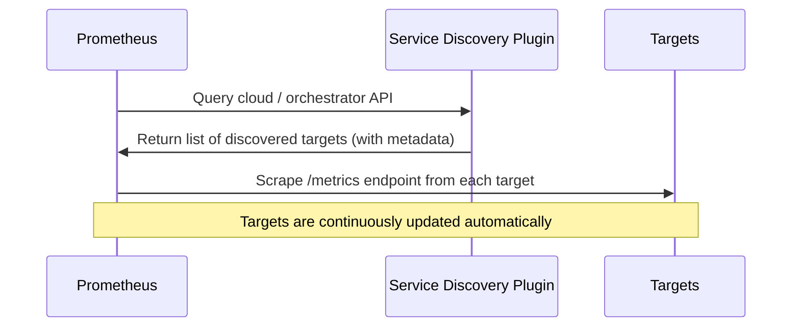

# 🌍 **Prometheus Service Discovery** — “How Prometheus Finds Everything Automatically”

## 📖 **What Is Service Discovery?**

> **Service Discovery (SD)** in Prometheus is the mechanism that automatically discovers the network endpoints (**targets**) that should be scraped for metrics.

Instead of manually listing:

```yaml
static_configs:
  - targets: ["10.0.0.12:9100", "10.0.0.13:9100"]
```

You can tell Prometheus:

> “Hey, just watch my EC2 instances, Kubernetes pods, or Docker containers — and scrape all of them dynamically.”

✅ **No manual IP management.**  
✅ **Automatic updates when new instances appear or die.**

---

## ⁉️ **Why We Need It**

In static environments (few servers), static configs work fine.  
But in **modern, dynamic infrastructure** (Kubernetes, AWS, EC2 auto scaling, Docker Swarm), targets change **all the time**.

<div align="center" style="background-color: #141a19ff;color: #a8a5a5ff; border-radius: 10px; border: 2px solid">

| Problem             | Without Service Discovery     | With Service Discovery    |
| ------------------- | ----------------------------- | ------------------------- |
| New VM added        | Must manually edit config     | Auto-discovered           |
| Container restarted | Loses IP, breaks scrape       | Automatically updates     |
| Cloud autoscaling   | IPs change constantly         | Prometheus keeps up       |
| Thousands of nodes  | Impossible to manage manually | Fully automated discovery |

</div>

---

## ⚙️ **How It Works — High Level Flow**

<div align="center" style="background-color: #141a19ff;color: #a8a5a5ff; border-radius: 10px; border: 2px solid">



</div>

---

## 🏛️ **Service Discovery Architecture**

Prometheus supports **pluggable service discovery mechanisms** via “SD Configs”.  
Each job in your `prometheus.yml` defines _how to discover targets_.

### General Structure:

```yaml
scrape_configs:
  - job_name: "my-service"
    <service_discovery_config>  # e.g., ec2_sd_configs, kubernetes_sd_configs, etc.
    relabel_configs:
      - source_labels: [__meta_ec2_tag_Name]
        target_label: instance
```

---

## 🧩 **Supported Service Discovery Mechanisms**

Let’s group them by environment 👇

---

### 🏗️ **1. Static Configs** (manual)

```yaml
static_configs:
  - targets: ["localhost:9090", "node1:9100"]
```

✅ Simple  
❌ Doesn’t adapt to changes

---

### 📃 **2. File-Based SD**

> Load targets dynamically from a JSON or YAML file that can be updated at runtime.

```yaml
file_sd_configs:
  - files:
      - /etc/prometheus/targets/*.json
```

**Example JSON:**

```json
[
  {
    "targets": ["node1:9100", "node2:9100"],
    "labels": { "env": "prod", "job": "node_exporter" }
  }
]
```

🧩 Prometheus automatically reloads file changes every 5 seconds (no restart needed).

✅ Great for custom integrations or CI/CD pipelines generating targets dynamically.

---

### ☁️ **3. Cloud-Based Service Discoveries**

<div align="center" style="background-color: #141a19ff;color: #a8a5a5ff; border-radius: 10px; border: 2px solid">

| Provider          | Config                     | Description                        |
| ----------------- | -------------------------- | ---------------------------------- |
| **AWS EC2**       | `ec2_sd_configs:`          | Discover EC2 instances dynamically |
| **Azure**         | `azure_sd_configs:`        | Discover Azure VMs                 |
| **GCP**           | `gce_sd_configs:`          | Discover GCE instances             |
| **OpenStack**     | `openstack_sd_configs:`    | Discover OpenStack instances       |
| **DigitalOcean**  | `digitalocean_sd_configs:` | Discover Droplets                  |
| **Hetzner Cloud** | `hetzner_sd_configs:`      | Discover servers dynamically       |

</div>

---

**Example: AWS EC2 Service Discovery:**

```yaml
scrape_configs:
  - job_name: "ec2-nodes"
    ec2_sd_configs:
      - region: us-east-1
        access_key: YOUR_KEY
        secret_key: YOUR_SECRET
        port: 9100
    relabel_configs:
      - source_labels: [__meta_ec2_tag_Name]
        target_label: instance
```

🧩 Prometheus will:

- Call the AWS API
- Find all EC2 instances
- Filter using EC2 metadata tags (via relabeling)
- Auto-scrape `/metrics` from discovered targets

💡 Easy to set up

- Credentials should be set up with an IAM user with the `AmazonEC2ReadOnlyAccess` Policy.

---

### 🐳 **4. Container-Based SD**

<div align="center" style="background-color: #141a19ff;color: #a8a5a5ff; border-radius: 10px; border: 2px solid">

| Platform         | Config                    | Description                               |
| ---------------- | ------------------------- | ----------------------------------------- |
| **Docker**       | `docker_sd_configs:`      | Discover running containers               |
| **Docker Swarm** | `dockerswarm_sd_configs:` | Discover Swarm services                   |
| **Kubernetes**   | `kubernetes_sd_configs:`  | Discover pods, nodes, services, endpoints |

</div>

---

**Example: Kubernetes Service Discovery:**

Kubernetes is **the most common** SD mechanism.

```yaml
scrape_configs:
  - job_name: "kubernetes-pods"
    kubernetes_sd_configs:
      - role: pod
    relabel_configs:
      - source_labels: [__meta_kubernetes_pod_annotation_prometheus_io_scrape]
        action: keep
        regex: true
      - source_labels: [__meta_kubernetes_pod_annotation_prometheus_io_path]
        target_label: __metrics_path__
        regex: (.+)
      - source_labels: [__address__, __meta_kubernetes_pod_annotation_prometheus_io_port]
        target_label: __address__
        regex: (.+):(?:\d+);(\d+)
        replacement: $1:$2
```

🧩 How it works:

- Prometheus queries the **Kubernetes API Server**
- Fetches metadata for Pods or Endpoints
- Applies **relabeling rules** to decide what to scrape
  (e.g., only Pods with annotation `prometheus.io/scrape: "true"`)

✅ Automatically discovers all Pods, even after restarts or scaling events.

---

### 🧰 **5. DNS-Based SD**

For environments that use DNS for load balancing.

```yaml
dns_sd_configs:
  - names: ["api.mycompany.local"]
    type: "A"
    port: 9100
```

Prometheus will periodically resolve that DNS name to multiple IPs.

✅ Works with Consul, Route53, or internal DNS  
❌ Limited metadata (no labels or tags)

---

### ⚙️ **6. Consul SD**

```yaml
consul_sd_configs:
  - server: "localhost:8500"
    services: ["web", "api"]
```

Prometheus will fetch all services registered in Consul.  
Each service + instance becomes a scrape target.

---

### 🧮 **7. Marathon / Nomad / Triton / Eureka**

Prometheus integrates with several orchestration systems:

- `marathon_sd_configs:`
- `eureka_sd_configs:` (Netflix OSS)
- `triton_sd_configs:`
- `nomad_sd_configs:`

Each works similarly: Prometheus queries their API endpoints for available services or instances.

---

## 📃 **Metadata Labels in SD**

Each discovered target gets **auto-generated labels** starting with `__meta_`.

Examples (for EC2 SD):

```ini
__meta_ec2_tag_Name="webserver-1"
__meta_ec2_instance_id="i-0ab123cd"
__meta_ec2_private_ip="10.0.1.23"
```

Then, you can transform these into user-friendly labels using **relabel_configs**:

```yaml
relabel_configs:
  - source_labels: [__meta_ec2_tag_Name]
    target_label: instance
  - source_labels: [__meta_ec2_private_ip]
    target_label: private_ip
```

---

## 🔧 **Relabeling — The Secret Ingredient**

Relabeling acts as a **filter and transformer** that runs on all discovered targets before scraping.

Common actions:

<div align="center" style="background-color: #141a19ff;color: #a8a5a5ff; border-radius: 10px; border: 2px solid">

| Action     | Purpose                              |
| ---------- | ------------------------------------ |
| `keep`     | Keep only targets that match a regex |
| `drop`     | Exclude certain targets              |
| `replace`  | Modify or create labels              |
| `labelmap` | Copy multiple labels matching regex  |

</div>

### Example: Keep only prod environment

```yaml
- source_labels: [__meta_ec2_tag_Environment]
  regex: prod
  action: keep
```

---

## 📝 **End-to-End Example**

```yaml
scrape_configs:
  - job_name: "node"
    ec2_sd_configs:
      - region: us-east-1
        port: 9100
    relabel_configs:
      - source_labels: [__meta_ec2_tag_Name]
        target_label: instance
      - source_labels: [__meta_ec2_tag_Environment]
        regex: prod
        action: keep
```

✅ Automatically discovers **only EC2 instances** tagged `Environment=prod`  
✅ Scrapes their Node Exporter metrics automatically

---

## 🔁 **How Prometheus Keeps It Updated**

Prometheus periodically re-runs the SD mechanism:

- AWS EC2 → polls EC2 API
- Kubernetes → watches API Server stream (real-time)
- File SD → polls file changes
- DNS SD → re-resolves names

So when a target is added or removed:  
👉 Prometheus updates its internal target list instantly.

You can confirm this under the **Targets** page:

```ini
http://<prometheus>:9090/targets
```

---

## 🔒 **Security and Performance Notes**

✅ **Security**

- For cloud SDs, use limited IAM or Azure credentials.
- Avoid hardcoding secrets in `prometheus.yml` (use environment variables or IAM roles).

✅ **Performance**

- Use relabeling to drop unnecessary targets.
- Reduce API polling frequency for large clouds.
- Use static configs for small, stable systems.

---

## 🏁 **Visual Summary — Prometheus Service Discovery Flow**

<div align="center" style="background-color: #141a19ff;color: #a8a5a5ff; border-radius: 10px; border: 2px solid">

```mermaid
flowchart LR
    A[Prometheus Config] --> B[Service Discovery Module]
    B -->|Cloud API / DNS / File| C[Discovered Targets]
    C --> D[Relabeling Rules]
    D --> E[Final Scrape Targets]
    E --> F[Prometheus TSDB (Time-Series Database)]
```

</div>

---

## 💬 **Human Analogy**

> Imagine Prometheus as a **curious explorer** 🧭:
>
> - You give him a _map_ (your service discovery config).
> - He asks the _cloud_ (AWS/K8s/Docker) where everything is.
> - He tags each discovery with metadata (“region=us-east-1”).
> - Then he decides who’s worth visiting (via relabeling).
> - Finally, he _visits_ each one every 15 seconds to collect stories (metrics). 📊

---

## 🧠 **TL;DR**

<div align="center" style="background-color: #141a19ff;color: #a8a5a5ff; border-radius: 10px; border: 2px solid">

| Type           | Config                                           | Description                              |
| -------------- | ------------------------------------------------ | ---------------------------------------- |
| **Static**     | `static_configs`                                 | Manual list of targets                   |
| **DNS**        | `dns_sd_configs`                                 | Uses DNS name resolution                 |
| **File**       | `file_sd_configs`                                | Dynamic target files                     |
| **AWS EC2**    | `ec2_sd_configs`                                 | Auto-discovers EC2 instances             |
| **Azure**      | `azure_sd_configs`                               | Auto-discovers Azure VMs                 |
| **GCP**        | `gce_sd_configs`                                 | Auto-discovers GCE instances             |
| **Kubernetes** | `kubernetes_sd_configs`                          | Auto-discovers Pods, Services, Endpoints |
| **Docker**     | `docker_sd_configs`                              | Auto-discovers containers                |
| **Consul**     | `consul_sd_configs`                              | Uses Consul registry                     |
| **Others**     | `marathon_sd_configs`, `eureka_sd_configs`, etc. | Integrates with orchestrators            |

</div>
